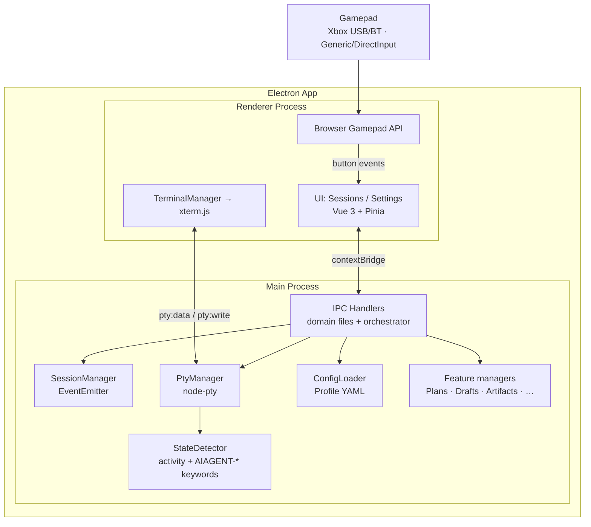

# Helm

## Mission

DIY Xbox controller → CLI session manager. Control multiple AI coding CLIs (Claude Code, Copilot CLI, etc.) from a single game controller. Embedded terminals via node-pty + xterm.js — no external windows. Built as an Electron 41 desktop app on Windows.

> **Scope of this file:** orientation and the invariants that constrain code anywhere in the repo. It is deliberately NOT a feature catalogue — per-feature behaviour lives in [`docs/`](#reference-documentation). When you add a feature, document it there and link it from the table; do not grow this file.

## System Overview



Every feature manager follows the same shape: an `EventEmitter` class in `src/session/`, an injected `persist` sink writing YAML/JSON under the user config dir, IPC channels exposed through the preload bridge, and a renderer composable owning the reactive mirror. Match that shape when adding one.

## Data Flow

```
Gamepad → Browser Gamepad API (renderer polling, 16ms)
  → IPC gamepad:event → debounce (250ms)
    → Resolve binding (per-CLI type)
      → Execute action (keyboard/voice/spawn/switch/prompt-tree)

D-pad / left stick navigates sessions and auto-selects the terminal.
Keyboard input routes to the active terminal (PTY stdin), blocked while a
selection-mode modal overlay is visible.
```

Full button/key maps, modal-blocking rules, and stick behaviour: [docs/controls.md](docs/controls.md).

## Invariants

These hold repo-wide. Breaking one is a design change, not a refactor.

1. **Browser Gamepad API is the only input source** — a single input path via Chromium, covering Xbox (standard mapping) and generic/DirectInput (axes-based) pads. The XInput/PowerShell path was removed deliberately; do not reintroduce a second source.
2. **CLIs run in embedded PTYs, never external windows** — node-pty + xterm.js. All keyboard, paste, and sequence input reaches a CLI through PTY stdin.
3. **Context isolation is enforced** — the renderer never touches Node APIs. New capability = a typed channel in `preload.ts` via `contextBridge` plus a handler in the matching `src/electron/ipc/` domain file. See [docs/preload-api-boundary.md](docs/preload-api-boundary.md).
4. **Config boundary: the repo ships defaults only** — all writable config, logs, and temp files resolve to the per-user app-data dir in BOTH dev and packaged mode. Never write to the repo working tree. See [docs/config-boundary.md](docs/config-boundary.md).
5. **Input is expressed as sequence syntax** — `{Enter}`, `{Ctrl+C}`, `{Wait 500}`, plain text — parsed to PTY escape codes rather than simulating keys. One parser serves bindings, initial prompts, prompt templates, and plan delivery.
6. **A session's identity survives restarts** — `cliSessionName` (UUID v4) maps 1:1 between a hub session and the CLI's own session. Fresh spawn chain `spawnCommand → command`; resume chain `resumeCommand → continueCommand → command`. Persistence is an explicit allow-list: a new `SessionInfo` field must be added to `serializeSession` or it will not survive a restart.
7. **PTY errors never kill the PTY** — session state lives in the main process, so the renderer can crash and reload freely. All PTY operations are wrapped in try-catch that logs and continues; the process may still be alive.
8. **Dots reflect activity, not pipeline state** — green/blue/grey are derived from PTY I/O timing, with colours centralized in `renderer/state-colors.ts`. Never hardcode a dot colour. See [docs/terminal-architecture.md](docs/terminal-architecture.md).
9. **AI-authored content is untrusted** — anything an AI produces that gets rendered is contained before display: sanitized against an allow-list when it lands in the app DOM (markdown artifacts), or isolated in an opaque-origin document under its own CSP when it needs full fidelity (HTML artifacts — see [docs/artifact-viewer.md](docs/artifact-viewer.md)). Remote peers act under a synthetic proxy identity that can never impersonate a local session.
10. **Vue 3 migration is in progress** — new renderer code is Composition API + Pinia; legacy imperative TS modules coexist during the transition. xterm.js stays imperative. Vite builds the renderer; esbuild builds main/preload.

## Architecture Principles

- DRY, YAGNI, KISS
- TDD — tests first, then implement
- Event-driven, non-blocking
- Composition over inheritance
- Clean separation: input → processing → output
- Document **why**, not **how**

## Build & Test

```bash
npm run build    # Vite: renderer (dist/renderer/) + esbuild: electron (dist-electron/main.js) + preload
npm run start    # Build and launch
npm run package  # Build + package portable Windows EXE to release/
npm test         # Vitest suite
```

### Release Workflow (two-step)

```bash
python prepareDeploy.py patch   # Bump version, strip configs, build, package EXE → release/YYYYMMDD-vX.Y.Z/
# ... validate the EXE manually ...
python sendDeploy.py            # Commit, tag, push, upload installer via gh CLI
```

| Script | Purpose |
|--------|---------|
| `runApp.py` | Dev workflow — install deps, build, launch |
| `runTests.py` | Run Vitest suite |
| `prepareDeploy.py` | Release step 1 — bump version, strip configs for deploy, build, package EXE |
| `sendDeploy.py` | Release step 2 — commit, tag, push, upload installer to GitHub Releases via `gh` CLI |

## Tech Stack

| Component | Technology |
|-----------|-----------|
| Desktop shell | Electron 41 |
| Language | TypeScript (ESM) |
| UI framework | Vue 3 (Composition API) + Pinia stores |
| Bundler | Vite (renderer) + esbuild (electron main/preload) |
| Tests | Vitest + @vue/test-utils |
| Gamepad input | Browser Gamepad API (sole input source) |
| Embedded terminals | node-pty (PTY) + @xterm/xterm (xterm.js) |
| PTY shell | cmd.exe (Windows), bash (Unix) |
| Config | YAML (yaml package) |
| Logging | Winston |

## Reference Documentation

**Orientation**

| Document | Content |
|----------|---------|
| [docs/modules.md](docs/modules.md) | Module reference table — all modules including Vue stores, composables, and SFC components |
| [docs/file-structure.md](docs/file-structure.md) | Complete directory tree with per-file descriptions |
| [docs/build-and-test.md](docs/build-and-test.md) | Build commands, output paths, build notes, tech stack details |
| [docs/config-system.md](docs/config-system.md) | Profile YAML, binding types, sequence parser syntax, stick/dpad config |
| [docs/css-architecture.md](docs/css-architecture.md) | CSS ownership, global exceptions, tokens, primitives, and selection states |
| [docs/config-boundary.md](docs/config-boundary.md) | Where writable config/logs/temp live, seeding, legacy migration |
| [docs/preload-api-boundary.md](docs/preload-api-boundary.md) | IPC/contextBridge boundary rules |
| [docs/docking.md](docs/docking.md) | Dock workspace — pane registry, tabs/splits/edge docks, rails, close & restore, chips-in-pane |

**Input & terminals**

| Document | Content |
|----------|---------|
| [docs/controls.md](docs/controls.md) | Gamepad button + keyboard mappings, navigation priority chain |
| [docs/gamepad-input-model.md](docs/gamepad-input-model.md) | **Proposal, not shipped** — pane-addressed gamepad model, shared input contract, command registry + radial wheel |
| [docs/keyboard-routing.md](docs/keyboard-routing.md) | Keyboard router — one listener, declared precedence, per-screen handlers, focused-vs-visible ownership |
| [docs/terminal-architecture.md](docs/terminal-architecture.md) | PTY stack, input/output routing, activity dots, key modules |
| [docs/pattern-matcher.md](docs/pattern-matcher.md) | Per-CLI regex rules over PTY output — send-text and wait-until schedules |

**Session features**

| Document | Content |
|----------|---------|
| [docs/group-overview.md](docs/group-overview.md) | Group overview grid — entry/exit, navigation, live previews |
| [docs/runtime-groups.md](docs/runtime-groups.md) | Custom cross-directory groups, exclusive membership, restore-to-group, drag/close flows |
| [docs/recycle-bin.md](docs/recycle-bin.md) | Closed recoverable sessions — 30-day rolling bin, restore-with-resume |
| [docs/drafts.md](docs/drafts.md) | Per-session draft prompt memos |
| [docs/handover.md](docs/handover.md) | Compaction handover — a note carried across a session's own `/compact`, pasted back on the next lull |
| [docs/mess.md](docs/mess.md) | Durable local project conversation, ordered cursors, best-effort reminders, and read-only observer pane |
| [docs/prompt-templates.md](docs/prompt-templates.md) | Global nested prompt-template library and the prompt editor apply flow |
| [docs/artifact-viewer.md](docs/artifact-viewer.md) | Ephemeral per-session versioned md/html reports, sanitized render, `helm-img://` protocol |
| [docs/flash-attention.md](docs/flash-attention.md) | The grab-the-user session flash — accent colour, contrast, pulse/solid phases |

**Planning & scheduling**

| Document | Content |
|----------|---------|
| [docs/dreaming.md](docs/dreaming.md) | Scheduled memory-maintenance dreams — prompt assembly, `dreaming` system skill, scheduling rules, run-now |
| [docs/directory-plans.md](docs/directory-plans.md) | Directory Plans — DAG work items, lifecycle, canvas, layout, badges |
| [docs/plans-file-structure.md](docs/plans-file-structure.md) | On-disk plan file layout |
| [docs/scheduled-task-history.md](docs/scheduled-task-history.md) | 7-day rolling run log of scheduled-task executions |

**Integrations**

| Document | Content |
|----------|---------|
| [docs/chat-fan-out.md](docs/chat-fan-out.md) | Transport-agnostic chat — ChatBroker fan-out, ChatBridge, `chatBindings`, the mobile chat surface and its wire records |
| [docs/mobile-ble-transport.md](docs/mobile-ble-transport.md) | Phone ↔ Helm BLE link — Helm as central, GATT characteristics, chunk framing, link ownership and online state, cross-language vectors |
| [docs/mobile-secure-channel.md](docs/mobile-secure-channel.md) | Phone ↔ Helm app-layer encryption — X25519 + SAS handshake, AEAD framing, cross-language vectors |
| [docs/mobile-pairing.md](docs/mobile-pairing.md) | Phone pairing — SAS confirmation, device registry keyed on machineId, atomic finalize, revocation |
| [docs/mobile-gate.md](docs/mobile-gate.md) | Phone call boundary — `mobile:<deviceId>` proxy identity, allow-list + hard-deny, ownership, rate limit, key-names-only audit |
| [docs/fleet.md](docs/fleet.md) | Cross-machine peer MCP proxy — TLS-WS transport, PSK + TOFU pinning, SAS pairing, InboundCallGate |
| [docs/helm-mcp-protocol.md](docs/helm-mcp-protocol.md) | Helm MCP wire protocol |
| [docs/helm-mcp-client-guide.md](docs/helm-mcp-client-guide.md) | Guide for AI clients using the Helm MCP tools |
| [docs/helm-session-info.md](docs/helm-session-info.md) | `session_info` surface |
| [docs/telegram-mirror.md](docs/telegram-mirror.md) | Telegram integration — AI-driven relay channels, state-change notifier, topic↔PTY routing |
| [docs/security-review-telegram.md](docs/security-review-telegram.md) | Telegram integration security review |
