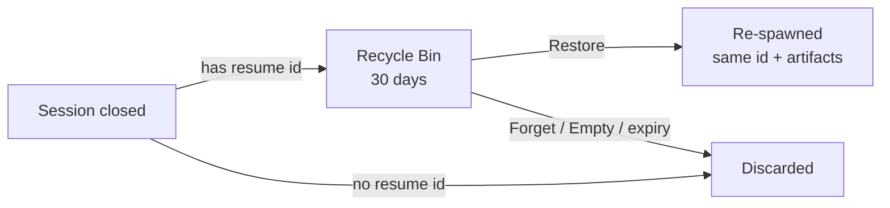
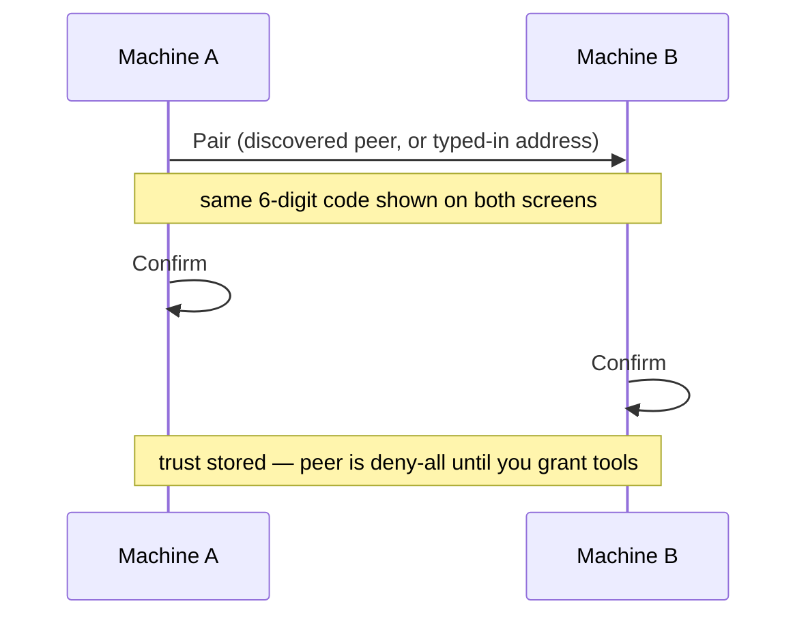

# Helm

**Helm - steer your fleet of agents**

You're running Claude Code in one terminal, Copilot CLI in another, Codex CLI in a third, maybe a fourth session for a side project. Alt-tabbing between them is slow. Finding the right window is annoying. Typing repetitive commands is tedious.

Pick up your controller. One button spawns a new Claude Code session — it opens as an embedded terminal right inside the app. Another fires up Copilot CLI or Codex CLI in its own tab. The D-pad flips between sessions instantly, auto-selecting the terminal so you can start typing right away. Step away from your desk? Monitor and control everything from your phone via the Telegram bot.

This is a session manager for people who run multiple AI-assisted terminals at once and got tired of the friction.

---

## What Is This?

Helm is an Electron desktop app that lets you control multiple AI coding CLI sessions from a game controller. Each CLI runs as an embedded terminal (via node-pty + xterm.js) — no external windows to manage.

It ships for **Windows** (installer `.exe`) and **macOS** (universal `.dmg` — native arm64 and x64, no Rosetta).

**Why use it?**

- **Multi-CLI workflows** — Run Claude Code, Copilot CLI, Codex CLI, and other AI tools side-by-side in embedded terminals
- **Physical controls** — D-pad, buttons, and analog sticks replace keyboard shortcuts. Works with Xbox controllers and generic/DirectInput gamepads
- **Session groups** — Sessions grouped by working directory with collapsible headers, bookmarks, and a live preview grid
- **Directory planning** — Per-folder plan graph with `planning`/`ready`/`coding`/`review`/`blocked`/`done` states, plan sequences, contexts, attachments, and plan chips
- **Pattern matcher** — Auto-fire sequences when PTY output matches regex rules, with per-session cooldown and scheduled sends
- **Scheduled tasks** — One-time or recurring prompts with spawn or direct-to-session delivery
- **Drafts + chip bar** — Keep prompt drafts beside the active terminal and trigger reusable quick actions with template expansions
- **Telegram bot** — Remote session control, activity-gated output monitoring, and spawning from your phone
- **LLM notifications** — Smart delivery routing: sessions can direct notifications to other sessions, Telegram, or Windows toasts
- **Voice control ready** — Designed to work with OpenWhisper for voice-to-text input
- **Session recovery** — Sessions survive app crashes and restarts, with per-CLI resume commands and snapped-out window recovery
- **Helm MCP server** — Control sessions from Claude Code or other AI agents via MCP tools (send text, read terminal, manage plans)
- **Configurable submit suffix** — Per-CLI text terminator (CR/LF/CRLF) for inter-session messaging and paste delivery
- **Projects & contexts** — Group working directories into stable project identities with reusable knowledge contexts
- **Skills system** — Create, manage, and rate reusable instruction templates scoped per-project or globally
- **Snap-out windows** — Detach any session or the planner into its own window for side-by-side work
- **Session jump keys** — Ctrl+1 through Ctrl+9 jump directly to the Nth session
- **Toast notifications** — In-app transient notifications for events like plan imports
- **Incoming plan import** — CLI sessions can write plan files that Helm auto-imports with validation
- **Artifact viewer** — Sessions publish readable markdown/HTML reports into an in-app panel, with versions, mermaid diagrams, and inline local images
- **Recycle bin** — Closed recoverable sessions are kept 30 days in a searchable Project › Group › Folder tree, restorable with their resume id and artifacts
- **Runtime session groups** — Custom cross-directory groups alongside the folder groups, with drag-to-move and restore-to-group
- **Fleet** — Pair two machines and drive sessions, terminals, and plans on the other one from here
- **Cross-platform** — Windows and macOS, from one codebase

---

## Installation

Download the latest installers from [GitHub Releases](https://github.com/PetePeter/helm/releases/latest):

- **Windows:** `Helm Setup <version>.exe`
- **macOS:** `Helm-<version>-universal.dmg` for native Intel (`x86_64`) and Apple Silicon (`arm64`)

Current macOS packages are not notarized. If Gatekeeper blocks the first launch, open the app from Finder with **Control-click → Open** and confirm the prompt.

## Quick Start

```bash
npm install
npm start
```

Plug in a controller (USB or Bluetooth). The app detects it automatically — Xbox controllers and generic/DirectInput gamepads are supported. Head to Settings to configure CLI tools, working directories, and button bindings.

### First Session Workflow

1. **Settings** → add a CLI tool (e.g. Claude Code with command `claude`)
2. **Left Trigger** (or Back/Start) → spawns a new session in the selected directory
3. **D-pad** → switch between sessions, start typing immediately
4. **Right stick** → scroll the terminal buffer

### Remote Control (Telegram)

1. **Settings** → Telegram → follow the setup guide (token + chat ID)
2. Bot appears with a pinned dashboard of all sessions
3. `/spawn` to create sessions, `/send` to send prompts, type in topic threads for direct input
4. Activity-gated output: buffered while sessions are busy, flushed when they go quiet

---

## Controls

### Gamepad

| Input | Action |
|-------|--------|
| D-Pad Up / Down | Switch sessions (auto-selects terminal) |
| D-Pad Right | Open group overview from a group header / cycle session-card sub-elements |
| D-Pad Left | Back one sub-element column |
| Left Stick | Same as D-pad |
| Right Stick | Scroll terminal buffer (configurable per-profile) |
| A | Confirm / configurable per-CLI binding |
| B | Back / configurable per-CLI binding |
| X | Close session / configurable per-CLI binding |
| Y | Configurable per-CLI binding |
| Left Trigger | Spawn Claude Code (default) |
| Right Bumper | Spawn Copilot CLI (default) |
| Back / Start | Previous / next profile |
| Sandwich / Guide | Focus hub window + show sessions screen |

### Keyboard

| Input | Action |
|-------|--------|
| Ctrl+Tab / Ctrl+Shift+Tab | Next / previous terminal tab |
| Ctrl+Shift+N | Terminal: open quick spawn / Sessions or Overview: create a new plan for the current directory |
| Ctrl+Shift+W | Close the active session while terminal view is active |
| Ctrl+Shift+P | Open the planner for the current session folder |
| Ctrl+Shift+O | Open the overview for the current session folder; press again to toggle to global overview |
| Ctrl+Shift+S | Switch back to the last selected session, including a snapped-out window |
| Arrow keys | Navigate sessions (D-pad equivalents) |
| Enter | Confirm (A button) |
| Escape | Back (B button) |
| Delete | Close (X button) |
| F5 | Mapped to Y button |
| Ctrl+V | Paste clipboard text to active terminal |
| Ctrl+G | Open in-app Prompt Editor (textarea + recent-prompts history + prompt-template tree) — Ctrl+Enter sends to active terminal |
| Ctrl+1-9, Ctrl+0 | Jump to Nth session in sidebar order |
| Ctrl+Shift+E | Toggle eye visibility for the selected session |
| Shift + drag | Select terminal text (see note below) |

> **Selecting text in TUI CLIs:** Tools like Claude Code enable mouse-reporting mode, so a plain click-drag is sent to the app instead of selecting text. **Hold Shift while dragging** to force a local terminal selection — this enables 📋 Copy and 📋➕ New Session with Selection in the context menu.

Every binding is remappable per CLI type. See [docs/controls.md](docs/controls.md) for the full mapping.

### Context Menu

Right-click the terminal area (or bind a button to `context-menu`) for quick actions:

| Item | Description |
|------|-------------|
| 📋 Copy | Copy terminal selection to clipboard |
| 📥 Paste | Paste clipboard to active PTY |
| ✏️ Compose in Editor | Open in-app Prompt Editor to compose prompt — sent to active PTY on send |
| ➕ New Session | Quick-spawn picker (pre-selects active CLI type & directory) |
| 📋➕ New Session with Selection | Spawn with selected text as context |
| ⚡ Prompts… | Open the `PromptTreeModal` picker — picking a template prefills the in-app Prompt Editor (`EditorPopup.vue`); sends to active PTY via `deliverPromptSequence()` |

---

## Session Management

Sessions are automatically grouped by working directory. Each group has a collapsible header showing the directory name and session count.

**Overview button** — A full-width "Overview" bar sits above all groups in the session list (press A or Enter when focused). Opens a global preview grid of all eye-visible sessions across every folder, with folder break marks between groups.

**Group overview** — Press D-pad Right on a group header (or click the group name) to open a per-folder preview grid showing only sessions in that directory.

Both overview modes show:
- Each card: session name, activity dot, and the last 10 lines of terminal output
- Live-updating previews (500ms throttle)
- Navigate with D-pad, A to select, X to close
- Scrollable via right stick or mouse wheel

**Eye toggle (👁 / 👁‍🗨)** — Each session card has an eye button (D-pad Right to column 3). Toggle it to hide a session from the global overview without closing it. Hidden sessions still appear in the sidebar list and their own group overview.

See [docs/group-overview.md](docs/group-overview.md) for details.

Any session can be detached into its own Electron window — click the snap-out button or bind a gamepad action. The detached window includes the full terminal, chip bar with plan actions, draft editor, and context menu.

The planner canvas can also be popped out into a separate window for side-by-side plan work.

Use Ctrl+Shift+S to switch back to the last selected session, including snapped-out windows.

### Runtime Session Groups

Runtime groups are custom groups that cut **across** working directories, listed alongside the default folder groups. A session belongs to at most one runtime group — drag a card onto a group, or use the context menu. Closing a group asks whether to keep the sessions (moved back to their folders) or close them all. Empty groups stay visible so restored sessions have somewhere to return to.

See [docs/runtime-groups.md](docs/runtime-groups.md).

---

## Artifact Viewer

Sessions publish readable **reports** — markdown or HTML — into a dockable right-hand panel instead of leaving files for you to open. Toggle with the 📄 toolbar button or `Ctrl+Shift+A`; when collapsed, an edge tab pulses as new artifacts arrive.

- Master–detail layout: searchable/sortable index rail plus a rendered detail pane, drag-to-resize
- Each update appends a **version**; step back through them or jump to latest
- ` ```mermaid ` blocks render as diagrams (loaded on demand)
- Text is selectable and copyable — `Ctrl+C`/`Ctrl+X` copy the selection rather than interrupting the terminal
- Images render from local file paths and `data:image/*` via the privileged `helm-img://` protocol; remote URLs and SVG are refused by design
- Artifacts are ephemeral to a session and travel with it into a snapped-out window

See [docs/artifact-viewer.md](docs/artifact-viewer.md).

---

## Recycle Bin

Closing a **recoverable** session (one carrying a resume id) parks it for 30 days instead of discarding it. Restoring re-spawns it under its original id, so its resume history, runtime group, and artifacts all come back.



Entries are shown as a collapsible, searchable tree — **Project › Runtime Group › Folder › sessions** — with bottom-up counts, newest-closed first, full paths, exact `yyyy/mm/dd HH:mm` close times, and per-folder *Restore all* / *Forget all*.

See [docs/recycle-bin.md](docs/recycle-bin.md).

---

## Activity Monitoring

The app tracks PTY I/O timing and shows colored activity dots on session cards and tabs:

- 🟢 **Active** — producing output or receiving user input
- 🔵 **Inactive** — silent for more than 10 seconds
- ⚪ **Idle** — silent for more than 5 minutes

The app also watches for `AIAGENT-*` keywords in PTY output to detect CLI state (implementing, planning, completed, idle) — used for auto-handoff pipeline and notifications.

**Windows toast notifications** fire when a session goes inactive while implementing or planning — so you know when a long task finishes without staring at the screen.

**LLM-directed notifications** let sessions route notifications to other sessions, Telegram, or Windows toasts with smart delivery — the AI decides where the notification goes based on context and urgency.

---

## Prompt Sequences

Button bindings, quick actions, and initial prompts can send small scripted input sequences:

```yaml
A:
  action: keyboard
  sequence: |
    /clear
    {Wait 500}
    yes{Send}
    {Ctrl+C}
```

| Token | Effect |
|-------|--------|
| Plain text | Sent as literal characters to PTY |
| `{Enter}`, `{Send}`, `{Tab}`, `{Escape}`, `{Delete}` | Named keys |
| `{Ctrl+C}`, `{Ctrl+Z}`, `{Ctrl+V}` | Modifier + key combos |
| `{Wait 500}` | Pause N ms (max 30000) |
| `{Ctrl Down}`, `{Ctrl Up}`, `{Shift Down}`, `{Shift Up}` | Hold/release modifier |
| `{{`, `}}` | Literal `{` and `}` |

### Initial Prompts

Automatically send commands when a session spawns:

```yaml
tools:
  claude-code:
    name: Claude Code
    command: claude
    initialPrompt:
      - label: "Initialize"
        sequence: "/init{Enter}"
    initialPromptDelay: 2000
```

---

## Voice Control

The app works with **OpenWhisper** (or any voice-to-text tool that listens for a hotkey). Bind a gamepad button to simulate a keypress, and OpenWhisper starts listening. When it transcribes your speech, the text flows directly into the active terminal.

```yaml
LeftTrigger:
  action: voice
  key: F1
  mode: tap
```

Voice bindings support two routing modes:

| Mode | Description |
|------|-------------|
| **OS (default)** | Key simulated at the OS level via robotjs — works with external apps |
| **Terminal** | Key sent as an escape sequence to the active PTY (`target: terminal`) |

---

## Plans, Drafts & Chip Bar

Each working directory can have its own plan graph. Plan items live in a dependency-aware canvas with `planning`, `ready`, `coding`, `review`, `blocked`, and `done` states. Ready work appears as chips near the active terminal so you can pick it up quickly, and active work can be completed from the same strip.

Drafts, Plans, and Contexts are separate primitives: Drafts are per-session prompt memos, Plans are durable per-directory work items, and Contexts are reusable project knowledge nodes that can be bound to plans or sequences. Plan items persist as individual JSON files under `config/plans/` with dependencies in `config/plan-dependencies.json`; `config/plans.yaml` is legacy migration input only.

The same strip also shows draft prompts and reusable chip-bar actions. In practice this means you can keep a few common prompts or workflows one click away while a session is busy.

### Contexts

Contexts are project-level knowledge nodes with title, content, type, and permission (readonly/writable). They live on the planner canvas as draggable cards and can be bound to plans or sequences. A context bound to a plan is automatically surfaced when working on that plan, providing just-in-time reference material.

Create contexts from the planner's split add button. Use the context editor to set content, permissions, and bindings. Contexts persist per-project and survive app restarts.

### Plan Sequences

Group related plans into sequences with shared memory. Sequences render as labeled lanes in the planner canvas with distinct bounding boxes.

### Incoming Plan Import

CLI sessions can create plan items by writing JSON files to `config/plans/incoming/`. Helm watches this directory and automatically imports valid plan items into the appropriate project. On success, a toast notification confirms the import; on validation failure, an error toast is shown. The source file is deleted after processing.

See [docs/directory-plans.md](docs/directory-plans.md) and [docs/config-system.md](docs/config-system.md) for the planner and chip-bar details.

---

## Projects

Projects are stable identities that group working directories — useful when repos have multiple worktrees or when planning data should survive directory moves.

Each project has a canonical directory and optional alternate directories. Plans, sequences, and contexts are scoped to projects rather than raw paths, so renaming or moving a folder doesn't lose your planning data.

Manage projects from Settings → Projects. You can create, rename, add/remove directories, and delete projects (which cascades to associated plans, sequences, and attachments).

---

## Skills

Skills are reusable instruction templates that can be loaded by AI agents at runtime. Create skills from Settings → Skills with a name, description, body text, and optional type tag.

- **Per-project or global** — Scope skills to specific projects or make them available everywhere
- **AI-amendable** — Mark skills as editable by agents (when enabled, agents can improve them based on usage feedback)
- **Analytics** — Track use counts, star ratings (1-5), and written feedback reviews
- **Cloning** — Duplicate a skill to use as a starting point for a new one

---

## Telegram Bot

Control your sessions remotely via a Telegram bot with forum topics. Each session gets its own topic thread that mirrors terminal output and forwards your input directly to the PTY.

### Setup

Settings → Telegram → follow the collapsible setup guide (bot token + chat ID). The bot creates forum topics automatically — one per session.

### Commands

| Command | Description |
|---------|-------------|
| `/sessions` | Browse directories → sessions with inline buttons |
| `/status` | Show all session states at a glance |
| `/spawn` | 3-step wizard: pick CLI tool → pick directory → session created |
| `/send <text>` | Send text directly to the active session's PTY |
| `/close` | Close the current topic's session |

### Features

- **Activity-gated output** — Terminal output streams to Telegram, but batched intelligently: buffers while the session is active, flushes when it goes quiet (>10s silence)
- **Topic input forwarding** — Type in a session's topic and it goes straight to the PTY
- **Audio transcription** — Voice/audio attachments are saved with transcript text and a transcript file path when OpenWhispr is configured
- **Pinned dashboard** — Auto-updating message with all sessions grouped by directory, Talk button for quick access
- **Topic lifecycle sync** — Closing a session automatically closes its Telegram topic
- **MCP tool consolidation** — Three MCP tools (`status`, `chat`, `close`) for programmatic bot control

---

## Pattern Matcher

Define per-CLI regex rules that auto-fire when PTY output matches. Two action types:

- **send-text** — Immediately sends a sequence to the PTY
- **wait-until** — Parses a time from the matched output and fires at that time

Rules have per-session cooldowns to prevent rapid re-triggering. Pending schedules are cancellable from the session card.

---

## Scheduled Tasks

Schedule prompts to run automatically at a specific time or on a recurring interval.

Two modes:
- **Spawn** — Creates a new CLI session, delivers the prompt, then tears down
- **Direct** — Sends the prompt to an existing session (pick from dropdown filtered by directory)

Schedule from the Sessions screen via the scheduler section or from Settings.

---

## Helm MCP Server

Control sessions from Claude Code or other AI agents via MCP tools (send text, read terminal, manage plans, etc.). The MCP server starts automatically with the app.

### Quick Start

Agents call `session_info` on startup to get the MCP endpoint URL, auth token, and AIAGENT state registry. From there they can send text between sessions, read terminal output, manage plans, and coordinate work.

### CLI Setup

Settings → MCP Server provides ready-to-use setup instructions for configuring Claude Code and Codex CLI to connect to Helm's MCP server, including env var detection per CLI type and one-click "run in cmd.exe" buttons per snippet.

### Key Concepts

- **Inter-session messaging** — Send instructions between CLI sessions via `[HELM_MSG]` envelopes with reply routing
- **AIAGENT state** — Sessions declare their work phase (planning/implementing/completed/idle) visible in the Helm UI
- **Plan coordination** — Create, link, and complete plan items from any session with dependency-aware DAG validation
- **Plan attachments** — Attach files (text, JSON, images) to plan items for cross-session reference
- **Plan sequences** — Group related plans into swimlanes with shared memory for coordinated multi-step work

### Documentation

| Document | Content |
|----------|---------|
| [helm-mcp-protocol.md](docs/helm-mcp-protocol.md) | Inter-session coordination, plan workflow, environment variables |
| [helm-envelope-reference.md](docs/helm-envelope-reference.md) | `[HELM_MSG]` envelope format for sending and receiving instructions |
| [helm-mcp-client-guide.md](docs/helm-mcp-client-guide.md) | Client implementation guide for parsing envelopes and replying |
| [helm-session-info.md](docs/helm-session-info.md) | `session_info` tool reference, AIAGENT state registry, plan/attachment guides |

## Fleet (Cross-Machine)

Drive another machine's Helm from this one. Once two machines are paired, a local AI can call the remote Helm's MCP tools by their **native names** — create sessions, read terminals, manage plans — over the LAN. **Off by default**: nothing listens on the network until you enable it.

### Setup

1. On **both** machines: Settings → 🔗 **Fleet** → tick **Enable cross-machine fleet**.
2. Allow **TCP 47474** through the firewall on both (plus **UDP 5353** for automatic discovery).
3. The status line lists the addresses a peer can reach you on — click one to copy it.

### Pairing



Pick the machine under **Discover nearby** and press **Pair**, or use **Pair by address** (`10.98.1.140:47474`). Compare the 6-digit code on both screens, confirm on both, then open **Allow-list** and choose a preset — a freshly paired peer can do nothing until you do.

Discovery uses mDNS, which does **not cross subnets** and does not survive Wi-Fi client isolation. On many real networks pair-by-address is the normal path, not a fallback. If the two codes differ, reject — that mismatch is the protection working.

### Using it

| Tool | Purpose |
|------|---------|
| `peer_list` | Paired peers and their online state |
| `peer_tools` | What a given peer allows you to call |
| `peer_call` | Invoke a tool on a peer, by its native name |

`peer_list` and `peer_tools` accept either the peer id or its alias, so you can call a machine by name.

Sessions a peer opens on this machine are **tinted light blue** in the sidebar, so remote-driven terminals are obvious at a glance; the marking is persisted and survives a restart.

Messages sent with `expectsResponse` round-trip across machines: the sender's identity is carried as a `fleet:<peerId>:<sessionId>` address and the reply is routed back over the same link into the asking session. The proxy identity is still what authorises the call, so a forged sender can at worst route a reply back to its own machine.

Each peer has its own allow-list (deny-by-default), a rate limit, and a rolling 7-day **Audit** log of every inbound call. `helm_restart`, `session_close` and `session_group_close` are never remotely invocable, even for a peer allowed everything. Unpair forgets the key and the pinned certificate.

See [fleet.md](docs/fleet.md) for the transport, pairing protocol and security model.

## Configuration

### Settings Tabs

| Tab | What it configures |
|-----|-------------------|
| Tools | CLI commands, env vars, initial prompts, per-CLI pattern rules |
| Directories | Working directories with bookmarks and auto-bookmarking |
| Bindings | Per-CLI gamepad button and keyboard bindings |
| Profiles | Named configuration sets that swap tools, directories, and bindings |
| Projects | Project identities grouping working directories |
| Skills | Reusable instruction templates with analytics |
| MCP Server | Helm MCP server configuration with per-CLI setup instructions |
| Chipbar / Quick Actions | Reusable prompt templates and workflow shortcuts |
| Scheduled Tasks | One-time and recurring prompt schedules |
| Telegram | Bot token, chat ID, and monitoring configuration |
| Fleet | Cross-machine peers: enable, port, pairing, per-peer allow-lists, audit |

### Profiles

Profiles let you keep different setups for different workflows. You can switch profiles with Back/Start or from Settings.

### Tool Editor

Each CLI tool has an advanced editor (accessible from Settings → Tools) with options beyond basic command configuration:

| Option | Description |
|--------|-------------|
| Large text as temp file | Writes pasted text above the size threshold to a temp file instead of inline |
| Helm initial prompt | Whether Helm handles the initial prompt delivery sequence |
| Environment variables | Per-CLI env vars with `replace`, `append`, or `prepend` modes |
| Submit suffix | Text terminator for inter-session messaging: CR, LF, or CRLF |

### Binding Actions

| Action | Description |
|--------|-------------|
| `keyboard` | Send a sequence of keystrokes to the terminal |
| `voice` | Simulate a keypress for voice recognition (OS or PTY routing) |
| `scroll` | Scroll the terminal buffer up/down |
| `context-menu` | Open the context menu overlay |
| `prompt-tree` | Open the global prompt-template picker tree, then prefill the in-app Prompt Editor with the chosen template |
| `new-draft` | Open the draft editor for the active session |

---

## Build & Test

See [docs/build-and-test.md](docs/build-and-test.md) for development and packaging details.

To create the complete universal macOS installer, run `python3 packageMac.py` on macOS. This stages clean config seeds, builds the app, and writes `release/Helm-<version>.dmg`.

---

## Documentation

User-facing docs are in `docs/`:

| Document | Content |
|----------|---------|
| [controls.md](docs/controls.md) | Gamepad + keyboard mappings, navigation priority chain |
| [group-overview.md](docs/group-overview.md) | Session preview grid — entry/exit, navigation, live previews |
| [directory-plans.md](docs/directory-plans.md) | Planner canvas, plan lifecycle, persistence, and chips |
| [config-system.md](docs/config-system.md) | Profile setup, bindings, tool configuration, and sequences |
| [fleet.md](docs/fleet.md) | Cross-machine Fleet — pairing, peer allow-lists, transport and security model |
| [artifact-viewer.md](docs/artifact-viewer.md) | Artifact panel — versions, sanitized render, images via `helm-img://` |
| [recycle-bin.md](docs/recycle-bin.md) | Closed recoverable sessions — 30-day bin, restore-with-resume |
| [runtime-groups.md](docs/runtime-groups.md) | Cross-directory runtime groups — membership, drag/close flows |
| [terminal-architecture.md](docs/terminal-architecture.md) | PTY stack, input/output routing, activity dots |
| [modules.md](docs/modules.md) | Module reference — all modules, stores, composables, and components |
| [file-structure.md](docs/file-structure.md) | Complete directory tree with per-file descriptions |
| [helm-mcp-protocol.md](docs/helm-mcp-protocol.md) | Inter-session coordination, plan workflow, environment variables |
| [helm-envelope-reference.md](docs/helm-envelope-reference.md) | `[HELM_MSG]` envelope format quick reference |
| [helm-mcp-client-guide.md](docs/helm-mcp-client-guide.md) | Client implementation guide for MCP envelope parsing |
| [helm-session-info.md](docs/helm-session-info.md) | `session_info` tool, AIAGENT states, plan attachments |
| [plans-file-structure.md](docs/plans-file-structure.md) | Plan persistence format and file layout |
| [CHANGELOG.md](CHANGELOG.md) | Versioned release notes |

---

## Built For

- Developers running multiple AI coding assistants side by side
- Anyone who wants physical controls for terminal workflows
- People who monitor long-running AI tasks from their phone
- The kind of person who automates their automation
