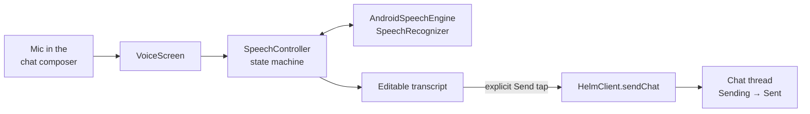
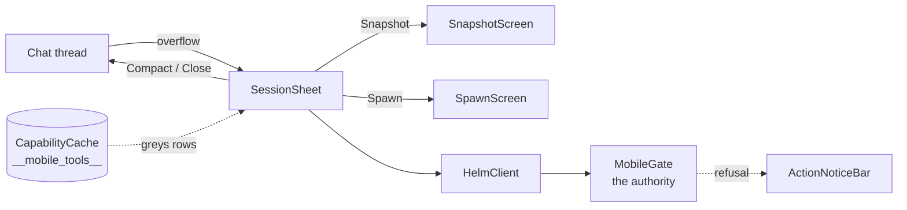
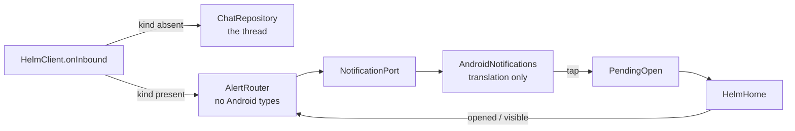
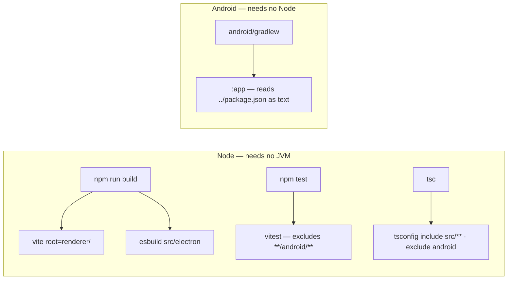

# Helm for Android

The phone client for Helm. It pairs over Bluetooth LE and gives full session
control away from the desk.

> **Role:** the phone is the BLE **peripheral** — it advertises and serves the
> GATT server; Helm on Windows is the **central** and connects in. See
> [`../docs/mobile-ble-transport.md`](../docs/mobile-ble-transport.md).

## ⚠️ The release keystore must never be regenerated

An APK signed with a different key **refuses to install** over an existing one.
The only recovery is uninstall-and-repair, which loses the user's pairing.

- Generate the release keystore **once**.
- **Back it up outside this repository**, along with its passwords.
- Never commit it. `*.keystore`, `*.jks` and `android/local.properties` are
  gitignored.

Likewise `applicationId` is fixed at `com.potatomotato.helm` **forever**.
Changing it is not an update — Android installs it as a second, separate app.

```bash
keytool -genkeypair -v -keystore helm-release.jks -alias helm \
  -keyalg RSA -keysize 4096 -validity 10000
```

Then point the build at it via `android/local.properties` (gitignored):

```properties
sdk.dir=C\:\\Users\\<you>\\AppData\\Local\\Android\\Sdk
helm.keystore.file=C\:\\path\\outside\\repo\\helm-release.jks
helm.keystore.password=...
helm.key.alias=helm
helm.key.password=...
```

CI reads the same values from `HELM_KEYSTORE_FILE`, `HELM_KEYSTORE_PASSWORD`,
`HELM_KEY_ALIAS`, `HELM_KEY_PASSWORD`.

If none are set, `assembleRelease` still produces an installable APK — signed
with the **debug** key and a loud warning. That is for local work only; it must
never be published.

> **Never rename `releaseKeyAlias` / `releaseKeyPassword` back to `keyAlias` /
> `keyPassword`.** Inside `signingConfigs.create("release")` the receiver has
> properties of those names, so `this.keyAlias = keyAlias` reads the receiver's
> own null back into itself — a silent self-assignment. `hasReleaseSigning`
> stays `true`, the config reports as configured, and the key quietly goes
> missing. `storePassword` escapes only because that name does not collide.

**Never conclude an APK is correctly signed from the build log.** A debug-signed
APK builds, installs and runs exactly like a correct one; the fault surfaces
only when a user cannot upgrade and loses their pairing. Verify the certificate:

```bash
apksigner verify --print-certs app/build/outputs/apk/release/app-release.apk
```

The release pipeline does this automatically and refuses to publish otherwise —
see [`../docs/apk-distribution.md`](../docs/apk-distribution.md).

## Build

Requires JDK 17 and the Android SDK (platform 35). **No Node tooling.**

```bash
cd android
./gradlew assembleRelease     # -> app/build/outputs/apk/release/app-release.apk
./gradlew assembleDebug
./gradlew installDebug        # build + install onto the attached device
./gradlew test                # JVM unit tests — no device, no emulator
adb install -r app/build/outputs/apk/release/app-release.apk
```

The unit tests read the BLE conformance vectors straight out of
`../tests/fixtures/`, whose path Gradle passes as the `helm.fixtures.dir` system
property. They are shared with the TypeScript suite on purpose: the two
languages must agree byte for byte, and a copy would drift silently. See
[../docs/mobile-ble-transport.md](../docs/mobile-ble-transport.md).

## Design system

Every colour, type and spacing token lives in
`app/src/main/kotlin/com/potatomotato/helm/ui/theme/`. Screens compose from
`HelmColors`, `HelmSpacing`, `MaterialTheme.typography` and the shared
components in `ui/components/` — **no screen declares a colour**.

`NoRawColorLiteralTest` enforces that by scanning `src/main` for `Color(…)` and
`Color.White`-style literals outside the theme package. It is the only test the
design system has, deliberately: "black is black" is a constant equalling
itself, but a screen quietly reintroducing a hardcoded accent is the real way a
design system dies, and nothing else catches it.

Two rules the tokens exist to protect:

- **True black, always.** `HelmColors.Bg` is `#000000`. On OLED a black pixel is
  an unlit pixel; a dark grey is not. Elevation is a 1px `HelmColors.Line`
  hairline, never a lighter fill. There is no light theme and no Material You
  dynamic colour — wallpaper tinting would replace the black with grey.
- **State colours are the desktop's, semantically.** Green active, blue waiting,
  grey idle, amber flash, per invariant 8 and `renderer/state-colors.ts`. The
  Android hexes are the brighter OLED-tuned tones ratified in the P-0740 mockup,
  so they are **not** byte-identical to the desktop's. Adding or removing a
  *state* on the desktop must be mirrored here; re-tuning a desktop hex need not
  be. All four are drawn by one composable, `ui/components/StateDot.kt`.

The approved mockup is the attachment on plans P-0740 and P-0742–P-0746. It is
deliberately **not** copied into the working tree — a copy is a second source of
truth waiting to drift.

## Voice input

Dictation uses the platform `SpeechRecognizer` with `EXTRA_PREFER_OFFLINE`:
recognition happens on the phone, nothing is recorded to a file and nothing is
uploaded. There is no OpenWhispr, no ffmpeg and no audio on the BLE link — the
only thing that crosses the wire is the confirmed text, as an ordinary gated
`session_send_text` over `HelmClient`, identical to a typed message.



Three rules this layer exists to hold:

- **Partial results replace, never append.** Each partial is the recogniser's
  whole current guess. Appending them is what turns one spoken phrase into
  "test test test test".
- **Nothing is sent without an explicit tap.** The transcript is an editable
  field, not a label, because recognisers get names and jargon wrong and
  retyping a whole dictation to fix one word is worse than typing it.
- **No failure strands the user on "Listening".** Every recogniser error lands
  in `VoicePhase.Failed` with whatever was already heard still on screen.
  `SpeechError.retryable` decides whether the screen offers another attempt or
  sends the user to Settings — retrying a permission denial fails silently,
  because the system stops prompting once a permission is refused for good.

Logic lives in `voice/SpeechController.kt` with no Android types in it, driven
in tests by `FakeSpeechEngine`. `voice/AndroidSpeechEngine.kt` is translation
only — the same split the BLE layer uses, for the same reason: the sequences
that break this (a partial after a cancel, an empty final, an error
mid-utterance) cannot be produced on demand by the real recogniser.

`RECORD_AUDIO` is requested at the mic button, not at launch — the app is
useful without it. The `<queries>` entry for `android.speech.RecognitionService`
in the manifest is **load-bearing**: without it `isRecognitionAvailable()`
returns false on API 30+ even when a recogniser is installed.

## Control surface

Mockup screen 4 (the session sheet), screen 7 (the terminal snapshot) and the
spawn form screen 4 implies but never draws. Every action is a gated call over
`link/HelmClient.kt` — there is no second route to `HelmPairing.send`, so
nothing here bypasses `MobileGate`.



**What is offered comes from the gate.** Rows grey out from `__mobile_tools__`,
the device's real permitted surface, never from a list written in the app. That
is what entitles the sheet to say "not permitted" at all — a ratified divergence
from the desktop's uniform-deny rule, defensible because a SAS-paired phone is
the user's own device *and* because the claim is true. `Capabilities.Unknown` and
`Known`-without-the-tool are drawn differently on purpose: an unanswered
discovery says "checking…" rather than claiming a verdict the phone was never
given. The surface is forgotten on link loss so a reconnect re-asks, and a
capability revoked on the desktop stops being offered.

**A row that cannot work is not drawn.** The mockup's Drafts and Artifacts rows
are absent, not greyed. Drafts have no MCP surface at all; every `artifact_*`
tool resolves its subject from the caller's own session, so from the phone's
proxy identity it answers *emptily* instead of refusing. Greying them would be a
lie — the user is permitted; there is nothing to call. They appear by themselves
the day a reachable surface exists, with no change to this screen. See
[docs/mobile-gate.md](../docs/mobile-gate.md#structurally-unreachable-tools).

**The gate is the authority; this UI is a hint.** The capability cache can be a
poll stale, so a refusal for a permitted-looking action is a NORMAL outcome, not
a crash. `ActionNoticeBar` words a refusal as a rule that will hold and a link
failure as a radio that may come back — and never guesses *which* rule, because
every deny path answers with byte-identical text by design.

**Snapshot is on demand, never streamed**, with the line count chosen before the
pull, so the cost is decided by the person paying it. The tail is requested
`stripped`: the ANSI cleaning is the desktop's own and this app has no second
escape-code parser to drift from it. Lines scroll sideways rather than wrapping —
a wrapped terminal line changes what a diff or a table means.

**Spawn fills every field from a surface the phone already has** —
`directory_list` for directories, distinct `cliType`s harvested from
`session_list`. The consequence is deliberate: a phone can only spawn a KIND of
session it can already see running. That is smaller than the desktop, and honest;
the alternative was inventing a tool to populate a picker. Close confirms and
names the session. Spawn does not confirm — creating is cheap, and a prompt on
everything trains people to tap through the one that matters.

## Notifications

The payoff for choosing BLE: a session needing attention buzzes a phone in your
pocket with no cloud, no APNs, no Firebase and no Telegram in the path. A GATT
notify reaches the already-running foreground service, which posts a lock-screen
row.



**A kind-bearing record never enters the thread.** It is an event Helm reported,
not something an agent said; putting it in the conversation would fabricate one.
The split happens once, at decode. See [docs/chat-fan-out.md](../docs/chat-fan-out.md).

**One row per session.** The notification id is derived from the session id and
nothing else, so ten buzzes from one session REPLACE nine times. Key it on the
kind or the timestamp and the phone stacks instead. This is a different thing
from the ratified duplication between Telegram and the app — that is two surfaces
telling you once each, which is the point.

**A channel change cancels first.** Android will not carry a live notification to
another channel, so a session going Attention → Completion must take the old row
down or it strands under a channel the user may have silenced.

**Three channels**, so the classes can be silenced apart: Attention ("Needs
you"), Completion ("Finished"), Idle ("Went quiet"). Attention alone wears the
amber flash colour — the same meaning as the flash dot, per invariant 8 — which
is what finally gives `StateDot.Flash` a consumer. Everything else takes the app
accent.

**Nothing is posted for the session already open in the foreground**, and opening
a session clears its row. Backgrounded, the same alert posts: being out of the
room is exactly what this is for.

A tap lands in that session's thread from a cold start as well as a warm one.
`PendingOpen` parks the request because on a cold start the tap arrives before
there is any composition to hand it to; it is consumed exactly once, so a
rotation does not drag the user back to a thread they left.

## Versioning

`versionName` and `versionCode` are **derived from the repo's `package.json`**
at configure time and must not be hand-edited. `prepareDeploy.py` already bumps
that file on every release, so the Android version follows automatically —
Android refuses to install an APK whose `versionCode` went backwards, and a
forgotten manual bump only surfaces on a user's phone.

`versionCode = major * 10000 + minor * 100 + patch`.

## Distribution

Every tagged release carries the signed APK as a GitHub release asset on the
public `PetePeter/helm`, named `helm-<version>.apk`. `prepareDeploy.py` builds
and certificate-verifies it; `sendDeploy.py` refuses to publish a release that
has no APK. Settings → Mobile shows a QR and the plain URL for the running
version's asset — never `latest`.

Full route, the three-valued availability check and why R8 is still off:
[`../docs/apk-distribution.md`](../docs/apk-distribution.md).

## Toolchain boundary

The Node and Android toolchains never touch each other:



- `vite.renderer.config.ts` is rooted at `renderer/`, so it cannot see `android/`.
- esbuild bundles from explicit `src/electron` entry points.
- `tsconfig.json` includes only `src/**` and now excludes `android` explicitly.
- `vitest.config.ts` excludes `**/android/**`.
- Gradle reads `../package.json` as **plain text** — no Node process is spawned.

A contributor with no Android SDK can still run `npm test` and `npm run build`;
a contributor with no Node can still build the APK.
