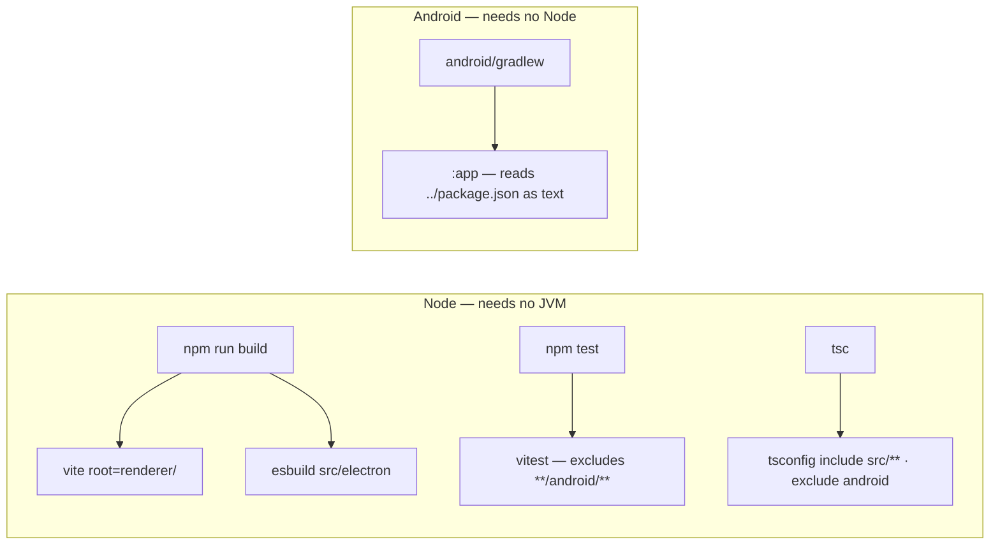

# Helm for Android

The phone client for Helm. It pairs over Bluetooth LE and gives full session
control away from the desk.

> **Role:** the phone is the BLE **peripheral** — it advertises and serves the
> GATT server; Helm on Windows is the **central** and connects in. See
> [`../docs/mobile-ble-transport.md`](../docs/mobile-ble-transport.md).

## ⚠️ The release keystore must never be regenerated

An APK signed with a different key **refuses to install** over an existing one.
The only recovery is uninstall-and-repair, which loses the user's pairing.

- Generate the release keystore **once**.
- **Back it up outside this repository**, along with its passwords.
- Never commit it. `*.keystore`, `*.jks` and `android/local.properties` are
  gitignored.

Likewise `applicationId` is fixed at `com.potatomotato.helm` **forever**.
Changing it is not an update — Android installs it as a second, separate app.

```bash
keytool -genkeypair -v -keystore helm-release.jks -alias helm \
  -keyalg RSA -keysize 4096 -validity 10000
```

Then point the build at it via `android/local.properties` (gitignored):

```properties
sdk.dir=C\:\\Users\\<you>\\AppData\\Local\\Android\\Sdk
helm.keystore.file=C\:\\path\\outside\\repo\\helm-release.jks
helm.keystore.password=...
helm.key.alias=helm
helm.key.password=...
```

CI reads the same values from `HELM_KEYSTORE_FILE`, `HELM_KEYSTORE_PASSWORD`,
`HELM_KEY_ALIAS`, `HELM_KEY_PASSWORD`.

If none are set, `assembleRelease` still produces an installable APK — signed
with the **debug** key and a loud warning. That is for local work only; it must
never be published.

## Build

Requires JDK 17 and the Android SDK (platform 35). **No Node tooling.**

```bash
cd android
./gradlew assembleRelease     # -> app/build/outputs/apk/release/app-release.apk
./gradlew assembleDebug
./gradlew installDebug        # build + install onto the attached device
./gradlew test                # JVM unit tests — no device, no emulator
adb install -r app/build/outputs/apk/release/app-release.apk
```

The unit tests read the BLE conformance vectors straight out of
`../tests/fixtures/`, whose path Gradle passes as the `helm.fixtures.dir` system
property. They are shared with the TypeScript suite on purpose: the two
languages must agree byte for byte, and a copy would drift silently. See
[../docs/mobile-ble-transport.md](../docs/mobile-ble-transport.md).

## Design system

Every colour, type and spacing token lives in
`app/src/main/kotlin/com/potatomotato/helm/ui/theme/`. Screens compose from
`HelmColors`, `HelmSpacing`, `MaterialTheme.typography` and the shared
components in `ui/components/` — **no screen declares a colour**.

`NoRawColorLiteralTest` enforces that by scanning `src/main` for `Color(…)` and
`Color.White`-style literals outside the theme package. It is the only test the
design system has, deliberately: "black is black" is a constant equalling
itself, but a screen quietly reintroducing a hardcoded accent is the real way a
design system dies, and nothing else catches it.

Two rules the tokens exist to protect:

- **True black, always.** `HelmColors.Bg` is `#000000`. On OLED a black pixel is
  an unlit pixel; a dark grey is not. Elevation is a 1px `HelmColors.Line`
  hairline, never a lighter fill. There is no light theme and no Material You
  dynamic colour — wallpaper tinting would replace the black with grey.
- **State colours are the desktop's, semantically.** Green active, blue waiting,
  grey idle, amber flash, per invariant 8 and `renderer/state-colors.ts`. The
  Android hexes are the brighter OLED-tuned tones ratified in the P-0740 mockup,
  so they are **not** byte-identical to the desktop's. Adding or removing a
  *state* on the desktop must be mirrored here; re-tuning a desktop hex need not
  be. All four are drawn by one composable, `ui/components/StateDot.kt`.

The approved mockup is the attachment on plans P-0740 and P-0742–P-0746. It is
deliberately **not** copied into the working tree — a copy is a second source of
truth waiting to drift.

## Versioning

`versionName` and `versionCode` are **derived from the repo's `package.json`**
at configure time and must not be hand-edited. `prepareDeploy.py` already bumps
that file on every release, so the Android version follows automatically —
Android refuses to install an APK whose `versionCode` went backwards, and a
forgotten manual bump only surfaces on a user's phone.

`versionCode = major * 10000 + minor * 100 + patch`.

## Toolchain boundary

The Node and Android toolchains never touch each other:



- `vite.renderer.config.ts` is rooted at `renderer/`, so it cannot see `android/`.
- esbuild bundles from explicit `src/electron` entry points.
- `tsconfig.json` includes only `src/**` and now excludes `android` explicitly.
- `vitest.config.ts` excludes `**/android/**`.
- Gradle reads `../package.json` as **plain text** — no Node process is spawned.

A contributor with no Android SDK can still run `npm test` and `npm run build`;
a contributor with no Node can still build the APK.
