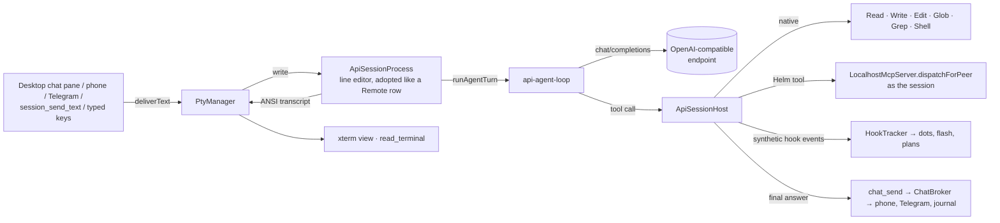

# API tools — Helm-hosted agent sessions

An **API tool** is a CLI type with an `api` block. Instead of spawning a CLI in
a PTY, Helm runs the agent loop itself against an OpenAI-compatible
chat-completions endpoint (the local llama router, LM Studio, OpenRouter, ...).

**Why:** small local models cannot drive Claude Code. Its ~28k-token prompt, 50+
tools and the "reply with `chat_send`" ritual are more than a 2B model can
follow. An API tool gives the model a short constant prompt, only the tools the
user ticked, and Helm posts the answer to the chat itself.

## Shape



- **No new input path.** `ApiSessionProcess` implements `PtyProcess` and is
  adopted into `PtyManager`, exactly like `RemotePtyProcess`. Everything that
  writes to a session — `session_send_text`, chat inbound, bindings, the desktop
  chat pane — reaches it unchanged. Invariant 2 still holds: every *CLI* runs in
  a PTY. An API tool is not a CLI; its "terminal" is Helm's own transcript.
- **Tools are ticked per API tool.** `allowedTools` lists native tool names and
  Helm MCP tool names. Anything unticked is never offered, and a hallucinated
  call to it is refused.
- **Helm tools and skills are native.** Helm MCP tools dispatch in-process
  under the session's own identity. When `skill_get` is ticked, the project's
  skills directory is listed in the system prompt.
- **Replies go to chat automatically.** An API session's conversation IS its
  chat. The desktop pane reuses the operator chat view, over the same journal
  the phone reads. Every final answer is posted via `chat_send`, unless the
  model already called a chat tool itself that turn.
- **Bare input, no Helm envelopes.** The model gets plain text instead of the
  `[HELM_MSG]` / `[HELM_TELEGRAM]` envelopes and their reply rules; replies are
  routed by Helm. A message from another Helm session is tagged
  `[from <name> (<id>)]`, plus `, awaiting reply` when `expectsResponse` was
  set. In that case Helm sends the final answer back to that session via
  `session_send_text` instead of posting it to chat. Large texts are always
  inline — the temp-file redirect exists for PTY paste limits an API tool does
  not have — so there are no files to fetch or clean up.
- **Delivery is synchronous.** Terminal-activity delivery verification is
  skipped: it waits for TUI repaints an API session never makes, and would
  outlast the phone's 10 s ack deadline.
- **`request_tool` is always offered.** When the model needs a tool that does
  not exist, the wish becomes a review on the `api-tool-requests` skill (read it
  with `skill_get_feedback`), the user gets a chat ping, and the model is told to
  carry on without it.
- **Mid-turn input joins the running turn.** Text submitted while a turn runs
  is fed to the model right after the pending tool results. It is never placed
  between a tool call and its result, which the API forbids. If the model then
  answers without another tool step, the text runs as the next turn instead.
- **Deleting chat bubbles edits the context.** The phone's `__chat_delete__`
  (see [chat-fan-out.md](chat-fan-out.md#deleting-messages)) removes journal
  entries and tells the host:
  - Deleting a user bubble drops its whole turn: the question, the tool calls
    and results it caused, and the answer.
  - Deleting a reply drops the answer and the tool steps it was built on; the
    question stays.

  The next request re-reads from the first changed message (one cache miss).
- **Usage badge.** Each auto-reply carries `contextTokens` (context size after
  the turn, from the server's `usage`) and `toolCalls`. The desktop pane and the
  phone show these as "ctx 12.3k · 4 tools" under the bubble. When history
  shrinks without a reply to carry the size (bubbles deleted between turns,
  compaction), Helm posts a short note whose badge is an estimate: the last
  reported size scaled by the characters kept. The next reply shows the
  server's real figure.
- **Forgetting on purpose.** Three tools, always offered:
  - `checkpoint` / `rollback` cut everything since a mark and leave a note.
  - `forget_turns` drops chosen past turns by quoting their first words. It
    uses the same matching as bubble deletion and applies after the turn. Once
    history reaches 20 turns, the per-turn context nudges the model to prune,
    and repeats every 10 turns after that.
- **Compaction.** `session_compact` works on an API tool with no configured
  action: Helm's loop understands `/compact [focus]`. The model writes a
  handover summary in one tool-less turn. The summary is saved as a memory, so
  it survives a crash mid-swap, and then becomes the whole history. After that
  the memory is deleted.
- **`chat_history`.** An always-offered tool that reads the session's own chat
  journal, both sides, newest page last. It can grep (`query`, a regex, falling
  back to plain text) and page back (`before`). What was said survives
  forgetting and compaction even though the model's context does not.
- **Clean text.** Model text is cleaned before it reaches history, the terminal
  or chat. UTF-8 misread as cp1252 ("don’t") is re-decoded, and stray
  control characters and U+FFFD are stripped.
- **Subagents and slots.** Every API session gets an `Agent(tasks: [{description,
  prompt}])` tool. One call is one batch:
  - The loop sets a checkpoint (`agents-N`) before the batch. The result tells
    the model to roll back to it, with a note of the memory ids it still needs,
    once it has used the findings. Each finding is already filed as a
    summary + detail memory, so nothing is lost.
  - Each task spawns a visible session of the same API tool. It opens with a
    handover (parent name, parent mission, the task), and its final answer
    returns as the tool result instead of going to chat.
  - A batch's tasks run concurrently, as do several `Agent` calls in one step. Subagents nest up to
    `MAX_SUBAGENT_DEPTH` (3) levels, with at most `MAX_LIVE_SUBAGENTS_PER_ROOT`
    (20) working at once under one top-level session; past either limit the
    call returns an error telling the model to do the work itself.
  - A tree of agents cannot deadlock on slots: a parent waiting on subagents
    is inside a tool call, not a model request, so it holds no slot.
  - Every session, subagents included, is offered the same tools. Its system
    prompt and tool block are therefore byte-identical to its parent's, so the
    server's prefix cache is shared.
  - `slots` (default 1) caps the model requests in flight across all sessions
    of the API tool, subagents included. Set it to the server's parallel slots.
  - The model may ask for any number of subagents; the requests queue for a
    free slot.

  ```mermaid
  graph LR
      P[Parent turn] -->|Agent ×N| H[ApiSessionHost]
      H -->|session_create| C1[Subagent 1]
      H -->|session_create| C2[Subagent 2 …]
      C1 & C2 -->|complete| S{{slots semaphore<br/>per API tool}}
      S --> LLM[(Server)]
      C1 & C2 -->|final answer| P
  ```
- **Hooks without a shim.** The host emits canonical `UserPromptSubmit`,
  `PreToolUse`/`PostToolUse` and `Stop`/`StopFailure` events into the
  `HookReceiver` stream. Activity dots, attention flash and plan settlement
  therefore behave as they do for a hooked CLI.
- **Injected context without a shim.** A CLI gets its per-prompt context in the
  hook reply: inter-session rules, the `[HELM_MISSION]` line, "possibly
  related" memory and skill pointers, and nudges. An API turn asks the same
  `ContextInjector.promptContext` for that text and appends it after
  `<helm_context>`. If the injector fails, the turn runs without the hints.

## Prompt layout: constant first, mutable last

```
[system: identity · rules · skills directory · user's extra prompt]   ← constant for the session
[tools: ticked subset, in catalog order]                               ← constant for the session
[history: append-only]                                                 ← grows, never rewritten
[new user message] + <helm_context> time · session · cwd + hook context ← the only moving part
```

The server's prefix cache (llama.cpp slot reuse, provider prompt caching) keeps
everything above the new message. Two rules follow from that:

- Nothing volatile may ever enter the system prompt.
- Tools are offered in catalog order, not tick order, so the tool block is
  byte-stable however the ticks were made.

## Config

```yaml
<uuid>:
  name: local-minicpm-api
  api:
    baseUrl: http://127.0.0.1:8080/v1
    model: minicpm              # router section / provider model slug
    apiKeyEnv: OPENROUTER_API_KEY  # optional; the key itself is never stored
    maxToolRounds: 25           # optional; the final round offers no tools
    systemPrompt: ...           # optional; appended to the constant prompt
    allowedTools: [Read, Glob, Grep, memory_search, skill_get]
```

Spawn, resume and continue commands are ignored for an API tool.

## Lifecycle

- **History** lives at `<config>/api-sessions/<cliSessionName>.json` and is
  rewritten after each completed turn. A resume-spawn with the same
  `cliSessionName` reloads it, so a restart keeps the conversation.
- **Input:** typing plus Enter submits. Bracketed pastes (every Helm delivery)
  submit as one turn. Input that arrives mid-turn is queued. Ctrl+C or Esc
  aborts the running turn.
- **Rows:** `SessionInfo.apiTool` marks the row, so its pane opens on the chat
  view. The flag is ephemeral and re-derived at every spawn.

## Files

| File | Role |
|------|------|
| `src/session/api/api-agent-loop.ts` | `runAgentTurn` and the OpenAI-compatible client |
| `src/session/api/api-native-tools.ts` | Read / Write / Edit / Glob / Grep / Shell |
| `src/session/api/api-prompt.ts` | Tool catalog, tick selection, system prompt, mutable context, chat chunking |
| `src/session/api/api-session-process.ts` | The `PtyProcess` adapter: line editor, turn queue, transcript |
| `src/session/api/api-session-host.ts` | Wiring to Helm: dispatch, hooks, history, auto chat reply |
| `src/session/configured-session-spawn.ts` | The `cfg.api` branch: adopt instead of spawn |
