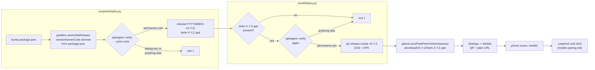

# APK distribution — how the phone gets the app

The Android companion is sideloaded, not on a store, so it needs a delivery
route. `PetePeter/helm` is public, so a GitHub release asset is a plain HTTPS
URL the phone can fetch directly.

**Helm does NOT host the APK.** No LAN server, no token, no TTL on this side.
This is a build-pipeline change plus a link.

**Downloading the APK grants nothing.** Delivery and access are separate
concerns. A fresh install is an unpaired stranger: it can do nothing until SAS
pairing completes ([mobile-pairing.md](mobile-pairing.md)) and every call it
then makes is gated ([mobile-gate.md](mobile-gate.md)). Anyone may download it;
only a device whose six digits the user confirmed can reach a session. A public
download is not a security hole.

## The route



## The version in the URL is the running Helm's, never `latest`

`src/mobile/apk-release.ts` is the single definition of the tag, the asset name
and the URL. A `latest` URL renders identically in the tab and hands the user an
APK from a different release, which protocol-version negotiation
([mobile-ble-transport.md](mobile-ble-transport.md)) then refuses — presenting
as a broken radio rather than as a version mismatch. The asset name is
version-stamped for the same reason: a release cannot accidentally carry an APK
built from another version.

`deploy_android.py:apk_asset_name()` mirrors `apkAssetName()`. Keep them in step.

## Availability is three-valued

`mobile:apkRelease` HEAD-checks the asset and reports one of:

| Value | Meaning | What the tab says |
|---|---|---|
| `available` | the asset is there | nothing — just the QR and URL |
| `missing` | no APK was published for this version | names the version; the link will not work |
| `unknown` | the check could not be made | says so; the link is still shown |

`unknown` is deliberately not `missing`. Being offline is not evidence that a
release lacks an APK, and collapsing the two tells the user their release is
broken every time the desktop has no network. This is the same distinction
`Capabilities.Unknown` draws in the phone's permissions sheet: "we could not
ask" and "it is not there" are different claims.

An unusable app version answers `{ ok: false, reason }` rather than rejecting
the IPC call — a rejection reaches the renderer with no copy attached to it,
which is how a settings tab ends up blank and unexplained.

## Never conclude an APK is signed correctly by reading the build log

This is the rule the whole pipeline exists to enforce.

A debug-signed APK builds cleanly, installs, and runs. It is indistinguishable
from a correct one until a user tries to upgrade it — at which point Android
refuses the install and their pairing and app data are gone. There is no second
chance: **the release key is permanent and must never be regenerated.**

The `hasReleaseSigning` flag in `build.gradle.kts` is not evidence. It was
`true` for the entire period during which the signing config was silently
dropping its own key: inside `signingConfigs.create("release")` the receiver has
its own `keyAlias` and `keyPassword` properties, so `this.keyAlias = keyAlias`
read the receiver's own null straight back into itself. The outer vals are now
`releaseKeyAlias` / `releaseKeyPassword` and **must never be renamed back**.

So `deploy_android.py` asserts the certificate in the finished file:

```bash
apksigner verify --print-certs app/build/outputs/apk/release/app-release.apk
```

against the recorded permanent SHA-256, refusing anything else and naming the
debug key explicitly when it sees it. An APK whose signer cannot be verified is
refused exactly like a wrongly signed one — shipping on "we could not check" is
how the debug key escapes.

## The QR

Drawn black-on-white in both themes, a deliberate exception to the token rule in
[css-architecture.md](css-architecture.md). A QR is read by a camera, not by a
person; a themed low-contrast code fails looking like a code. The payload is
exactly the URL with no trailing whitespace — some scanners carry a trailing
newline into the address bar, where it becomes a 404 on a URL that looks right.

`qrcode-generator` is zero-dependency and its output is bound as SVG geometry,
never injected as markup.

## R8 is off, on purpose

`isMinifyEnabled = false`. The APK is ~9 MB, about 4 MB of it Bouncy Castle
(which supplies X25519 — the platform does not). R8 would reclaim most of that,
but Bouncy Castle needs keep rules and **a stripped crypto class does not fail
loudly — it fails as "pairing just never works"**. That can only be judged on a
real phone, so minification waits until after the end-to-end hardware pass
rather than shipping an unverified crypto path.
