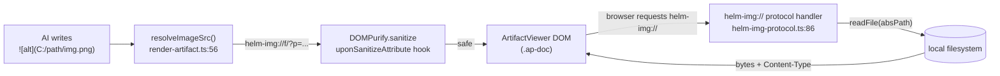
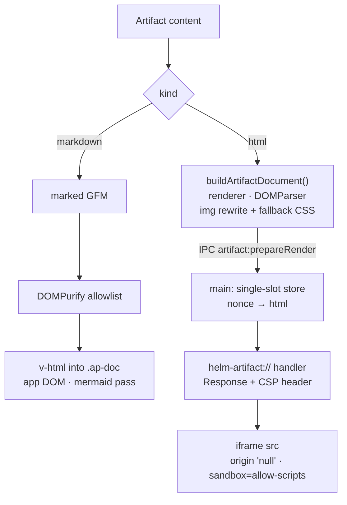
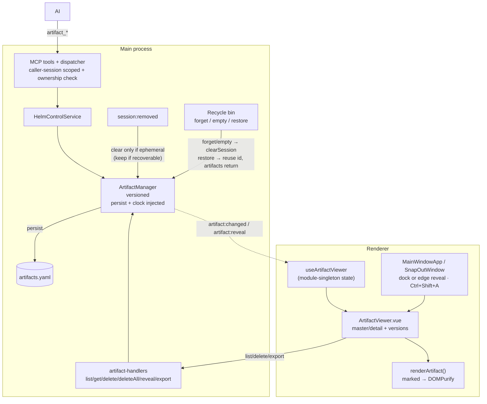

# Artifact Manager + Viewer

Per-session, **ephemeral** store of renderable outputs an AI produces for the
user to *read* — explanations, reports, analyses, results — rendered in a
dedicated in-app panel instead of making the user open a random file. Artifacts
are **markdown or HTML**, **versioned**, and **die with their session**.

Distinct from:
- **Drafts** (per-session prompt memos the user composes) — see [directory-plans.md](directory-plans.md) neighbours.
- **Plans** (per-directory DAG work items).
- **Contexts** (project knowledge nodes).

## Lifecycle — tied to the recycle bin

Artifacts belong to a single session, keyed by its hub `sessionId`. Their fate
follows the session's **recoverability**:

- **Recoverable close** (session carried a `cliSessionName` → goes to the recycle bin): the `session:removed` listener **keeps** the artifacts under the same id. They live alongside the bin entry for its 30-day window.
- **Restore** reuses the session's **original id** (exactly like startup auto-resume — `doSpawn(..., entry.sessionId)`), so the preserved artifacts come straight back attached, with no re-keying. Restore is **two-phase**: `recycleBin:restore` *peeks* the entry (no removal), and only a successful re-spawn calls `recycleBin:commitRestore` to remove it — a failed spawn leaves the entry (and its artifacts) intact and retryable.
- **Forget** (delete one bin entry) clears that entry's artifacts; **Empty** clears every binned entry's artifacts. An entry that **expires** past the 30-day window at runtime fires `recycle-bin:expired` and its artifacts are cleared then too (not only at startup).
- **Non-recoverable / ephemeral close** (no bin entry): the listener clears the artifacts immediately.
- **Startup reclamation**: `pruneOrphanArtifacts` drops any stored artifact whose session is neither live nor in the bin — crash orphans, or a bin entry that expired past the 30-day window.
- Nothing leaves the session except an explicit **Export** to a user-chosen file.

Persisted to `%APPDATA%/Helm/config/artifacts.yaml` (global file, keyed by session; sessions with zero artifacts are omitted on export).

## Versioning

Each artifact holds an ordered `versions[]` stack (1-based). The AI only ever
writes the newest version:
- `artifact_create` → version 1 (always a new uuid; duplicate titles allowed).
- `artifact_update(id, content)` → appends the next version and brings it forward.
- A user-attached file (`artifact:createWithFile`) → **also just version 1**. The
  attachment is filed under the artifact's id, so the handler pre-mints that uuid and
  passes it to `ArtifactManager.create` (the optional trailing `id`), storing the file
  and building the markdown *before* the artifact exists. Creating it empty and
  `update`-ing it afterwards produced two versions and doubled the changed/reveal
  events per drop.

The user can read any prior version in the viewer (‹ › steppers + a version
dropdown, with a "viewing older version" banner and *Jump to latest*).

## Adding a file — readable vs binary

Drag-drop, clipboard paste, and the 📎 picker all funnel through one decision
(`renderer/artifacts/text-file-drop.ts`), so they cannot drift:

| Input | Result |
|---|---|
| `.md` / `.markdown` | markdown artifact holding the file's text — it renders |
| `.txt`, `.json`, `.csv`, `.log`, source files, or any `text/*` | artifact holding the text in a fence long enough to contain it |
| anything else, or over 1 MB | attachment: bytes on disk + a metadata card |

**Identification is by file EXTENSION first.** Chromium reports an empty
`blob.type` for `.md` and most source files, so a mime-only rule filed
documents as `application/octet-stream` and handed the user a binary card
instead of their notes.

**The attachment card's link.** It is `helm-attachment://<artifactId>/<attachmentId>`,
not a filesystem path — the markdown sanitizer's href allowlist is
https/mailto, so an absolute path is stripped and the link was dead on click
however valid the stored file was. The scheme is allowed on `<a href>` only
(never navigated), and `ArtifactViewer.onDocClick` turns it into
`artifact:openAttachment`, which shell-opens the real stored file. Build and
parse it with the helpers in `src/types/artifact-attachment.ts`.

## MCP surface (AI-driven)

The calling session is resolved from the MCP auth context (`authContext.sessionId`),
so the AI operates only on **its own** session's artifacts. Id-based tools
additionally verify the artifact belongs to the caller — a cross-session id
surfaces the same `Artifact not found` error (no existence leak).

| Tool | Args | Effect |
|------|------|--------|
| `artifact_create` | `title, kind('markdown'\|'html'), content` **or** `filePath, title?, contentType?` | New artifact (returns id); auto-reveals. With `filePath`, the caller owns the source file; Helm reads it but never deletes or modifies it. |
| `artifact_update` | `id, content` **or** `id, filePath, contentType?` | Append a version; brings forward. With `filePath`, the caller owns the source file; Helm reads it but never deletes or modifies it. |
| `artifact_show` | `id` | Bring forward in the viewer (no change) |
| `artifact_list` | — | The caller's artifacts (id/title/kind/versionCount/timestamps) |
| `artifact_get` | `id, version?, asFile?, attachmentId?` | Read own content inline, or receive a Helm temp path for artifact content/attachment. Caller must delete returned `tempPath` after reading; Helm may reap stale temp files on startup. |

The old `artifact_delete`/`artifact_delete_all` MCP tools were removed: they
resolved the subject from the caller's auth context, which a paired phone can
never satisfy. Deletion is now `session_artifact_delete` (`sessionId`,
`artifactId`) — see [mobile-app.md](mobile-app.md) — and there is deliberately
no bulk variant; the renderer's artifact panel keeps its own delete/deleteAll
IPC, which is unaffected.

### MCP file ownership

For every MCP API that accepts `filePath`, the caller owns the source file. Helm
only reads it during the call and never deletes or modifies it. The path is
resolved on the Helm instance handling the call (for peer calls, the receiving
instance). The source must remain available until the call returns; after a
successful call the caller may delete it.

For every MCP API that returns `tempPath`, Helm creates a temporary copy on the
Helm instance handling the call for the caller. The caller must read it and
delete it promptly. Helm's startup cleanup is only a safety net for stale files,
not a replacement for caller cleanup. Stored
artifact attachments are different: Helm owns those copies and they remain until
the artifact or attachment is deleted through Helm.

`session_info` advertises the viewer so any connected AI knows to post
user-facing reports here rather than dumping files.

## UI — master / detail panel

Right-hand, resizable dock (width persisted). Master/detail so it scales to many
artifacts:

- **Index rail** (master): scrollable list, live search, sort (newest / recently-updated / A–Z), `Today` / `Earlier` group headers, unread dots, hover-delete.
- **Detail pane**: sanitized render (see below), version bar (title + ✎ rename + ‹ › + dropdown + older-version banner + *Jump to latest*), footer with **Edit / Open externally / Export… / Copy reference / Delete**.

**Rename** is inline in the version bar — the ✎ button or a double-click on the
title (`artifact:rename`, title-only, no new version).

**Edit** opens the raw source of the shown version in place and saves it through
`artifact:update`, i.e. as a **new version** — history is never rewritten. It is
therefore offered on the latest version only; while an older one is on screen the
button is disabled ("Jump to the latest version to edit"). Blank content is
refused in the main process rather than stored, so a stray Save can never blank
an artifact. Markdown and HTML both edit as source.

**Open externally** writes the version *currently on screen* to a read-only temp
file under `<appData>/Helm/tmp` (`helm-artifact-<sessionId>--<title>-<stamp>.md|.html`)
and hands it to the OS default app via `shell.openPath`. It is `chmod 0o444` because
`artifacts.yaml` is the source of truth and edits to the copy would be silently lost.
`shell.openPath` *resolves* an error string rather than throwing (e.g. Windows with no
`.md` handler registered), so the reason is shown inline in the footer instead of the
button appearing dead.

*Temp-copy lifecycle.* The copy outlives the IPC call — the external app still holds
it — so it is attributed to the owning session, both in the filename and in the
in-memory `ArtifactTempRegistry`. It is deleted when that session goes away:

| Trigger | Effect |
|---|---|
| `session:removed` (any close, recoverable or not) | Drains that session's temp copies. A restore re-opens artifacts from the store, never from these files. |
| Recycle-bin **Forget** / **Empty** / 30-day expiry | Drains the binned session's temp copies alongside its artifacts. |
| App startup (`cleanupWorkTempFiles`) | Backstop only — sweeps anything a crash or a quit-with-open-sessions stranded, including legacy names with no session id. |

Deletion goes through `forceDeleteTempFile`, which clears the `0o444` bit before
`unlink` — without that, Windows fails the unlink with `EPERM` and the copies
accumulate forever. A copy the external app still has locked survives the drain and
is caught by the next startup sweep.

**Export…** differs on both counts: it prompts for a location and always writes the
**latest** version.

**Attachments (desktop CRUD).** Below the detail body, an *Attachments (n)*
section manages the side store for the selected artifact:

- **Add** — native picker (`artifact:pickAndReadFile`) → `artifact:attachmentAdd`
  (base64 in, 10 MB cap, body untouched — attachments are a side store, and any
  body links stay as the AI/user wrote them).
- **Open** — `artifact:openAttachment` (shell-open the stored file).
- **Delete** — `artifact:attachmentDelete`; a body link to a deleted
  attachment becomes inert text and never breaks rendering.

The list loads through `artifact:attachmentList` whenever the selection or the
session's artifact list changes (metadata only — no bytes cross the bridge).
This is desktop-side CRUD on an *existing* artifact; the phone-only
`session_artifact_attachment_add`/`_commit` upload path is unchanged.

**Show / hide:** the dock owns pane visibility and close/restore, with the View
menu recovering closed panes and the right rail revealing collapsed panes.
`Ctrl+Shift+A` shows/focuses Artifacts and never toggles it. In a snapped-out
window, the slim right **edge tab** (📄 + badge) remains the reveal affordance
and pulses when a new artifact arrives. ArtifactViewer itself has no duplicate
panel-close button.

**Snap-out follow:** the panel is bound to its session. Its `⧉` snaps the
terminal out; the `SnapOutWindow` mounts its own `ArtifactViewer` bound to that
window's session, so artifacts travel with the terminal and never render in two
windows at once.

**Mermaid:** ```mermaid fenced blocks are emitted as `<pre class="mermaid">` (the
only class the sanitizer keeps, and only on `<pre>`); after the HTML is in the DOM,
`ArtifactViewer` lazy-loads mermaid and renders those nodes to SVG
(`theme: dark`, `securityLevel: strict`). The heavy mermaid bundle loads only when
a diagram is actually present.

## Images

The AI writes plain markdown or HTML image syntax with a local path; Helm rewrites it internally — the artifact body never needs a custom URL.

- `` or `` — any absolute local path works.
- `resolveImageSrc()` (`renderer/artifacts/render-artifact.ts`, line 56) converts the raw `src`/`href` to `helm-img://f/?p=<encodeURIComponent(absPath)>` before the HTML reaches DOMPurify.
- The `helm-img://` Electron protocol handler (`src/electron/helm-img-protocol.ts`, `registerHelmImgProtocol()` line 86) runs in the main process, reads the file bytes with `fs/promises.readFile`, and returns a typed `Response` — `webSecurity` stays ON throughout.
- `file:` URIs are normalised and treated identically to bare absolute paths (the leading `/` before a Windows drive letter is stripped).
- `data:image/<safe-type>` (png/jpeg/gif/webp/bmp/avif) pass through unchanged.

**Dropped sources** (resolve to `null` → image removed, alt text kept for markdown; `` node removed for HTML):

| Source | Reason |
|--------|--------|
| `http://` / `https://` | Deliberate: remote images would leak session context to third-party servers. |
| `data:image/svg+xml` | SVG can embed scripts; serving it via a privileged scheme with the preload attached is a security risk. |
| `javascript:` / relative paths / anything else | Sanitised out. |

The DOMPurify `uponSanitizeAttribute` hook (`render-artifact.ts`, line 131) confines `helm-img:` and `data:image/*` to `` only — those schemes are rejected on `<a href>` and all other attributes, so the `<a>` URI allowlist (https/mailto only) is not loosened.



## HTML rendering

`kind: 'html'` artifacts do **not** go through the markdown sanitizer. Passing
them through it discarded every visual decision the author made — `<style>` is
not in the allowlist, `style` is in `FORBID_ATTR`, `class` is stripped except
the `mermaid` marker, and `<svg>` is refused — so HTML reports arrived as
unstyled prose. They are instead served as their own **isolated document** with
full CSS/SVG/JS fidelity, contained by origin isolation and a CSP rather than by
tag-stripping.



### Why not `<iframe srcdoc>`

Documents with a *local scheme* (`about:srcdoc`, `about:blank`, `blob:`,
`data:`) **inherit the embedding document's CSP**, and the inherited policy
applies *in addition* to anything the frame declares — the intersection wins.
W3C closed the request to opt out ([webappsec-csp#700]) as **wontfix**. The
renderer's policy is `script-src 'self'`, so a `srcdoc` frame would silently
refuse to run the artifact's own inline scripts and would block `helm-img:`
images.

A document fetched over a **real scheme via `src`** does not inherit, and can
carry an authoritative `Content-Security-Policy` **response header** that
artifact script cannot strip. Electron additionally gives custom-protocol
iframes origin `"null"` ([electron#40663]) — the opaque origin, for free.

[webappsec-csp#700]: https://github.com/w3c/webappsec-csp/issues/700
[electron#40663]: https://github.com/electron/electron/issues/40663

### The pipeline

| Stage | Where |
|---|---|
| Parse (inert), rewrite `` via `resolveImageSrc`, inject fallback CSS + link bridge | `renderer/artifacts/build-artifact-document.ts` |
| Stage the document, mint a nonce | `artifact:prepareRender` → `src/electron/helm-artifact-protocol.ts` |
| Serve with `text/html` + CSP header | `helm-artifact://doc/?k=<nonce>` handler |
| Display | `<iframe sandbox="allow-scripts" referrerpolicy="no-referrer">` in `ArtifactViewer.vue` |

The store is a **single slot**: only the document currently on screen is
reachable, so nothing accumulates and a stale frame cannot re-read an old
document.

### Policy

```
default-src 'none'; img-src helm-img: data:; style-src 'unsafe-inline';
font-src data:; script-src 'unsafe-inline' helm-artifact:; form-action 'none';
base-uri 'none'; frame-ancestors 'self' file:
```

`script-src 'unsafe-inline'` carries **no** `'self'` and no host source: the
artifact's own inline `<script>` runs, but no external script can load. The
single exception is the `helm-artifact:` scheme itself, which serves exactly
one script — the locally-bundled mermaid (below). The `sandbox` attribute adds
denial of top-level navigation, popups and form submission on top of the opaque
origin.

Denied: app DOM access, the preload bridge, `localStorage`/cookies, and **all
network egress** — no CDN, no fetch, no web fonts, no remote images.

### Styling

Artifact decides, app provides fallback. `ARTIFACT_BASE_CSS`
(`renderer/artifacts/artifact-base-css.ts`) is injected **only** when the
document has no `<style>`, no stylesheet `<link>` and no inline `style`
attribute, so an unstyled HTML artifact looks like the markdown one. CSS custom
properties do not cross the document boundary, so those values are inlined
literals mirroring `renderer/styles/main.css`.

### Links

Links in the frame are inert by design, so an injected capture listener posts
`{ type: 'helm-artifact-open-url', url }` to the parent, which opens `http(s)`
URLs via the same `shell.openExternal` route the markdown path uses. The parent
gates on **`event.source === frame.contentWindow`** — the frame's opaque origin
makes `event.origin` the useless string `"null"`.

### When the frame renders nothing

A document that fails to come up is *silent*: an iframe fires no error event, and
a document carrying its own restrictive CSP can kill the injected bridge script
while still "loading" fine. So the same injected script posts
`{ type: 'helm-artifact-ready' }` once it runs, and the viewer treats **the
absence of that ping within 1.5 s** as failure — it overlays the frame with a
centred card offering **⧉ Open externally**, which routes through exactly the
same handler as the footer button. Selecting another artifact resets the watch.

Without this the user sees a blank panel and a footer button whose relevance is
not obvious; the same document usually renders fine in a real browser.

### Mermaid in HTML artifacts

The one script the frame may load is mermaid itself: the build copies
`node_modules/mermaid/dist/mermaid.min.js` to `dist-electron/assets/` and the
protocol serves it at `helm-artifact://asset/mermaid.js` (`script-src
helm-artifact:` above). Because AI-authored HTML almost always pulls mermaid
from a CDN — which the zero-egress CSP refuses with the classic *"violates
script-src 'unsafe-inline'"* console error — `buildArtifactDocument` rewrites
any `http(s)` `<script src>` whose last path segment starts with `mermaid` to
the local URL. Every other remote script stays untouched and stays blocked.

A ` ```mermaid ` fence that fails to parse now leaves a visible ⚠ note under
the kept source instead of looking like styled code.

### Limitations

- **No network.** Artifacts must inline assets or use `data:` / `helm-img:`.
- **No auto-height.** The frame fills the panel and scrolls internally.

## Selection & copy

Artifact text is fully selectable. Ctrl+C or Ctrl+X with a text selection inside the `.ap-doc` container performs a **native browser copy** — the keyboard relay does not forward the event to the PTY as a SIGINT or escape code.

The carve-out is the `shouldAllowNativeCopy()` predicate (`renderer/paste-handler.ts`, line 282). It returns `true` when all three conditions hold:

1. `ctrlKey` is set.
2. The key is `c` or `x`.
3. The DOM selection is non-collapsed (`!sel.collapsed`) and its anchor lives inside an `.ap-doc` element (`sel.inArtifactDoc`).

If no text is selected, the predicate returns `false` and the existing PTY behaviour applies (Ctrl+C → SIGINT escape sequence). This mirrors the analogous carve-out in `TerminalView` for xterm selections.

**Security:** artifact bodies are AI-authored (untrusted). The two kinds are
contained by **different mechanisms** — see [HTML rendering](#html-rendering)
for why. Markdown renders via `v-html` inside the *privileged* Electron window,
so its defence is layered:
- `renderArtifact()` compiles markdown with a synchronous `marked` instance, then runs **`DOMPurify.sanitize`** against a strict **document allowlist** — prose/lists/tables/code/links/images only. Forms, controls, inline `style` (no `position:fixed` overlay spoofing), `target`, and non-`http(s)`/`mailto` URLs are stripped. `` is rewritten by the `uponSanitizeAttribute` hook before DOMPurify evaluates it.
- Link clicks inside the rendered doc are intercepted (`onDocClick`) and `http(s)` links open in the OS browser via `shell.openExternal`; they never navigate the app.
- `system:openExternalUrl` re-validates the scheme (http/https/mailto only).
- An app-wide navigation policy (`src/electron/navigation-policy.ts`) is applied to every privileged window (main, snap-out, planner pop-out): `will-navigate` to non-`file:` targets is denied (web URLs go to `shell.openExternal`) and `setWindowOpenHandler` blocks all in-app window opens.

## Data flow



## Key modules

| Module | Role |
|--------|------|
| `src/types/artifact.ts` | `Artifact`, `ArtifactVersion`, `ArtifactKind` |
| `src/session/artifact-manager.ts` | CRUD + versioning + reveal, `artifact:changed`/`artifact:reveal` events |
| `src/session/artifact-persistence.ts` | YAML save/load + type-guard sanitize |
| `src/session/artifact-orphan-prune.ts` | Pure startup reclamation of artifacts with no live/binned owner |
| `src/electron/ipc/recycle-bin-handlers.ts` | Forget/Empty clear a binned session's artifacts; restore preserves them |
| `src/electron/ipc/artifact-handlers.ts` | IPC channels incl. `artifact:export` (native save dialog) and `artifact:openExternal` (read-only temp copy → `shell.openPath`) |
| `src/session/artifact-temp-file.ts` | Pure filename helpers — `sanitizeFilename`, `artifactExtension`, `artifactTempFileName` (shared by export and open-externally) |
| `src/session/artifact-temp-registry.ts` | In-memory sessionId → temp paths written by `openExternal`; `attachSessionTempCleanup` drains on `session:removed` |
| `src/utils/temp-file-delete.ts` | `forceDeleteTempFile` — clears the read-only bit then unlinks (Windows `EPERM`), restoring it if the unlink fails |
| `src/mcp/tools/{definitions,dispatcher,validation}.ts` | 7 MCP tools, caller-session scoping, ownership check |
| `src/mcp/helm-control-service.ts` | Service methods + `requireOwnedArtifact` guard |
| `src/mcp/guides/session-info-guide.ts` | `artifact_viewer` advert in `session_info` |
| `renderer/artifacts/render-artifact.ts` | marked + DOMPurify strict-allowlist sanitized render; `resolveImageSrc()` rewrites local paths to `helm-img://`; ```mermaid → `<pre class="mermaid">` marker |
| `src/electron/helm-img-protocol.ts` | `helm-img://` privileged protocol handler — serves local image bytes; `mimeForPath()` allowlist (png/jpeg/gif/webp/bmp/avif); SVG refused |
| `renderer/paste-handler.ts` | `shouldAllowNativeCopy()` — Ctrl+C/X carve-out for `.ap-doc` text selections |
| `src/electron/navigation-policy.ts` | App-wide privileged-window navigation guard (deny remote nav / window opens) |
| `renderer/composables/useArtifactViewer.ts` | Module-singleton reactive state + event subscription |
| `renderer/components/panels/ArtifactViewer.vue` | Master/detail panel |
