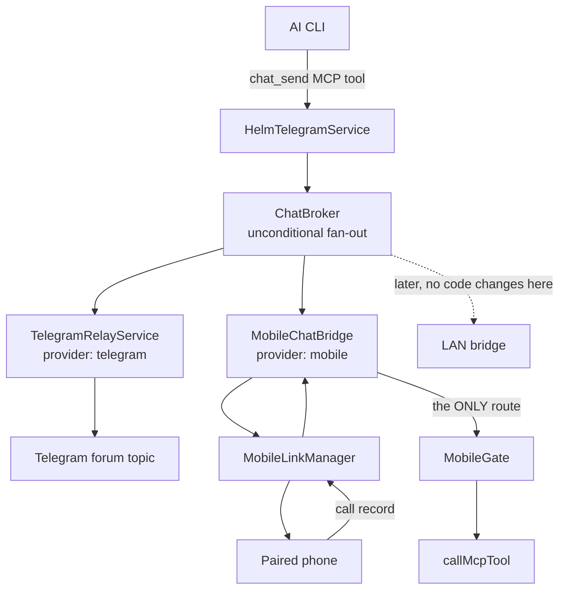
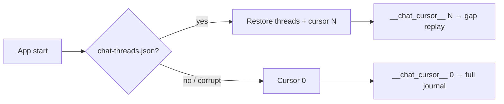
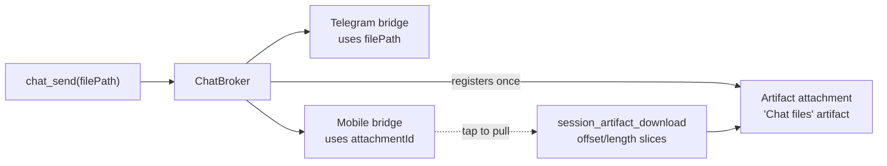
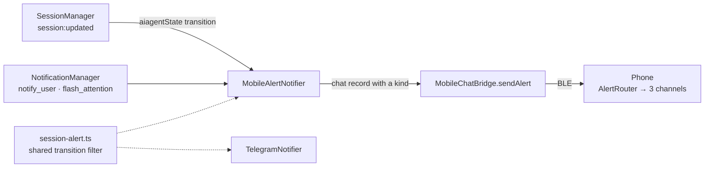

# Chat fan-out — ChatBroker, ChatBridge and the mobile chat surface

Telegram used to **be** the chat channel: `TelegramRelayService` was both the
concept and the transport. A phone over BLE is a second surface that runs
**alongside** Telegram permanently, and a LAN surface is wanted later still, so
the concept is lifted out into a bridge interface and a broker.

| Module | Role |
|--------|------|
| `src/session/chat/chat-bridge.ts` | The interface one chat surface implements |
| `src/session/chat/chat-broker.ts` | Unbounded registry, fan-out, inbound routing |
| `src/session/chat/chat-bindings.ts` | Per-provider session bindings + `topicId` migration |
| `src/telegram/relay-service.ts` | `provider: 'telegram'` — the first implementation |
| `src/mobile/mobile-chat-bridge.ts` | `provider: 'mobile'` — the phone, and the inbound call path |
| `src/mobile/mobile-chat-journal.ts` | The session-lifetime rolling record every phone catches up from |
| `src/mobile/mobile-envelope.ts` | The records that cross the BLE wire |



## Fan-out is unconditional

Every registered bridge receives every message, always. No provider selection, no
"prefer the phone when it is linked", no de-duplication. Telegram is the only
out-of-BLE-range path, so suppressing it whenever the phone happens to be online
would make *"was I told?"* depend on link state. **Duplicate buzzes are the
accepted cost** — the escape hatch is muting the Telegram topic at OS level.

One bridge failing never silences another: each send is isolated, and a throw
becomes a `sent: false` row rather than propagating.

The registry is **unbounded**. Adding a surface is one `register()` call and one
interface implementation — nothing in the broker, the service or the MCP tools
changes. The MCP tool names (`chat_send` / `telegram_chat`,
`telegram_send_voice`) are deliberately unchanged in behavior: `chat_send` is
the transport-neutral name and `telegram_chat` is its long-standing alias, so a
CLI keeps calling what it always called and the extra surfaces appear behind
them.

## chatBindings — where a session lives on each surface

`SessionInfo.topicId` was a Telegram forum topic id and nothing else. The
persisted form is now `chatBindings`, a map keyed by provider.

Two rules, both learned the hard way:

1. **Forward compatible.** An unrecognised provider key survives a load/save
   round-trip untouched. An older Helm must not silently delete a newer one's
   binding — that is exactly how fleet lost `machineId`.
2. **One source of truth per provider.** `topicId` remains on the in-memory
   `SessionInfo` as Telegram's typed view of `chatBindings.telegram`, because the
   whole Telegram stack reads it. The mirroring lives **only** in
   `chat-bindings.ts`: derived on save, rehydrated on load, legacy `topicId`-only
   records migrated on the way. Per invariant 6, `chatBindings` is in
   `serializeSession`'s allow-list; the regression test is
   `tests/chat-bindings.test.ts`.

Mobile deliberately has **no** binding — a phone addresses a session by its id.

## Inbound

Telegram keeps its own inbound path: it already resolves topic → session and
injects into the PTY itself, so routing it through the broker as well would
deliver the user's message twice. It therefore does not emit `inbound`.

The phone's inbound path is different and is a **security boundary**: every
record a phone sends is a `call`, and every call goes through
`MobileGate.handle`. A chat reply from the phone is a `session_send_text` call —
gated, rate-limited and audited like any other — not a privileged side channel.
There is no second gate and no other route from `MobileChatBridge` to a tool. If
no gate is wired the bridge **denies**; a missing boundary never becomes an open
one.

Anything that is not a well-formed `call` from a **registered** machine is
dropped silently — answering would tell a stranger their bytes were understood.
`MobileDeviceStore.getByMachineId` is the bridge between the link manager (keyed
on `machineId`) and the gate (keyed on the local `MobileDevice` record id).

## The mobile wire records

`src/mobile/mobile-envelope.ts` defines four UTF-8 JSON records carried inside a
`SecureChannel` message. Key order is fixed and optional keys are omitted rather
than emitted as null, so two encoders in two languages produce identical bytes.

| Record | Direction | Purpose |
|--------|-----------|---------|
| `call` | phone → Helm | A tool invocation. The only inbound kind. |
| `result` | Helm → phone | The gate's return value for one call id. |
| `error` | Helm → phone | JSON-RPC-shaped failure; deny messages stay uniform. |
| `chat` | Helm → phone | An unsolicited agent message for a session — or, with `kind`, an alert. Messages carry the journal `seq`; alerts never do. Replayed journal records add `replay: true`; a phone's own echoed reply adds `originId` (see below). Optionally carries an attachment's ids (see below). |

Decoding never throws — a malformed record is dropped and logged.

### `kind` — the field that splits a message from an alert

A `chat` record carrying the optional `kind` (`attention` / `completion` /
`idle`) is **not** something an agent said. It is Helm reporting an event, and
the phone routes it to a notification and puts **nothing** in the thread.

That split is the whole point. A reported event rendered as an agent bubble would
grow a conversation on the phone that the desktop never had, and the drift would
be invisible from the desktop side — nobody would ever file it.

`kind` is additive and omitted when absent, so every committed vector still
encodes byte-identically and **no vector was regenerated** — the same precedent
as `SessionSummary.activityLevel`. It is emitted last, after the other optional
keys, because key order is part of the format. Routing happens once, at decode,
in `HelmClient.onInbound`.

`seq` followed the same precedent when the journal arrived (emitted after
`sizeBytes`, no vector regenerated). It is the one field that turns a message
into something a phone can be *reminded of* — see below. Two more keys rode the
same precedent, emitted after `seq`: `originId` and `replay`, both omitted when
absent.

- **`originId`** marks a record as a PHONE'S OWN message, echoed into the journal
  (below) — the value is the phone's `session_send_text` call id, prefixed with
  its machineId so two phones that number their calls alike can never drop each
  other's echoes.
- **`replay: true`** is stamped ONLY on records streamed from the journal during
  catch-up; live fan-out never carries it.

## The journal — why a phone never misses a message

Live fan-out answers "was it sent?", never "was it received". A phone out of
Bluetooth range, or an app whose process died with its in-memory threads, missed
everything — and Telegram was quietly carrying the whole burden of *was I
told?*, which is a heavier job than the duplicate buzz it was ratified for.

So every **message** the mobile bridge fans out is appended to ONE global
journal (`mobile-chat-journal.json`, under the user config dir) before anyone is
told, and the wire record gains its `seq`. The journal keeps **delivered**
entries too, because a fresh APK install is *designed* to refetch its history.
Retention is the session's lifetime, not an age: entries survive until their
session is permanently gone — purged from the recycle bin (expiry, Forget,
Empty) or closed without ever being recoverable — with a hard 100,000-entry
ceiling as the only runaway guard.

Each phone keeps just its own cursor — the seq of the last message it holds,
saved beside the threads it counts. On every link up the phone reports it
via a second reserved in-gate meta-method, `__chat_cursor__` (the
`__mobile_tools__` precedent: answered in the gate, never dispatched, so a
disabled device cannot pull the journal), and Helm streams everything after
that seq over the same link, oldest first. The phone reports the cursor on its
link-up hook AND from its session poll whenever the current link has
not heard it — a relink that comes up without the hook firing (observed after a
failed handshake retry) still catches up within one poll instead of leaving the
threads empty for the process lifetime. One global sequence means the hub
tracks nothing per phone — a fourth paired phone needs no new hub state.

"Has this link heard it" is owned by the HANDSHAKE, not the transport: the
link-up hook clears the phone's reported-flag every time a SecureChannel is
established, because the link-LOST hook it used to rely on fires only when the
transport itself changes. A channel re-made over a transport that never went
down — a desktop restart, a re-handshake after a stumble — otherwise left the
flag standing, and that reconnect came back with permanently empty threads.
Re-reporting costs nothing: Helm replays from the same seq and the phone
dedupes. The report also goes STALE after five minutes — a replay streamed
over BLE can outrun a link that drops mid-stream, and the desktop, having
answered once, never sends the rest; saying the cursor again on a later poll
heals that hole without waiting for a reconnect.

The cursor persists ONLY together with the threads: `ChatStore` writes one
snapshot (threads capped at 200 rows each, cursor, recent own-echo ids) to
`chat-threads.json` in app-private storage, atomically and coalesced. A cursor
saved alone would describe history the restarted process no longer holds and
talk Helm out of the replay it needs; saved with its threads it only claims
what the restart gets back, so a restart shows the chats at once and Helm
replays just the gap. No file (fresh install, wiped data) or an unreadable one
is a cold start: cursor zero, full journal. Threads of sessions the desktop no
longer lists are pruned on each session-list sync.



Two deliberate edges:

- **A refused send stops the stream.** The phone reports its cursor again on the
  next link up and takes the remainder then; the re-request *is* the retry
  story, so none is attempted inline.
- **The phone dedupes by seq — and FILLS by it.** Messages fanned out live
  while the cursor was in flight can race the replay; the cursor is the only
  order both sends share. A live record above the cursor advances it; a
  record at or below it can only be a duplicate — UNLESS it is stamped
  `replay: true`, which means it is the gap itself: the cursor jumped over it
  while the request was in flight, and dropping it there loses the hole until
  the app restarts. So a replayed record below the cursor files into its
  thread in seq order (deduped by seq, cursor untouched). A record with no
  `seq` (an older hub) updates nothing — catch-up degrades to live-only
  rather than advancing past history nobody held.

### Phone-origin echoes

The journal would otherwise hold only half of every conversation: the agent's
messages. So when the gate ACCEPTS a phone's `session_send_text` call, the
bridge appends an echo to the journal — `journalPhoneReply` — stamped with
`originId` (`<machineId>:<callId>`). The echo is **journaled only**: nothing is
live-fanned to the other phones, whose own catch-up picks it up naturally, so
fan-out rows stay as honest as ever. A reply the gate denies, or one naming a
session that no longer exists, is answered but journaled as nothing.

The phone that sent it recognises its own words on replay and drops the echo —
after the cursor advanced, so the history it now holds is never re-requested.
`HelmClient` registers the originId the moment a send is *carried* (an unsent
call claims nothing), keeping a bounded recent-sends set; `ChatRepository`
compares against it. Other phones' echoes land in the thread as phone-side
messages (`fromPhone`), because an originId names a phone and rendering it as an
agent bubble would fabricate a speaker the desktop never had.

### No buzz on catch-up

Everything in a replay is old news the phone *asked* to be given, so the bridge
stamps replayed records with `replay: true` — never live fan-out — and the
phone's `AlertRouter` files them silently. The message still reaches the thread
and still marks unread; only the notification is suppressed. A hub old enough to
never send the key degrades to today's behaviour: a backlog replays and buzzes,
which is annoying but honest.

Alerts are **not** journaled. They are only true while they happen; the table
below is unchanged for them.

## Attachments — one file, two ways to name it

`chat_send` takes a `filePath`, and the two surfaces need opposite things from
it. Telegram uploads the bytes to **its own servers**, which then carry them to
the phone's Telegram client; it needs a path. The paired phone has no server in
the middle — BLE or LAN direct is the only pipe — and a desktop path reaches it
as a string naming another machine's filesystem. It needs an **id it can ask
for**.

So `ChatBroker.send` takes Helm's own copy of the file **once**, before fan-out,
through the injected `ChatAttachmentRegistrar`
(`src/session/chat/chat-attachment-registrar.ts`), and puts the ids on the
message beside the path:



Each bridge takes the half it can carry — the same rule that already lets a
text-only bridge skip `filePath`. Registration is once per **send**, not once per
bridge: doing it per bridge would store one photo twice and give two surfaces
different ids for one file. A failure to take the copy is logged and dropped; a
message that lost its file still beats no message.

**Why artifact attachments and not a new store.** They are already per-session,
already capped at 10MB, already pruned with the session, and already reachable
from a phone through the allow-listed `session_artifact_*` family. A second
store would have duplicated all four and given the user two places to look. All
of a session's chat files sit under **one** artifact (`Chat files`), so a chatty
afternoon does not bury the session's real reports.

**Slices.** A frame carries just under 1MiB and a photo is measured in
megabytes, so `session_artifact_download` takes optional `offset`/`length` and
answers `{ offset, total, eof }` for an attachment. The phone asks in ~1MB
slices over LAN and 93KiB over BLE — the Bluetooth message cap is 256KiB, so the
size is chosen from whichever transport owns the link at the moment of the ask —
and keeps **four asks in flight**, because a
measured round trip on this link costs far more than the bytes in it. Answers
may therefore arrive out of order; they are held until the gap ahead of them
closes, and only a **whole** file is ever saved. A duplicate, or an answer to an
attempt already abandoned, is dropped. A retry resumes from what arrived.

There is no such thing as an *unsliced* attachment download: `length` defaults
to one slice budget, so an ask without an offset answers the FIRST slice and
nothing more. A caller that saves that answer as the file writes a truncated,
plausible-looking one. That is why the phone runs every attachment fetch —
chat tile or artifact-screen row — through the one driver
(`data/AttachmentPulls.kt` over `AttachmentTransfer`); the second
implementation it replaced was producing corrupt images.

Fetching is always a **tap**, never automatic: a thread of photos fetching
themselves would hold the link for minutes.

The first measurement of this path is worth keeping: 754KB took ~15s, and the
cause was not base64 (a flat +33%) but round trips — 64KiB slices, strictly
serial, with the phone's `session_list` poll landing between every one of them.
Slice size and pipelining are second-order; **round trips are the cost**.

That measurement is why the reply is now **binary**. A download answers with a
marker byte, a small JSON header and the RAW bytes — see `encodeBlobResult` in
`src/mobile/mobile-envelope.ts` — so nothing is base64'd and the 1MiB frame
carries a 1MB slice. A 10MB file went from 111 round trips to ~11. The marker is
never `{`, so a reader tells a blob from a JSON record by its first byte; the
record is Helm→phone **only**, and `decodeRecord` refuses one, so the inbound
surface is unchanged and every phone call is still a JSON `call` through
MobileGate. This was a wire break, carried by protocol 3.

Measured on the first build that shipped it: **9.9MB over LAN in 2–3 seconds**,
against a baseline of 754KB in ~15s. Roughly 3–5 MB/s where it had been ~50KB/s.
The bytes were never the problem.

`session_artifact_attachment_delete` bins one file without binning the artifact.

## Alerts — the phone's notification path



`src/session/session-alert.ts` states **once** what counts as "something
happened": an active (`implementing` / `planning`) → non-active transition, and
which of the three classes the new state belongs to. Both surfaces gate on it, so
they can never drift into telling the user different things.

Only the **filter** is shared. `TelegramConfig`'s `notifyOnComplete` /
`notifyOnIdle` / `notifyOnError` stay Telegram's own: reading them from the
mobile path would couple two transports this whole module exists to keep apart.
Per-transport notification preferences are an open config-surface question.

What the mobile path deliberately does **not** do:

| Not done | Why |
|----------|-----|
| Deduplication | The phone keys its notification on the session id, so ten alerts from one session replace into one row. Better than the desktop guessing a suppression window — and distinct from the ratified Telegram/app double-buzz, which stays. |
| Journaling / retry | An alert is only true when it happens, so it is in no journal and is replayed by nothing — a queue would deliver "needs input" about something that finished an hour ago. Catch-up (above) is for **messages** only. |
| Preferences | See above. |

**Cross-language contract:** `tests/fixtures/mobile-envelope-vectors.json` pins
the exact bytes for both directions plus the payloads a conformant decoder must
refuse. P-0743 (Kotlin) asserts against that file. Regenerate it **only** for an
intentional wire change:

```bash
npx tsx scripts/generate-mobile-envelope-vectors.ts
```

Regenerating is a wire break.
