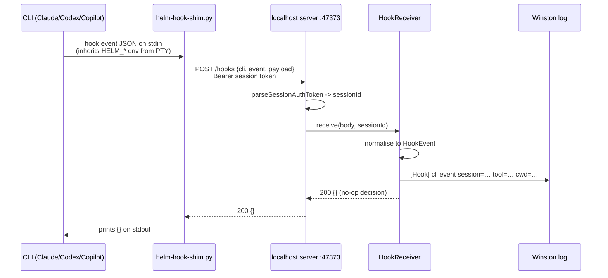

# CLI Hooks

**Status: G1 shipped (transport + installer). Policy (deny, injection, compaction handover) is later work — G1 decides nothing.**

Helm installs lifecycle hooks into each CLI's own user-level config, once per
CLI, system-wide. When a hooked event fires inside a Helm-spawned session, the
event reaches Helm over one shared transport, is correlated to the session,
normalised to one shape, logged, and offered to subscribers. Nothing is ever
denied, blocked or injected yet — the whole of G1 is proving the wire and
making hook traffic visible.

## Transport — one shim, `type: "command"`

Codex supports only `command` and `mcp_tool` handlers (its `prompt` and
`agent` handlers are "parsed but skipped"); there is **no http handler**.
`command` is the only handler type all three CLIs support, so it is the only
one built. One transport, one code path, one shim — do not add an http path
for Claude/Copilot.

The shim is `src/config/hooks/helm-hook-shim.py`, seeded to
`<appData>/Helm/config/hooks/helm-hook-shim.py` by the normal config seeding.
Stdlib `urllib` only, no pip, ever. It:

1. reads the hook JSON from stdin
2. POSTs it to Helm's `POST /hooks` endpoint with the session bearer token
3. prints Helm's reply on stdout — the CLI reads its decision from there
4. on ANY failure (no session id, Helm down, refused, timeout, malformed
   stdin) prints nothing and **exits 0**

Exit 2 is the trap: for command hooks, **exit code 2 DENIES** on supported
events. The shim catches everything so it can never exit 2 by accident.
Fail-open matches Claude's and Copilot's own timeout behaviour — a hook must
never be able to brick a session.

If `HELM_SESSION_ID` is absent the shim does nothing at all: user-level hook
config is machine-wide and fires for CLI sessions Helm did not spawn.

## Flow

Correlation needs no new plumbing: every spawned PTY already receives
`HELM_SESSION_ID`, `HELM_SESSION_NAME`, `HELM_MCP_TOKEN` and `HELM_MCP_URL`;
G1 adds `HELM_HOOK_URL` (`http://127.0.0.1:<mcpPort>/hooks`) beside them
(`resolveConfiguredSpawnEnv`).

`POST /hooks` accepts **session tokens only** — the shared bearer that grants
anonymous MCP read access is rejected with 401, because a hook belongs to
exactly one spawned session.

## The event name comes from the config, not the payload

The installed command is `<python> <shim> <cli> <EventName>` — Helm wrote the
event name into the hook's arguments at install time, so the shim forwards it
explicitly. This sidesteps each CLI's payload-naming whims entirely (Copilot's
camelCase payloads don't carry the name the way Claude's do).

The normaliser (`src/session/hooks/hook-normaliser.ts`) maps per-CLI field
names (`session_id`/`sessionId`, `tool_name`/`toolName`, …) into one
`HookEvent`, and aliases Copilot's native camelCase event names onto the
canonical PascalCase common-core set (`agentStop` → `Stop`,
`userPromptSubmitted` → `UserPromptSubmit`, …). Events outside the common
core are logged and ignored.

## Config locations (user-level, install once)

| CLI | File | Shape |
|-----|------|-------|
| Claude Code | `~/.claude/settings.json` → `hooks` key | nested matcher-groups |
| Codex | `~/.codex/hooks.json` | nested matcher-groups |
| Copilot | `~/.copilot/hooks/helm.json` (Helm-owned file) | flat entries, `version: 1` |

All three merge config layers, so Helm writes ONE owned block and never
touches the rest. Helm-owned entries are identified by the shim path inside
their `command` — not a marker field — so nothing depends on the CLIs
tolerating unknown keys. Uninstall removes exactly those entries; the
Helm-owned Copilot file is deleted only when it holds nothing of the user's.

> **First write outside Helm's tree.** This is the first code in Helm that
> writes to a directory Helm does not own. It is the user's own CLI config,
> not the repo working tree (invariant 4 is about the repo), but the courtesy
> is the same: one owned block, nothing else touched.

Registered events are the common core: `SessionStart`, `UserPromptSubmit`,
`PreToolUse`, `PostToolUse`, `PreCompact`, `Stop` (Copilot: its native
camelCase spellings). Copilot entries run in native camelCase mode; Codex
non-managed hooks must be reviewed via `/hooks` before they run — trust is
keyed to the hook's hash, so changes re-trigger review.

## Python detection

Python is **not** guaranteed on an end user's machine — Helm ships as a
packaged EXE. The installer probes for a working interpreter
(`python`, `python3`, `py -3`) at install time: found → install; not found →
install **nothing** and show "Python not found" in the pane. A hook config
pointing at an interpreter that isn't there is a feature that silently does
nothing, which is worse than one that visibly refused. The probe is written
generically (resolve an interpreter, verify it runs) so a curl fallback would
be a few lines later — deliberately not built (YAGNI).

## Settings pane

Settings → 🪝 CLI Integrations (`renderer/components/settings/CliIntegrationsTab.vue`):
one row per CLI type with a `hooks` block in its config. Status is read off
disk every time — never a stored flag — and reports `installed` /
`outdated` / `not-installed` / `interpreter-missing`. IPC:
`hooks:getStatus` / `hooks:install` / `hooks:uninstall` via the preload
`config` domain (`hooksGetStatus` / `hooksInstall` / `hooksUninstall`).

## Mobile/Telegram channel affinity (G2 enabler)

A phone message over BLE/LAN now sets the target session's
`interactionChannel` to `'telegram'` — the SAME value the Telegram relay
sets, deliberately not a new enum member — in `mobile-chat-bridge.ts`
(`markChannelAffinity`), only on the transition. G2's planned
"deny while the user is away from the desk" can therefore key on one value
for both surfaces.

## Modules

| Module | Role |
|--------|------|
| `src/session/hooks/hook-normaliser.ts` | per-CLI fields → one `HookEvent`; canonical event set; Copilot aliases |
| `src/session/hooks/hook-receiver.ts` | `EventEmitter` behind `/hooks`: correlate, log, emit `hook`; always replies `{}` |
| `src/session/hooks/hook-installer.ts` | interpreter probe; install/update/remove of the Helm-owned block; status from disk |
| `src/config/hooks/helm-hook-shim.py` | the shared transport shim (fail-open) |
| `src/mcp/localhost-mcp-server.ts` | `POST /hooks` route, session-token auth |
| `src/config/cli-types.yaml` | `hooks:` block per CLI (provider, configPath, events) |

Later groups subscribe to `HookReceiver`'s `hook` events; StateDetector and
every existing session behaviour are untouched.
