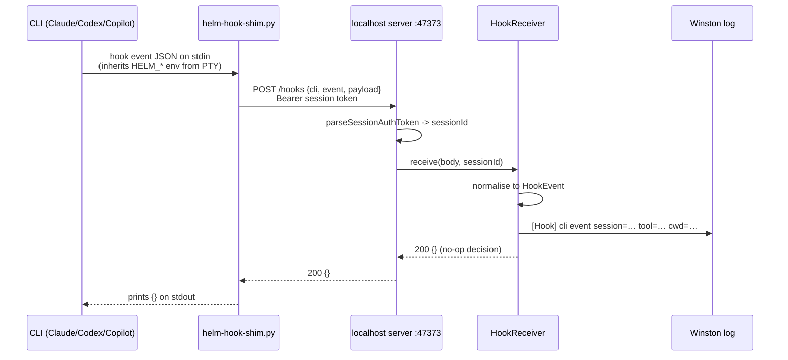
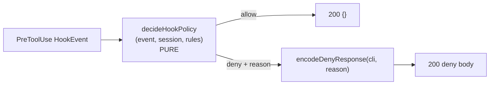
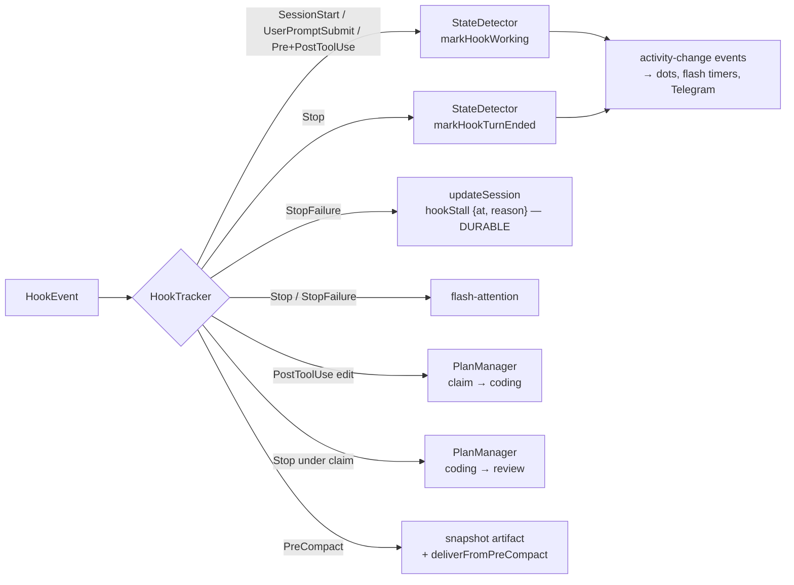
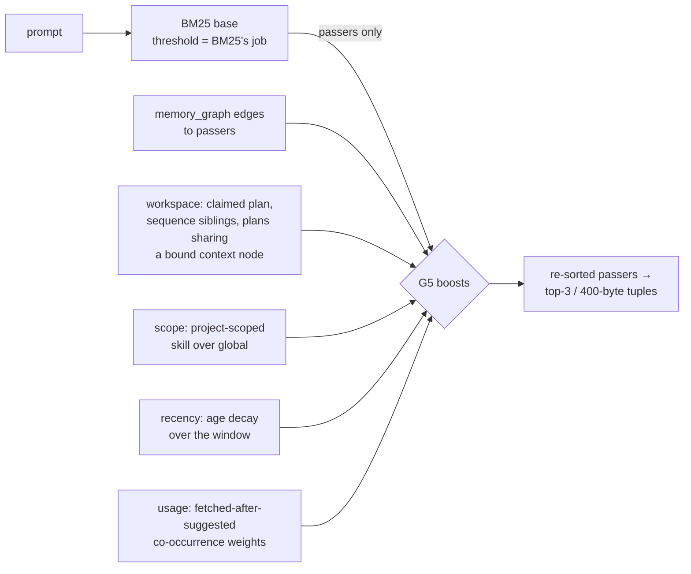
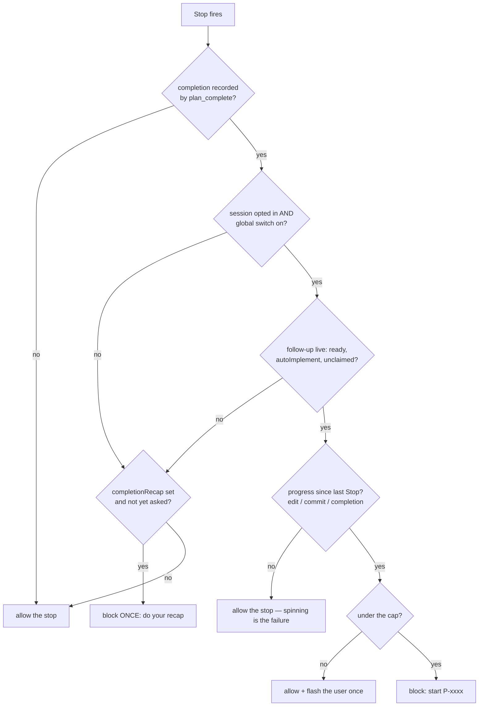

# CLI Hooks

**Status: G1 (transport + installer), G2 (PreToolUse deny policy), G3 (reported truth: activity, stalls, plan progress, PreCompact snapshot), G4 (context injection, nudges, hint-only suggester, dual-path rules delivery), G5 (ranking signals) and G9 (reminder delivery: the inventory below, plus per-reminder hook/pty/off modes) shipped. G8 (loop driving, below) shipped after being deliberately dropped from G4 — revived only once its exit condition became a fact Helm already records.**

Helm installs lifecycle hooks into each CLI's own user-level config, once per
CLI, system-wide. When a hooked event fires inside a Helm-spawned session, the
event reaches Helm over one shared transport, is correlated to the session,
normalised to one shape, logged, and offered to subscribers. G1 proved the
wire; G2 added the first decision on it — PreToolUse denies (below).

## Transport — one shim, `type: "command"`

Codex supports only `command` and `mcp_tool` handlers (its `prompt` and
`agent` handlers are "parsed but skipped"); there is **no http handler**.
`command` is the only handler type all three CLIs support, so it is the only
one built. One transport, one code path, one shim — do not add an http path
for Claude/Copilot.

The shim is `src/config/hooks/helm-hook-shim.py`, seeded to
`<appData>/Helm/config/hooks/helm-hook-shim.py` by the normal config seeding.
Stdlib `urllib` only, no pip, ever. It:

1. reads the hook JSON from stdin
2. POSTs it to Helm's `POST /hooks` endpoint with the session bearer token
3. prints Helm's reply on stdout — the CLI reads its decision from there
4. on ANY failure (no session id, Helm down, refused, timeout, malformed
   stdin) prints nothing and **exits 0**

Exit 2 is the trap: for command hooks, **exit code 2 DENIES** on supported
events. The shim catches everything so it can never exit 2 by accident.
Fail-open matches Claude's and Copilot's own timeout behaviour — a hook must
never be able to brick a session.

If `HELM_SESSION_ID` is absent the shim does nothing at all: user-level hook
config is machine-wide and fires for CLI sessions Helm did not spawn.

## Flow



Correlation needs no new plumbing: every spawned PTY already receives
`HELM_SESSION_ID`, `HELM_SESSION_NAME`, `HELM_MCP_TOKEN` and `HELM_MCP_URL`;
G1 adds `HELM_HOOK_URL` (`http://127.0.0.1:<mcpPort>/hooks`) beside them
(`resolveConfiguredSpawnEnv`).

`POST /hooks` accepts **session tokens only** — the shared bearer that grants
anonymous MCP read access is rejected with 401, because a hook belongs to
exactly one spawned session.

## The event name comes from the config, not the payload

The installed command is `<python> <shim> <cli> <EventName>` — Helm wrote the
event name into the hook's arguments at install time, so the shim forwards it
explicitly. This sidesteps each CLI's payload-naming whims entirely (Copilot's
camelCase payloads don't carry the name the way Claude's do).

The normaliser (`src/session/hooks/hook-normaliser.ts`) maps per-CLI field
names (`session_id`/`sessionId`, `tool_name`/`toolName`, …) into one
`HookEvent`, and aliases Copilot's native camelCase event names onto the
canonical PascalCase common-core set (`agentStop` → `Stop`,
`userPromptSubmitted` → `UserPromptSubmit`, …). Events outside the common
core are logged and ignored.

## Enforcement (G2) — PreToolUse denies

Rules arrive as prompt text today ("don't use AskUserQuestion on mobile") —
an agent can ignore them. The `PreToolUse` hook makes them physical: a deny
cancels the tool call in all three CLIs, and the **deny reason is fed back to
the model**, so it redirects rather than merely fails. A reason that names the
Helm alternative ("use `chat_send`") IS the feature.



- **Policy** — `src/session/hooks/hook-policy.ts`. Pure function of
  `(HookEvent, SessionInfo, rules) -> Decision`; no I/O, so it tests with real
  objects. The receiver owns all I/O (live `getSession` and config rule
  lookups) and wraps the call in the fail-open catch.
- **Rules** — per CLI type in `cli-types.yaml` under `hooks.denyRules`
  (`ConfigLoader.getHookDenyRules(provider)`). Shipped defaults:
  1. `AskUserQuestion` while `interactionChannel === 'telegram'` (phone or
     Telegram — G1's mobile-bridge affinity feeds this) → use `chat_send`
  2. native `Artifact` tool → use `session_artifact_create`
  3. command guardrail: `rm -rf` (either flag order). `git push` is
     deliberately NOT in the shipped defaults — Helm's own release workflow
     (`sendDeploy.py`) pushes from inside a Helm session; a push guard is a
     one-line user rule, not a default.

  `outsideSessionDir` is SUPPORTED but likewise not shipped on by default. A
  session legitimately reaches outside its cwd — its own scratchpad lives in the
  per-user temp dir, and cross-repo work is normal — so denying every such write
  blocked ordinary working behaviour, not just the mistakes it was aimed at. The
  rule remains available for anyone who wants it; it is a user choice, not a
  default. Same reasoning as `git push`.
- **Rule shape** — `tools` (case-insensitive match) plus any of `onlyWhenAway`,
  `commandPattern` (regex over the shell command; uncompilable = never
  matches), `outsideSessionDir`, and the required `reason`. First matching
  rule wins.
- **Deny encoding** (`encodeDenyResponse`): Claude
  `hookSpecificOutput.permissionDecision:"deny"` + reason; Copilot flat
  `permissionDecision` + reason; Codex `{decision:"block", reason}`.

**Fail open, everywhere.** Unknown tools, unknown events, absent rules,
malformed rule objects, and ANY internal error allow. A crashed or confused
policy must never brick a session — matching the CLIs' own timeout
behaviour. (Seeding note: like all `cli-types.yaml` defaults, `denyRules`
reach fresh installs only; existing files are never overwritten, and no
rules configured simply denies nothing.)

## Reported truth (G3) — the HookTracker

Four things Helm previously inferred from timing — dots, stalls, handover
timing, plan progress — are REPORTED as fact when hooks are installed. One
subscriber consumes the receiver's `hook` stream and pushes each fact through
the channel that already owns it. It is a **second producer, not a new
channel**: a session without hooks never produces hook events, so for it
nothing here runs and StateDetector's timing remains the producer of record.



- **Activity** — `markHookWorking` / `markHookTurnEnded` emit the same
  `activity-change` events PTY timing does, so dots, question flow and
  Telegram flushing are untouched. Stop drops the dot out of green
  immediately (the agent said it finished) and restarts the idle countdown
  from that moment; trailing PTY output still promotes normally, so hooks
  going silent mid-session cannot stick the dot anywhere.
- **Stalls** — Claude-only `StopFailure` (Claude registers it in
  `hooks.events`; Codex and Copilot have no equivalent event) is the turn
  died on an API error — the usage-limit stall reported as fact instead of
  guessed from silence. It is stored on the session as a durable
  `hookStall {at, reason}` record (serializeSession allow-list, invariant 6)
  and deliberately NOT treated as a normal finish: no turn-end edge, no
  green-to-blue transition from it. Any later life sign (prompt, tool use,
  next turn, SessionStart) clears it; a re-report of the same stall neither
  re-persists nor re-flashes. Flash-attention fires on Stop and StopFailure
  — turn finished and turn died are both "look at me".
- **Plan progress** — an edit-family tool call (`Edit`, `Write`,
  `MultiEdit`, `NotebookEdit`, `apply_patch`, `edit_file`, …) under a
  claimed item moves it `ready → coding`; `Stop` under a `coding` claim
  moves it to `review`. `claimedItemFor` sees a claim whatever its status
  (`claimedPlanFor` — active work only — cannot see the `ready` claim the
  first edit exists to promote). `blocked` stays sacred: only a human or an
  MCP call unblocks.
- **PreCompact** — Helm composes a **Compaction snapshot** artifact itself
  (below).

**Invariant-8 refinement, written down.** Invariant 8 says dots reflect
activity, not pipeline state. Hooks make dots reflect **reported** activity —
an agent that said "done" is not a silent terminal, and a tool call that
started is not a spinner tick. That is a deliberate refinement of the
invariant, not a violation: the colours stay centralised in
`renderer/state-colors.ts`, and the timing producer is never disabled as the
fallback.

### PreCompact — Helm composes the save

The obvious design — "ask the agent to write its state into an artifact" —
is broken by construction: PreCompact fires because the context is FULL, the
one moment the agent has no room to help. So Helm composes the snapshot
itself, entirely from data it already holds: the claimed plan and its state,
tools run and files touched (accumulated from PostToolUse), turn count and
session age, draft memos, any pending handover note, and the PreCompact
`trigger` (`auto` = context filled, `manual` = `/compact`).

- The **transcript is ATTACHED, never inlined** (`transcript.jsonl`).
  Transcripts are megabytes of mostly tool noise; inlining would make the
  one artifact meant to be readable unreadable. Missing (`Copilot` sends
  none) or over the 10MB attachment cap → the summary stands alone and the
  drop is logged — never a truncated attachment, never a silently missing
  one.
- **Artifacts are ephemeral** — they die with the session. That is the
  accepted trade: surviving a compaction happens within the same session, so
  the artifact is alive exactly when it is needed. A durable copy was
  explicitly declined.
- **Handover delivery**: if a handover note was armed (via `session_compact`),
  PreCompact delivers it immediately, ignoring the 15s lull floor. The
  pending entry is removed before delivery, so the fallback lull heuristic's
  later edge finds nothing — **no double delivery by construction**. The
  heuristic stays armed only for sessions without hooks.
- **Deliberately not built**: asking the agent early at "≈60% fill". No CLI
  reports context fill, so any threshold is a guess that would inject a
  prompt mid-work; the PreCompact composition covers the requirement without
  agent capacity. Revisit only with evidence that the summary alone loses
  something.
- **Compaction can only be held on Codex** (`continue:false`). Claude and
  Copilot treat PreCompact as notification only — the snapshot is composed
  and the handover delivered at the announcement, but nothing delays the
  compaction on those two.

## Injection (G4) — the ContextInjector

PreToolUse denies are one half of steering; the other half is giving the agent
context it would otherwise not have. `ContextInjector`
(`src/session/hooks/context-injector.ts`) answers every non-policy event and
can say THREE things, each independently optional — and **null** (send
nothing) is the common case by design:

- **SessionStart** — the session's claimed plan, its draft memos, and any
  pending handover note, out-of-band at startup. Nothing is preloaded
  wholesale; each source is capped at 800 chars, the whole payload at 2500,
  and whole parts are dropped from the end before anything is cut mid-line.
- **UserPromptSubmit** — for a prompt carrying a `[HELM_MSG]` /
  `[HELM_TELEGRAM]` envelope, the inter-session rules as additionalContext
  instead of prepended prompt text (dual-path, below); the hint-only
  suggester pointer; conditional one-shot nudges (unset AIAGENT state, one
  startable plan). Copilot is excluded entirely — its CLI drops this event's
  command-hook output, so injecting there is writing into the void.
- **Stop** — the one-shot nudge: a claimed-but-open plan item or an unset
  AIAGENT state blocks the turn ONCE with a reason naming the alternative
  (`plan_complete` / `session_plan_claim` / `session_set_aiagent_state`).
  The second Stop always passes; the cap is 1 by decision and not
  configurable. `StopFailure` is NEVER answered — a usage-limit stall is
  reported fact, not something to retry in a loop. G8's loop decision
  (below) runs BEFORE this nudge on the same event; exactly one block is
  ever emitted per Stop.

```mermaid
flowchart LR
    H[HookEvent<br/>SessionStart / UserPromptSubmit / Stop] --> I{ContextInjector}
    I -->|SessionStart| A["plan + drafts + handover<br/>800/2500 caps"]
    I -->|UserPromptSubmit| B["envelope rules<br/>+ suggester pointer<br/>+ one-shot nudges"]
    I -->|Stop| C["stop block, ONCE<br/>cap = 1"]
    A --> E["encodeAdditionalContext<br/>claude/codex: nested under<br/>hookSpecificOutput.hookEventName<br/>copilot: flat"]
    B --> E
    C --> D["encodeStopBlock"]
    E --> R[200 reply body]
    D --> R
    I -->|nothing worth saying| N[null → 200 {}]
```

The encoders (`src/session/hooks/hook-encoder.ts`) matter: Claude and Codex
silently IGNORE a top-level `additionalContext` — it must nest under
`hookSpecificOutput.hookEventName`. Copilot wants it flat. Getting the shape
wrong is a silent no-op, which is the worst kind of bug: everything looks
wired and nothing arrives.

### The hint-only suggester

`src/session/hooks/suggestion-scorer.ts`. On UserPromptSubmit, skills and
memories are scored against the prompt — **BM25 over name + description +
declared triggers**, pure TypeScript, no model, no download, no worker. The
payload is `(type/id (name))` TUPLES ONLY:

```
possibly related: skill/graphify, memory/f412c44b (helm-chain-stall-recovery)
```

The id is the ADDRESS — it is what `skill_get` / `memory_get` take, and names
are not unique. The name is the LABEL — without it a pointer is a bare UUID
the recipient must FETCH just to judge relevance, which is the exact cost the
tuples-only design exists to avoid (G7). The name is appended only when it
adds information the id lacks (`skill/graphify` never renders as
`skill/graphify (graphify)`); an empty name degrades to the id form, never
`()`. Names never carry the characters that build the line format (comma,
parens, newline), so a name cannot forge another tuple.

The agent fetches what it wants via `skill_get` / `memory_get`, or ignores it.
A miss costs nothing; a hit costs ~15 tokens. There is no "inject body" tier
to tune and never will be. A prompt that NAMES a candidate bypasses scoring.
Caps: top-3, 400 bytes — a cap that bites drops whole pointers, never splits
one; once per item per session; below threshold sends
nothing (that is the common case and it must be free). Candidates are
pre-filtered to the session's project — skills visible to that project, plus
that project's live (non-dormant) memories. `Trigger:` phrases declared in a
description (`Trigger: /graphify`) beat any inference. Known, accepted
weakness: BM25 misses oblique phrasing; revisit only with evidence from real
use.

### Dual-path rules delivery

The inter-session rules reach a session two ways, per recipient:

1. **Prepended** into the message (the path that works everywhere — today's
   behaviour, kept byte-identical).
2. **Injected** out-of-band via the UserPromptSubmit hook when the recipient
   can — the transcript stays clean.

The choice is ONE capability check (`src/session/hooks/hook-capability.ts`)
wrapped by the G9 reminder-delivery resolver (`src/session/reminder-delivery.ts`)
and consulted by EVERY delivery surface — the MCP delivery service
(`HelmSessionDeliveryService.setReminderDelivery`) and the Telegram relay
(`TelegramRelayService.setReminderDelivery`, which drops only the envelope's
trailing instruction line). Hooks block present AND provider injects on
UserPromptSubmit (claude, codex) AND the block reads back
`installed`/`outdated` from disk — otherwise false, which means "prepend as
today". Every failure answers false: a disk error can degrade to the old
behaviour, never break delivery. Sessions without hooks see zero change, and
both paths coexist because the check is read live per recipient.

**Loop driving (Stop + block restarting the turn) was deliberately dropped**
from G4 — remote control of the agent loop with a credit card attached is not
shipped, not built, and its guards (max auto-continues, visible counter, kill
switches) were never implemented. If it ever lands, it inherits the
StopFailure-never-retried rule above.

## Reminder delivery (G9) — the inventory, and a visible mode per reminder

Helm accumulated several ways of telling a session something, all predating
hooks and all spending prompt tokens on every message. G9 migrated the
STANDING ones onto the hook channel and made the choice visible. **This is a
migration of delivery, not a cull** — the message still needs saying; only
how it reaches the session changed.

### The inventory — every place Helm injects standing text into a session

| # | Standing text | Defined in | Delivered by | Classification |
|---|---------------|-----------|--------------|----------------|
| R1 | Inter-session rules `[HELM_MSG_RULES]` (prepend builder + injected static) | `src/session/intersession-directive.ts` | `HelmSessionDeliveryService` prepend / `ContextInjector` inject; gated per CLI type by `helmPreambleForInterSession` | **move** — dual-path since G4, now mode `helmMsgRules` |
| R2 | Telegram reply instruction `"Respond via telegram_chat MCP tool."` — text envelope, attachment envelope, and the topic-input fallback line | `src/telegram/relay-service.ts` (`wrapTelegramEnvelope` + attachment envelope), `src/telegram/topic-input.ts` | same three surfaces / `ContextInjector` (`HELM_TELEGRAM_HOOK_RULES`) | **move** — dual-path since G4, now mode `telegramInstruction`; one mode covers all three carrying surfaces |
| R3 | Telegram mode block `[HELM_TELEGRAM_MODE]`, announced once per entry into Telegram mode | `src/session/intersession-directive.ts` (`HELM_TELEGRAM_MODE_INSTRUCTIONS` — ONE constant, both paths) | relay first-contact prepend / `ContextInjector` (once per mode entry, re-armed on leaving) | **move** — default `pty` (today's always-prepend); mode `telegramModeInstructions` opts it onto the hook channel |
| — | `expectsResponse` reply-routing tag on the envelope opening | `helm-session-delivery-service.ts` | prepend only | **keep inline** — per-sender dynamic content, not a standing rule |
| — | Mess pokes (`[HELM_MESS] N new — call mess_check`, join line) | `src/session/mess-notifier.ts` | `sendSystemReminder` PTY write | **keep inline** — the unread count IS the message (per-event content); the per-CLI-type `messReminders` flag already is its off-switch |
| — | Spawn init prompt (`Call session_info…`) | `cli-types.yaml` `initialPrompt` | PTY after spawn | **keep inline** — it triggers the CLI's first turn; injection alone would leave nothing to respond to |
| — | Handover paste, `session_clear` context note, large-text temp-file notices | handover-delivery / delivery service | PTY | **keep inline** — one-shot per-message payloads |
| — | G2 deny reasons | `cli-types.yaml` `hooks.denyRules` | PreToolUse deny response | not injected text — event-driven enforcement, delivered exactly when relevant |

**Deletions: none.** A reminder is deleted only when a PreToolUse deny now
ENFORCES it, making the please-remember text pure duplication. The nearest
candidate — the AskUserQuestion prohibition inside R1/R2 — is enforced only
`onlyWhenAway` (interactionChannel `'telegram'`): between two local sessions
while the user is at the desk, a blocking prompt is answerable at the
terminal, so the rule still carries information the deny does not deliver.
Partial enforcement is not duplication; the text stays.

### Delivery modes

Per reminder, in Settings → 🪝 CLI Integrations → **Reminder delivery**:

- **hook** — injected out-of-band; costs nothing per message. Falls back to
  prepend when the recipient's CLI cannot inject (no hooks installed, or a
  provider that drops UserPromptSubmit output — Copilot) and the pane SHOWS
  the fallback per CLI rather than silently doing it.
- **pty** — prepended, as today. The user's choice beats the capability: a
  hook-capable recipient still gets the prepend.
- **off** — suppressed on both paths.

The defaults reproduce today exactly, so an upgrade changes nothing until the
user chooses: `helmMsgRules`/`telegramInstruction` default to `hook`
(G4's auto dual-path IS today's behaviour), `telegramModeInstructions`
defaults to `pty` (always-prepended). Settings live in `settings.yaml` under
`reminderDelivery`; malformed values are dropped, never misrouted. IPC:
`config:getReminderDelivery` / `config:setReminderDelivery` via the preload
`config` domain (invariant 3).

One resolver decides everything (`src/session/reminder-delivery.ts`):
`resolveReminderDelivery(reminder, mode, capable)` is PURE; the per-recipient
factory wraps the ONE capability check from G4 (no second notion of "can this
session receive injected rules"), and every surface consumes it — the
delivery services decide whether to prepend, the injector decides whether to
inject, so **one message never carries a prepended rule and its injected
twin**. Inside the injector capability is always true (a hook firing IS the
proof). Injected reminders share the existing G4 byte budget (800/source,
2500 total) and are pushed first in the payload, so they cannot silently
crowd out the suggester pointer or nudges; plan/draft/handover ride
SessionStart, a different event with its own budget.

## Ranking signals (G5) — adjacency, scope, recency, usage

BM25 matches words, not meaning. G5 adds four signals **behind the same
`SuggestionScorer` interface** (`BoostedSuggestionScorer` in
`src/session/hooks/suggestion-scorer.ts`), composed explicitly on top of
BM25 — still no model, no download, no network, no background index (scoring
is on demand, decided for G4/G5 and not re-derived here):

```
final = base(BM25) + adjacency + scope + recency + usage
```

Every contribution is on the log line
(`[HookSuggestSignals] skill/x base=… adjacency=… scope=… usage=… recency=… final=…`)
— explainability is the entire reason this exists instead of a model, so
there is no opaque blend.

**THE RULE, decided and pinned by tests: the threshold is BM25's job.** The
base decides who passes `MIN_SCORE`; the signals **reorder passers only**.
No signal — not adjacency, not a hundred recorded fetches — may lift a
candidate over the line. A signal that could decide would create a
self-reinforcing loop: an item gets suggested, being visible makes it more
likely to be fetched, being fetched raises its weight, which makes it
suggested again. Over weeks the ranking drifts toward whatever was suggested
early rather than whatever is relevant, and every individual suggestion looks
plausible while it happens. Do not "improve" this into a rescue/bonus that
can cross the threshold; if real use shows relevant items consistently
sitting just below the line, that is EVIDENCE, and a bounded rescue becomes a
deliberate follow-up with a number attached.



| Signal | Evidence | Default | Configuration |
|--------|----------|---------|---------------|
| adjacency | memory_graph edge to a passer; workspace membership (a memory whose `planId` is the claimed plan, a sequence sibling, or a plan sharing a context node bound to that plan/sequence) | +1.0 per anchor, cap 2.0 | `suggestionScoring.adjacencyPerAnchor` / `adjacencyMax` |
| scope | project-scoped (`allProjects: false`) skill over an equal global one; memories are pre-filtered to the project, so the signal is not theirs | +0.75 | `suggestionScoring.scope` |
| recency | linear age decay of a memory's `createdAt` to 0 over the window | 0.75 max over 30 days | `suggestionScoring.recencyMax` / `recencyWindowDays` |
| usage | co-occurrence counts between the item and the prompt's usable terms | +1.0 per count, cap 2.0 | `suggestionScoring.usagePerCooccurrence` / `usageMax` |

Weights are configuration, not buried magic: the `suggestionScoring` section
of the user's `settings.yaml` overrides any field, absent fields use the
shipped defaults, and a malformed section degrades to the defaults.

### Usage feedback — what is recorded, and what never is

**Privacy boundary:** the store records ITEM IDS (the same tuples the
suggester emits) and TERM CO-OCCURRENCE counts — single lowercased words,
stopword-stripped. **Prompt text is never recorded**: no sentences, no
messages, no transcript. That is stated here deliberately — a silent prompt
log would be a nasty surprise for a user.

The loop is narrow. When a suggestion payload goes out, the suggester notes
the sent tuples and the prompt's usable terms (in memory only). When the MCP
dispatcher sees `skill_get` / `memory_get` succeed for one of those tuples,
within a 15-minute window, the co-occurrence counts increment; anything else
— fetches with no matching suggestion, fetches long after, peers Helm cannot
identify, failed fetches — records nothing.

- Storage: one JSON file, `<configDir>/suggestion-usage.json` (the per-user
  app-data dir — never the repo, invariant 4). Every write is fail-open.
- Inspect and reset: Settings → 🪝 CLI Integrations → "Suggestion usage
  feedback" shows the strongest associations, the recent learning events, and
  a reset button. Reset empties the store; nothing is re-learned until new
  fetches correlate with new suggestions.
- Fresh install: no history → every usage boost is 0, no links means no
  adjacency, and all-zero signals produce output **identical to bare G4** —
  pinned by a whole-layer regression test, not just a unit.

## Loop driving (G8) — Stop-block continuation gated on `autoImplement`

The Stop hook can decline to end a turn: reply `{"decision":"block",
"reason":...}` and the CLI starts another turn with the reason as its prompt.
That is remote control of the agent loop without touching the PTY — and, left
ungated, an infinite loop with a credit card. G8
(`src/session/hooks/loop-driver.ts`) ships it only because the exit condition
turned out to be a question Helm already answers.

**Loop driving never decides for itself.** It reads three facts that already
exist, recorded before the loop started:

1. **`autoImplement` on a follow-up plan is the go/no-go.** Its existing
   meaning — "this ready follow-up may be picked up automatically once its
   prerequisite completes" — is already consent, per plan, in the DAG.
   Unticked means the loop stops there. There is NO new consent UI.
2. **`followUpPlans`, already returned by `plan_complete`, is the what-next.**
   `plan_complete` reports the completion (and its follow-ups) to the
   `LoopDriver`; Stop asks the DAG rather than guessing. An empty list is a
   natural terminator. Eligibility is re-read LIVE at Stop time — still
   `ready` (precursors done), still `autoImplement`, and not claimed by
   anyone (another session claiming the follow-up kills the chain).
3. **`completionRecap` is a QUALITY gate, never a continuation gate.**

### Two separate gates on the same Stop event

"Is this finished properly" and "should we keep going" feel similar and must
not be merged — conflate them and the loop argues with itself about whether
it is done:

| | CONTINUATION | VERIFICATION |
|---|---|---|
| gated on | `autoImplement` (follow-up) + session opt-in | `completionRecap` (completed plan) |
| may repeat | yes, to the cap (default 5) | no — capped at 1, not configurable |
| default | **OFF** — opt-in per session | always on (works with loop driving off) |
| asks | "start P-xxxx" | "confirm what you verified" |

Continuation is checked FIRST. Exactly one block is ever emitted per Stop
event — never two stacked. The G4 one-shot Stop nudge still runs after both,
untouched, and independently.



### Hard stops — all of them required

- **Cap**: consecutive auto-continues, default 5 (`hooks.loopDriving.
  maxAutoContinues` in settings.yaml). At the cap the stop is allowed and the
  user is flashed once — even with work still outstanding.
- **Never auto-continue on `StopFailure`.** The turn died on an API error;
  retrying a usage-limit stall in a loop is the worst case this feature can
  produce. `StopFailure` also resets the loop state outright.
- **No measurable progress since the last Stop → stop.** Progress ticks are
  edit-shaped tools, `git commit` commands, and plan completions. Spinning
  is the real failure; stopping early is not.
- **A genuine user prompt ends the chain.** The user typing is the strongest
  signal they have taken the wheel — the recorded completion is cleared, not
  just the counter. The chain re-arms naturally on the next `plan_complete`.
  (Our own block reason coming back as a prompt is consumed, not counted.)
- **Visible counter.** `SessionInfo.loopContinues` (ephemeral) drives a 🔁
  badge on the session row — an active loop must never be invisible.
- **OFF by default**, opt-in per session via the `session_set_loop_driving`
  MCP tool (`SessionInfo.loopDriving`, durable across restarts), plus a
  global kill switch (`hooks.loopDriving.enabled: false` in settings.yaml)
  that outranks every opt-in and is read live mid-loop.
- The verification block never counts toward the continuation cap, and vice
  versa; the recap is also skipped on the Stop the cap itself ends.

A session that has not opted in behaves exactly as today — the only visible
difference for anyone is the recap verification block, which fires whether
or not loop driving is on.

## Config locations (user-level, install once)

| CLI | File | Shape |
|-----|------|-------|
| Claude Code | `~/.claude/settings.json` → `hooks` key | nested matcher-groups |
| Codex | `~/.codex/hooks.json` | nested matcher-groups |
| Copilot | `~/.copilot/hooks/helm.json` (Helm-owned file) | flat entries, `version: 1` |

All three merge config layers, so Helm writes ONE owned block and never
touches the rest. Helm-owned entries are identified by the shim path inside
their `command` — not a marker field — so nothing depends on the CLIs
tolerating unknown keys. Uninstall removes exactly those entries; the
Helm-owned Copilot file is deleted only when it holds nothing of the user's.

> **First write outside Helm's tree.** This is the first code in Helm that
> writes to a directory Helm does not own. It is the user's own CLI config,
> not the repo working tree (invariant 4 is about the repo), but the courtesy
> is the same: one owned block, nothing else touched.

Registered events are the common core: `SessionStart`, `UserPromptSubmit`,
`PreToolUse`, `PostToolUse`, `PreCompact`, `Stop` — plus Claude-only
`StopFailure` (G3's reported stall; the normaliser rejects it from any other
provider). Copilot entries run in native camelCase mode; Codex
non-managed hooks must be reviewed via `/hooks` before they run — trust is
keyed to the hook's hash, so changes re-trigger review.

## Python detection

Python is **not** guaranteed on an end user's machine — Helm ships as a
packaged EXE. The installer probes for a working interpreter
(`python`, `python3`, `py -3`) at install time: found → install; not found →
install **nothing** and show "Python not found" in the pane. A hook config
pointing at an interpreter that isn't there is a feature that silently does
nothing, which is worse than one that visibly refused. The probe is written
generically (resolve an interpreter, verify it runs) so a curl fallback would
be a few lines later — deliberately not built (YAGNI).

## Settings pane

Settings → 🪝 CLI Integrations (`renderer/components/settings/CliIntegrationsTab.vue`):
one row per CLI type with a `hooks` block in its config. Status is read off
disk every time — never a stored flag — and reports `installed` /
`outdated` / `not-installed` / `interpreter-missing`, plus the G9 `canInject`
flag (false for providers that drop UserPromptSubmit output). IPC:
`hooks:getStatus` / `hooks:install` / `hooks:uninstall` via the preload
`config` domain (`hooksGetStatus` / `hooksInstall` / `hooksUninstall`).
Below the install rows: the **Reminder delivery** section (G9, above).

## Mobile/Telegram channel affinity (G2 enabler)

A phone message over BLE/LAN now sets the target session's
`interactionChannel` to `'telegram'` — the SAME value the Telegram relay
sets, deliberately not a new enum member — in `mobile-chat-bridge.ts`
(`markChannelAffinity`), only on the transition. G2's planned
"deny while the user is away from the desk" can therefore key on one value
for both surfaces.

## Modules

| Module | Role |
|--------|------|
| `src/session/hooks/hook-normaliser.ts` | per-CLI fields → one `HookEvent`; canonical event set; Copilot aliases; per-CLI deny encoding |
| `src/session/hooks/hook-receiver.ts` | `EventEmitter` behind `/hooks`: correlate, log, emit `hook`; PreToolUse → policy, everything else → the (late-bound) G4 responder |
| `src/session/hooks/hook-policy.ts` | PURE `(event, session, rules) -> allow / deny+reason`; fail open on everything unexpected |
| `src/session/hooks/context-injector.ts` | G4: SessionStart context, UserPromptSubmit rules + nudges, one-shot Stop block; silent when there is nothing worth saying |
| `src/session/hooks/loop-driver.ts` | G8: Stop-block continuation (autoImplement-gated, live follow-up reads, hard stops) + the one-shot completionRecap verification block |
| `src/session/hooks/suggestion-scorer.ts` | G4 hint-only suggester: BM25, tuples only, caps + once-per-item ledger |
| `src/session/hooks/hook-encoder.ts` | per-CLI additionalContext nesting and the stop-block form |
| `src/session/hooks/hook-capability.ts` | the ONE rules-via-hooks check behind both delivery paths; false on every failure |
| `src/session/reminder-delivery.ts` | G9: pure hook/pty/off resolution per reminder + the per-recipient factory wrapping the capability check |
| `src/session/intersession-directive.ts` | the inter-session rules in both delivery forms — prepended builder + static injected blocks |
| `src/session/hooks/hook-tracker.ts` | G3: the `hook` stream's first subscriber — activity edges, durable `hookStall`, plan progress, the PreCompact snapshot (composed by Helm, transcript attached) |
| `src/session/hooks/hook-installer.ts` | interpreter probe; install/update/remove of the Helm-owned block; status from disk |
| `src/config/hooks/helm-hook-shim.py` | the shared transport shim (fail-open) |
| `src/mcp/localhost-mcp-server.ts` | `POST /hooks` route, session-token auth |
| `src/config/cli-types.yaml` | `hooks:` block per CLI (provider, configPath, events, denyRules) |

Later groups subscribe to `HookReceiver`'s `hook` events (the HookTracker
already does); StateDetector's timing path and every existing session
behaviour are untouched without hooks.
