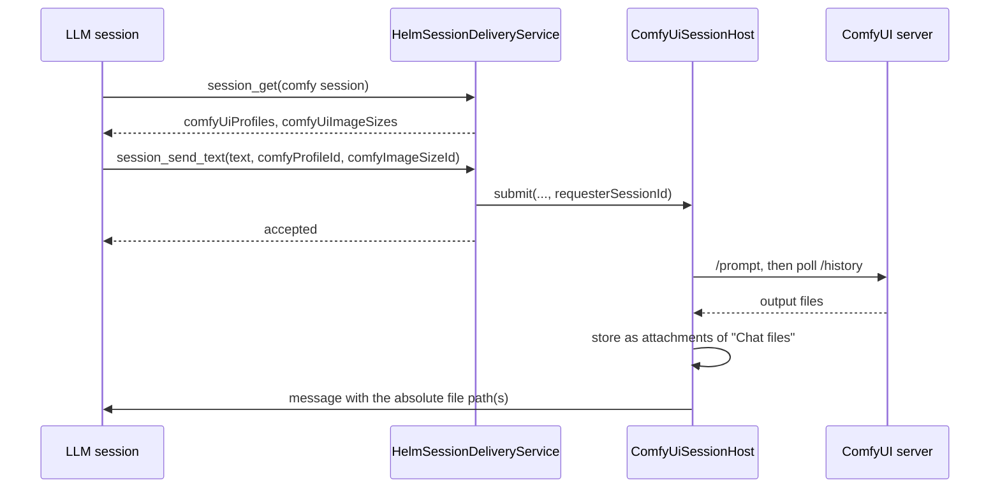

# ComfyUI sessions

A ComfyUI session is a chat-pane session with no CLI behind it. `ComfyUiSessionHost` (`src/session/comfyui/`) turns each chat prompt into a ComfyUI workflow run and posts the generated image or video back into that session's chat. Like an API tool, it is adopted into `PtyManager` as a `PtyProcess`, so it is an ordinary session row.

## Profiles and sizes

A ComfyUI tool is configured with an endpoint and a list of **profiles**. A profile is one API workflow graph plus the mappings that say which node inputs take the prompt, size, steps and seed. Its `kind` is `image` or `video`.

Only the safe selector data leaves the main process: `id`, `name`, `kind` and `supportsImageSize`. The workflow graphs stay in desktop config. That selector data is on the session as `comfyUiProfiles` and `comfyUiImageSizes`, which is what the chat pane's pickers and `session_get` / `session_list` both read.

## Who can ask

| Asker | Path | Sees the result |
|-------|------|-----------------|
| Desktop chat pane | `voice:ask` IPC | In the chat |
| Paired phone | `session_send_text` (mobile gate) | In the chat |
| Another session (an LLM) | `session_send_text` | In a message Helm sends back |

Terminal input, sequences and reminders never start a job: only these explicit paths may spend GPU time.

## An LLM asking for an image

The LLM does not poll. The host records the sender on the job as its **requester** and, when the job ends, sends it one message: the stored file paths on success, the failure reason, or that the job was cancelled. The reply is sent whatever `expectsResponse` says, because a request with no result is useless.

**Why a message, not a blocking tool call:** a video takes minutes, which is longer than a tool call can be held open.

**Why only a local session is a requester:** a phone or the desktop pane already shows the session's chat, so a second copy would be noise. The delivery service records the sender only when it is a session this Helm knows.

**Why the reply cannot break the queue:** the requester may have closed while its job ran. A failed reply is logged and the next job starts.

The files live in the ComfyUI session's "Chat files" artifact and are removed when that session expires. A requester that needs the file for longer copies it.

## One GPU, one job

Jobs from every ComfyUI session run through one serialized queue. Each job takes the GPU lease (`gpu-coordination.ts`) first: a cross-process mutex shared with Helm's other media helper, and, for a local endpoint, a hand-off that unloads the LM Studio model and restores it afterwards. ComfyUI's memory is freed after each job.

`/cancel` as the prompt text cancels the session's running job, or its next queued one.
