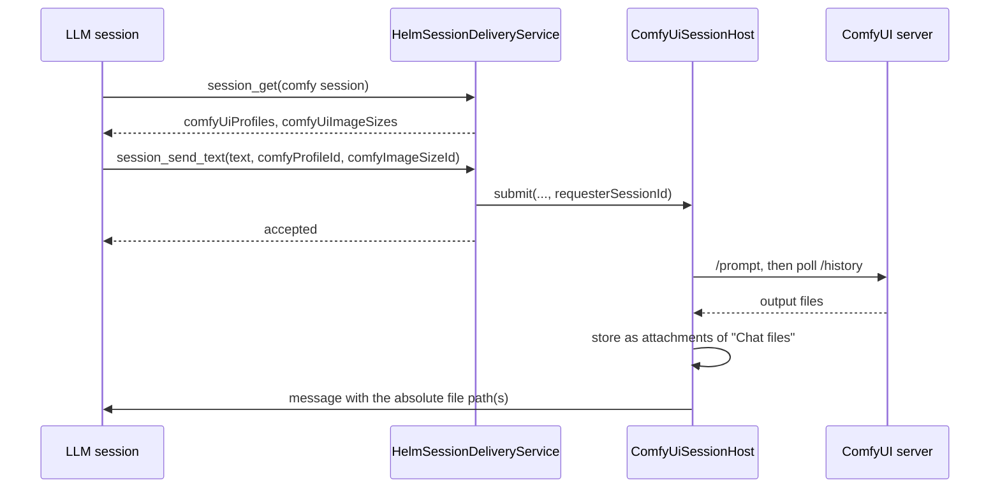

# ComfyUI sessions

A ComfyUI session is a chat-pane session with no CLI behind it. `ComfyUiSessionHost` (`src/session/comfyui/`) turns each chat prompt into a ComfyUI workflow run and posts the generated image or video back into that session's chat. Like an API tool, it is adopted into `PtyManager` as a `PtyProcess`, so it is an ordinary session row.

## Profiles and sizes

A ComfyUI tool is configured with an endpoint and a list of **profiles**. A profile is one API workflow graph plus the mappings that say which node inputs take the prompt, size, steps and seed. Its `kind` is `image` or `video`.

A profile's default size is the size its model was trained at, and no shipped image profile samples at a picked size directly. Both derive their sizes inside the graph (`EmptyImage` → `ImageScaleToTotalPixels` → `GetImageSize`), so the picker still writes one plain width and height.

| Profile | For | How a picked size is reached |
|---------|-----|------------------------------|
| Photoreal · LUSTIFY V8 Apex (SDXL) | People, photographs | First pass at the picked aspect scaled to one megapixel; enlarge and repaint lightly (8 steps, 0.35 denoise), capped near FHD; plain resize to the exact size |
| Graphics · Z-Image Turbo | Signs, icons, game assets, anything with text | Sampled at the picked aspect scaled to one megapixel, then a plain resize |
| Detail · Qwen-Image 2.1 (slow) | Best detail when minutes per picture are acceptable | Same as Graphics. Its model and text encoder do not fit a 16 GB card together, so every new prompt swaps them |

SDXL warps anatomy when sampled far above one megapixel, and both models stop fitting a 16 GB card at large sizes: a step that takes a second at one megapixel takes minutes at 4K. The Graphics profile ships the int8 model with the fp8 text encoder because that pair fits in VRAM together.

Only safe selector data leaves the main process: `id`, `name`, `kind`, `supportsImageSize` and `maxReferenceImages`. The workflow graphs stay in desktop config. That selector data is on the session as `comfyUiProfiles` and `comfyUiImageSizes`, which is what the chat pane's pickers and `session_get` / `session_list` both read.

## Reference images

Desktop and Android ComfyUI chats show image results and imported references in a session-scoped horizontal filmstrip. Images start selected for later requests. Each image can be unchecked; the profile picker reports the reference limit. Tap an item to view it full screen and save it. Android fetches the image only when opened or saved, using the existing sliced attachment transfer, and saves it in Downloads. Selection state is remembered per session.

The prompt can be sent by itself, with one newly attached image, with selected filmstrip references, or with both a new image and selected references. An image alone is also a valid request. The phone's existing picker uploads its selected image to the desktop share inbox; Helm accepts that path only from the paired phone that uploaded it and verifies it stays inside that inbox. Inputs are limited to PNG, JPEG or WebP files, with a 10 MiB limit per file.

All shipped image profiles accept one reference image. Qwen Image 2.1 accepts up to 16 and connects them to its autogrowing `image_1`…`image_16` inputs. Video workflows accept one start frame. Helm uploads each reference to ComfyUI, then adds the workflow-specific image input: image profiles use a scaled, VAE-encoded latent at 0.65 denoise, Qwen receives direct encoder images, and video workflows use the Wan start frame. ComfyUI's standard upload API stores sources in its input area; Helm names uploads by content so reusing the same image does not create another copy. ComfyUI does not expose a standard input-file deletion route, so those copies remain in ComfyUI's input folder.

## Who can ask

| Asker | Path | Sees the result |
|-------|------|-----------------|
| Desktop chat pane | `voice:ask` IPC | In the chat |
| Paired phone | `session_send_text` (mobile gate) | In the chat |
| Another session (an LLM) | `session_send_text` | In a message Helm sends back |

Terminal input, sequences and reminders never start a job: only these explicit paths may spend GPU time.

## An LLM asking for an image

The LLM does not poll. The host records the sender on the job as its **requester** and, when the job ends, sends it one message: the stored file paths on success, the failure reason, or that the job was cancelled. The reply is sent whatever `expectsResponse` says, because a request with no result is useless.

**Why a message, not a blocking tool call:** a video takes minutes, which is longer than a tool call can be held open.

**Why only a local session is a requester:** a phone or the desktop pane already shows the session's chat, so a second copy would be noise. The delivery service records the sender only when it is a session this Helm knows.

**Why the reply cannot break the queue:** the requester may have closed while its job ran. A failed reply is logged and the next job starts.

The files live in the ComfyUI session's "Chat files" artifact and are removed when that session expires. A requester that needs the file for longer copies it.

## One GPU, one job

Before a job takes the GPU, Helm probes `/system_stats`. If a **local** endpoint is down and the tool has a `startCommand`, Helm runs it through the shell, waits up to two minutes for the server to answer, then carries on (`comfyui-server.ts`). The shipped default runs the launcher the media helper installs; clear the field to opt out. A remote endpoint is never started — a down server there fails the job with "ComfyUI server is not running at …".

Jobs from every ComfyUI session run through one serialized queue. Each job takes the GPU lease (`gpu-coordination.ts`) first: a cross-process mutex shared with Helm's other media helper, and, for a local endpoint, a hand-off that unloads the LM Studio model and restores it afterwards. The job waits without a time limit for the shared GPU mutex; `/cancel` cancels while it is waiting. Image and video jobs continue polling ComfyUI until completion or cancellation. Startup readiness and individual HTTP requests still have bounded timeouts. ComfyUI's memory is freed after each job.

`/cancel` as the prompt text cancels the session's running job, or its next queued one.

## Shipped Windows media helper

`tools/comfyui/Generate-ComfyMedia.ps1` and its launcher dependency `Start-ComfyUI.ps1` are included in Helm's Windows package. On Windows startup, Helm copies updated versions to `%LOCALAPPDATA%\Helm\tools\comfyui`, which is where the default ComfyUI start command and local helper expect them. The standalone helper waits without a time limit for the GPU mutex and for ComfyUI to finish the image or video job.

The standalone helper supports `-StartImagePath` for video generation. The chat flow supports optional image inputs on all shipped image and video profiles.
