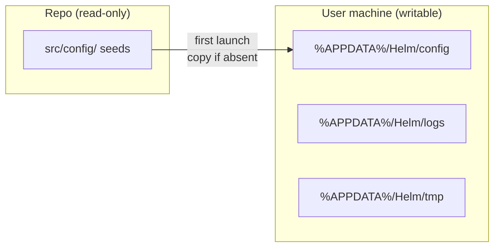
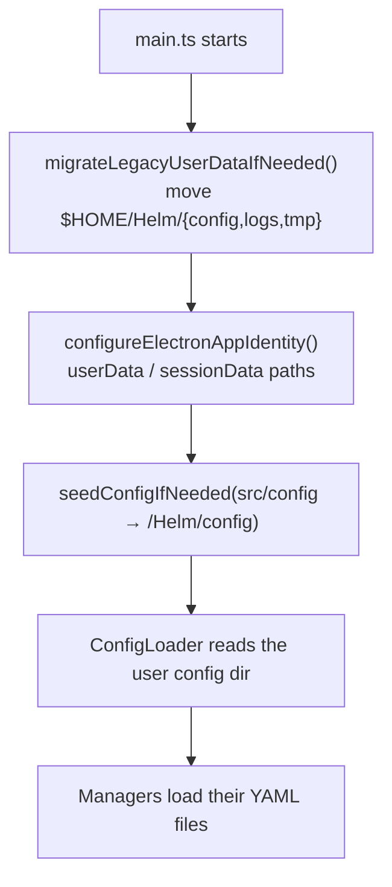

# Config Boundary — repo ships defaults, the user dir holds runtime state

**The repository is read-only as far as the running app is concerned.** All writable
config, logs and temp files resolve to a per-user app-data directory —
`<appData>/Helm/{config,logs,tmp}` — in **both** dev and packaged mode.

## Why this exists

Three problems forced the boundary:

1. **A packaged app cannot write next to itself.** Inside `app.asar` (or under
   `C:\Program Files\`) relative paths point at a read-only install directory.
   Anything the app persists must go somewhere the user owns.
2. **Dev builds were writing into the working tree.** With a repo-relative
   `config/`, running the app dirtied git — real session lists, tokens and drafts
   landed in tracked files. The repo `config/` directory was therefore removed from
   git tracking, and only **seed stubs** remain, in `src/config/`.
3. **Dev and packaged must behave identically.** Resolving to different places in
   the two modes means bugs that only reproduce in one of them. So the resolution is
   unconditional: `isPackaged()` is *not* consulted by `getConfigDir` / `getLogDir` /
   `getTempDir` — they always return the user-data path.

## The base directory

`defaultAppDataBase()` mirrors Electron's own `app.getPath('appData')`, so no-arg
callers land in exactly the same place Electron puts the app's `userData` /
`sessionData`:

| Platform | Base | Resolved from |
|---|---|---|
| Windows | `%APPDATA%` (…/AppData/Roaming) | `env.APPDATA`, else `<home>/AppData/Roaming` |
| macOS | `~/Library/Application Support` | `<home>/Library/Application Support` |
| Linux / other Unix | `$XDG_CONFIG_HOME` or `~/.config` | `env.XDG_CONFIG_HOME`, else `<home>/.config` |

`platform` and `env` are **injectable parameters**, for a specific testing reason
called out in the source: steering this through the real environment only exercises
the Windows branch (`APPDATA` is read on `win32` alone), which previously left the
macOS and Linux branches untested on a Windows CI host.

`APP_NAME` is `'Helm'`, and `getUserDataDir(appData?)` = `<base>/Helm`.

## Resolvers

| Function | Returns |
|---|---|
| `getUserDataDir(appData?)` | `<appData>/Helm` |
| `getConfigDir(_dirname, appData?)` | `<appData>/Helm/config` |
| `getLogDir(_dirname, appData?)` | `<appData>/Helm/logs` |
| `getTempDir(_dirname, appData?)` | `<appData>/Helm/tmp` (e.g. Ctrl+G external editor prompts, large-text temp files) |
| `getSessionDataDir(_dirname, appData?)` | `<appData>/Helm/session-data` (Electron/Chromium runtime data) |
| `getRendererHtmlPath(dirname)` | `dist/renderer/index.html` — Vite output, relative to `dist-electron/` |
| `getAppRootDir(dirname)` | One level up from `dist-electron/`; works in dev and inside asar |
| `isPackaged(dirname)` | `dirname.includes('app.asar')` |

The `_dirname` parameters are vestigial (kept for call-site compatibility) — the
paths no longer depend on where the code is running from. That is the point.

## Seeding

`seedConfigIfNeeded(sourceDir, targetDir)` fills the user config dir in from the
bundled defaults. The decision is **per file**: a file that already exists is
never read, merged or overwritten, but a default shipped in a later version still
lands on upgrade instead of being locked out by the config dir merely existing.

`src/config/` is the single source of shipped defaults. Dev mode seeds straight
from it; for packaged builds `prepareDeploy.py` copies it into `config-deploy/`
(overwriting the runtime-state files with empty stubs) and electron-builder maps
that to `config/` inside the asar.

Seed stubs shipped in `src/config/`:

| File | Purpose |
|---|---|
| `settings.yaml` | App settings |
| `sessions.yaml` | Empty session list |
| `drafts.yaml` | Empty draft store |
| `cli-types.yaml` | Default CLI types — Claude Code, Codex, GitHub Copilot CLI, cmd |
| `scheduled-tasks.yaml` | Empty scheduled-task list |
| `prompt-templates.yaml` | Empty prompt-template tree |
| `peers.yaml` | Empty fleet peer registry |
| `skills.yaml`, `skill-analytics.json` | Skill store stubs |

**asar-safe copying.** `copyDirRecursive` uses `readFileSync` + `writeFileSync`
rather than `copyFileSync`, because **Electron does not patch `copyFileSync` for
asar reads** — it would fail to read the packaged source. Both `readFileSync` and
`writeFileSync` *are* patched.

Seeding is invoked from two places: `src/config/loader.ts` (module load, for the
config dir) and `src/electron/main.ts` (app startup).

## Legacy migration

`migrateLegacyUserDataIfNeeded(appData?)` relocates data written by pre-platform-aware
builds, which used a bare `$HOME/Helm` fallback base. It moves `config`, `logs` and
`tmp` from `<home>/Helm` into the correct per-platform user-data dir.

Its guarantees, all enforced in the code:

- **Idempotent** — returns `[]` when the legacy dir does not exist.
- **No-op when they are the same path** — on Linux, `$HOME/Helm` may already *be*
  the target under some configurations.
- **Non-destructive** — a subdir is moved only when the destination does **not** yet
  exist; an existing destination is never overwritten.
- **Leaves `session-data` alone** — Electron already manages that at the correct
  location.

It must run **before** `configureElectronAppIdentity` / `seedConfigIfNeeded`, since
those create the new dirs and would make the destination-exists check fail.

## Startup order

## Key modules

| File | Role |
|------|------|
| `src/utils/app-paths.ts` | `APP_NAME`, `defaultAppDataBase`, `getUserDataDir`, `getConfigDir`/`getLogDir`/`getTempDir`/`getSessionDataDir`, `getRendererHtmlPath`, `getAppRootDir`, `isPackaged`, `seedConfigIfNeeded`, `migrateLegacyUserDataIfNeeded` |
| `src/utils/app-paths.test.ts` | Per-platform base resolution, seeding, migration behaviour |
| `src/electron/main.ts` | Calls migration → identity → seeding at startup |
| `src/config/loader.ts` | `DEFAULT_CONFIG_DIR`, seeds on module load, reads profiles/settings |
| `src/session/persistence-paths.ts` | Per-feature file constants (`DRAFTS_FILE`, …) derived from the config dir |
| `src/config/*` | The shipped seed stubs |

## Consequences to remember

- **Never write a runtime file to a repo-relative path.** Route it through
  `getConfigDir` / `getTempDir` (or a constant in `persistence-paths.ts`).
- **Adding a new persisted feature** means adding a seed stub to `src/config/` only
  if the file must exist before first write; managers generally tolerate a missing
  file and start empty.
- **`config/` in the repo is not the app's config.** It is untracked scratch at most;
  the shipped defaults are `src/config/`.
