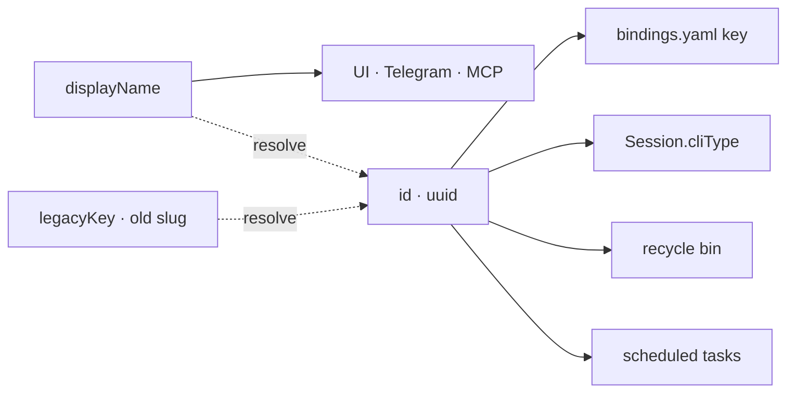

# Configuration System

## Directory Structure

```
config/
├── settings.yaml               # Active profile name, hapticFeedback toggle, notifications toggle, sidebar prefs, sorting, sessionGroups (order + collapsed + bookmarked), mcp (enabled/port/token)
├── sessions.yaml               # Persisted session state (auto-managed)
├── drafts.yaml                 # Persisted draft prompts per session (auto-managed)
├── plans/                      # Individual per-plan JSON files and incoming plan artifacts
├── plan-dependencies.json      # Persisted directory plan dependency registry
├── mcp/
│   ├── claude-mcp.json         # Sample MCP config for Claude Code clients
│   └── copilot-mcp.json        # Sample MCP config for Copilot CLI clients
└── profiles/
    └── default.yaml            # Self-contained: tools + workingDirectories + bindings + sticks + dpad
```

### Deploy Packaging

Release builds ship sanitised configs. `prepareDeploy.py` creates a transient `config-deploy/` directory with profiles stripped of `workingDirectories`, default-only `settings.yaml`, and empty `sessions.yaml`. This is overlaid onto `config/` by electron-builder during packaging so personal paths never ship.

## CLI Type Identity

A CLI type has two separate handles, and confusing them is the bug this split exists to prevent:

| | What it is | Who sees it |
|---|---|---|
| `id` | UUID v4, minted once at creation. Also the map key in `cli-types.yaml`, and the key everything else joins on. | Nobody. Never rendered. |
| `displayName` | Free-text label the user edits. `name` is a deprecated alias kept in sync for legacy readers. | Everywhere — sidebar, spawn grid, settings, Telegram, session default names. |

Renaming writes `displayName` and nothing else. No key changes, so bindings, live sessions, recycle-bin entries and scheduled tasks all keep resolving.



### Resolution

`ConfigLoader.resolveCliType(ref)` is the single choke point. Every cliType reference supplied by a human or an agent — MCP `session_create`, scheduled tasks, Telegram, IPC — goes through it. It resolves in order:

1. exact `id` (uuid)
2. `legacyKey` — the pre-UUID slug, e.g. `claude-code`. Kept indefinitely; agents and docs in the wild still use it.
3. `displayName`, trimmed and case-insensitive

An ambiguous `displayName` throws `AmbiguousCliTypeError` naming the conflicting ids rather than silently picking one — the settings UI blocks duplicate names on add, clone and rename, so this only fires on a hand-edited YAML. An unknown reference returns `null`; nothing falls back to treating the reference as an executable name.

**Resolve when the reference is accepted, not when it is used.** A scheduled task can sit pending for weeks, so `ScheduledTaskManager` resolves `cliType` in `createTask`/`updateTask` and stores the canonical uuid — an unknown or ambiguous reference fails the person or agent setting the schedule up, instead of failing unattended at 3am. Tasks written before this (or before the uuid migration) are healed once in `start()`; one that still will not resolve is left alone rather than blocking startup, and fails loudly when it next fires.

`ConfigLoader.getCliTypeLabel(ref)` is the display counterpart: never throws, never returns a uuid. Telegram gets it via `setCliLabelResolver` (wired once in `initTelegramModules`) because the notifier, topic manager and keyboard builders hold no `ConfigLoader`.

### Migration

`src/config/cli-type-migration.ts` runs from `ConfigLoader.load()`. A `cli-types.yaml` whose entries have no `id` is pre-UUID: each entry gets a minted uuid, `displayName` from the old `name`, and `legacyKey` set to the old slug, preserving order. The slug→uuid map is then applied to `bindings.yaml`, persisted sessions, recycle-bin entries, and scheduled tasks plus their history. Staged write, verify, then swap — a failure leaves the originals untouched. Running it again is a no-op.

## Profiles

**Profiles are self-contained**— each profile YAML includes tools (CLI definitions), working directories, button bindings, stick config, and dpad config. Switching profiles changes everything. Profile switch shows a confirmation dialog when terminals are open (keep sessions / close all). `createProfile(name)` creates an empty profile; `createProfile(name, copyFrom)` clones from an existing profile.

**Auto-migration:** On first load, if legacy `config/tools.yaml` and `config/directories.yaml` exist, their contents are merged into all profiles and the old files are deleted.

## Binding Resolution

CLI-specific bindings are used. Each profile defines different button behaviours per CLI type.

## Binding Action Types

### keyboard

`{ action: 'keyboard', sequence: '{Wait 500}some text{Enter}{Ctrl+C}' }` — sequence parser syntax string sent to PTY stdin as escape codes. The sequence format is the only input mode for keyboard bindings.

### voice

`{ action: 'voice', key: 'F1', mode: 'tap', target?: 'terminal' }` — key simulation for voice activation triggers.

**OS-default routing:** voice bindings default to OS-level robotjs simulation (for external apps like OpenWhisper). Only routes through PTY when `target: 'terminal'` is explicitly set — converts key to terminal escape sequence via `keyToPtyEscape()` and writes to PTY via `ptyWrite()`. Falls back to OS-level robotjs when no terminal is active or `target` is not `'terminal'`.

- `mode: 'tap'` sends a single key event
- `mode: 'hold'` sends the escape sequence once on press (PTY has no key-up concept) or holds/releases via robotjs for OS-targeted bindings
- Key supports single keys (`F1`, `Space`) and combos (`Ctrl+Alt`)
- Supports F1-F12 (VT220 escape sequences), navigation keys, and modifier combos

### voice-talk

`{ action: 'voice-talk' }` — hold-to-talk to the Helm operator: press starts recording, release transcribes (OpenWhispr) and sends to the operator; replies are spoken (Piper). Needs the operator enabled and the OpenWhispr/Piper/ffmpeg paths set in Settings → Telegram (the Telegram bot itself need not be on). Not to be confused with `voice`, which only simulates a key for an external dictation app. See [voice-operator.md](voice-operator.md#desktop-voice).

### scroll

`{ action: 'scroll', direction: 'up'|'down', lines?: 5 }` — Scroll active terminal buffer (or overview grid when visible).

### context-menu

`{ action: 'context-menu' }` — Opens the context menu overlay. Gamepad binding centers the menu in the viewport (mode: 'gamepad'). Right-click on any terminal pane shows at mouse position (mode: 'mouse').

Menu items: Copy, Paste, Compose in Editor ✏️, New Session, New Session with Selection, Prompts ⚡, Drafts ►, Cancel.

- Copy and "New Session with Selection" are disabled when no text is selected
- "New Session" / "New Session with Selection" open a quick-spawn CLI type picker (pre-selects active session's type), then the directory picker (pre-selects active session's working directory), then spawns
- "⚡ Prompts…" is enabled when there is an active session — opens the global prompt-template picker tree (`PromptTreeModal`), then prefills the in-app Prompt Editor with the chosen template (see `prompt-tree` below)
- "Drafts ►" opens a submenu listing New Draft + existing drafts with per-draft Apply/Edit/Delete actions

### prompt-tree

`{ action: 'prompt-tree' }` (renamed from the removed `sequence-list` action)

Opens the global **prompt-template** picker tree (`PromptTreeModal.vue`) — a progressive-disclosure tree of folders + template leaves backed by `PromptTemplateManager` and persisted to `%APPDATA%/Helm/config/prompt-templates.yaml`. Navigation: D-pad up/down cycles visible nodes, left/right expand/collapse folders, A picks, B cancels; keyboard accelerators index visible nodes `1-9,0` then `a-z`.

Picking a template does NOT send directly — it opens the in-app Prompt Editor (`EditorPopup.vue`) prefilled with the template body (caret at end) so the user can amend it. Only Ctrl+Enter / Send delivers the composed text to the active PTY via `deliverPromptSequence()`. Template bodies use the sequence-parser syntax (`{Enter}`, `{Wait 500}`, plain text). The apply flow is shared by the main window and the popout via the `usePromptApplyFlow` composable. (The legacy per-CLI `sequences` groups, `SequencePicker` modal, and `sequence-list` action were removed in PT-7; the executor/delivery layer that parses the syntax is retained.)

### new-draft

`{ action: 'new-draft' }` — Opens the draft editor for the active session, allowing the user to compose a draft prompt memo while the CLI is busy. Drafts can be applied (sent to PTY) via the Apply button in the editor or through the Drafts submenu in the context menu.

## Chip-Bar Action Buttons

Quick-action buttons configured at the **profile root** (not per-CLI-type — same buttons appear regardless of which CLI is active).

```yaml
chipActions:
  - label: "💾 Save Plan"
    sequence: >-
      Create a plan item for what you just described...{Enter}
  - label: "📋 My Action"
    sequence: some text to send to PTY {Enter}
```

Each entry: `{ label: string, sequence: string }`.

- Buttons render right-aligned in the draft strip (same horizontal bar as draft pills and plan chips), via `margin-left: auto` on `.chip-action-bar`.
- `sequence` uses the same [Sequence Parser Syntax](#sequence-parser-syntax) as bindings, plus four template variables resolved at click time from the active session:

| Variable | Resolves to |
|----------|-------------|
| `{cwd}` | Active session's working directory |
| `{cliType}` | Active session's CLI type key |
| `{sessionName}` | Active session's display name |
| `{plansDir}` | `config/plans/incoming/` absolute path |
| `{inboxDir}` | `config/plans/incoming/` absolute path |

- Actions are cached per page load. `invalidateChipActionCache()` (exported from `draft-strip.ts`) forces a re-fetch on the next strip render.
- IPC: `configGetChipbarActions` bridge → `config:getChipbarActions` handler → `ConfigLoader.getChipbarActions()` → returns `{ actions, inboxDir }`.
- Omit `chipActions` (or leave it empty) to show no action buttons.

## Tool Config

In profile YAML `tools` section:

```yaml
claude-code:
  name: Claude Code
  renameCommand: "/rename {cliSessionName}"   # Optional: rename CLI-internal session (sent to PTY stdin)
  spawnCommand: "claude --session-id {cliSessionName}"  # Fresh spawn: set session UUID (written as-is to shell stdin)
  resumeCommand: "claude --resume={cliSessionName}"  # Resume: reload specific session by UUID
  continueCommand: "claude --continue"           # Fallback when resumeCommand is not configured
  initialPrompt:              # Array of sequence items sent to PTY sequentially after spawn
    - sequence: "/init{Enter}"
  initialPromptDelay: 2000    # ms to wait before sending first item (default 2000 for AI CLIs, 0 for generic)
```

Resume templates accept two placeholders:

| Placeholder | Source | Used by |
|---|---|---|
| `{cliSessionName}` | UUID Helm mints at spawn | claude (`--session-id`/`--resume`), copilot, codex rename |
| `{cliThreadId}` | The CLI's own `session_id`, captured from its hook events (`SessionInfo.cliThreadId`) | codex: `codex resume {cliThreadId}` |

`{cliThreadId}` has no fallback. If the CLI never reported an id (no hooks block, or a session from before capture existed), the literal placeholder reaches the CLI and the resume fails visibly. See [cli-hooks.md](cli-hooks.md#thread-id-capture).

No `terminal` field — all CLIs run as embedded PTY sessions (no external window config). `initialPrompt` items are sent in order; use `{Wait N}` within sequences for inter-item timing.

`renameCommand` runs **before** the `initialPrompt` items, onto a guaranteed-empty composer, and only once the PTY's output has been quiet for a beat (`waitForQuiet`): a full-screen TUI re-render landing mid-paste (e.g. a SessionStart hook reply) splits the paste and submits its tail as a stray user message. A wedge-proof second CR follows the rename for composers that swallow the submit after a paste.

> **Note:** The legacy per-CLI `sequences:` block (named groups of sequence items) was removed in PT-7 and replaced by the global **prompt-template** library (`%APPDATA%/Helm/config/prompt-templates.yaml`, see the [`prompt-tree`](#prompt-tree) action). Any `sequences:` block still present in an old profile is read once as migration input and folded into the prompt-template tree.

## Pattern Rules (`patterns`)

Per-CLI array of regex rules stored under each CLI type in the profile YAML. `PatternMatcher` scans every PTY output chunk against all rules for that CLI type.

```yaml
claude-code:
  patterns:
    - regex: "try again at (\\d{1,2}(?::\\d{2})?(?:am|pm))"
      action: wait-until
      timeGroup: 1          # Capture group index whose text is parsed as a time
      onResume: "{Enter}"   # Sequence sent to PTY when the scheduled time arrives
      cooldownMs: 300000    # 5 min — suppresses re-triggering for same session
    - regex: "Are you sure"
      action: send-text
      sequence: "y{Enter}"  # Sequence sent to PTY immediately on match
      cooldownMs: 10000
```

### Action Types

| Action | Trigger | Required fields | Optional fields |
|--------|---------|-----------------|-----------------|
| `wait-until` | Parses a time from the matched capture group (or uses `waitMs` as fixed delay), then sends `onResume` to PTY at that time | `onResume` | `timeGroup` (default 0), `waitMs` (fallback fixed delay) |
| `send-text` | Sends `sequence` to PTY immediately on match | `sequence` | — |

Both action types use `sequence` / `onResume` strings in [Sequence Parser Syntax](#sequence-parser-syntax).

### Cooldown & Dedup

Each rule carries an optional `cooldownMs`. After a rule fires for a session, it is suppressed for that session for `cooldownMs` milliseconds — preventing rapid re-triggering from repeated output lines. Cooldown is tracked **per session per rule** (not globally), so two concurrent sessions can each trigger the same rule independently.

### Schedule Chip

When a `wait-until` fires and a scheduled send is pending, the session card shows a ⏰ `HH:mm [×]` chip. Clicking `×` cancels the pending send via the `pattern:cancelSchedule` IPC channel.

### IPC Channels

| Channel | Purpose |
|---------|---------|
| `tools:addPattern(cliType, rule)` | Append a pattern rule to a CLI type |
| `tools:updatePattern(cliType, index, rule)` | Replace pattern rule at index |
| `tools:removePattern(cliType, index)` | Delete pattern rule at index |
| `tools:getPatterns(cliType)` | Return all pattern rules for a CLI type |
| `pattern:cancelSchedule(sessionId)` | Cancel the pending `wait-until` for a session |

## Operator (`operator`)

`settings.yaml → operator` configures the Helm voice operator singleton. Edit it in Settings → Operator.

| Key | Default | Meaning |
|---|---|---|
| `enabled` | `false` | Keep one locked "Helm" operator session running |
| `cliType` | `''` | CLI type id to run it on. Empty means nothing spawns |
| `workingDir` | `''` | Spawn directory. Empty means the CLI's default |
| `compactEveryMinutes` | `60` | Idle self-compaction cadence. `0` = off. It skips when there's been no activity and retries every 30 min while busy |

See [voice-operator.md](voice-operator.md#the-operator-session--helm).

## Sequence Parser Syntax

Used by both `sequence` bindings and `initialPrompt`:

| Token | Effect |
|-------|--------|
| Plain text | Sent as literal characters |
| `{Enter}` | Newline / carriage return |
| `{Tab}`, `{Escape}`, `{Delete}`, etc. | Named keys |
| `{Ctrl+C}`, `{Ctrl+Z}`, etc. | Modifier + key combos |
| `{Wait 500}` | Pause N ms (max 30000) |
| `{Ctrl Down}`, `{Ctrl Up}` | Hold/release modifier |
| `{{`, `}}` | Literal `{` and `}` |

## Stick Config

In profile YAML:

```yaml
sticks:
  left:
    mode: cursor    # cursor | scroll | disabled
    deadzone: 0.25
    repeatRate: 60
  right:
    mode: scroll
    deadzone: 0.25
    repeatRate: 60
dpad:
  initialDelay: 400
  repeatRate: 120
```

## Plan Storage

Plan storage is folder-level and shared across profiles. Current plan items are individual JSON files under `config/plans/`, dependency edges live in `config/plan-dependencies.json`, and inbox imports use `config/plans/incoming/`. `config/plans.yaml` is legacy migration input only; if present at startup it is migrated and renamed to `plans.yaml.bak`.

```yaml
plans:
  "C:/projects/my-app":
    dirPath: "C:/projects/my-app"
    items:
      - id: "a1b2c3d4-..."
        dirPath: "C:/projects/my-app"
        title: "Setup auth"
        description: "Implement JWT authentication"
        status: ready              # planning | ready | coding | review | blocked | done
        createdAt: 1700000000000
        updatedAt: 1700000000000
      - id: "e5f6g7h8-..."
        dirPath: "C:/projects/my-app"
        title: "Build API routes"
        description: "REST endpoints for user CRUD"
        status: planning
        sessionId: null            # Set when status is 'coding' or 'review'
        stateInfo: null            # Required when status is 'blocked'
        createdAt: 1700000000000
        updatedAt: 1700000000000
    dependencies:
      - fromId: "a1b2c3d4-..."    # Blocker (must be done first)
        toId: "e5f6g7h8-..."      # Blocked (can't start until blocker is done)
```

Status transitions: new items start as `planning` and become `ready` when their dependencies are satisfied. Ready work is claimed with `plan_set_state status=coding` (the legacy `plan:apply` IPC still maps ready to coding), can move through `review` or `blocked`, and is finished with `plan_complete`/`plan:complete`. Completing an item triggers ready-state recomputation, which may promote dependency-unblocked `planning` items to `ready`.

## MCP Server (localhost)

Helm exposes a Model Context Protocol (MCP) HTTP endpoint on `127.0.0.1` so external AI CLIs (e.g. Claude Code, Copilot CLI) can query and control Helm remotely. The server is disabled by default.

### Settings

Stored in `config/settings.yaml` under the `mcp` key:

```yaml
mcp:
  enabled: false          # Toggle the MCP server on/off
  port: 47373             # TCP port bound to 127.0.0.1 (1-65535)
  authToken: ""           # Bearer token required for all requests
```

- **enabled** — Starts the HTTP server when Helm launches. The server only runs while Helm is open.
- **port** — Bound strictly to `127.0.0.1`; never exposed to the network.
- **authToken** — Random string sent as `Authorization: Bearer <token>`. Generated via the settings UI or manually entered.
  Helm also mints session-scoped bearer tokens for Helm-spawned CLIs so the MCP server can infer sender identity for inter-LLM relay without callers manually passing sender fields.

Environment variable overrides (optional):

| Variable | Effect |
|----------|--------|
| `HELM_MCP_ENABLED` | `1` to enable, anything else to disable |
| `HELM_MCP_HOST` | Override bind address (default `127.0.0.1`) |
| `HELM_MCP_PORT` | Override port (default `47373`) |
| `HELM_MCP_TOKEN` | Override auth token |

When `session_send_text` is called through a Helm-spawned CLI session, the localhost MCP server can infer the sender from that session-scoped bearer token. A bare external HTTP client that only knows the shared root token is still authenticated, but it is not automatically tied to a specific Helm session.

### Client Configuration

#### Claude Code / Claude Desktop

Add to `claude_desktop_config.json` (macOS) or `%APPDATA%\Claude\settings.json` (Windows):

```json
{
  "mcpServers": {
    "helm": {
      "type": "http",
      "url": "http://127.0.0.1:47373/mcp",
      "headers": {
        "Authorization": "Bearer YOUR_TOKEN_HERE"
      }
    }
  }
}
```

#### Copilot CLI / VS Code

Add to `.mcp.json` or VS Code MCP settings:

```json
{
  "mcpServers": {
    "helm": {
      "type": "http",
      "url": "http://127.0.0.1:47373/mcp",
      "tools": ["*"],
      "headers": {
        "Authorization": "Bearer YOUR_TOKEN_HERE"
      }
    }
  }
}
```

### Available Tools

The MCP server exposes the following tools for external clients:

| Tool | Description |
|------|-------------|
| `tools_list` | List configured CLI types and their supported working directories |
| `plans_list` | List all plan items for a directory, including human-readable `P-00xx` IDs |
| `plans_summary` | List compact plan status, canonical IDs, human-readable IDs, and dependency relationships |
| `plan_get` | Get a single plan item by UUID or `P-00xx` human-readable ID |
| `plan_create` | Create a durable plan with `Problem Statement`, `User POV`, `Done Statement`, `Files / Classes Affected`, `TDD Suggestions`, and `Acceptance Criteria` sections |
| `plan_update` | Update a plan item title, description, and/or type by UUID or `P-00xx` ID |
| `plan_delete` | Delete a plan item by UUID or `P-00xx` ID |
| `plan_set_state` | Set plan state (`planning`/`ready`/`coding`/`review`/`blocked`) by UUID or `P-00xx` ID |
| `plan_complete` | Mark a plan item as done by UUID or `P-00xx` ID with implementation, file, test/review, and risk notes |
| `plan_nextplan_link` | Link one plan as a prerequisite for another by UUID or `P-00xx` ID, including `QUESTION: ...` blocker links to original plans |
| `plan_nextplan_unlink` | Remove a prerequisite link between two plan items by UUID or `P-00xx` ID |
| `directories_list` | List all known working directories |
| `session_create` | Spawn a new CLI session in a working directory |
| `sessions_list` | List active Helm sessions |
| `session_get` | Get a session by ID or exact display name |
| `session_send_text` | Send text to a running session's PTY |
| `session_read_terminal` | Read the recent terminal tail for any known session, with `raw`, `stripped`, or `both` output modes |
| `session_plan_claim` | Claim a plan: records ownership, transitions ready→coding, shows plan badge on session row |
| `session_set_aiagent_state` | Update the session AIAGENT state icon |
| `session_info` | Return MCP endpoint, AIAGENT state registry, directories, tool descriptions, and agent plan guidance |

All tools return JSON via MCP's `tools/call` endpoint. Errors are returned as JSON-RPC error responses with descriptive messages.
