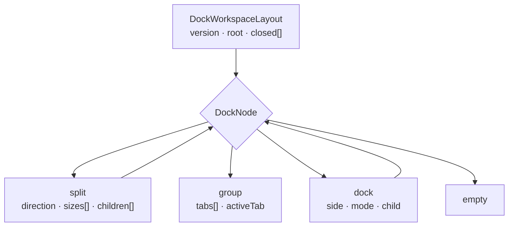

# Docking Workspace

The prompt-IDE workspace: a recursive, persisted layout tree in which every view
and tool window is a **pane**. Panes can be tabbed, split, docked to an edge,
collapsed to a rail, closed, and restored.

## Model

The tree is plain serializable data — no DOM selectors, no Vue constructs — so
the renderer decides placement and a live xterm element can be *adopted* into a
new position rather than remounted.

| File | Role |
|------|------|
| `renderer/dock-types.ts` | Node types, geometry constants, and the pane registry |
| `renderer/dock-layout.ts` | Pure tree operations — every function takes a layout and returns a new one |
| `renderer/dock-persistence.ts` | Loads/validates the untrusted persisted layout; legacy migration |
| `renderer/composables/useDockWorkspace.ts` | Reactive wrapper: focus identity, reveal state, persistence queue |
| `renderer/components/dock/*.vue` | Recursive renderer — nodes, tab groups, splitters, rails, drag preview |
| `renderer/dock-visibility-bridge.ts` | Hands pane visibility to the imperative gamepad nav in `screens/` |

## The pane registry

`DOCK_PANES` in `dock-types.ts` is the single source of a pane's identity. Adding
a pane means adding a descriptor and a component in `dock-pane-registry.ts` —
nothing else in the model knows pane ids.

| Field | Meaning |
|-------|---------|
| `title` | Shown on the tab and as the rail tooltip |
| `icon` | Glyph on a collapsed dock's rail |
| `hint` | Optional keyboard hint, surfaced as the tab tooltip |
| `home` | `DockSide \| 'center'` — where the pane lands when restored |
| `closable` | Whether it can be closed to the View menu |

## Pane profiles

A window hosts a **subset** of the registry, named by a `DockProfileId`. The
profile is data, like the registry itself, so the default layout, the validator
and the View menu all read one allow-list.

| Profile | Panes | Window |
|---------|-------|--------|
| `main` | every registered pane (derived, never re-listed) | `MainWindowApp.vue` |
| `popout` | terminal, plans, memories, mess, artifacts | `SnapOutWindow.vue` |

The pop-out omits the session list, quick spawn, scheduler and projects: those
act on things the main shell owns.

Each profile persists its own tree. `main` keeps the original `workspaceLayout`
settings field; `popout` writes `popoutWorkspaceLayout`, and the profile travels
with `configGet/SetWorkspaceLayout`. There is **one** pop-out layout shared by
every snapped-out window, not one per session.

### The pop-out shell

A snapped-out window is a real workspace bound to one session. `SnapOutWindow.vue`
pins `activeSessionId` during setup (`pinActiveSession`), after which
`setActiveSessionId` is a no-op for the lifetime of the window. Every pane reads
the store, so pinning is the whole of the binding — no session state is copied
into props and no pane knows it is in a pop-out.

The `terminal` pane is overridden with `PopOutTerminalPane.vue`: the main window's
`TerminalPane` hands its container to the shared `TerminalManager`, which a
pop-out does not have, so the pop-out pane owns its `TerminalView` directly
(attach → replay → live `pty:data`). PTY ownership is released only on snap-back,
never on pane close.

The window carries a slim `app-header`: the pinned session's identity on the left
(name, CLI, folder — the same derivation as the OS window title) and the **View
menu** on the right, listing the `popout` profile's panes. Without it a closed
pane would be unrecoverable, since a pop-out has no other entry point. Help, logs
and settings stay in the main window — they are app-global, not per-window.

## Titling and collapse have one owner

The dock names a pane (tab + rail tooltip) and collapses it (rail). **Pane
components render content only** — no section header, no collapse toggle. A pane
that draws its own title bar is duplicating the dock and is a bug.

Likewise there is exactly one collapse concept: a dock's `mode`.

| Mode | Behaviour |
|------|-----------|
| `pinned` | Content visible; the rail offers a collapse toggle |
| `autohide` | Collapsed to its rail; opens on rail click or focus, re-collapses on focus-out |
| `hidden` | Collapsed and stays collapsed until explicitly opened |

Reveal state (which autohide docks are currently open) is **session state, not
layout** — it is deliberately outside the persisted tree, so an opened autohide
dock re-collapses on the next launch.

### The rail

A collapsed dock renders a rail of **one icon button per pane in the dock**;
clicking an icon opens *that* pane. Rails never contain rotated text — a ~34px
strip fits a glyph and a tooltip, not a legible word.

A pinned dock also gets a rail, carrying a collapse chevron. This matters: it is
what makes reclaiming space a *collapse* rather than a *close*.

## Closing and restoring

`closePane` removes the pane from the tree and appends it to `layout.closed`;
empty groups and emptied docks are pruned by `normalizeNode`. Recovery is the
**View menu** in the header, which lists open and closed panes separately and
badges the trigger with the number of recoverable panes.

`restorePane` resolves a landing spot in this order:

1. an explicit `DropTarget` (drag, or restore-to-here);
2. `home: 'center'` → the first group not inside an edge dock, as a tab;
3. `home: <side>` → the live dock on that side, as a tab;
4. **no such dock** → the edge dock is recreated at `OUTER_EDGE_RATIO`.

Step 4 is load-bearing. Homes are anchored on an *edge*, never on a sibling
pane: a sibling can itself be closed, and anchoring on one used to strand a
restored tool window as a tab in the centre group behind Terminal — which read
as "it never came back".

Homes live in the registry, not in the persisted tree, so changing a pane's home
does not invalidate a saved layout.

## Workspace shortcuts and view lifecycle

The dock owns pane selection. Two panes — **Terminal** and **Plans** — also
represent a *view mode* and therefore pass through the navigation store's
mount/unmount lifecycle, whichever way they are selected (tab, rail, View menu,
shortcut). `renderer/composables/useDockViewRouting.ts` is the single place that
maps between the two, so the dock mirrors `main-view-manager` instead of
becoming a second routing path. Selecting Terminal closes the active overview or
plan lifecycle before focusing the terminal.

Every other pane is a tool pane over existing state, **including Team View**
(pane id `overview`). Focusing a tool pane is a focus move and nothing else: a
view transition started from `focusin` would cancel the click that is about to
select a session. See [team-view.md](team-view.md). The `overview` *view mode*
still exists for the legacy fullscreen group-overview grid; it simply has no
pane of its own, so the `activeView` watcher has nothing to reconcile for it.

Global shortcuts are `Ctrl+Shift+T` Terminal, `Ctrl+Shift+O` Team View,
`Ctrl+Shift+M` Memories, `Ctrl+Shift+P` Plans, `Ctrl+Shift+S` Sessions, and
`Ctrl+Shift+A` Artifacts. The Artifact shortcut shows/focuses the pane; it does
not toggle visibility. `Ctrl+Shift+N` remains the new-session shortcut.

Pane content does not provide a second close control. The dock tab close button
is the close action, the View menu restores closed panes, and rails reveal
collapsed or autohide panes.

## Chips belong to the terminal

`TerminalChips` (plan pills + quick actions) mounts **inside** `TerminalPane`, at
its foot — not as a band across the shell. Its visibility is therefore "the
terminal pane is rendered", which the dock already decides, and it travels with
the pane when the pane is moved, split or docked.

`TerminalChips` is a thin store adapter over `ChipBar`; the same component serves
the docked pane and a snapped-out window, so there is one chip-row
implementation.

## Gamepad navigation

The imperative nav in `renderer/screens/` must skip zones that cannot take
focus. It asks `isPaneVisible(paneId)` from `dock-visibility-bridge.ts`, which
the shell backs with `dockWorkspace.isVisible` — accounting for collapsed rails,
hidden docks and inactive tabs in one answer. Nav modules never track collapse
state of their own.

## Persistence

The layout is stored by the main process as an opaque value
(`config:get/setWorkspaceLayout`) — main never interprets the renderer's schema,
so an older build can still load settings written by a newer renderer. The
renderer validates on load and falls back to the Classic default if the value
does not satisfy the schema.

The Classic default is one horizontal root split with four tracks: the left tool
dock (session list over the stacked tool windows), the view group
(Terminal / Plans / Memories / Mess, Terminal active), Team View in a column of
its own, and Artifacts as a collapsed right-edge rail. Team View is deliberately
not a tab of the view group — a roster used to switch sessions must stay visible
when the terminal it switched to becomes active. Saved layouts are untouched by
this: the default only describes a fresh workspace, and the pane id is unchanged.

## Related

- [preload-api-boundary.md](preload-api-boundary.md) — IPC/contextBridge rules
- [terminal-architecture.md](terminal-architecture.md) — PTY stack and terminal adoption
- [artifact-viewer.md](artifact-viewer.md) — the Artifacts pane
