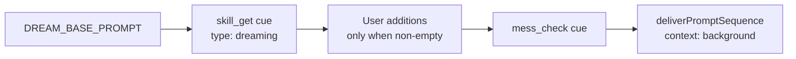

# Dreaming

A **dream** is a scheduled maintenance pass over one project's durable memories. Helm seeds one disabled dream task per project; enabling it gives that project a daily housekeeping run that prunes, consolidates and sharpens what the project already knows.

Dreams are ordinary scheduled tasks with `systemKind: 'dream'` (`src/session/scheduled-task-manager.ts`). Helm owns their prompt and title; the user owns the time, the CLI, the enabled toggle, and an optional prompt addendum.

## Delivered prompt

The prompt is deliberately short. It cues the `dreaming` system skill rather than restating the procedure, so the guidance can be revised in one place without touching the scheduler.

Assembled by `buildDreamPrompt` and delivered as the spawned session's `contextText` — the same mechanism a user-created session uses for its initial prompt. It is **not** delivered from an `onPromptComplete` callback: a missed callback used to leave the dream session with nothing but the `[HELM_MESS]` reminder.

The procedure itself lives in the `dreaming` system skill (`src/mcp/guides/dream-guide.ts`, registered as `sys-dream` in `helm-control-service.ts`). Like every system skill it is shadowed by a user skill of the same `type`, so a project can override the dreaming procedure without a code change.

## Scheduling

- The sidebar resolves the exact instant the user picked and sends it as `scheduledTime` alongside a daily cron expression.
- `updateTask` recomputes `nextRunAt` **only** when the schedule itself changes (`scheduledTime`, `scheduleKind`, `cronExpression`, `endDate`). Recomputing on every patch pushed a daily task out a further day per edit.
- A failed or healed dream is put back on its configured hour via `nextDreamRun`, not at `now + 24h`, so a hiccup does not walk the dream off its time.

## Run now

The play button in the dream row fires an extra occurrence immediately (`runTaskNow`). `nextRunAt` and `scheduledTime` are restored once the run starts, so "run now" can never act as "postpone". A disabled dream can still be run on demand — the toggle governs the timer, not the button.

## Related

| Document | Content |
|----------|---------|
| [scheduled-task-history.md](scheduled-task-history.md) | 7-day rolling run log of scheduled-task executions |
| [mess.md](mess.md) | The project conversation a dream checks on completion |
