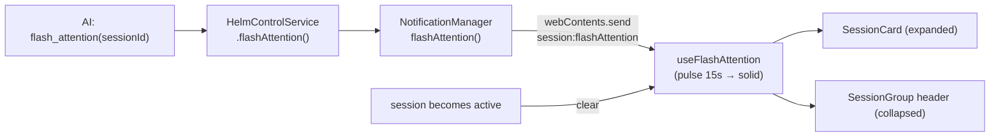

# Flash Attention

The `flash_attention` Helm MCP tool lets an AI make one of its sessions **visually
beat** in the sidebar until the user looks at it.

## Why this exists

`notify_user` covers "tell the user something". Flash Attention covers the different
case: *"stop what you're doing and come here."* A toast is transient and a badge is
easy to miss across a sidebar of a dozen sessions. A card that pulses in the app's
accent colour is unmissable, unambiguous about **which** session wants
attention, and — crucially — **persists** until acknowledged, rather than expiring on
a timer while the user is in another room.

Three design choices follow from that:

- **The app's theme accent tokens, not the OS accent.** The flash uses the app's own
  `--accent` / `--accent-contrast` tokens so it matches the app's theme regardless of
  the OS accent — which can read as any colour, including ones the app's resting
  palette collides with.
- **Pulse, then hold.** A 15-second beat is the attention grab; after that it settles
  to a solid accent. Beating forever is hostile; stopping entirely would lose the
  signal for a user who returns after a coffee.
- **Cleared by *focus*, not by time.** The flash ends when the user actually looks at
  the session. That is the only event that means "acknowledged".

## Chain



The chain deliberately mirrors `notify_user`: MCP dispatcher →
`HelmControlService.flashAttention(ref)` resolves the session reference → delegates to
`NotificationManager.flashAttention(id)`.

## Main process

`NotificationManager.flashAttention(sessionId)`:

1. Looks the session up. **Unknown session is a graceful no-op** (`{ flashed: false }`
   + a warning) — an AI holding a stale id must not crash anything.
2. Broadcasts `session:flashAttention` `{ sessionId }` to
   **every** live, non-destroyed renderer — a snapped-out window must flash too.

Timing and rendering location are **not** decided here. The main process states the
fact; the renderer owns the presentation, including the colour (the app's
`--accent` / `--accent-contrast` tokens).

## Renderer state (`useFlashAttention`)

A module-singleton `reactive(new Map<string, FlashEntry>())` plus a parallel timer
map.

```
FlashEntry { sessionId, phase: 'pulse' | 'solid', startedAt }
PULSE_DURATION_MS = 15_000
```

| Function | Behaviour |
|---|---|
| `start(payload)` | Clears any existing timer, records the entry in `pulse`, schedules the flip to `solid` after `PULSE_DURATION_MS`. Re-flashing an already-flashing session restarts the pulse. |
| `clear(sessionId)` | Stops the timer and removes the entry (user focused it, or it closed). |
| `clearAll()` | Teardown / tests. |
| `isFlashing(sessionId)` | Is this session flashing? |
| `groupIsFlashing(sessionIds)` | Is *any* member flashing? — drives collapsed group headers. |
| `pickGroupFlashEntry(source, sessionIds)` | Which member's phase a collapsed header should use. |

`pickGroupFlashEntry` is exported as a **pure** function over the passed map so it is
directly unit-testable. Its rule: a **pulsing** member always beats a **solid** one —
a fresh attention grab must not be masked by an older steady hold — and ties break to
the most recently started.

### Clearing rules (`MainWindowApp.vue`)

- Switching to a session (`activeSessionId` watcher) clears its flash.
- Window `focus` clears the flash on the currently active session.
- Incoming flashes are **skipped only when the user is already looking**: the target
  is the active session **and** `document.hasFocus()`. A backgrounded active session
  still flashes, so the attention grab is never silently dropped.
- `clearAll()` on teardown.

## Rendering

Location is derived **live** from collapse state, not stored:

| Situation | What flashes |
|---|---|
| Session's directory group expanded | the session's `SessionCard` |
| Group collapsed | the `SessionGroup` **header** (any flashing member) |

The flashing element is coloured straight from the app's `--accent` /
`--accent-contrast` tokens — no per-target inline styles.

```css
@keyframes flash-beat {
  0%,   49% { background-color: var(--bg-secondary); color: var(--text-primary); }
  50%, 100% { background-color: var(--accent);  color: var(--accent-contrast); }
}
.session-card.flash-pulse,
.group-header.flash-pulse { animation: flash-beat 1s infinite; }

.session-card.flash-solid,
.group-header.flash-solid {
  background-color: var(--accent) !important;
  color: var(--accent-contrast);
}
```

Two contrast decisions are load-bearing and documented in `main.css`:

1. **Background and text animate on one timeline.** The label must stay readable at
   every frame.
2. **The beat is DISCRETE, not a smooth interpolation** — background and text switch
   together at flat plateaus, so every rendered frame lands on one of two
   guaranteed-contrast surfaces (dark bg + light text, or accent + its paired text).
   Cross-fading foreground and background smoothly would collapse contrast
   mid-transition, producing an unreadable moment every second.

Additional rules force **all** textual and icon descendants (timer, meta, state, plan
badges, row actions) onto the flash text colour, so nothing keeps a fixed low-contrast
grey against the accent.

## Key modules

| File | Role |
|------|------|
| `src/mcp/tools/dispatcher.ts` | Routes the `flash_attention` tool call |
| `src/mcp/helm-control-service.ts` | `flashAttention(ref)` — resolves the session reference |
| `src/session/notification-manager.ts` | `flashAttention(sessionId)`, broadcast |
| `src/electron/preload/domain-api.ts` | `onFlashAttention` subscription |
| `renderer/composables/useFlashAttention.ts` | `PULSE_DURATION_MS`, entry map, `start`/`clear`/`isFlashing`/`groupIsFlashing`/`pickGroupFlashEntry` |
| `renderer/MainWindowApp.vue` | IPC subscription, skip-if-looking rule, focus/activation clearing |
| `renderer/styles/main.css` | `@keyframes flash-beat`, `.flash-pulse` / `.flash-solid` |

## Distinct from

- **`notify_user`** — routed by `NotificationManager` to toast / bubble / taskbar
  flash / Telegram depending on visibility and lock state. It *delivers content*;
  flash attention delivers only urgency.
- **Activity dots** — automatic, derived from PTY I/O timing. Flash is explicitly
  requested by the AI.
- **Telegram notifications** — off-machine, and never triggered by this tool.
