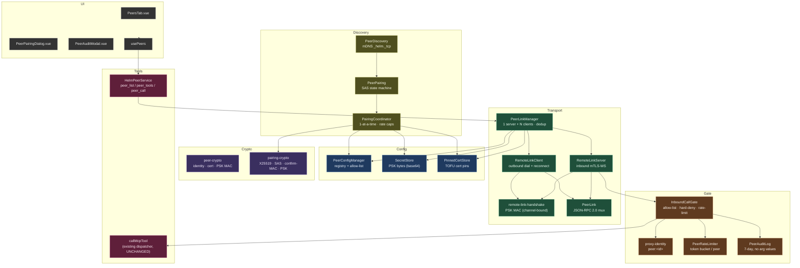
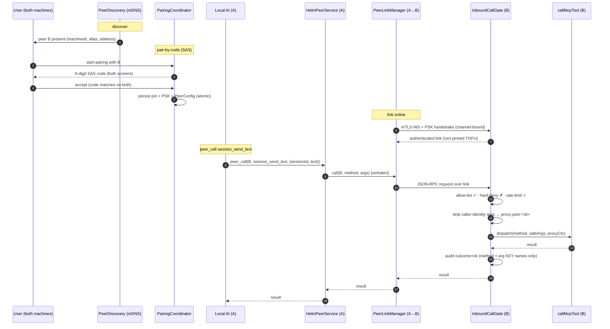
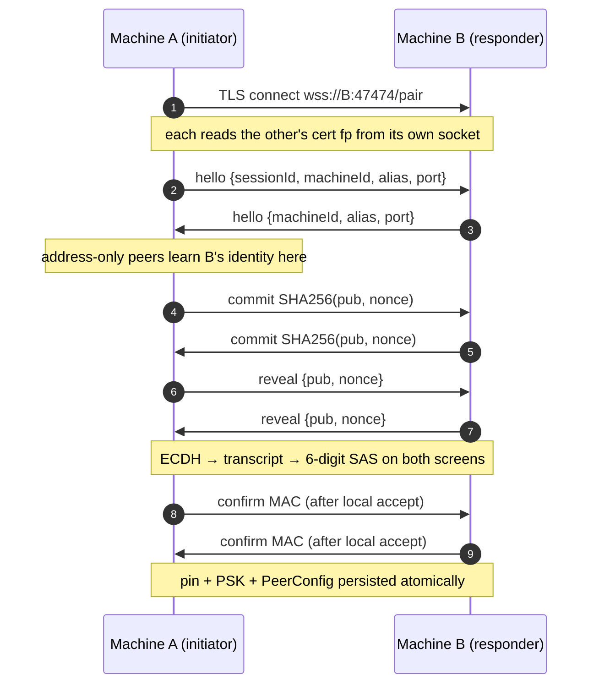
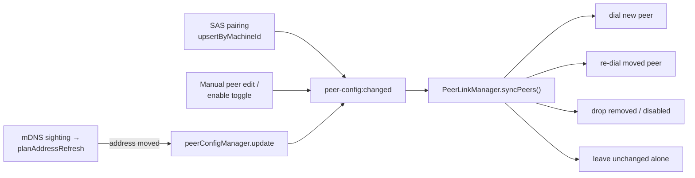

# Cross-Machine Helm Fleet

## Overview

Fleet lets **one Helm instance invoke another Helm's MCP tools** over the same LAN. A local AI reaches into a remote peer's *native* tool vocabulary through three meta-tools — `peer_list`, `peer_tools`, `peer_call` — instead of mirroring every remote tool into the local catalogue. The remote's **full tool surface** is reachable, gated behind a **per-peer allow-list** (deny-by-default).

Key properties:

- **Transport:** a SEPARATE TLS-WebSocket listener (default `:47474`) carrying JSON-RPC 2.0. The localhost MCP server (`127.0.0.1:47373`) is never touched — fleet is a wholly separate port and code path.
- **Discovery + pairing:** peers find each other via mDNS (`_helm._tcp`) and pair by comparing a **6-digit SAS code** on both screens (numeric-comparison, commit-then-reveal). Discovery grants NO access — access requires a completed pairing.
- **Proxy identity / no impersonation:** a remote peer's calls run under a synthetic `peer:<id>` identity, never a real local session. Caller-identity-override args (e.g. `senderSessionId`) are stripped before dispatch.
- **Reuses `callMcpTool` UNTOUCHED:** the inbound gate dispatches through the existing MCP dispatcher with no signature change — fleet adds a boundary in front of it, nothing inside it.
- **OFF by default:** fleet binds no port and constructs no manager unless explicitly enabled in settings.

## Components



## Headline flow



## Pairing transport (`pairing-socket.ts`)

Pairing runs over its own path on the **same** `:47474` listener — `wss://host:47474/pair` —
so a fleet needs exactly ONE firewall rule on Windows and one local-network permission
on macOS, not two.

**Why a separate path at all:** the steady-state link authenticates with a PSK, but the
PSK is precisely what pairing *derives*. It cannot exist yet, so the `/pair` path skips
the PSK handshake. What replaces it:

- Each side reads the peer's certificate fingerprint from **its own** TLS socket and folds
  it into the SAS transcript. The code the users compare therefore commits to the exact
  cert that will be pinned — a MITM terminating TLS presents a different one, so the two
  codes diverge.
- The `hello` frame (machineId, alias, listening port) is necessarily unauthenticated —
  the responder does not know who is calling until told — but it too is in the transcript,
  so tampering changes the SAS.
- A `/pair` socket **never becomes a `PeerLink`** and can invoke no tool. Its only
  capability is running the pairing state machine.
- Nothing is persisted until BOTH users accept a matching code.



**Finding the other machine.** mDNS (`_helm._tcp`) is the convenience path, but it does
**not cross subnets** and dies under Wi-Fi client isolation. **Pair by address**
(`peer:startPairingByAddress`) is the fallback and is often the primary path on real
networks: the peer's `machineId` is unknown when pairing by address, so it is taken from
the responder's own `hello` and folded into the SAS — a wrong address surfaces as a
mismatched code, never a silent mispairing. A `machineId` already known from mDNS is
**never** overwritten, so a responder cannot redirect a pairing aimed at a specific machine.

## Status reporting

`FleetController.status()` returns `{ enabled, running, error, addresses, allInterfaces }`,
read by the UI over `config:getFleetStatus`. Two deliberate properties:

- **A failed start is visible in the app.** The stack once died at startup (an ESM
  `require()` of `bonjour-service` threw in the bundled main process) and the only trace
  was a line in a log file while the Peers tab reported "No nearby peers found" — the same
  thing it says for a healthy but empty LAN. The tab now distinguishes *off* / *not
  running* / *scanning* / *N found*, and the panel shows the error text.
- **Addresses are shown, not the bind host.** A `0.0.0.0` bind is expanded via
  `reachableAddresses()` into the real IPv4 addresses of this machine, which is what the
  user has to type on the other one. IPv6 is omitted deliberately: link-local addresses
  need a scope suffix that does not survive being typed into a text box.

## Peer reconciliation (why a paired peer actually comes online)

Pairing writes a peer into the registry; it does **not** itself open a link. The
transport converges on the registry through a single reconcile path, so pairing, a
manual edit, and a discovered address change are all the same event:



Three properties this exists to guarantee:

- **Inbound connections can be identified.** A peer presents its cert before claiming
  any identity, so the server maps the observed fingerprint back to a peer via
  `PinnedCertStore.findPeerIdByFingerprint` (`resolveExpectedPeer`) — that is what
  selects the PSK its handshake runs with. Without it the server resolves `undefined`,
  finds no PSK, and rejects **every** inbound peer: a fully-paired fleet that displays
  "offline" forever. An unpinned fingerprint stays unresolved by design.
- **An unchanged registry never churns a link.** mDNS re-announces continuously;
  `planAddressRefresh` returns `null` unless a **known** machine's address actually
  changed, and discovery never invents a peer.
- **Addresses are normalized at the boundary.** A responder learns its peer's address
  from `tls.remoteAddress`, which on a dual-stack listener is IPv4-mapped
  (`::ffff:10.0.0.2`). `normalizePeerAddress` unwraps it before storage, since the raw
  form splits into an undialable host. Real (bracketed) IPv6 is left intact.

Peer entries are sanitized on load and import by the single shared `sanitizePeers`
(`src/session/peer-sanitize.ts`). The loader and `PeerConfigManager.importAll` once
implemented this twice and drifted — the loader dropped `machineId`, so after a restart a
paired peer could no longer be found by machineId and re-pairing forked a duplicate entry
with an orphaned pin and PSK.

## Security model

- **TLS + cert pinning (TOFU).** Each machine has a stable self-signed cert (RSA-2048/SHA-256). The link is mutual-TLS; certs are pinned on first pairing (`PinnedCertStore.recordIfAbsent`) and thereafter **hard-rejected on any change** — a differing fingerprint is a MITM reject, never an auto-rotate. The pin only ever changes via explicit user unpair.
- **PSK handshake, channel-bound.** After TLS, a PSK-keyed HMAC handshake runs, bound to the TLS session via RFC-5705 `exportKeyingMaterial` (hard-fail if unavailable — no insecure fallback). Distinct per-role MAC labels stop either side replaying the other's proof; the responder nonce defeats replay.
- **SAS numeric-comparison pairing.** The 6-digit code is a **KDF output** derived from the ECDH shared secret that the user compares on both screens — never an input to any MAC/KDF, so there is no offline verifier to grind. **Commit-then-reveal** (each side commits `SHA256(pub, nonce)` before revealing) blocks an active MITM from grinding a matching SAS. On accept, a confirm-MAC keyed from the ECDH secret (not the SAS) is exchanged; only then are pin + PSK + `PeerConfig` persisted atomically (all-or-nothing rollback).
- **Proxy identity — no impersonation.** Every inbound call dispatches under `peer:<peerId>` (`proxy-identity.ts`); session-scoped tools only ever see the proxy's own data. Caller-identity-override keys are neutralized before dispatch: all are stripped except `senderSessionId`, which is **wrapped** as a fleet address (below) — a wrapped id can never equal a local UUID, so impersonation stays impossible either way.
- **Per-peer allow-list, default-deny.** `PeerConfigManager.isToolAllowed` — an empty/absent allow-list denies everything; only glob-matched tool names pass.
- **Hard-deny list.** `helm_restart`, `session_group_close` are NEVER remotely invocable, even under a wildcard `*` allow-list (`HARD_DENY_TOOLS`). `session_close` is **ownership-gated**: a peer may close only sessions it created via `session_create` (tracked by `createdByPeerId`). Attempts to close sessions owned by another peer or created locally are denied with the same uniform message. Deny messages are **uniform** ("Tool not permitted") so a peer cannot probe which tools or sessions exist.
- **Rate-limit + 7-day audit.** A per-peer token bucket throttles inbound calls; every decision (`ok`/`denied`/`rate-limited`/`error`) is recorded to `PeerAuditLog` — a rolling 7-day trail storing **argument KEY NAMES only, never values or secrets**.
- **Enable toggle blocks both directions.** An explicitly disabled peer drops its live link and is denied inbound with the same uniform message. Fleet is **OFF by default**: no `:47474` listener is bound and no manager is constructed until enabled.

## Cross-machine replies (`fleet:` session addresses)

Replies are **LLM-driven**, not server-side: when text arrives with
`expectsResponse=true`, the HELM_MSG preamble tells the recipient LLM which
`sessionId` to call `session_send_text` back on. For that to work across machines
the reply address must name a session on the *other* host — so `senderSessionId`
is wrapped into a fleet address on the way in and unwrapped on the way out.

`fleet:<peerId>:<realSessionId>` — `src/mcp/peer/fleet-session-id.ts`. The prefix
cannot collide with a UUID v4 session id nor with the `peer:` proxy identity, and
the full session id stays readable (never hashed) so a human can see who is being
answered. This is the **only** inter-fleet reply mechanism; there is no parallel
path.

```mermaid
sequenceDiagram
    participant MacLLM as Mac LLM
    participant Mac as Mac Helm
    participant Box as Box Helm
    participant BoxLLM as Box LLM

    MacLLM->>Mac: peer_call(box, session_send_text, senderSessionId=S, expectsResponse)
    Mac->>Box: over the link
    Box->>Box: InboundCallGate WRAPS → fleet:<macPeerId>:S
    Box->>BoxLLM: HELM_MSG "reply to fleet:<macPeerId>:S"
    BoxLLM->>Box: session_send_text(sessionId=fleet:<macPeerId>:S)
    Box->>Box: dispatcher UNWRAPS → peerCall(macPeerId, …, sessionId=S)
    Box->>Mac: over the link
    Mac->>MacLLM: delivered to the real session S
```

Two halves, both in `session_send_text` (`src/mcp/tools/dispatcher.ts`):

| Half | Where | Behaviour |
|------|-------|-----------|
| Wrap (inbound) | `InboundCallGate.wrapCallerIdentityOverrides` | A peer's `senderSessionId` becomes `fleet:<peerId>:<id>`. Non-string values are dropped; all other override keys are still stripped outright. |
| Unwrap (outbound) | dispatcher, before any local lookup | A `fleet:` **target** is forwarded via `service.peerCall` with the real id; a malformed one is rejected, never treated as local. |

A `fleet:` **sender** skips the local known-session check (`resolveSenderIdentity`)
— it names a session on the calling peer, so it is deliberately absent from this
host's list, and the gate has already vouched for the caller. The same resolution
serves `session_send_input` (the raw, no-preamble path), so remote input keeps
working too.

Unaffected by design: the Telegram integration (separate PTY path, and its tools
key on `authContext.sessionId`, never `senderSessionId`), and the peer-created
session tint (`session_create` reads only the proxy identity).

## Known limitations / deferred

- **Pairing rate-limit key is spoofable.** `PairingCoordinator`'s per-source rate cap keys on the peer mDNS `machineId` (MVP), which an attacker on the LAN can spoof. The **real backstop is the GLOBAL cap of 10 pairing starts per 10 minutes**, which no spoofing bypasses. (The per-source cap adds a 3-fail → 15-min cooldown on top for honest sources.)
- **Two-machine physical run is still manual.** SAS pairing now runs over a real socket and is covered end-to-end against real mTLS loopback (`tests/pairing-socket-e2e.test.ts`): matching codes, mutual trust, identical derived PSKs, tampered-hello divergence, and reject-persists-nothing. What automation cannot cover is the physical network — firewalls, subnets, Wi-Fi isolation — so a run between two real machines (one Windows, one macOS) remains a manual check.

## Config files

All under `%APPDATA%/Helm/config`:

| File | Contents |
|------|----------|
| `peers.yaml` | Peer registry: id, alias, address, `pskRef`, `allow` glob list, direction, machineId, enabled. **No secrets.** |
| `peer-secrets.yaml` | PSK bytes, base64-encoded, keyed by `pskRef`. The ONLY home for secret material. |
| `peer-pins.yaml` | TOFU cert fingerprints, keyed by peerId. |
| `machine-identity.yaml` | This machine's stable identity (machineId + RSA keypair). |
| `self-signed-cert.yaml` | This machine's stable TLS cert + private key. |
| `peer-audit.yaml` | Rolling 7-day inbound-call audit trail (no arg values). |
