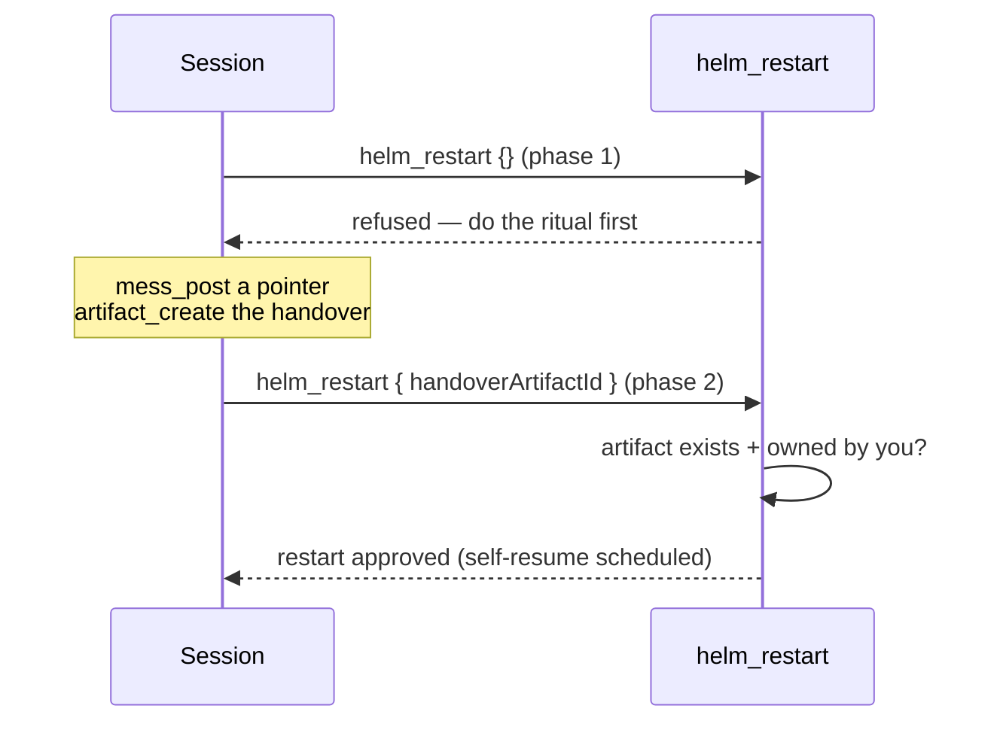

# Helm MCP Client Guide for Claude Code Sessions

## Quick Start: Receiving and Responding to Inter-Session Instructions

When a Claude Code session receives a `[HELM_MSG]` message, it should:
1. **Detect** the `[HELM_MSG]` prefix
2. **Parse** the JSON metadata on the first line
3. **Extract** `envelope.fromSessionName` as the reply target
4. **Process** the instruction after the first newline
5. **Reply** via Helm MCP to `envelope.fromSessionName`

> **Never block on a prompt.** A `[HELM_MSG]` comes from another LLM, not from a
> human at your terminal — an `AskUserQuestion` modal there is one nobody can see
> or answer, and your session hangs silently. If you need a decision, send the
> question back to `envelope.fromSessionId` with `session_send_text`
> (`expectsResponse=true`), set `session_set_aiagent_state(state="planning")`, and
> stand by for the reply. Do not guess. Helm restates this in the
> `[HELM_MSG_RULES]` block appended to every enveloped message — see
> [helm-mcp-protocol.md](helm-mcp-protocol.md).

## Detecting and Parsing the Envelope

Your Claude Code session receives text in chunks via PTY. Watch for the `[HELM_MSG]` prefix:

```typescript
function parseHelmInstruction(chunk: string) {
  const PREFIX = '[HELM_MSG]';

  if (!chunk.startsWith(PREFIX)) {
    return null;  // Not a Helm instruction
  }

  // First line: [HELM_MSG]{json}
  const envelopeEnd = chunk.indexOf('\n');
  const envelopeJson = chunk.slice(PREFIX.length, envelopeEnd);
  const envelope = JSON.parse(envelopeJson);

  // Rest is the instruction
  const instruction = chunk.slice(envelopeEnd + 1).trim();

  return {
    targetSession: envelope.fromSessionName,  // reply to sender
    fromSessionId: envelope.fromSessionId,
    expectsResponse: envelope.expectsResponse,
    instruction,
  };
}

// Usage:
const msg = `[HELM_MSG]{"type":"inter_llm_message","fromSessionId":"uuid-123","fromSessionName":"test-session","expectsResponse":true,"timestamp":"2026-04-26T10:00:00Z"}
INSTRUCTION: What is your purpose?`;

const parsed = parseHelmInstruction(msg);
// → { targetSession: 'test-session', fromSessionId: 'uuid-123', expectsResponse: true, instruction: 'INSTRUCTION: What is your purpose?' }
```

## Responding via Helm MCP

Once you've parsed the envelope, reply to the target session using HELM_MCP_TOKEN:

```typescript
async function replyViaHelm(
  targetSession: string,
  responseText: string
): Promise<void> {
  const sessionId = process.env.HELM_SESSION_ID;
  const sessionName = process.env.HELM_SESSION_NAME;
  const token = process.env.HELM_MCP_TOKEN;

  if (!token) {
    throw new Error('HELM_MCP_TOKEN not available — cannot reply');
  }

  const response = await fetch('http://127.0.0.1:47373/mcp', {
    method: 'POST',
    headers: {
      'Authorization': `Bearer ${token}`,
      'Content-Type': 'application/json'
    },
    body: JSON.stringify({
      jsonrpc: '2.0',
      id: Date.now(),
      method: 'tools/call',
      params: {
        name: 'session_send_text',
        arguments: {
          name: targetSession,
          text: responseText,
          senderSessionId: sessionId,
          senderSessionName: sessionName,
          expectsResponse: false
        }
      }
    })
  });

  if (!response.ok) {
    throw new Error(`Helm MCP error: ${response.statusText}`);
  }

  console.log(`✓ Reply sent to ${targetSession}`);
}

// Usage:
const parsed = parseHelmInstruction(incomingChunk);
if (parsed && parsed.expectsResponse) {
  const myResponse = `I completed: ${parsed.instruction}`;
  await replyViaHelm(parsed.targetSession, myResponse);
}
```

## Complete Example: Helm-Aware Session

Minimal code to receive Helm instructions and reply:

```typescript
// Handle incoming text from PTY
async function onPtyData(chunk: string) {
  const PREFIX = '[HELM_MSG]';

  if (!chunk.startsWith(PREFIX)) {
    console.log(chunk);  // Normal output
    return;
  }

  // Parse envelope
  const envelopeEnd = chunk.indexOf('\n');
  const envelope = JSON.parse(chunk.slice(PREFIX.length, envelopeEnd));
  const instruction = chunk.slice(envelopeEnd + 1).trim();

  console.error(`[Helm] Received instruction from ${envelope.fromSessionName}`);
  console.error(`[Helm] Instruction: ${instruction.slice(0, 100)}`);

  // Process instruction...
  const response = `✓ Processed: ${instruction}`;

  if (!envelope.expectsResponse) return;

  // Reply via Helm MCP
  await fetch('http://127.0.0.1:47373/mcp', {
    method: 'POST',
    headers: {
      'Authorization': `Bearer ${process.env.HELM_MCP_TOKEN}`,
      'Content-Type': 'application/json'
    },
    body: JSON.stringify({
      jsonrpc: '2.0',
      id: Date.now(),
      method: 'tools/call',
      params: {
        name: 'session_send_text',
        arguments: {
          name: envelope.fromSessionName,
          text: response,
          senderSessionId: process.env.HELM_SESSION_ID,
          senderSessionName: process.env.HELM_SESSION_NAME,
          expectsResponse: false
        }
      }
    })
  });
}
```

## Environment Variables Available

When your Claude Code session starts, these are already set:

```bash
HELM_SESSION_ID=pty-claude-code-1777154777746
HELM_SESSION_NAME=claude-code
HELM_MCP_TOKEN=helm_session_v1.pty-claude-code-1777154777746.Y2xhdWRlLWNvZGU.yf3zzDdFdmHRhnaBLVWHHpyoERiNfbcmUodTJDCTbIE
```

Use these to:
- **Read from env:** `process.env.HELM_SESSION_ID`, `process.env.HELM_SESSION_NAME`
- **Authenticate replies:** Include `HELM_MCP_TOKEN` in `Authorization: Bearer` header
- **Identify yourself:** Send `senderSessionId` and `senderSessionName` when replying

## Common Mistakes

❌ **Mistake 1: Using the wrong prefix to detect the envelope**
```typescript
// Bad: old plain-text format that is no longer used
if (chunk.startsWith('[HELM_MSG: REPLY_VIA_HELM_MCP_TO_')) { ... }

// Good: JSON envelope format
if (chunk.startsWith('[HELM_MSG]')) { ... }
```

❌ **Mistake 2: Missing authentication token in reply**
```typescript
// Bad: call fails with 401 Unauthorized
const response = await fetch('http://127.0.0.1:47373/mcp', {
  headers: { 'Content-Type': 'application/json' }  // No Authorization!
});

// Good: include token in header
const response = await fetch('http://127.0.0.1:47373/mcp', {
  headers: {
    'Authorization': `Bearer ${process.env.HELM_MCP_TOKEN}`,
    'Content-Type': 'application/json'
  }
});
```

❌ **Mistake 3: Hardcoding session names in replies**
```typescript
// Bad: won't work when calling a different session
senderSessionId: 'hardcoded-id-12345'

// Good: use environment variables
senderSessionId: process.env.HELM_SESSION_ID
```

❌ **Mistake 4: Not extracting reply target from envelope**
```typescript
// Bad: target not extracted, reply fails
await replyViaHelm('hardcoded-name', response);

// Good: parse fromSessionName from the envelope JSON
const envelope = JSON.parse(chunk.slice(10, chunk.indexOf('\n')));
await replyViaHelm(envelope.fromSessionName, response);
```

## Keeping your mission current: `session_mission_set`

Every session has a mission — a TL;DR (max 500 characters) pinned above its
terminal. The UserPromptSubmit hook shows it to you on every prompt as
`[HELM_MISSION] ...`. When there is none, set one; when a prompt changes the
direction of work, replace it; otherwise ignore the line.

```
session_mission_set(text="Port the planner canvas to Vue; keep DAG layout stable")
```

- `sessionId` is optional and defaults to your own session.
- Text is trimmed; an empty string clears the mission.
- Over 500 characters is rejected and the existing mission is kept.
- Read it back with `session_get` (`mission`) or `session_info` (`your_mission`).

See [mission-statement.md](mission-statement.md).

## Restarting Helm: the `helm_restart` ritual

`helm_restart` is a two-phase gate. A restart destroys your own context, so the
first call exists only to be told to leave a handover — it ALWAYS fails:



1. **Phase 1** — call without `handoverArtifactId`. It throws; nothing restarts.
   Follow the error's instructions:
   - `mess_post` a short message pointing teammates at your handover doc.
   - `artifact_create` the handover itself: what was in flight, key decisions,
     the next concrete step.
   - Re-call `helm_restart` with `handoverArtifactId` set to that artifact id.
2. **Phase 2** — the id must name an artifact YOUR session created (a foreign
   or unknown id fails identically, with no cross-session existence leak).
   The artifact's latest content becomes the self-resume prompt, re-delivered
   to your session ~2 minutes after relaunch — the restart never strands the
   work that asked for it.

`resume` defaults to `true` (sessions preserved and auto-resumed). `resume:false`
closes every session first — refused while any session is locked, and no
self-resume is scheduled since your session is closed too. Remote peers and
phones can never invoke `helm_restart` (hard-denied in both gates).

## Directory cleanup: `plan_cleanup_counts`, `sequence_clear_empty`, `context_clear_unreferenced`

The same bulk cleanup as the desktop planner (P-0805), exposed as MCP tools so the phone can drive it. All take `{ dirPath }`.

- `plan_cleanup_counts` — read-only `{ donePlans, emptySequences, unreferencedContexts, unusedContexts }`. `unusedContexts` is what a full "Clear unused" removes.
- `sequence_clear_empty` — deletes sequences with no member plans and releases their context bindings. Returns `{ deleted }`.
- `context_clear_unreferenced` — deletes the project's context nodes with no bindings. Returns `{ deleted }`.

Call them in that order: clearing sequences first is what turns contexts bound only to empty sequences into unreferenced ones. Replies stay tiny on purpose — large replies have broken the phone link.

## Testing Your Envelope Handler

```bash
# Terminal 1: Start Claude Code session (spawned by Helm to get env vars)
$ claude --session-id test-session

# Terminal 2: Send a Helm instruction with sender info
$ mcp tool: session_send_text(
    name: 'test-session',
    text: 'Summarize the gamepad CLI hub in 1 sentence and reply.',
    senderSessionId: $HELM_SESSION_ID,
    senderSessionName: $HELM_SESSION_NAME,
    expectsResponse: true
  )

# Terminal 1 shows:
[HELM_MSG]{"type":"inter_llm_message","fromSessionId":"...","fromSessionName":"test-caller","expectsResponse":true,"timestamp":"..."}
Summarize the gamepad CLI hub in 1 sentence and reply.
```

## Debugging

Set environment variable to enable logging:

```bash
export DEBUG=helm:*
claude --session-id my-session
```

Then monitor stderr for envelope parse errors.

## See Also

- [helm-mcp-protocol.md](./helm-mcp-protocol.md) — Full protocol specification
- [localhost-mcp-server.ts](../src/mcp/localhost-mcp-server.ts) — MCP tool definitions
- [helm-control-service.ts](../src/mcp/helm-control-service.ts) — Envelope creation
