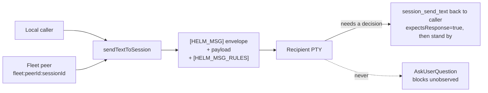

# Helm MCP Protocol: Inter-Session Coordination

## Overview

Helm MCP (Model Context Protocol) provides bidirectional communication between Claude Code sessions. Sessions can send text, coordinate work via plans, and pass structured metadata using the `[HELM_MSG]` envelope format.

## Agent Plan Coordination

Agents should call `session_info` on startup and read `agent_plan_guide` before creating or updating plans. New durable plans should include these description sections: `Problem Statement`, `User POV`, `Done Statement`, `Files / Classes Affected`, `TDD Suggestions`, and `Acceptance Criteria`.

Values like `P-0035` are Helm human-readable plan IDs (`PlanItem.humanId`). MCP plan tools accept either the canonical UUID or the `P-00xx` ID where a plan reference is requested. Use `plans_summary` to map between `P-00xx`, UUID, title, status, and dependency context.

When an agent is blocked by an important question, create a separate plan titled `QUESTION: ...`, put the concrete question at the top of that new plan, and link the question plan to the original blocked plan with `plan_nextplan_link` so the question is the prerequisite. Do not bury blocking questions in chat only, and do not overwrite the original plan description just to ask the question.

When completing a plan, `plan_complete` documentation should summarize implemented behavior, important files changed, tests or review performed, and any remaining risk.

Prefer `context_*` tools for durable memory that should survive across sessions. Sequences are primarily coordination lanes; their `sharedMemory` field is legacy and should be maintained only when updating existing sequence notes. For new durable notes, decisions, and collected evidence, create context and associate it with the relevant plan or sequence.

## Environment Variables

When a session is spawned by Helm, three environment variables are automatically injected:

| Variable | Type | Purpose |
|----------|------|---------|
| `HELM_SESSION_ID` | string (UUID) | Unique identifier for this session instance |
| `HELM_SESSION_NAME` | string | Human-readable display name of this session |
| `HELM_MCP_TOKEN` | string | HMAC-signed auth token for calling Helm MCP endpoints |

**Example:**
```bash
$ echo $HELM_SESSION_ID
pty-claude-code-1777154777746

$ echo $HELM_SESSION_NAME
claude-code

$ echo $HELM_MCP_TOKEN
helm_session_v1.pty-claude-code-1777154777746.Y2xhdWRlLWNvZGU.yf3zzDdFdmHRhnaBLVWHHpyoERiNfbcmUodTJDCTbIE
```

These values are available immediately upon session startup and remain constant for the lifetime of the session.

## Inter-Session Message Envelope

When `senderSessionId` or `senderSessionName` is provided to `session_send_text`, Helm automatically prepends a `[HELM_MSG]` envelope to the text. This enables receivers to:
- Identify the sender session
- Know whether a response is expected
- Route a reply back via Helm MCP

## Reading Session Output

Use `session_read_terminal` to inspect the recent terminal tail for any known session by `sessionId` or exact display `name`. The tool accepts `lines` from 1 to 100 and reports whether a larger request was clamped. Set `mode` to `raw`, `stripped`, or `both` depending on whether ANSI sequences are useful to the caller.

The response includes session metadata, `ptyRunning`, `lastOutputAt` when output has been seen, and the selected output arrays.

### Envelope Format

```
[HELM_MSG]<json-metadata>
<instruction text>
```

**Example — what the recipient actually receives:**
```
[HELM_MSG]{"type":"inter_llm_message","fromSessionId":"abc-123","fromSessionName":"test-session","expectsResponse":true,"timestamp":"2026-04-26T10:00:00.000Z"}
INSTRUCTION: Summarize the architecture in 1 sentence and reply via Helm MCP.
```

**Format Rules:**
- Line 1: `[HELM_MSG]` immediately followed by a JSON object (no space) — all on one line
- JSON fields: `type`, `fromSessionId`, `fromSessionName`, `expectsResponse`, `timestamp`
- Everything after the first newline is the plain-text instruction for Claude Code
- `fromSessionName` is the session to reply to
- A trailing `[HELM_MSG_RULES]` block follows the instruction — see below

### The `[HELM_MSG_RULES]` Directive

Every enveloped message ends with a `[HELM_MSG_RULES]` block telling the recipient
**not to block on an interactive prompt**. The recipient is being driven by another
LLM, so an `AskUserQuestion` modal on its terminal is one nobody will ever see or
answer — the session hangs silently. Questions must travel back over the same wire
the work arrived on. This mirrors the guarantee Telegram mode already provides.



The directive instructs the recipient to:

1. Never use `AskUserQuestion` or any other blocking prompt.
2. Send the question back via `session_send_text` to the envelope's `fromSessionId`, with `expectsResponse=true`.
3. **Stand by** for the reply — not guess, not proceed on assumptions.
4. Call `session_set_aiagent_state(state="planning")` while waiting, so the standby is visible on the session row rather than looking like a stalled session.

**Phone senders get a different first rule.** A `mobile:<deviceId>` proxy sender
cannot read the recipient's terminal at all, so before anything else the directive
states the output channel: terminal output is invisible to the phone, `chat_send`
is the only channel the user reads, and **every** phone message gets a
`chat_send` reply — ack, plan, result, or error, not just questions. Peer and
local sender directives are unchanged.

It is appended to **every** enveloped message, not only `expectsResponse=true` ones —
a fire-and-forget task is the most likely to sit blocked unobserved. The sender id it
quotes is whatever the envelope carries, so a cross-machine `fleet:<peerId>:<sessionId>`
address routes questions home the same way a local session id does.

Recipients configured with `helmPreambleForInterSession: false` receive plain text
with no envelope and therefore no directive — that opt-out is unchanged.

The directive follows the payload in the same write, appended with no separator, so the
`[HELM_MSG]{json}` opening and the instruction text remain byte-exact for existing parsers.

Frame, payload and directive go out as a **single** PTY write. They were once separated by
`{Wait 80}` tokens, but a wait makes the sequence executor flush — turning one message into
three writes, and therefore three bracketed pastes into the recipient's composer. Full-screen
TUIs ingest a paste asynchronously, so each extra paste was another chance for the trailing
submit to land mid-ingest and leave the message sitting unsent on the prompt. The bytes are
identical either way; one write means one race instead of three.

### When Envelope Is Added

The envelope is only added when the caller provides sender identity — either via explicit `senderSessionId`/`senderSessionName` params, or automatically from the session-scoped `HELM_MCP_TOKEN` when a Helm session calls back.

**Plain text (no envelope) is delivered when:**
- No sender info is present (e.g. external orchestrator using master token)
- The receiver should just see the text at its prompt

### Sending an Envelope via Helm MCP

Pass `senderSessionId` and `senderSessionName` — Helm builds the envelope:

```typescript
await helmMcp.sendTextToSession(
  'target-session-name',
  'INSTRUCTION: Summarize the architecture in 1 sentence and reply via Helm MCP.',
  {
    senderSessionId: process.env.HELM_SESSION_ID,
    senderSessionName: process.env.HELM_SESSION_NAME,
    expectsResponse: true
  }
);
```

### Parsing the Envelope on Receipt

A session receiving a `[HELM_MSG]` envelope should:

1. **Detect the prefix:**
   ```typescript
   if (chunk.startsWith('[HELM_MSG]')) {
     const envelopeEnd = chunk.indexOf('\n');
     const envelopeJson = chunk.slice(10, envelopeEnd);  // skip '[HELM_MSG]'
     const envelope = JSON.parse(envelopeJson);
     const messageText = chunk.slice(envelopeEnd + 1);
   }
   ```

2. **Extract sender info:**
   - `envelope.fromSessionId` — UUID of sending session
   - `envelope.fromSessionName` — Display name of sender (use as reply target)
   - `envelope.timestamp` — When message was sent (ISO 8601)

3. **Check if response is needed:**
   - If `envelope.expectsResponse === true`, the sender expects a reply
   - Reply via `session_send_text` targeting `envelope.fromSessionName`

## Authentication: HELM_MCP_TOKEN

The `HELM_MCP_TOKEN` is an HMAC-SHA256 signed token encoding:
- Session ID
- Session name (base64url-encoded)
- Cryptographic proof

**Format:**
```
helm_session_v1.{sessionId}.{base64url(sessionName)}.{signature}
```

A session uses this token to authenticate back to Helm MCP when calling `session_send_text` to reply.

**Example (conceptual):**
```typescript
const token = process.env.HELM_MCP_TOKEN;
const response = await fetch('http://127.0.0.1:47373/mcp', {
  method: 'POST',
  headers: {
    'Authorization': `Bearer ${token}`,
    'Content-Type': 'application/json'
  },
  body: JSON.stringify({
    jsonrpc: '2.0',
    id: 1,
    method: 'tools/call',
    params: {
      name: 'session_send_text',
      arguments: {
        name: senderSessionName,  // reply to whoever sent the message
        text: 'Here is my response...',
        senderSessionId: process.env.HELM_SESSION_ID,
        senderSessionName: process.env.HELM_SESSION_NAME,
        expectsResponse: false
      }
    }
  })
});
```

## Workflow: Request-Response Coordination

### Session A sends to Session B

```typescript
// Session A calls session_send_text with sender info
await helmMcp.sendTextToSession(
  'session-b',
  'Please review this code and reply with feedback.',
  {
    senderSessionId: process.env.HELM_SESSION_ID,
    senderSessionName: process.env.HELM_SESSION_NAME,
    expectsResponse: true
  }
);
```

Session B's terminal receives:
```
[HELM_MSG]{"type":"inter_llm_message","fromSessionId":"uuid-a","fromSessionName":"session-a","expectsResponse":true,"timestamp":"..."}
Please review this code and reply with feedback.
```

### Session B replies to Session A

```typescript
// Session B detects envelope, extracts reply target
const envelopeEnd = chunk.indexOf('\n');
const envelope = JSON.parse(chunk.slice(10, envelopeEnd));
const replyTarget = envelope.fromSessionName;  // "session-a"

// Reply via Helm MCP
await fetch('http://127.0.0.1:47373/mcp', {
  method: 'POST',
  headers: { 'Authorization': `Bearer ${process.env.HELM_MCP_TOKEN}` },
  body: JSON.stringify({
    jsonrpc: '2.0', id: 1,
    method: 'tools/call',
    params: {
      name: 'session_send_text',
      arguments: {
        name: replyTarget,
        text: 'Code looks good. x is initialized correctly.',
        senderSessionId: process.env.HELM_SESSION_ID,
        senderSessionName: process.env.HELM_SESSION_NAME,
        expectsResponse: false
      }
    }
  })
});
```

## Common Patterns

### Pattern 1: One-Way Relay (No Metadata Needed)
```typescript
// Just send text, no envelope (no senderSessionId/Name provided)
await helmMcp.sendTextToSession('session-name', 'continue from line 42');
```

### Pattern 2: Instruction with Expected Reply
```typescript
await helmMcp.sendTextToSession(
  'session-name',
  'Summarize what you learned',
  {
    senderSessionId: process.env.HELM_SESSION_ID,
    senderSessionName: process.env.HELM_SESSION_NAME,
    expectsResponse: true
  }
);
```

### Pattern 3: Authenticated Callback
```typescript
// Session receives envelope with expectsResponse=true
// Replies using HELM_MCP_TOKEN
const envelope = JSON.parse(chunk.slice(10, chunk.indexOf('\n')));

await helmMcp.sendTextToSession(
  envelope.fromSessionName,  // reply to sender
  "Here's my reply",
  {
    senderSessionId: process.env.HELM_SESSION_ID,
    senderSessionName: process.env.HELM_SESSION_NAME
  }
);
```

## Best Practices

1. **Always source sender info from env vars** — Don't hardcode session IDs
   ```typescript
   // ✓ Good
   senderSessionId: process.env.HELM_SESSION_ID,
   senderSessionName: process.env.HELM_SESSION_NAME,
   
   // ✗ Bad
   senderSessionId: "hardcoded-id",
   ```

2. **Sender and receiver must be different sessions** — Self-messages are rejected
   ```typescript
   // ✓ Good — sender and receiver are different
   await helmMcp.sendTextToSession(
     'other-session',
     'message',
     { senderSessionId: process.env.HELM_SESSION_ID, senderSessionName: process.env.HELM_SESSION_NAME }
   );
   
   // ✗ Bad — will throw error
   const myId = process.env.HELM_SESSION_ID;
   await helmMcp.sendTextToSession(
     myId,  // receiver = myId
     'message',
     { senderSessionId: myId, senderSessionName: '...' }  // sender = myId ← ERROR!
   );
   ```

3. **Set `expectsResponse: true` only when you need a reply** — Reduces noise

4. **Parse and validate envelope before acting** — Prevent injection
   ```typescript
   if (chunk.startsWith('[HELM_MSG]')) {
     // Parse safely, validate structure, then proceed
   }
   ```

5. **Use HELM_MCP_TOKEN for authenticated replies** — Maintains trust chain

## Testing Inter-Session Communication

```bash
# Terminal 1: Start Session A (spawned by Helm, gets env vars)
$ claude --session-id my-session-a

# Terminal 2: List available sessions
$ mcp tool: sessions_list

# Terminal 3: Send message from external tool (no sender info → plain text)
$ mcp tool: session_send_text(
    name: 'session-a',
    text: 'Hello from outside'
  )

# Send inter-session message (with sender info → envelope added)
$ mcp tool: session_send_text(
    name: 'session-a',
    text: 'Reply to me',
    senderSessionId: $HELM_SESSION_ID,
    senderSessionName: $HELM_SESSION_NAME,
    expectsResponse: true
  )

# Session A's terminal shows:
[HELM_MSG]{"type":"inter_llm_message","fromSessionId":"...","fromSessionName":"...","expectsResponse":true,"timestamp":"..."}
Reply to me
```

## Reference

| Tool | Purpose |
|------|---------|
| `session_send_text(name, text, options)` | Send text with optional envelope |
| `session_get(name)` | Get session metadata |
| `sessions_list(dirPath?)` | List active sessions |
| `session_plan_claim(sessionId, planId)` | Claim a plan: records ownership, transitions ready→coding, shows plan badge |
| `notify_user(sessionId\|name, title, content)` | LLM-directed notification with smart routing (toast / taskbar flash / bubble / Telegram) |
| `flash_attention(sessionId\|name)` | Flash a session in the sidebar for attention — beats card/collapsed-group header between its bg and the Windows accent for 15s, then holds the accent until focused |

## See Also

- [Helm Control Service](../src/mcp/helm-control-service.ts) — Implementation
- [localhost-mcp-server.ts](../src/mcp/localhost-mcp-server.ts) — MCP tool definitions
- [session-auth.ts](../src/mcp/session-auth.ts) — Token verification logic
