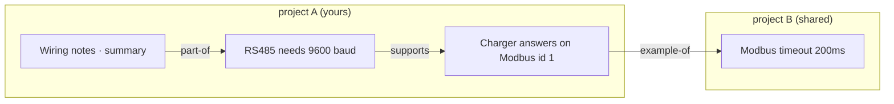
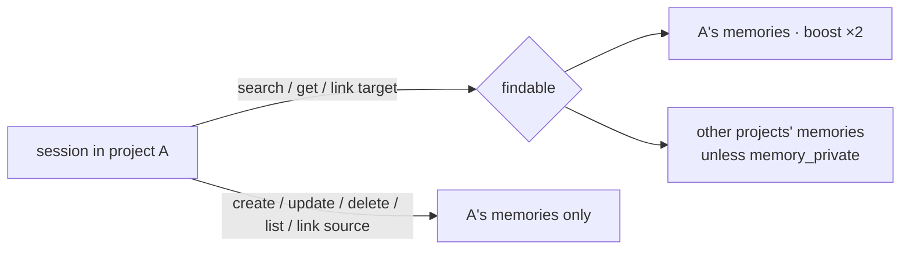
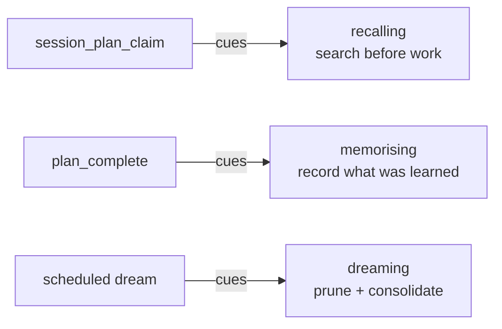

# Memory — a knowledge graph of small facts

Durable memories are meant to be **atoms**: one idea each, whose links add up
to more than the parts. Search finds the atoms; links carry the structure.

## Why atoms

A 1–6 KB memory holds several ideas, so it matches too many searches and
links too vaguely. One idea per memory (soft cap ~300 chars, `ATOM_SOFT_LIMIT`)
makes each link say something precise. The cap is advisory: `memory_create`
returns an `atomHint` rather than refusing.

## Writing grows the graph

`memory_create` returns the new record plus `similar`: the 5 closest memories
the caller can find (any shared project), minus ones already linked. The AI is
told to link each related one with a type. Without this prompt nobody links,
and the graph stays a pile.

## Typed links

`memory_link { fromId, toId, type? }` — `supports`, `contradicts`, `part-of`,
`example-of`, `supersedes`; omitted = plain "related" (every pre-existing
edge). One edge per ordered pair: linking again retypes it. An unknown type
read from disk degrades to plain rather than failing the store.

## Search

`src/session/memory-search.ts` — MiniSearch BM25 over tldr (×2) and content,
any term matching, typo/prefix slack on longer words, stop words dropped
(`search-terms.ts`, shared with the prompt hint scorer). A literal substring
still matches, ranked last, so `deploy` finds `prepareDeploy`. `regex=true`
filters instead of ranking. The index is built per call: a store of tens to
hundreds of memories costs less to index than to keep a synced copy.

`memory_search` and `memory_get` default to `graphDepth: 1`, so a hit arrives
with its direct neighbours.

## Cross-project

- Search covers every project that shares; own-project matches score ×2 and
  each hit carries `projectId` and `foreign`. A foreign memory is another
  repo's knowledge — the AI must judge whether it applies.
- Writing stays fenced (`owns` unchanged). Links may point across projects;
  that is how two similar repos share.
- `project_memory_private { projectId, private }` keeps a project out of
  everyone else's search. Absent = shared. `MemoryManager` without an
  `isProjectShared` policy keeps the old full fence.

## Dreaming

The dream guide now splits essays into linked atoms (candidates carry
`contentChars`), merges only true duplicates (`supersedes`), and links related
memories across projects. See [dreaming.md](dreaming.md).

## Memory skills across the plan lifecycle

Three system skills teach agents to use memory; each is cued by the tool reply
at the moment it matters, so the procedure lives in one place and can change
without touching callers.

- **recalling** (`sys-recall`) — search specific-to-broad, follow links, verify stale facts before acting.
- **memorising** (`sys-memorise`) — search first and update rather than duplicate, one atom per idea with why/how-to-apply, link it.
- **dreaming** (`sys-dream`) — see [dreaming.md](dreaming.md).

A user skill of the same type shadows the system one.
