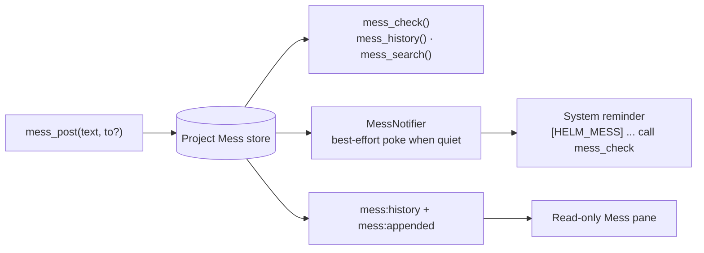
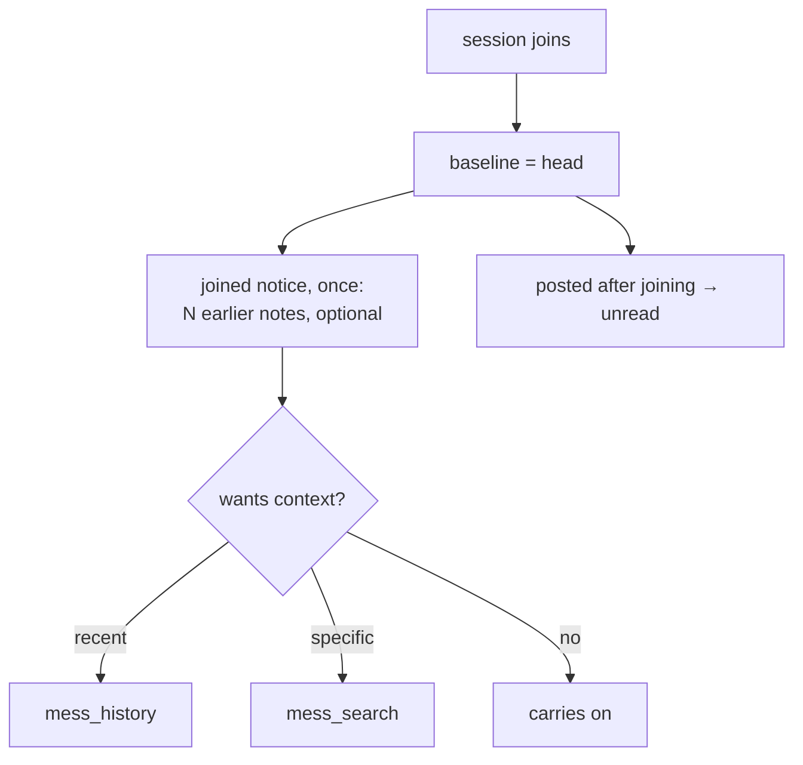

# Mess

Mess is where sessions leave each other little notes — a heads-up, an aside, a
"watch out for X", a question for whoever is around. It is deliberately the
surface for things worth saying but not worth filing: a **memory** holds durable
project knowledge, a **plan** holds tracked work with a lifecycle, and Mess holds
everything in between.

It is Helm's durable, local, project-scoped conversation for coordination
between sessions. It is deliberately separate from `session_send_text`: posting
records intent for later reading, while `session_send_text` delivers an urgent
message into a live PTY.

## Why it exists

`session_send_text` combines posting, delivery, and interruption. That is useful
when a live session must act now, but it is the wrong shape for routine
coordination: the recipient may be offline, busy, or not yet created. Mess stores
bounded messages first, makes them available to future members, and optionally
issues one small best-effort reminder when a session appears idle.

Mess adds durable project history, offline queueing, batching of reminders, and a
human-readable observer pane. It does not replace plans, memories, drafts,
artifacts, Telegram, or session ownership state.

## Choosing the channel

| Situation | Use | Reason |
|---|---|---|
| A live recipient must receive and act on instructions now | `session_send_text` | It writes to the recipient PTY and is designed for urgent directed delivery. |
| Record a coordination note for the project | `mess_post(text)` | A project broadcast is durable and can be read later, including by future sessions. |
| Leave a note for one same-project session | `mess_post(text, to)` | The direct target is validated before the record is stored; it remains queued if the target is offline. |
| Read unread coordination messages | `mess_check()` | Returns an ordered, bounded delta and advances only the caller's cursor. |
| Inspect recent conversation without acknowledging anything | `mess_history(...)` | Cursor-neutral, grouped by date, for agents and the observer pane. |
| Find an earlier note about a specific thing | `mess_search(query, before, after)` | Literal text match across the whole retained log, with surrounding context. |
| Record durable project knowledge worth keeping | a memory | Mess is for passing notes, not for what the project knows. |
| Track work with a lifecycle | a plan | Mess has no states, ownership, or completion. |
| Ask the user to inspect a report or make a decision | Artifact or Telegram | Those are user-facing channels, not project coordination. |

Mess is social coordination only. It has no lock, claim, conflict detection, or
auto-release. A Mess message, unread badge, or idle reminder never implies that
the sender owns a task. Work ownership remains in the plan lifecycle and the
explicit plan-claim flow.

## Data flow



The MCP service is authenticated from Helm's caller context. It never accepts a
caller-supplied sender identity. Project membership is derived from the local
session's stored project identity; a direct target must resolve to a session in
that same project. Fleet proxy sessions are rejected in v1 because they have no
trusted local project membership, and a remote path or project id cannot safely
authorize access to local data.

## Wire contract

The wire uses short, human-oriented fields. `seq` is the ordering key; `t` is
display time only. The empty check response is intentionally tiny.

```json
{"new":0}
```

A populated check may look like:

```json
{"new":2,"hasMore":false,"msgs":[
  {"seq":41,"t":"09:20","from":"planner","to":"all","text":"Rewriting the resize path."},
  {"seq":42,"t":"09:22","from":"memories","to":"me","text":"Does Ctrl+C still map to 0x03?"}
]}
```

`t` is the machine's local clock, matching what the pane shows the human beside
the agent — display metadata only, never an ordering key.

When retention has moved past the caller's cursor, `gap: true` and
`oldestSeq` make the loss explicit instead of presenting a clean empty poll:

```json
{"new":1,"gap":true,"oldestSeq":38,"msgs":[...]}
```

Unread is narrower than visible. A session sees broadcasts, entries addressed to
it, and everything it wrote itself — including its own directed posts, which are
addressed away from the author and would otherwise vanish from the sender's own
transcript on send. But a session never receives its own posts in its delta or
unread count: an author has already read what it wrote, and counting it would
inflate the total the notifier advertises.

`mess_post` omits `to` for a broadcast. A supplied target must be same-project;
cross-project targets fail rather than creating an unreadable record. Text and
responses are bounded by the MCP service, and `mess_check` is bounded by both
entry count and total bytes.

## Ordering, retention, and joining

Each project has a monotonic `seq` counter. Cursors use `lastSeq`, never a
timestamp. Timestamps can collide within a millisecond and can move backwards
when the clock changes; timestamp comparisons would therefore lose or duplicate
messages. `createdAt` is display metadata only.

The append-only JSONL log and cursor metadata are stored under the per-user
Helm app-data directory, keyed by immutable project UUID. Writes are serialized
by the main process. This is a deliberate single-writer assumption: sharing the
same config directory between multiple Helm processes is unsafe until an
interprocess lock exists. Compaction uses a temporary file and rename, and a
malformed final JSONL line is reported without making the whole log unusable.

Retention bounds what exists and is readable. `mess_history` and `mess_search`
read retained entries without changing a cursor. The window is enforced lazily on
the read path — at most once an hour per project — so retention needs no
background timer, and `gap` reporting stays meaningful instead of theoretical.

## Joining

**A new member starts at the head.** Unread means exactly "posted since you
joined"; a new session inherits no backlog at all.

An age window was tried and removed. No timestamp can decide whether an older
message still applies to a session that did not exist yet — 24 hours is not more
correct than 30 minutes, both are guesses about relevance — and every fresh spawn
replayed the same window again, so a workflow that opens and closes sessions all
day re-read the same mail repeatedly. Worse, inheriting old mail as *unread*
misrepresents it: a newcomer would earnestly answer a request made an hour before
it existed.

What predates a session is therefore **disclosed, not pushed**:



The notice is delivered on the first `mess_check` as a `joined` field carrying
the count, the oldest readable sequence, and a note stating that reading is
optional and that earlier requests were not addressed to the newcomer. A joining
session also receives one `[HELM_MESS] joining` line, because with no inherited
backlog nothing else would ever reveal that the project has a history.

`joinNoticeSent` lives on the cursor and is set **only** by `mess_check`. It is
deliberately separate from cursor existence: the notifier creates cursors as a
side effect of polling unread, so tying the notice to cursor creation would let a
poke consume it before the agent ever looked. The notifier pins the baseline at
`session:added`, so mail posted while a session is still starting up is unread
rather than lost behind a later baseline.

## Reading back

Two cursor-neutral pulls cover everything the push path does not:

- `mess_history` returns the last N notes grouped under date labels (`groupBy`
  of `day` or `month`, newest group first, chronological within a group).
- `mess_search` finds notes containing **literal, case-insensitive text**, with
  `before`/`after` context around each match and overlapping windows merged so a
  burst reads as one passage.

`mess_search` is deliberately not a regular-expression search. Callers are AI
agents, so a pattern would be untrusted input (invariant 9) compiled in the main
process, where catastrophic backtracking would freeze the app and every PTY with
it. Literal matching removes that failure class outright rather than guarding
against it.

## Notifications

`IDLE IS NOT READINESS.` StateDetector idle means that PTY output has been quiet
for its configured inactivity window; it does not prove that a CLI is at a
prompt. Pokes are consequently best-effort and may be intrusive. They contain
one line only:

```text
[HELM_MESS] 3 new — call mess_check
```

The notifier checks unread visibility, receptiveness, and whether the PTY is
running. It listens for both activity transitions and new appends, because a
post made while a session is already quiet produces no new transition.

**Receptive means `inactive` or `idle`** — 10 seconds of PTY silence, not 5
minutes. Requiring full `idle` meant a post arriving moments after a session
printed anything waited up to five minutes, and a session that kept working
never heard about it at all. `inactive` is the same best-effort bet made far
sooner.

**Mail that has never been announced is never delayed.** Every append pokes
every receptive session in the project — or only `toSessionId` when the post is
targeted. A session that is busy at post time cannot be woken, so the notifier
records that it is *owed* an announcement and delivers on its next transition
into `inactive`, bypassing the cooldown. Without that debt the message would
inherit the full cooldown window and sit undelivered for up to fifteen minutes
despite nobody having seen it.

The debt is tracked as a flag rather than an unread count, because unread
returning to the same number is not evidence it is the same mail — read one,
receive one, and the count is unchanged while the message is entirely new.

The cooldown therefore guards exactly one thing: re-announcing mail already
delivered. The poke is itself PTY output, which drives the session back through
`active` to `inactive`; without the throttle that bounce would re-poke every few
seconds forever. The guard is the cooldown, never the activity level.

**A CLI type can refuse the poke entirely.** The reminder is prose written into
stdin: for an LLM that is a nudge, for a plain shell it is a stray command. The
`Allow Mess reminders` checkbox on the CLI Type editor (Settings -> Tools) owns
that choice per CLI type, defaults to on, and is stored only when turned off, so
no existing profile changes behaviour. The gate sits on the single path every
poke funnels through, so it covers fresh posts, idle transitions and the
one-time join line alike. It silences only the push — `mess_check` and the
observer pane are pull-side and stay available.

A retry timer rechecks the conditions after cooldown. Cooldown is recorded only
after successful delivery; a failed or unverified write does not acknowledge
anything.

## Observer pane

The `Mess` dock pane is a read-only observer for the active session's project.
It uses the selected session's authoritative project identity, not renderer path
inference. Switching sessions within one project leaves the transcript and
scroll position alone; switching projects reloads the transcript. With no
resolvable active project it shows an empty state.

Rows show time, live-resolved sender and target labels, body text, and a dashed
`all` broadcast marker. Closed sessions retain their stored label snapshot and
are marked as closed. A directed message the target's cursor has not passed
shows `not picked up`; the main process derives that from the stored cursor, so
the renderer never infers delivery from session activity. The badge is a
visibility hint, never an ownership or lock indicator. Filters cover sender, broadcast, and unread state.
The pane follows new entries unless the user has scrolled up, and `Older` reads
cursor-neutral history. There is no composer and human reads never advance an
agent cursor.

## Lifecycle and limits

Default project settings are 30 days of retention and a 15-minute poke cooldown
(mail that has never been announced ignores it). Project rename and path changes are safe
because records and filenames use the project UUID. Project deletion purges its
Mess data. Cursor lifetime follows session identity: recoverable close preserves
it, while ephemeral close, forget, and expiry remove it.

Fleet participation is deliberately excluded from v1. Remote peers do not have
trusted local project membership, and peer allow-lists are not project
authorization. Adding fleet Mess later requires an explicit host-project
targeting protocol rather than guessing from a proxy identity.

## Boundaries

| Boundary | Responsibility |
|---|---|
| `MessManager` | Project membership, ordered cursors, visibility, and domain events. |
| `MessPersistence` | Per-project JSONL entries plus atomic cursor/metadata persistence. |
| `HelmMessService` | Authenticated MCP validation and compact wire shapes. |
| `MessNotifier` | Best-effort quiet-session reminders; per-post fan-out plus transition-driven catch-up, cooldown, and retry policy. |
| `mess-handlers` | Cursor-neutral renderer history and project-scoped append push. |
| `useMessPane` / `MessPane.vue` | Reactive observer projection and read-only UI. |

The canonical agent-facing tool guidance is also kept in
`src/mcp/guides/mess-guide.ts`. The preload surface is the typed `mess` domain;
renderer code does not reach the legacy broad IPC facade.
