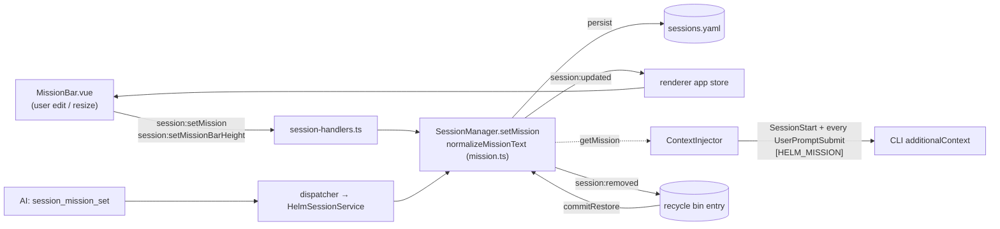

# Session Mission Statement

A TL;DR pinned at the top of each session's terminal saying what that session
is **meant to be doing**. The user edits it in the UI; the AI edits it through
MCP; the UserPromptSubmit hook reminds the AI of it on every prompt.

## Why

With several AI sessions running, the session name says *who* and the activity
dot says *whether*, but nothing says *what for*. A mission that both sides keep
current answers that at a glance, and re-stating it to the AI on each prompt
keeps drift visible: the AI is asked every turn whether the prompt changed the
direction of work, and updates the TL;DR when it did.

## Model

`SessionInfo.mission?: { text; setBy: 'user' | 'ai'; setAt }` — current value
only, no history — plus `SessionInfo.missionBarHeight?: number` (px) for the
resizable bar. Both are on the `serializeSession` allow-list (invariant 6) and
are captured in the recycle-bin entry, so they survive a restart and a
recycle-bin restore (re-applied verbatim, keeping `setBy`/`setAt`, when the
restore commits).

## Data flow

## The 500-character limit

One validator, `src/session/mission.ts` (`normalizeMissionText`), serves the MCP
and IPC paths. Text is trimmed; an empty result **clears** the mission; more
than 500 characters is **rejected** with an error before any mutation, so the
existing mission is left unchanged. The UI mirrors this with `maxlength=500`
and a live `n/500` counter. The limit keeps the bar a TL;DR and bounds what the
hook injects on every prompt.

## Hook behaviour

In `src/session/hooks/context-injector.ts` (dep `getMission`):

- **UserPromptSubmit** — on EVERY prompt (claude/codex; Copilot drops this
  event's output), after any envelope rules and before the suggester pointer
  and nudges, so the payload cap (which drops trailing parts first) never cuts it:
  - with a mission: `[HELM_MISSION] Current mission: "<text>". If this prompt changes the direction of work, call session_mission_set with a new TL;DR (max 500 chars). Otherwise ignore.`
  - without: `[HELM_MISSION] No mission set. Call session_mission_set with a one-line TL;DR of what this session is doing.`

  This is the deliberate exception to the injector's "silent when nothing to
  say" rule.
- **SessionStart** — the current mission rides with the plan, drafts and
  handover note.

It is **not** a G9 `ReminderId`: those reminders have a hook *and* a prepend
path and a per-reminder mode. The mission is hook-only — a per-prompt prepend
would pollute every message — so a mode selector would offer a `pty` option
that does nothing.

## UI

`renderer/components/dock/MissionBar.vue`, mounted at the top of the terminal
pane (`dock/TerminalPane.vue`) and of the snapped-out terminal
(`dock/PopOutTerminalPane.vue`), always visible for the active session.

- Label `◎ Mission`, the text, and a muted meta line `by AI/user · <relative time>`.
- Text is plain: rendered by interpolation, never `v-html` (invariant 9 — AI
  text is untrusted).
- Click the text or ✎ to edit: Enter saves, Shift+Enter inserts a newline,
  Esc cancels. A rejected save keeps the editor open with the reason.
- The editor is a plain `<textarea>` outside `.xterm`, so the keyboard router
  classes it as an editable field and the terminal relay never sees the keys
  (see [keyboard-routing.md](keyboard-routing.md)).
- Drag the bottom edge to resize: clamped to 28px…min(240px, 40% of the pane)
  (`renderer/terminal/mission-bar-size.ts`), saved once per drag; main clamps
  again to 28–240.
- No gamepad binding.

## MCP

`session_mission_set { sessionId?, text }` — `sessionId` defaults to the
caller's own session (server-derived auth context); `setBy` is always `ai`.
`session_get` returns `mission`; `session_info` returns `your_mission` (null
when unset). Remote peers and phones follow their allow-lists exactly like
`session_rename` — the tool is not hard-denied and is off unless allowed.
