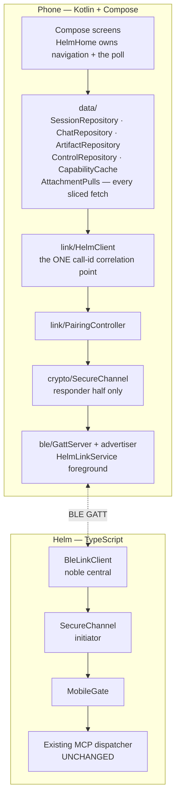
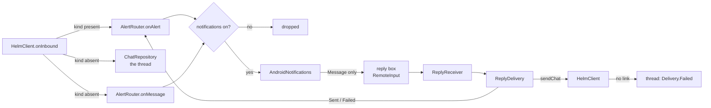
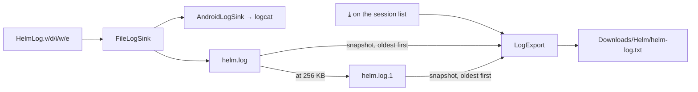
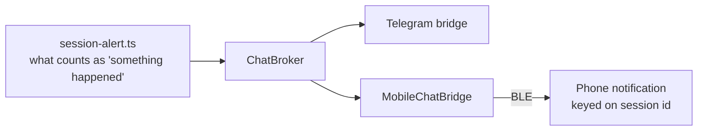

# The Helm mobile app

An Android companion that pairs with Helm over Bluetooth LE and gives full
session control away from the desk. It is a second client, not a viewer: it
lists sessions, carries the chat, spawns and closes work, takes dictation and
buzzes when something needs you.

This document is the orientation — what the app is, how its pieces fit, and
**why** each load-bearing decision went the way it did. It deliberately does
not restate what already has a home:

| For | Read |
|-----|------|
| Build, design system, voice, control surface, notifications, versioning | [`../android/README.md`](../android/README.md) |
| GATT roles, characteristics, chunk framing, link ownership | [mobile-ble-transport.md](mobile-ble-transport.md) |
| Handshake, AEAD, protocol version negotiation **and the version history table** | [mobile-secure-channel.md](mobile-secure-channel.md) |
| SAS confirmation, the device registry, revocation | [mobile-pairing.md](mobile-pairing.md) |
| The call boundary — proxy identity, allow-list, audit | [mobile-gate.md](mobile-gate.md) |
| ChatBroker fan-out and the wire records | [chat-fan-out.md](chat-fan-out.md) |
| How the phone gets the APK | [apk-distribution.md](apk-distribution.md) |

## Shape



Two rules hold that picture together:

- **`HelmClient` is the only place a call id is correlated to its reply**, and
  the only place an alert is split from a message. Nothing else may open a
  second path to `HelmPairing.send`; a second path is how two views of the same
  conversation start to disagree.
- **`MobileGate` is the only way into Helm's tools.** A phone's chat reply is
  itself a gated `session_send_text` call, and dictation sends down that same
  path — there is no voice channel and no chat channel, only calls. That is what
  makes "no path skips the gate" true by construction rather than by discipline.

## The screens

A handful of screens plus one sheet, in a hand-rolled `when` over a
`rememberSaveable` route (plus a saveable tab). There is still no navigation
library: the graph is small enough that one would be more machinery than it
removes.

- **Pairing** — the 6-digit SAS shown next to the same digits on the desktop.
  Confirming on both ends is what turns a radio link into a trusted device.
- **Session list** — the live sessions, each with an activity dot. The dot reads
  **activity**, never pipeline state, mirroring desktop invariant 8. Its app bar
  carries the two controls that belong to the app rather than to a session: the
  notification bell and the log export. Tapping the **link badge** opens Desktops
  — the badge is already what you look at to ask "what am I connected to", so the
  longer answer costs no extra chrome on a full bar.
- **Desktops** — every desktop this phone holds a key for, the live one first.
  Pairing more than one has always worked (keys are stored per `machineId`); until
  this screen existed, nothing said so, a second pairing was invisible, and a key
  could not be revoked from the phone. Each row can be renamed or forgotten.
  **One at a time is reported here, never enforced here**: the phone advertises
  and the desktop connects, so the radio itself refuses a second central
  (`BleLinkSession.onCentralConnected`) and advertising stops once linked.
- **Session tabs** — an open session shows two tabs under one app bar: **Chat**
  and **Artifacts**. They are places, not actions, which is why they are tabs and
  not sheet rows; the bar (title, link badge, ⋮) is owned by the scaffold, so
  switching tabs swaps only the body. A freshly opened session starts on Chat.
- **Chat** (tab) — one session's thread. Sending marks `Sending` → `Sent`/`Failed`.
  Bubbles cap at three quarters of the width, and the URLs in them are tappable
  (see **Links** below). The composer's mic is **push-to-talk**: hold it and the
  recogniser's partials land in the draft at the caret, each guess replacing the
  last. A pause does not end the dictation — the platform may close the
  utterance on its own silence threshold, but while the mic is held the
  controller reopens it and the segments join, so what is dictated can be edited and re-read before the send tap that is
  still the user's. The action buttons stand in a vertical stack along the right
  edge at every draft size — they never reorganise under the thumb when the text
  wraps — and the field's minimum height matches that stack, so the composer
  reads as one solid block. A half-typed draft is
  **phone-local and per-session** (`PrefsDraftStore`):
  every edit persists, so leaving the thread — or killing the app — and coming
  back finds the words and the caret where they were left, while a draft never
  follows the user into another session's thread. Sending or backspacing to empty
  clears it.
- **Attachments** — a message carrying a file shows a tile with its name and
  size, and **nothing is fetched until it is tapped**: the bytes cross the same
  radio as the conversation, and a thread of photos fetching themselves would
  hold it for minutes. A tap pages the file down in slices sized to whichever
  transport owns the link (`session_artifact_download` with `offset`/`length`),
  showing progress and
  offering a stop; a stumble retries and **resumes** from what arrived. Up to
  four asks ride at once, because a round trip costs far more than the bytes do;
  answers may therefore arrive out of order and are held until the gap ahead of
  them closes. A duplicate, or an answer to an abandoned attempt, is dropped.
  That loop is not chat's own — it lives in `data/AttachmentPulls.kt`, shared
  with the artifact screen's attachment rows (below), because a second copy of
  these rules is a second chance to get them wrong. The
  file lands in **`Downloads/Helm`**, an image draws itself in the tile (decoded off the
  main thread and downsampled — a 12MP photo decoded whole is ~48MB of bitmap),
  and **Open** hands it to whatever app the phone uses for that type. Deleting it
  from the tile deletes Helm's copy too. See
  [chat-fan-out.md](chat-fan-out.md) for why the file is an artifact attachment
  rather than bytes on the wire.
- **The session list poll runs only while the list is on screen.** It used to run
  behind every screen, which put a `session_list` call between every slice of a
  transfer — two round trips per slice, on a link where the round trip is most of
  the cost. The trade is that an open session's row data stops refreshing while
  the user is inside it; alerts and chat still arrive as pushes.
- **Artifacts** (tab) — the session's artifact list, re-pulled on every arrival.
  Opening a row pushes the artifact **detail**, which hangs off the tab and
  carries its own bar.
- **Voice** — on-device speech, dictated straight into the chat composer rather
  than a screen of its own: leaving the conversation to speak meant coming back
  with a message already sent. **No audio ever crosses the link**, and the
  manifest carries no `INTERNET` permission, so the app is structurally incapable
  of uploading any.
- **Links** — a URL in agent-written text (chat, a context body, plan prose, an
  artifact) is tappable and opens in the system resolver. `LinkRules` is the one
  allow-list — `http`/`https` only — so a `javascript:`, `intent:`, `file:` or
  `data:` target renders as plain, unstyled text and is never handed on. That is
  invariant 9 on the phone: the content may offer an address, never an action.
- **Copy references** — the ⧉ button copies a reference that names its own kind:
  `[helm plan P-0007]`, `[helm context ctx-9]`, `[helm artifact art-123]`. A bare
  id pasted into a session says nothing about which tool should resolve it.
- **Snapshot** — recent terminal output for a session, read on request.
- **Spawn** — start a new session. The CLI choices come from `tool_list` (the
  desktop's full configured catalogue, with each type's display name), fetched
  when the screen opens. When that fetch fails or comes back empty — an older
  desktop, a refused call — the form falls back to harvesting the distinct CLI
  types out of `session_list`, so it can only offer a kind of session already
  running. The name is optional: a blank name is omitted from the wire and the
  desktop names the session after the CLI type. The submit button — and the
  session list's New session button — grey while a spawn is **in flight**
  (`ControlRepository.spawnInFlight`): two taps are two sessions, and the flag
  settles on every outcome, refusal and dead link included, so it never greys
  forever.
- **Session sheet** — the per-session actions. Forbidden ones are greyed with
  "not permitted", read from the reserved `__mobile_tools__` meta-method and
  never a hardcoded list. Actions that are *reachable but meaningless* to a
  phone are **absent rather than greyed** — greying would claim you lack
  permission, when the truth is there is nothing there to call. How an action
  ended is said once in the notice bar under the app bar: tap to dismiss, or
  it dismisses itself after 30 seconds, because a stale outcome left standing
  starts describing an action the user has already moved past.

### Back, and what it costs

Every screen above owns a `BackHandler` for its own in-app step. At the **true
root** — the session list with nothing open over it — back asks instead of
acting, offering *leave it running* or *quit*.

This is not a way to enable background running; background running is already
the status quo. The foreground service keeps the BLE link and the notifications
alive while the app is backgrounded, so **quitting is the destructive option**
and a stray back used to take it silently. Backgrounding uses
`moveTaskToBack(true)`, never `finish()`, so the task stays in Recents where the
user left it.

The root handler is **gated on being at the root**, not merely composed last: it
composes after the nested handlers, and Android's dispatcher gives back to the
most recently added *enabled* callback — ungated it would swallow every in-app
back and offer to quit from halfway down the app.

The visual design lives as an attachment on the screen plans (P-0740 and
siblings) and deliberately has no copy in this repo — one source of truth,
nothing to drift. Where the mockup and a plan's prose disagree about an
interaction, the mockup wins.

## Artifacts — reading, writing, downloading

The desktop's `artifact_*` tools are unreachable from a phone: they address the
caller's own session, and the phone's identity is a proxy that owns nothing (see
[mobile-gate.md](mobile-gate.md)). Rather than loosen that boundary, artifacts
got a **session-addressed** family that takes the session as an argument:

| Tool | Does |
|------|------|
| `session_artifact_list` | id/title/kind/versionCount/timestamps for one session |
| `session_artifact_get` | metadata plus ONE version's content — the latest, or the version asked for |
| `session_artifact_create` | mint a new artifact — **markdown only in v1** |
| `session_artifact_update` | append a version to an artifact that session owns |
| `session_artifact_download` | `{ filename, mimeType, base64 }` for saving as a file |
| `session_artifact_delete` | delete one artifact — the only delete; the desktop-only `artifact_delete`/`artifact_delete_all` were removed, and there is **no bulk variant** (artifact-viewer.md) |

Two deliberate edges: **create is markdown-only** because HTML authored from a
phone keyboard is a sanitization question (invariant 9) nobody has answered, and
**reads and downloads are budgeted to the wire frame**, each on the form that
actually ships. A download body is base64 (3 bytes to 4 chars, ~94KB decoded at
the cap); an inline read body is a plain JSON string, so **JSON escaping counts
against the frame** — a quote doubles, a control character costs 6 bytes — and
the authority is the measured escaped length (JSON-inert content may run larger
than the download cap; escape-heavy content is refused sooner). Each cap once
let its boundary-size body ride past the 128KiB ceiling and tear the link
instead of refusing. Over budget, both refuse and point at the desktop viewer. A
cross-session artifact id answers not-found like a genuinely missing one, so
nothing leaks about which artifacts exist elsewhere.

On the phone these are rows on the artifacts screens, not sheet entries: a New
row under the list, and Revise / Save to phone / Delete under the open artifact.
Each greys from `__mobile_tools__` against its own tool — the sheet's greying
rules, drawn where the thing acted on is visible — and Delete is the one action
that confirms, naming the artifact. There is deliberately **no bulk delete**:
`session_artifact_delete` is the only delete on the wire and the phone offers
nothing bigger. A create mints markdown only (the wire kind is `md`); a revise
inherits the artifact's kind and an HTML body is edited as source even though the
viewer now renders it (below). A save lands in **`Downloads/Helm`** through
`MediaStore.Downloads` on API 29+ — user-visible, and no storage permission —
falling back to the app's own Download folder (no subfolder) below 29; the
notice waits until the file is actually on
disk, because "saved" before that would be a lie. An authored body is measured
against the same 128KiB frame the desktop caps its answers with
(`data/ArtifactRules.kt` mirrors `ARTIFACT_INLINE_MAX_ESCAPED_BYTES`), so a body
that would not fit is refused at the submit button instead of tearing the link.
The screens re-pull on every visit, so a write needs no refresh of its own —
returning from one reconciles the list for free.

**The editor can attach files, on a create and on a revise alike.** Both halves
enter the same staged-file chain (`HelmClient.beginArtifactUploads`) once the
artifact is known to exist — the new id for a create, the id already being
edited for a revise. Revise previously had no attachment path at all, so staged
files were dropped on submit, which is indistinguishable to a user from an
upload that failed silently. The editor stays open until the last file has
crossed, because a notice that closed it would strand a half-sent file with
nowhere to report itself.

**A revise can also delete and replace existing attachments** (read from the
list cache, like the detail screen). Delete confirms first, then calls
`HelmClient.deleteArtifactAttachment`, the one `session_artifact_attachment_delete`
path that chat tiles use too. On Ok the cached row is pruned at once; on failure
the row stays and shows the reason. Replace uploads and commits the new file
through the staged chain first, and deletes the old one only after that commit
returns Ok. So if the upload fails, the original stays, next to a chip you can
retry. A replace never navigates away from the editor.

**An artifact's attachments are rows, and a tap pulls one down in slices.** This
is the same transfer a chat attachment makes, on the same shared driver. It has
to be: the desktop ALWAYS slices an attachment and defaults `length` to one
slice budget, so a single ask with no offset answers the first slice and nothing
more — and this screen used to save that answer as the whole file, which is how
a multi-megabyte image arrived truncated and opened corrupt. An artifact BODY
download stays single-shot; it has its own inline cap and is answered whole.
Progress, the saved location and any failure are drawn **on the row itself**
rather than in the single notice line under the action rows, because several
rows can be pulling at once and one line cannot say so. A finished row becomes
an open button instead of re-fetching what is already on the phone.

**Everything the phone saves goes to `Downloads/Helm`** (`save/DownloadFolder.kt`)
— artifact bodies, pulled attachments, log exports. Two reasons, and the second
is the load-bearing one. For the user, Helm's files were unfindable loose among
a browser's downloads. For the code, de-collision was guesswork: under scoped
storage a query of `MediaStore.Downloads` returns only what *this app*
contributed, so a name the browser had already taken was invisible and the save
collided anyway. A folder only Helm writes into makes that query the truth, so
the names chosen are the names that exist. The suffix goes before the
extension (`photo (1).jpg`), because MediaStore's own de-duplication appends
after the whole display name — `photo.jpg (1)`, which no viewer, installer or
share sheet reads as a jpg. Below API 29 nothing changes: the app's own external
Download folder, no `Helm` subfolder.

**How artifacts render.** Markdown gets the phone's deliberate subset
(`ui/artifacts/MarkdownRules.kt`), and ` ```mermaid ` fences render as diagrams
rather than code: each becomes a `MdBlock.Diagram` drawn in a small WebView
running the mermaid bundle **shipped inside the APK** (`assets/mermaid/`), never
fetched from a network. HTML artifacts render in that same WebView, with
"view source" one tap away. Containment is invariant 9 again, the mobile answer
to the desktop's opaque-origin iframe: the CSP the desktop sends as a response
header rides INSIDE the document (`ui/artifacts/HtmlContainment.kt` —
`default-src 'none'`, inline script/style, `data:` images, `form-action 'none'`,
`base-uri 'none'`), the load uses a null base URL so the page runs on an opaque
origin, file/content access and every network load are switched off, and all
navigation is refused by the client. There is deliberately **no JS bridge**: the
one thing a contained page can ask for is a diagram-height report via a
`helm-diagram://height/<px>` navigation the WebView intercepts and swallows,
which is how a diagram sizes itself in the list. One WebView per fence, each
destroyed on dispose; the accepted cost of that simplicity is that every
diagram shell embeds its own copy of the ~3.5MB mermaid bundle — fine at the
one-or-two diagrams an artifact actually has, and pooling is the fix if that
ever stops being true.

Artifacts also **push**. `MobileArtifactNotifier` (sibling of the state-alert
notifier) listens to the ArtifactManager and emits a chat record with the
additive `kind: 'artifact'` plus `artifactId`/`title`, so a report an agent just
wrote buzzes the pocketed phone over the same link, with the same fire-and-forget
rules and no retry — a notice is only true while it happens. The phone keys its
row on the artifact id, so revisions replace rather than pile up. Re-opening an
artifact you have already read does not buzz; only a change does. The new keys
and the `'artifact'` kind are additive and omitted when absent, so the committed
envelope vectors still match byte for byte.

## Notifications — messages, a reply box, and one switch

Until now the phone buzzed for **events** (a session needs you, finished, went
quiet, wrote an artifact) and stayed silent for the one record type the user can
actually answer: something an agent said. A plain chat record went to the thread
and nowhere else, so between glances the phone looked dead.



The outcome goes back through `AlertRouter` — `replySent` / `replyFailed` —
rather than straight to the port, so the router's record of what is on the shade
stays true. A row taken down behind its back would leave it spending a cancel on
a row that had already gone.

A message goes to **both** surfaces — the thread is where it lives, the
notification is how you learn it arrived while you were elsewhere. That is the
same shape as the ratified Telegram/app duplication: one message, told once on
each surface.

Four decisions worth keeping:

- **Only a `Message` carries a reply box.** The other kinds report that something
  happened; a reply box on "a session went idle" invites the user to talk to an
  event. `AlertKind.Message` has no wire value the desktop sends — it is what a
  record with *no* kind means — and `fromWire` still falls back to `Attention`,
  so a future desktop event can never arrive wearing a reply box.
- **A reply that cannot be sent says so, and is not lost.** `sendChat` already
  writes the message into the thread before it calls and settles it as
  `Delivery.Failed` when the link refuses it. So there is no queue here: the
  reply is already recorded where the user will look. What was missing is that
  the user is looking at a *notification*, not the thread — so the row rewrites
  itself to "not sent", keeping its box for a retry.
- **The receiver can reach the link because the process is the link.**
  `HelmPairing` is process-scoped, so a `BroadcastReceiver` talks to the same
  client the UI does. And if there is a notification to reply to, a message
  crossed BLE, which means the foreground service was up. A process killed since
  then takes the link with it — which is the failure path above, and it is tested.
- **One master switch, not one per kind.** Android already gives per-channel
  control in system settings, which is exactly why the channels exist. What the
  OS does not give is a switch one tap from the screen you are already on. It
  lives beside the link badge as a bell, and turning it off **takes down the rows
  already showing** — rows left standing after you silenced them are
  indistinguishable from the setting not working.

Tap-to-open and swipe-to-dismiss were already there: `PendingOpen` parks a tap
until a screen can honour it (surviving a cold start), and `setAutoCancel` makes
the row disappear when it is used.

The setting is a one-byte file under the app's own storage rather than
`SharedPreferences`, so the thing that ships is the thing the tests exercise —
`SharedPreferences` is an unmocked stub on the JVM, and persistence is the whole
point of a toggle. Unreadable or unwritable resolves to **on**: the failure that
cannot be noticed is the silent one.

> The reply text is a **payload**. `ReplyReceiver` logs the session and the
> outcome, never what was typed — [`HelmLog`'s one rule](../android/app/src/main/kotlin/com/potatomotato/helm/log/HelmLog.kt),
> enforced by `NoPayloadInLogsTest`.

## Logs — always on, exportable without a cable

The phone logs to disk in every build, and the session list carries a `⤓` next
to the link badge that writes those logs to `Downloads/Helm/helm-log.txt`.

This exists because of how the BLE chunk defect was diagnosed: the only run that
mattered happened offsite, where nobody could attach `adb`, and logcat is a ring
the system recycles within minutes. By the time a user can report something, the
evidence is gone.



Four decisions worth keeping:

- **`FileLogSink` wraps the logcat sink rather than replacing it.** A developer
  with the phone on a cable keeps the stream they already use; the file is an
  addition.
- **Two files, rotated, not one truncated.** The moment the log matters is the
  moment it just got big. Truncating at the cap throws away exactly the history
  that explains what happened. Disk stays bounded at ~512 KB.
- **`debugEnabled` is on in release.** At INFO the chunk defect was invisible —
  the sender logged every chunk as complete. A log that cannot show what went
  over the radio is not worth its storage.
- **The export never touches the link.** The report it serves is "it says Linked
  but nothing arrives", so an export that needed the desktop would be broken in
  precisely the case it exists for.

The filename is fixed, so each export replaces the last one: a Downloads folder
full of `helm-log(4).txt` makes it impossible to say which file is the run under
discussion. [`HelmLog`'s one rule](../android/app/src/main/kotlin/com/potatomotato/helm/log/HelmLog.kt)
matters more now that the file is something a user can mail onward — never log a
secret or a payload, enforced by `NoPayloadInLogsTest` scanning every call site.

## Why it is built this way

**Why BLE, and not LAN or a cloud relay.** Battery over range, and it works
where a corporate network does not — no VPN, no shared subnet, no account. A
session finishing on the desk buzzes a phone in your pocket with no cloud, no
APNs and no Firebase in the path. The cost is stated honestly under
*Limitations*: the range genuinely does not cross an office.

**Why the phone is the peripheral and Helm the central.** This is inverted from
the original design. `@stoprocent/bleno` cannot serve a GATT server on Windows —
it routes `win32` to a USB/HCI binding needing a Zadig/WinUSB driver swap, which
removes the adapter from Windows Bluetooth settings entirely. That is
unacceptable on a user's daily machine, so bleno is banned. `@stoprocent/noble`
uses the real WinRT bindings and works with no driver change, so Helm takes the
central role and the phone advertises. The consequence is that **the phone
cannot initiate**: recovery is always Helm rescanning, with backoff.

**Why app-layer crypto rather than BLE pairing.** BLE's own Just Works pairing
offers no MITM protection, and terminal control is not something to hand to a
transport's weakest mode. But the deeper reason is that trust must **outlive the
transport**: `SecureChannel` rides an abstract `BytePipe`, and a LAN socket is
just another pipe. When the LAN transport lands the security model does not
change at all — and **pairing stays over BLE regardless**, because physical
proximity is what makes comparing six digits mean anything.

**Why Kotlin and Compose, not React Native or Flutter.** There is no iOS target
and there will not be one. With nothing to share, cross-platform tooling is pure
overhead: a second toolchain, a bridge, and a layer between the app and the
Bluetooth and speech APIs it exists to use.

**Why Helm does not host the APK.** The repo is public, so a GitHub release
asset is a plain HTTPS URL a phone can fetch with no server, no token and no
TTL on this side. Downloading it grants nothing — a fresh install is an unpaired
stranger until SAS pairing completes. The URL always addresses the **running**
Helm's tag, never `latest`, because a `latest` URL renders identically and hands
over an APK from a different release, which version negotiation then refuses:
a support problem that looks like a broken radio.

**Why both sides were written without ever meeting — and survived.** The Kotlin
and TypeScript halves had to agree byte for byte on framing, handshake and the
application envelope, and a mismatch does not fail loudly; it fails as "pairing
just never works". So whichever side was built second was tested against
committed fixture vectors rather than by inspection, read in place from
`tests/fixtures/`. All three layers matched on the first run. **Regenerating any
vector is a wire break**, and a breaking wire change increments `PROTOCOL_MAX`
and adds a row to the version history table in
[mobile-secure-channel.md](mobile-secure-channel.md) in the same commit.

**Why notifications fan out to Telegram and the phone unconditionally.**
Duplicate buzzes are accepted. Telegram is the only path that survives being out
of BLE range, so suppressing it whenever the phone is linked would make "was I
told?" depend on link state — the one property a notification must not have.



The **definition** of a worthwhile transition is stated once in
`session-alert.ts` and read by both surfaces; only the per-transport toggles
differ. The phone does no deduplication, deliberately: its notification id is
keyed on the session, so ten alerts from one session replace into one row, which
is a better mechanism than a suppression window.

> Note: Telegram's own state-change notifications have **never fired** —
> `TelegramNotifier.handleStateChange` has no production caller. The live signal
> is `session:updated`, which the mobile notifier consumes. Anyone reviving
> Telegram's path should feed it the same source, not a second one.

## Limitations — stated plainly

These are real and current. None of them is a to-do in disguise; each was a
decision or a known gap at the time of writing.

- **Nothing in this app has ever been driven against a real radio.** Both sides
  were built to committed vectors and to unit tests over fakes. The first live
  pairing, the notification look, lock-screen truncation, the cold-start deep
  link and voice quality are all still unjudged.
- **The reply box has never been typed into on a phone.** Everything it decides
  is unit-tested through `ReplyDelivery`, but `RemoteInput` extraction, the
  heads-up presentation and the "not sent" rewrite are framework behaviour, and
  the Android suite is JVM-only — there are no instrumentation tests. The one
  path most worth watching is a reply sent while the link is down: it should
  rewrite the row rather than vanish.
- **Four of the six screens have never been photographed.** They are gated
  behind an open session and need a live desktop link. The window-inset fix is
  owned at the theme root and a test fails the build if any screen tries to own
  insets itself, but nobody has *seen* those four.
- **"Waiting for Helm" on the phone is EXPECTED** until the desktop BLE side is
  running. It is not a fault, and it has already cost debugging time.
- **No release has been cut end-to-end with the APK pipeline.** The refuse-to-
  publish gates were exercised directly against real artifacts — a release APK
  accepted, a debug-signed one refused — which is good evidence and is not the
  same thing as one full run.
- **R8 is off.** Roughly 4 MB of the ~9.1 MB APK is Bouncy Castle, which supplies
  X25519 where the platform does not. Shrinking needs keep rules and must be
  retested on hardware, because a stripped crypto class fails as "pairing just
  never works". Deferred on purpose rather than left unnoticed.
- **BLE range does not cross an office.** A meeting room on the far side is out
  of reach; Telegram is the fallback and that is why the fan-out is
  unconditional.
- **The accent green sits close to the active-state green.** `#ccff00` next to
  the mint activity dot was a deliberate call, made with the similarity known.
  It is not a bug to fix.
- **Revocation is a soft gap.** A revoked phone still offers its stored PSK and
  dies on the confirm-MAC rather than being told it was revoked. Recovery is the
  user tapping forget on the phone.
- **Phone-side chat history is in-memory only**, capped at 200 entries. Nobody
  has asked for durability yet.
- **Peripheral-role support is a per-adapter fact.** The desktop adapter was
  measured as `Central=True Peripheral=True`, but it is a generic USB dongle —
  **re-check if Helm moves machines.** (Helm only needs the central role, so this
  matters less than it did before the role flip, but the measurement was taken
  on one dongle and should not be assumed universal.)
- **A mistyped call argument is ignored, not rejected.** The dispatcher drops it
  silently, so a wrong type reads as a setting that had no effect.
