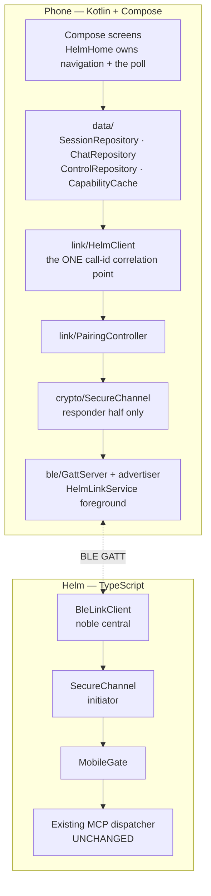
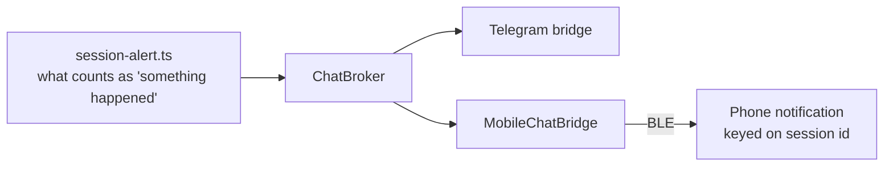

# The Helm mobile app

An Android companion that pairs with Helm over Bluetooth LE and gives full
session control away from the desk. It is a second client, not a viewer: it
lists sessions, carries the chat, spawns and closes work, takes dictation and
buzzes when something needs you.

This document is the orientation — what the app is, how its pieces fit, and
**why** each load-bearing decision went the way it did. It deliberately does
not restate what already has a home:

| For | Read |
|-----|------|
| Build, design system, voice, control surface, notifications, versioning | [`../android/README.md`](../android/README.md) |
| GATT roles, characteristics, chunk framing, link ownership | [mobile-ble-transport.md](mobile-ble-transport.md) |
| Handshake, AEAD, protocol version negotiation **and the version history table** | [mobile-secure-channel.md](mobile-secure-channel.md) |
| SAS confirmation, the device registry, revocation | [mobile-pairing.md](mobile-pairing.md) |
| The call boundary — proxy identity, allow-list, audit | [mobile-gate.md](mobile-gate.md) |
| ChatBroker fan-out and the wire records | [chat-fan-out.md](chat-fan-out.md) |
| How the phone gets the APK | [apk-distribution.md](apk-distribution.md) |

## Shape

Two rules hold that picture together:

- **`HelmClient` is the only place a call id is correlated to its reply**, and
  the only place an alert is split from a message. Nothing else may open a
  second path to `HelmPairing.send`; a second path is how two views of the same
  conversation start to disagree.
- **`MobileGate` is the only way into Helm's tools.** A phone's chat reply is
  itself a gated `session_send_text` call, and dictation sends down that same
  path — there is no voice channel and no chat channel, only calls. That is what
  makes "no path skips the gate" true by construction rather than by discipline.

## The screens

Six screens plus one sheet, in a hand-rolled `when` over a `rememberSaveable`
route. There is still no navigation library: the graph is small enough that one
would be more machinery than it removes.

- **Pairing** — the 6-digit SAS shown next to the same digits on the desktop.
  Confirming on both ends is what turns a radio link into a trusted device.
- **Session list** — the live sessions, each with an activity dot. The dot reads
  **activity**, never pipeline state, mirroring desktop invariant 8.
- **Chat** — one session's thread. Sending marks `Sending` → `Sent`/`Failed`.
- **Voice** — on-device speech to an editable transcript, then one confirmation
  tap that sends into that session's thread. **No audio ever crosses the link**,
  and the manifest carries no `INTERNET` permission, so the app is structurally
  incapable of uploading any.
- **Snapshot** — recent terminal output for a session, read on request.
- **Spawn** — start a new session. It can only offer a **kind** of session it can
  already see, because nothing phone-callable enumerates CLI types; it harvests
  the distinct ones out of `session_list`.
- **Session sheet** — the per-session actions. Forbidden ones are greyed with
  "not permitted", read from the reserved `__mobile_tools__` meta-method and
  never a hardcoded list. Actions that are *reachable but meaningless* to a
  phone are **absent rather than greyed** — greying would claim you lack
  permission, when the truth is there is nothing there to call.

The visual design lives as an attachment on the screen plans (P-0740 and
siblings) and deliberately has no copy in this repo — one source of truth,
nothing to drift. Where the mockup and a plan's prose disagree about an
interaction, the mockup wins.

## Why it is built this way

**Why BLE, and not LAN or a cloud relay.** Battery over range, and it works
where a corporate network does not — no VPN, no shared subnet, no account. A
session finishing on the desk buzzes a phone in your pocket with no cloud, no
APNs and no Firebase in the path. The cost is stated honestly under
*Limitations*: the range genuinely does not cross an office.

**Why the phone is the peripheral and Helm the central.** This is inverted from
the original design. `@stoprocent/bleno` cannot serve a GATT server on Windows —
it routes `win32` to a USB/HCI binding needing a Zadig/WinUSB driver swap, which
removes the adapter from Windows Bluetooth settings entirely. That is
unacceptable on a user's daily machine, so bleno is banned. `@stoprocent/noble`
uses the real WinRT bindings and works with no driver change, so Helm takes the
central role and the phone advertises. The consequence is that **the phone
cannot initiate**: recovery is always Helm rescanning, with backoff.

**Why app-layer crypto rather than BLE pairing.** BLE's own Just Works pairing
offers no MITM protection, and terminal control is not something to hand to a
transport's weakest mode. But the deeper reason is that trust must **outlive the
transport**: `SecureChannel` rides an abstract `BytePipe`, and a LAN socket is
just another pipe. When the LAN transport lands the security model does not
change at all — and **pairing stays over BLE regardless**, because physical
proximity is what makes comparing six digits mean anything.

**Why Kotlin and Compose, not React Native or Flutter.** There is no iOS target
and there will not be one. With nothing to share, cross-platform tooling is pure
overhead: a second toolchain, a bridge, and a layer between the app and the
Bluetooth and speech APIs it exists to use.

**Why Helm does not host the APK.** The repo is public, so a GitHub release
asset is a plain HTTPS URL a phone can fetch with no server, no token and no
TTL on this side. Downloading it grants nothing — a fresh install is an unpaired
stranger until SAS pairing completes. The URL always addresses the **running**
Helm's tag, never `latest`, because a `latest` URL renders identically and hands
over an APK from a different release, which version negotiation then refuses:
a support problem that looks like a broken radio.

**Why both sides were written without ever meeting — and survived.** The Kotlin
and TypeScript halves had to agree byte for byte on framing, handshake and the
application envelope, and a mismatch does not fail loudly; it fails as "pairing
just never works". So whichever side was built second was tested against
committed fixture vectors rather than by inspection, read in place from
`tests/fixtures/`. All three layers matched on the first run. **Regenerating any
vector is a wire break**, and a breaking wire change increments `PROTOCOL_MAX`
and adds a row to the version history table in
[mobile-secure-channel.md](mobile-secure-channel.md) in the same commit.

**Why notifications fan out to Telegram and the phone unconditionally.**
Duplicate buzzes are accepted. Telegram is the only path that survives being out
of BLE range, so suppressing it whenever the phone is linked would make "was I
told?" depend on link state — the one property a notification must not have.

The **definition** of a worthwhile transition is stated once in
`session-alert.ts` and read by both surfaces; only the per-transport toggles
differ. The phone does no deduplication, deliberately: its notification id is
keyed on the session, so ten alerts from one session replace into one row, which
is a better mechanism than a suppression window.

> Note: Telegram's own state-change notifications have **never fired** —
> `TelegramNotifier.handleStateChange` has no production caller. The live signal
> is `session:updated`, which the mobile notifier consumes. Anyone reviving
> Telegram's path should feed it the same source, not a second one.

## Limitations — stated plainly

These are real and current. None of them is a to-do in disguise; each was a
decision or a known gap at the time of writing.

- **Nothing in this app has ever been driven against a real radio.** Both sides
  were built to committed vectors and to unit tests over fakes. The first live
  pairing, the notification look, lock-screen truncation, the cold-start deep
  link and voice quality are all still unjudged.
- **Four of the six screens have never been photographed.** They are gated
  behind an open session and need a live desktop link. The window-inset fix is
  owned at the theme root and a test fails the build if any screen tries to own
  insets itself, but nobody has *seen* those four.
- **"Waiting for Helm" on the phone is EXPECTED** until the desktop BLE side is
  running. It is not a fault, and it has already cost debugging time.
- **No release has been cut end-to-end with the APK pipeline.** The refuse-to-
  publish gates were exercised directly against real artifacts — a release APK
  accepted, a debug-signed one refused — which is good evidence and is not the
  same thing as one full run.
- **R8 is off.** Roughly 4 MB of the ~9.1 MB APK is Bouncy Castle, which supplies
  X25519 where the platform does not. Shrinking needs keep rules and must be
  retested on hardware, because a stripped crypto class fails as "pairing just
  never works". Deferred on purpose rather than left unnoticed.
- **BLE range does not cross an office.** A meeting room on the far side is out
  of reach; Telegram is the fallback and that is why the fan-out is
  unconditional.
- **The accent green sits close to the active-state green.** `#ccff00` next to
  the mint activity dot was a deliberate call, made with the similarity known.
  It is not a bug to fix.
- **Revocation is a soft gap.** A revoked phone still offers its stored PSK and
  dies on the confirm-MAC rather than being told it was revoked. Recovery is the
  user tapping forget on the phone.
- **Phone-side chat history is in-memory only**, capped at 200 entries. Nobody
  has asked for durability yet.
- **Peripheral-role support is a per-adapter fact.** The desktop adapter was
  measured as `Central=True Peripheral=True`, but it is a generic USB dongle —
  **re-check if Helm moves machines.** (Helm only needs the central role, so this
  matters less than it did before the role flip, but the measurement was taken
  on one dongle and should not be assumed universal.)
- **A mistyped call argument is ignored, not rejected.** The dispatcher drops it
  silently, so a wrong type reads as a setting that had no effect.
