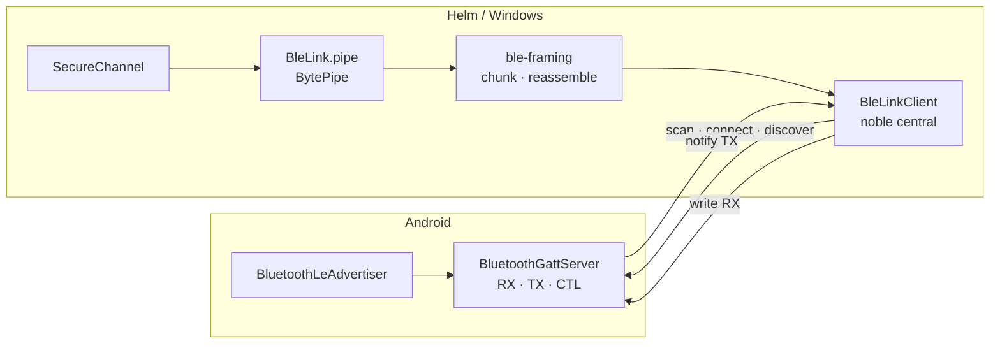
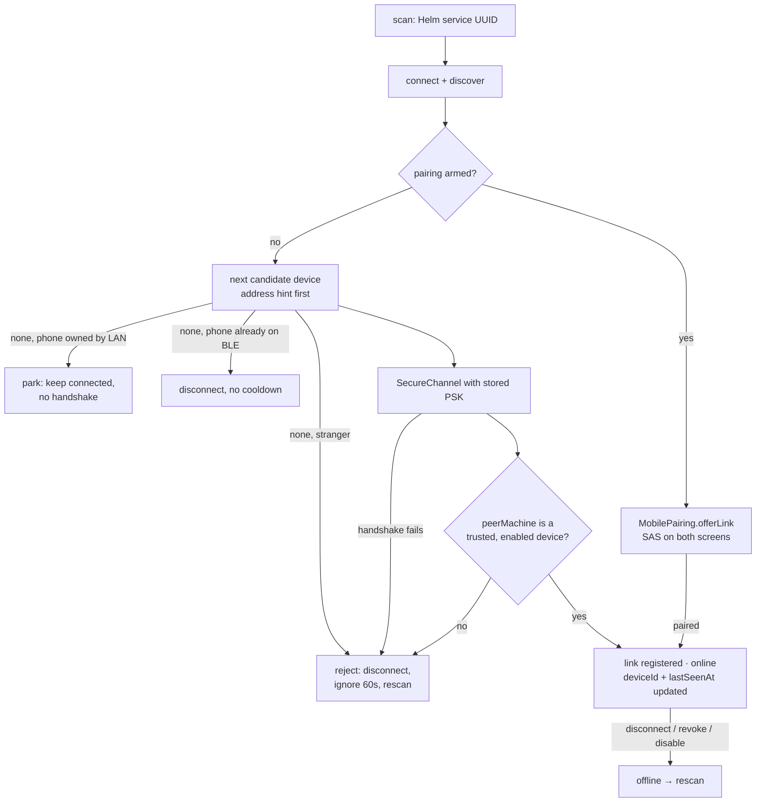
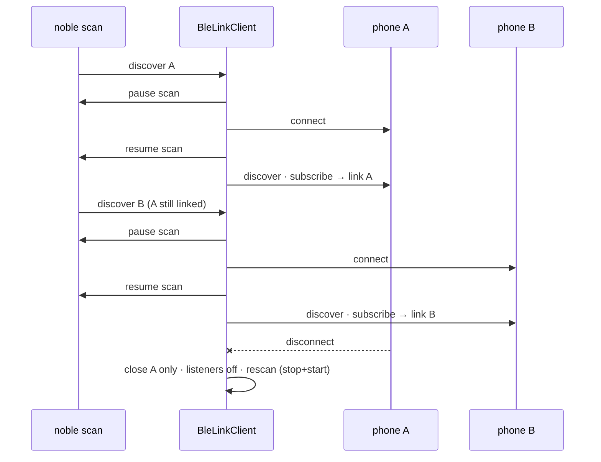
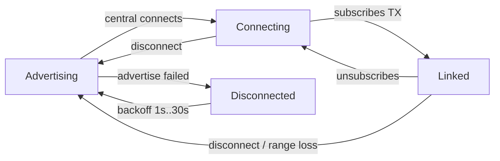

# Mobile BLE transport

How bytes get between Helm and the Android app. Everything BLE-specific lives in
`src/mobile/ble/` and nothing above it knows GATT exists.

> **The wire contract has two homes and only two.** This file owns everything
> below the byte pipe — the GATT service and characteristics, their directions,
> and chunk framing. Everything above it — the handshake, AEAD framing,
> protocol version negotiation and **the version history table that any breaking
> change must add a row to** — lives in
> [mobile-secure-channel.md](mobile-secure-channel.md). There is no third
> document, deliberately: a wire contract with a spare copy is a wire contract
> that drifts silently and is then believed. The app itself is described in
> [mobile-app.md](mobile-app.md).

## Roles: Helm is the central

Ratified 2026-09-11 after the P-0733 spike. `@stoprocent/bleno` cannot serve a
GATT server on Windows — it routes `win32` to a USB/HCI binding that requires a
Zadig WinUSB driver swap, which removes the adapter from Windows Bluetooth
settings entirely. `@stoprocent/noble` v2.8.0 does use the real WinRT bindings
and was measured working on the target machine with no driver change.

So the roles are inverted from the original design:



Consequences that shape the code:

- The phone **cannot initiate**. Recovery is always Helm rescanning, with
  exponential backoff so an out-of-range phone never drives a tight scan loop.
- The 31-byte advertisement limit is an **Android** concern now.
- No `@electron/rebuild` step: noble ships N-API prebuilds via `node-gyp-build`,
  and N-API is ABI-stable across Electron.

## Characteristics

Directions are stated from **Helm's** point of view (`characteristics.ts`).

| Role | UUID | Direction |
|------|------|-----------|
| Service | `48454c4d-4d4f-4249-4c45-000000000001` | advertised by the phone |
| RX | `…0002` | Helm **writes**. Helm → phone |
| TX | `…0003` | Helm **subscribes**. Phone → Helm, and the wake channel |
| CTL | `…0004` | pairing traffic only, never session data |

Noble reports UUIDs lowercased and undashed, so every comparison goes through
`normaliseUuid`.

## Framing

GATT is not a stream: it is bounded, independent attribute writes. `ble-framing.ts`
is the only place that reconciles that with the ordered pipe every layer above
wants.

```
chunk := seq:u8 | flags:u8 | [ totalLength:u32be if FIRST ] | payload
flags := bit0 FIRST | bit1 LAST
```

- `seq` wraps at 256 and exists **only to detect loss**. A dropped notification
  would otherwise be silently concatenated, corrupting the AEAD frame above with
  no error anywhere.
- `totalLength` rides on the FIRST chunk so the cap is enforced **before** a byte
  is buffered. `MAX_MESSAGE_BYTES` is 256 KiB; a peer that lies is refused, so
  reassembly memory is bounded regardless of what arrives.
- A drop is never fatal. The reassembler resynchronises on the next FIRST chunk,
  and since protocol v2 the AEAD layer above honours that contract too: a frame
  whose sequence skips ahead but whose tag verifies is a **gap** — logged,
  counter resynced, link continues. One lost notification costs one message,
  not the link, end to end.

## Cross-language wire contract

Both sides are built without ever meeting, and a framing disagreement fails
silently as "the phone connects and nothing arrives". So the chunk bytes are
computed from fixed inputs and committed:

| Artifact | Path |
|----------|------|
| Vectors | `tests/fixtures/ble-framing-vectors.json` |
| Builder | `src/mobile/ble/framing-vectors.ts` |
| Generator | `npx tsx scripts/generate-ble-framing-vectors.ts` |
| Guard test | `tests/mobile-ble-framing-vectors.test.ts` |

The fixture carries positive cases (including a sequence wrap and an MTU change)
and **reject** cases a conformant reassembler must refuse. P-0741's Kotlin suite
asserts against the same file. **Regenerating it is a wire break.**

The equivalent for the handshake and AEAD layer is
[mobile-secure-channel.md](mobile-secure-channel.md).

## Link ownership — who scans, who decides

`BleLinkClient` connects; it does not decide. `MobileLinkManager`
(`src/mobile/mobile-link-manager.ts`) owns the lifecycle and is the only object
that can answer "is this phone online".

**Identity is the `machineId`, never the BLE address.** Android rotates the
advertised peripheral address, so the scan filter cannot be an address
allow-list. Helm connects to any Helm-service advertiser and only learns who it
is from the `SecureChannel` handshake, which is bound to the stored pairing PSK.
`MobileDevice.deviceId` records the last-seen address as a *hint* so the
likeliest PSK is tried first, and is updated in place on the existing record —
a rotated address must never fork a registry entry or orphan a PSK.

Because the PSK is bound into the handshake, identification is "try a candidate
and see", and a failure closes the pipe: exactly one candidate per connection. A
per-address cursor walks the remaining paired devices across reconnects.



A refused advertiser is skipped for 60s (`rejectIgnoreMs`). Without that window
a neighbour's phone would be reconnected on every rescan forever, since the
refusal can only happen *after* connecting.

**The ignore window must never catch our own phone, and a scan must never go
stale.** noble reports each peripheral once per scan, so an advertiser skipped
while ignored is not reported again until the scan restarts. The original bug:
LAN preempted BLE, the phone's BLE advertiser reconnected, was refused as
"already linked" and ignored — and when LAN later dropped the desktop sat
offline ~15 minutes until Android rotated its address. So:

- A BLE link arriving for a phone LAN already owns is **parked**, not refused
  (see [mobile-lan-transport.md](mobile-lan-transport.md#downgrade-failover-to-a-parked-ble-link)).
  A same-rank duplicate is closed via `disconnect` (no cooldown); only a
  stranger gets `reject`.
- `BleLinkClient` restarts the scan when a link goes offline (backoff), when an
  ignore entry expires, and on a noble `scanStop` it did not request.
- Logged: scan start with its reason, scan stop, each rescan and its reason,
  ignore expiry, and the first skipped discovery per ignore entry.

### Several phones at once

`BleLinkClient` holds **one link per peripheral id**, not one link in total, so a
second paired phone links while the first is active. Every piece of connect
state is per peripheral — which ids are mid-connect, which are linked, each
link's negotiated MTU and its `mtu`/`disconnect` listeners — and a repeat
discovery of a phone already held or mid-connect is ignored.

Scanning keeps running while phones are linked. It is paused only for the
`connectAsync` step itself (the WinRT stack has stalled connects that race an
active advertisement watcher) and resumed the moment connect completes, before
discover/subscribe. A connect-step *failure* leaves the scan to the backoff
rescan instead, so a flapping phone never tight-loops the radio. A rescan is a
stop-then-start, because with other phones linked the scan may already be
running and noble reports each peripheral once per scan.



Every exit path of a link — peripheral `disconnect`, a failed or timed-out
write, `reject`, `disconnect` (retirement) — runs through the pipe's single
close hook, which removes that link's `mtu` and `disconnect` listeners, frees
its slot, emits `disconnected`, and schedules the rescan. Listener counts stay
constant across reconnects.

The manager runs the radio only when there is something to reach: at least one
paired device, or an armed pairing. `noble` is therefore never loaded on a
machine that has never paired a phone.

Revoke and disable both reach the radio: `MobilePairing.setDropLink` is wired to
`MobileLinkManager.dropLink`, so "off" means off now, not at next reconnect.
Pairing hands the established link and channel to the manager on its `paired`
event, so a freshly paired phone is online without reconnecting.

## Error posture

Per invariant 7's spirit, a misbehaving radio must not take a session with it:

- Every noble call is wrapped; failures log and emit, never throw at a caller.
- `BytePipe.write` is synchronous by contract, so writes are serialised through
  an internal promise chain — GATT rejects overlapping writes on one
  characteristic. A failed chunk poisons only its own message.
- An `error` event with no listener is logged rather than emitted, because
  EventEmitter would otherwise throw and abort the retry that follows it.
- Disconnect and reconnect are **events** (`link`, `disconnected`, `error`), not
  exceptions.

### The connect sequence is bounded, and never leaks a connection

`connect → discover → subscribe` each run under a 5s ceiling, and any failure
disconnects the peripheral before rescanning. Both rules were paid for:

- **A step with no ceiling cannot be blamed.** Discovery was observed never
  returning — noble said `Device is unreachable while discovering services`
  while the phone sat in `Connecting` with zero chunks either way — and Helm
  hung ~33s before dying on a bare `Disconnected unknown`. A failure now reads
  `BLE <step> to <id> failed after <n>ms`. 5s is well under the ~30s the phone
  was seen holding a silent connection, so **Helm gives up first** and is the
  one that gets to describe what happened. It was 10s; healthy steps finish in
  under 2s, and a long ceiling holds the scan pause — delaying every *other*
  phone's discovery.
- **A half-built connection must not outlive its attempt.** Walking away without
  disconnecting left the phone holding a live link carrying no traffic, and the
  next attempt met its own leftover as `Peripheral already connected`. The
  disconnect is unconditional: a step that timed out may have completed since,
  so "we never got that far" is not knowable here.

The loser of each race keeps running and its rejection is swallowed — noble
cannot cancel an in-flight GATT operation, and a rejection surfacing long after
we stopped caring is its own defect.

### Liveness: keepalive and half-open detection

A radio can die without emitting `disconnect` (the wedged-stack class), and a
quiet link would otherwise look online forever. The manager therefore probes:
the keepalive clock ticks every **5s**; a registered link silent for 5s gets a
**PING** (protocol v2 frame; the phone answers PONG), and one silent for **30s**
(6 ticks) is dropped, `offline` is emitted, and the normal rescan recovers it —
at most one tick late, so ~30-35s worst case (was 15s x 2 checked every 15s,
~45s). Any inbound traffic — application data, pong, anything — resets the
silence clock. A link is also pinged if it has not been pinged for 20s even
while the phone is talking, so the phone always hears from Helm at least every
~25s — inside the Android LAN socket's 45s read timeout on a healthy link.
Only a link that is *itself* mid-handshake is skipped; another link's handshake
(an identification, a failover, or a pairing attempt held open for its whole
TTL) no longer pauses the keepalive for everyone. Both probing and the
silence-drop pause while the link's outbound write queue is still working a
transfer (a bulk send is itself proof the peer path is up, and the reply that
would reset the clock cannot arrive until it finishes; a wedged queue is still
dropped, bounded by the per-chunk 10s write deadline). The initiator handshake
itself is bounded — 5s over LAN (two small frames on a socket; milliseconds
when healthy) and 8s over BLE (the same frames as acknowledged 20-byte writes
until the MTU report lands, on a connection still settling; observed 1-3s) — so
a phone that accepts the connection but never answers HELLO is rejected and
rescanned rather than held forever. A scan start
the radio refuses also feeds the rescan backoff instead of leaving the client
dormant.

### MTU and chunk size

The default ATT MTU of 23 leaves ~20 usable bytes per notification — a 100 KiB
snapshot would be ~5,000 serial chunks. Helm therefore listens for noble's
negotiated-MTU report (on Windows the WinRT binding emits the GATT session's
MaxPduSize — MTU minus the 3-byte ATT header — and on real hardware the report
lands *during* `connectAsync`, so the listener is attached before the connect
attempt starts and the value is replayed once the pipe exists) and sizes chunks
from it, capped at the 517 MTU the phone negotiates. Only an explicit report is
trusted — never the ambient `peripheral.mtu`, which transiently reports 517
during negotiation — and anything outside `[23, 517]` is ignored. A genuine 514
report (phone MTU 517) therefore yields 511-byte chunks: the 3-byte ATT
subtraction is applied twice, which only ever under-shoots the peer's window,
so it is left alone. Without a report, chunking falls back to 20 bytes and
everything still works, just slower. The phone side already sizes notifications
from its own negotiated MTU.

Whatever the MTU allows, a chunk is additionally capped at
`MAX_ATTRIBUTE_VALUE_BYTES` (512) — the ATT ceiling on a single attribute
value — on **both** ends. This is not belt-and-braces: a 517 report yields 514
by the arithmetic, and a real radio (Moto ThinkPhone, Android 15) *clips* a
514-byte write to 512 rather than refusing it. The loss is two bytes per
oversized chunk, invisible on the sending side, and it destroyed every
multi-chunk message while single-chunk keepalives flowed normally — a phone
stuck forever on "Asking your desktop for the session list" with the link
showing `Linked`. The peer drops the message as `truncated: N bytes short of
the declared length`, which is the only trace it leaves. Both suites pin the
cap, including a round trip of the exact 1711-byte, 4-chunk shape that failed
on hardware.

## The phone side (`android/app/src/main/kotlin/com/potatomotato/helm/ble/`)

The peripheral half mirrors this document from the other end. Directions keep
**Helm's** vocabulary in both languages — one name per characteristic, however
confusing it looks locally — so on the phone RX is *written to* and TX *notifies*.

| File | Role |
|------|------|
| `BleFraming.kt` | `BleChunker` / `BleReassembler` — a byte-for-byte port of `ble-framing.ts` |
| `HelmGatt.kt` | The UUIDs, mirroring `characteristics.ts`, including the reserved CTL |
| `BleLinkSession.kt` | Ownership, backpressure, state and the advertising retry curve |
| `GattServer.kt` | `BluetoothGattServer` + `BluetoothLeAdvertiser`; decides nothing |
| `BleRadioRecovery.kt` | Radio up/down policy — retry budget, generation guard; no Android types |
| `BootReceiver.kt` | Thin `BOOT_COMPLETED` → service start |
| `HelmLinkService.kt` | Foreground service, type `connectedDevice`, BT state receiver |
| `HelmLink.kt` | The process-scoped duplex seam the layers above use |



Three things that shape the Kotlin:

- **The phone never initiates.** "Reconnect" on this side is just returning to
  advertising and waiting, which is also what the status line says.
- **One central at a time.** A second connection is disconnected on arrival —
  two byte streams into one reassembler would corrupt both.
- **One notification in flight, with a deadline.** GATT gives no second slot
  until `onNotificationSent`, so outbound chunks queue and drain on the ack —
  and the ack itself is bounded (10s, mirroring the desktop's write deadline),
  because an ack that never arrives would otherwise stall the queue for the life
  of the connection. A refused chunk (synchronous `notifyTx` false, or
  `onNotificationSent(false)`) is put back at the head of the queue and
  **retried once after 50ms** — a refusal is almost always momentary congestion,
  and dropping it left a sequence gap the desktop's AEAD check turned into a
  full link teardown. A second refusal of the same chunk discards the rest of
  that message rather than sending a hole. All session state is confined behind a single monitor, since the
  binder thread, the main thread, and coroutines all touch it.
- **The radio comes back on its own.** `BleRadioRecovery` watches the adapter
  state: Bluetooth off waits (no retry churn), on retries `open()` with a 1s→4s
  backoff, and `BOOT_COMPLETED` restarts the foreground service so a reboot
  doesn't leave the peripheral dead until the app is opened.

Advertising is `ADVERTISE_MODE_BALANCED`, never `LOW_LATENCY` — this advertises
all day. The 31-byte advertisement carries only the 128-bit service UUID; the
device name rides in the scan response, and is dropped entirely if the user's
device name overflows it. Nothing identifying is advertised, because identity is
established by the handshake, not by the advert.

## Testing without hardware

`BleLinkClient` takes a `NobleApi` — a narrow interface declared in
`ble-link-client.ts`, not imported from noble — so the suite drives it with
`tests/helpers/fake-noble.ts`, a fake that holds real state and delivers real
bytes. The real radio is loaded in exactly one place, `noble-adapter.ts`, lazily.

`tests/mobile-ble-link-client.test.ts` cross-wires two fake peripherals and runs
a complete `SecureChannel` handshake over the resulting pipes, which is the
proof that BLE satisfies `BytePipe` with zero changes to SecureChannel.

The Kotlin side is tested the same way, on the JVM, with no device:
`android/app/src/test/.../BleLinkSessionTest.kt` drives the session through a
`FakeGattPeripheral`, and `BleFramingVectorsTest.kt` asserts the chunker and
reassembler against `tests/fixtures/ble-framing-vectors.json` **in place** —
Gradle passes its path as `helm.fixtures.dir` rather than copying it, because a
copy is a second source of truth waiting to drift. That test, not inspection, is
what proves the two languages agree.
