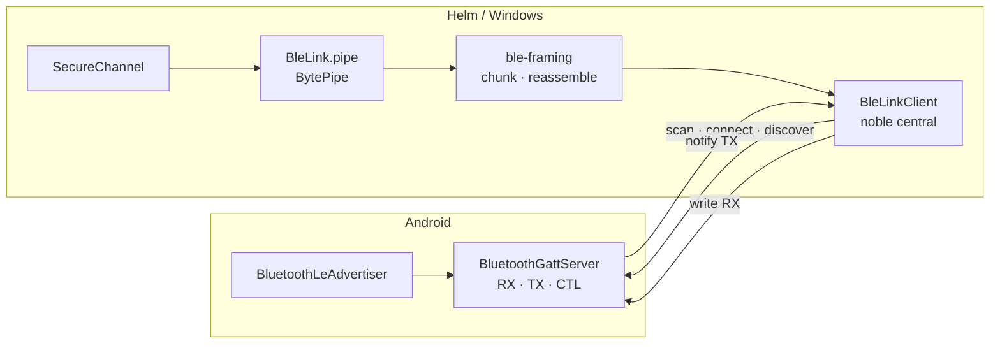

# Mobile BLE transport

How bytes get between Helm and the Android app. Everything BLE-specific lives in
`src/mobile/ble/` and nothing above it knows GATT exists.

## Roles: Helm is the central

Ratified 2026-09-11 after the P-0733 spike. `@stoprocent/bleno` cannot serve a
GATT server on Windows — it routes `win32` to a USB/HCI binding that requires a
Zadig WinUSB driver swap, which removes the adapter from Windows Bluetooth
settings entirely. `@stoprocent/noble` v2.8.0 does use the real WinRT bindings
and was measured working on the target machine with no driver change.

So the roles are inverted from the original design:



Consequences that shape the code:

- The phone **cannot initiate**. Recovery is always Helm rescanning, with
  exponential backoff so an out-of-range phone never drives a tight scan loop.
- The 31-byte advertisement limit is an **Android** concern now.
- No `@electron/rebuild` step: noble ships N-API prebuilds via `node-gyp-build`,
  and N-API is ABI-stable across Electron.

## Characteristics

Directions are stated from **Helm's** point of view (`characteristics.ts`).

| Role | UUID | Direction |
|------|------|-----------|
| Service | `48454c4d-4d4f-4249-4c45-000000000001` | advertised by the phone |
| RX | `…0002` | Helm **writes**. Helm → phone |
| TX | `…0003` | Helm **subscribes**. Phone → Helm, and the wake channel |
| CTL | `…0004` | pairing traffic only, never session data |

Noble reports UUIDs lowercased and undashed, so every comparison goes through
`normaliseUuid`.

## Framing

GATT is not a stream: it is bounded, independent attribute writes. `ble-framing.ts`
is the only place that reconciles that with the ordered pipe every layer above
wants.

```
chunk := seq:u8 | flags:u8 | [ totalLength:u32be if FIRST ] | payload
flags := bit0 FIRST | bit1 LAST
```

- `seq` wraps at 256 and exists **only to detect loss**. A dropped notification
  would otherwise be silently concatenated, corrupting the AEAD frame above with
  no error anywhere.
- `totalLength` rides on the FIRST chunk so the cap is enforced **before** a byte
  is buffered. `MAX_MESSAGE_BYTES` is 256 KiB; a peer that lies is refused, so
  reassembly memory is bounded regardless of what arrives.
- A drop is never fatal. The reassembler resynchronises on the next FIRST chunk:
  one lost notification costs one message, not the link.

## Cross-language wire contract

Both sides are built without ever meeting, and a framing disagreement fails
silently as "the phone connects and nothing arrives". So the chunk bytes are
computed from fixed inputs and committed:

| Artifact | Path |
|----------|------|
| Vectors | `tests/fixtures/ble-framing-vectors.json` |
| Builder | `src/mobile/ble/framing-vectors.ts` |
| Generator | `npx tsx scripts/generate-ble-framing-vectors.ts` |
| Guard test | `tests/mobile-ble-framing-vectors.test.ts` |

The fixture carries positive cases (including a sequence wrap and an MTU change)
and **reject** cases a conformant reassembler must refuse. P-0741's Kotlin suite
asserts against the same file. **Regenerating it is a wire break.**

The equivalent for the handshake and AEAD layer is
[mobile-secure-channel.md](mobile-secure-channel.md).

## Error posture

Per invariant 7's spirit, a misbehaving radio must not take a session with it:

- Every noble call is wrapped; failures log and emit, never throw at a caller.
- `BytePipe.write` is synchronous by contract, so writes are serialised through
  an internal promise chain — GATT rejects overlapping writes on one
  characteristic. A failed chunk poisons only its own message.
- An `error` event with no listener is logged rather than emitted, because
  EventEmitter would otherwise throw and abort the retry that follows it.
- Disconnect and reconnect are **events** (`link`, `disconnected`, `error`), not
  exceptions.

## Testing without hardware

`BleLinkClient` takes a `NobleApi` — a narrow interface declared in
`ble-link-client.ts`, not imported from noble — so the suite drives it with
`tests/helpers/fake-noble.ts`, a fake that holds real state and delivers real
bytes. The real radio is loaded in exactly one place, `noble-adapter.ts`, lazily.

`tests/mobile-ble-link-client.test.ts` cross-wires two fake peripherals and runs
a complete `SecureChannel` handshake over the resulting pipes, which is the
proof that BLE satisfies `BytePipe` with zero changes to SecureChannel.
