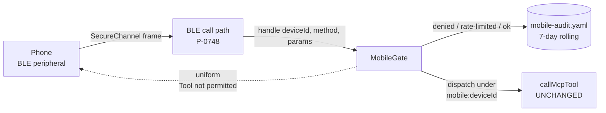

# MobileGate — proxy identity, capability allow-list and audit

A paired phone is an authenticated remote-code-execution surface that lives in a
pocket. `MobileGate` is the boundary that stands **in front of** the MCP
dispatcher for every inbound phone call: deny by default, no impersonation, rate
limited, audited.

It is deliberately the fleet's `InboundCallGate` pattern one prefix along, not a
second security model. See [fleet.md](fleet.md) for the original. Only three
things differ: the identity prefix (`mobile:` vs `peer:`), the registry it reads
(`MobileDeviceStore` vs `PeerConfigManager`) and the audit file.

## The boundary, not the dispatcher

`callMcpTool`'s signature is untouched and nothing inside it knows a phone
exists. The gate wraps it. If a change to this feature requires editing
`src/mcp/tools/dispatcher.ts`, the boundary has been put in the wrong place.

There must be exactly one gate instance. It is built in `handlers.ts` and reached
via `getMobileGate()`; a mobile frame must never reach `callMcpTool` by any other
route.

## Decision order

Every inbound call runs the same ordered checks, and **every** outcome is
audited:

| # | Check | Denies when |
|---|-------|-------------|
| 1 | Device enabled | the record has `enabled === false` |
| 2 | Permitted-tool discovery | (answered in-gate, never dispatched) |
| 3 | Hard deny | tool is in `HARD_DENY_TOOLS`, or is structurally unreachable — even under a wildcard `*` |
| 4 | Session ownership | (mechanism kept, set currently empty — see below) |
| 5 | Allow-list | no `allow` glob matches the tool name |
| 6 | Rate limit | the device's token bucket is empty |
| 7 | Dispatch | — |

**Deny-by-default is the registry's own behaviour.**
`MobileDeviceStore.isToolAllowed` already refuses an unknown device, a disabled
one and one with an empty `allow` list. The gate reuses it rather than
reimplementing authorisation.

### Uniform denials

Steps 1 and 3–5 all throw the *byte-identical* message `Tool not permitted`. A
phone — or whoever picked up a lost one — must not be able to tell "this tool is
hard-denied" from "this tool is not on your list" from "no such tool", because
the difference is a map of the attack surface. Rate limiting is the one distinct
message, since it is a retry signal rather than an authorisation answer.

### Hard deny

`restart_helm` and `session_group_close` are never invocable from a phone,
whatever the allow-list says. The set is imported from the fleet gate — one list,
one rationale. `session_close` is deliberately *not* in it.

### Structurally unreachable tools

`MOBILE_UNREACHABLE_TOOL_PREFIXES` — `artifact_`, `memory_`, `mess_` — are denied
alongside the hard-deny set and filtered out of `__mobile_tools__`.

Every tool in those families resolves its subject from `authContext.sessionId`
alone and takes no session argument (see the `requireCallerSession` call sites in
`dispatcher.ts`). From the `mobile:` proxy they can only ever address the proxy's
**own** empty data — and that is worse than a denial: `artifact_list` does not
fail for a phone, it *succeeds* with an empty array, so a user looking at three
artifacts on the desktop concludes the phone lost them.

The rule this encodes: **the permitted surface means "this will do something", not
"this will not be refused".** A UI built from `__mobile_tools__` must never be
handed a row that looks live and silently does nothing.

This is not a change to the ownership boundary. `requireCallerSession` is
untouched; reaching another session's artifacts from a phone would need a
session-scoped artifact surface that does not exist, and whose threat model is its
own decision.

## Proxy identity

Calls dispatch under `mobile:<deviceId>` (`mobile-identity.ts`), where
`deviceId` is the **local `MobileDevice` record id** — never the BLE address
(Android rotates it) and never the phone's `machineId`. Real session ids are
UUID v4, and `mobile:` is not part of any UUID, so session-scoped tools
(artifacts, drafts — anything keying ownership on `authContext.sessionId`) can
only ever see the proxy's own data.

`senderSessionId` is **stripped** before dispatch. The fleet *wraps* it as a
routable `fleet:<peerId>:<id>` address because a peer has sessions of its own to
reply to; a phone does not, so there is nothing to preserve and stripping is the
stronger choice.

## Session ownership

`OWNERSHIP_GATED_TOOLS` is **deliberately empty**, and the machinery behind it is
deliberately kept.

A session spawned over the mobile proxy still records `createdByMobileDeviceId` on
its `SessionInfo`, derived from the proxy identity in
`HelmSessionService.spawnCli` and persisted through `serializeSession`
(invariant 6 — the allow-list is explicit). The check, the uniform denial and the
audit all still work; nothing is currently named in the set.

`session_close` used to be, mirroring the fleet rule. **Ruled otherwise:** a
SAS-paired phone is the user's own device, and closing a session from the kitchen
is the point of the app. The deciding argument was the app's, not the gate's —
ownership is invisible to `__mobile_tools__`, so the control sheet would have
shown a Close row that looked permitted and was refused every single time, which
is precisely the failure the unreachable-tool audit above exists to remove.
Closing is still governed by the allow-list: permissive about *which* session,
unchanged about *whether*.

## Audit

`MobileAuditLog` keeps a 7-day rolling trail at `mobile-audit.yaml` in the
per-user app-data dir (invariant 4), mode 0600.

The security property is what it does **not** store. `argSummary` holds the
sorted top-level argument **key names only** — `keys: sessionId,text`, never a
value. An `error` outcome records the error **type** (`Error`), never the
dispatcher's message, because several dispatcher errors embed argument values
(`Session not found: <uuid>`). A reviewer must be able to read this file without
leaking anything sensitive; tests assert a secret-looking value is provably
absent.

## Permitted-tool discovery

`__mobile_tools__` is a reserved, non-dispatchable meta-method that returns the
intersection of the tool catalogue with the device's allow-list, minus the
hard-deny set and the structurally unreachable families. It is the mechanism behind the ratified "grey out forbidden
actions" rule in the app: the phone learns exactly what it may call and nothing
about what it may not. It is rate-limited and audited like any other call, so it
cannot be probed for free, and a disabled device gets the uniform denial.

## Rate limit

One `TokenBucket` per device (the fleet's `PeerRateLimiter`, which is keyed on an
arbitrary string): 60 calls/minute with a burst of 60. Roomier than the fleet's
30 because a phone UI is interactive — a sessions list open on screen refreshes
far more often than a peer AI issues tool calls.

## Key modules

| File | Role |
|------|------|
| `src/mobile/mobile-gate.ts` | The gate: ordered checks, dispatch, uniform denials |
| `src/mobile/mobile-identity.ts` | `mobile:<deviceId>` proxy `AuthContext` |
| `src/mobile/mobile-audit-log.ts` | 7-day rolling decision trail |
| `src/mobile/mobile-audit-persistence.ts` | The one reader/writer of `mobile-audit.yaml` |
| `src/mobile/mobile-device-store.ts` | Registry + allow-list ([mobile-pairing.md](mobile-pairing.md)) |
| `src/mcp/peer/inbound-call-gate.ts` | Source of `HARD_DENY_TOOLS` ([fleet.md](fleet.md)) |
