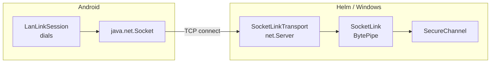
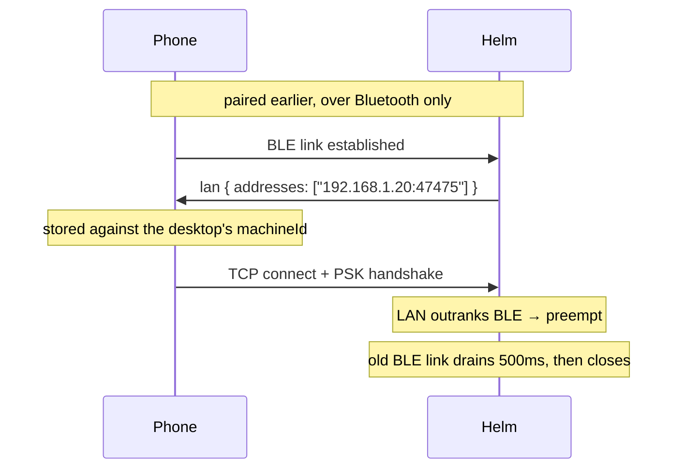
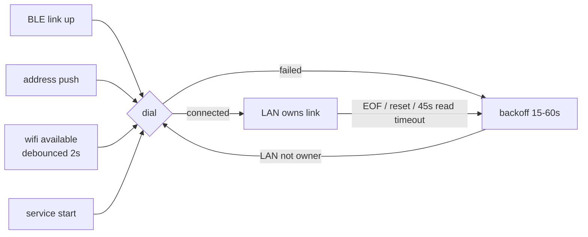

# Mobile LAN transport

How the phone reaches Helm over the network instead of over Bluetooth, and how
one link is chosen when both are available.

> **Scope.** This file owns the LAN pipe, transport ranking and address
> distribution. The crypto above the pipe is unchanged and is documented in
> [mobile-secure-channel.md](mobile-secure-channel.md); the Bluetooth pipe is in
> [mobile-ble-transport.md](mobile-ble-transport.md); pairing is in
> [mobile-pairing.md](mobile-pairing.md). There is deliberately no second copy
> of the wire contract here.

## Why it exists

BLE runs at roughly 5–20 KB/s over about ten metres. That is the right transport
in an office, where corporate wifi isolates clients from each other and the
network is simply not available. At home the phone and the desktop are on the
same LAN and pushing terminal snapshots through BLE is a self-inflicted
bottleneck.

The whole feature is cheap because the crypto lane was built transport-agnostic:
`SecureChannel` consumes an abstract `BytePipe`, and a socket is just another
pipe. **There is no new handshake, no new pairing flow, no regenerated crypto
vectors, and no change to `MobileGate`.**

## Direction is inverted from BLE

Over Bluetooth the phone advertises and **Helm connects**. Over LAN **Helm
listens and the phone dials**.



That choice is what makes the configuration story simple: a phone's address is a
DHCP lease behind a sleeping radio, while a desktop's is stable enough to be
worth knowing. **So no address is configured in Helm at all** — Helm binds a
port and the phone holds the address.

`SecureChannel` does its own length-prefixed framing and tolerates partial
frames on both ends, so a TCP stream needs no chunker. `SocketLink` is a genuinely
thin wrapper; if it ever stops being one, the abstraction has leaked.

## Pairing is Bluetooth-only, always

**Physical proximity is the trust anchor: you must be in the room to bootstrap a
PSK.** A socket may only ever carry a handshake against a PSK that Bluetooth
already established. This is a real security property, not a convenience.

`SocketLinkTransport` does not know what a PSK is, which is how it stays unable
to violate the rule. `MobileLinkManager.identify()` offers a link to the pairing
coordinator only while pairing is armed **and only when the link is BLE rank** —
that rank test is where the rule is actually enforced.

It used to be enforced nowhere. This paragraph claimed the property while the
code offered the coordinator whatever link arrived next, and the bill came due on
a home network: an ALREADY PAIRED phone dialling in over LAN was pulled into the
pairing flow, failed the confirm-MAC check against a coordinator that holds no
PSK, and `fail()` destroyed the whole attempt. Arming pairing therefore killed
itself within seconds of the next LAN dial, over and over. A documented invariant
with no line of code behind it is a comment, not an invariant.

The PSK is transport-independent, so the same device is the same device over
either pipe. **Identity comes from the PSK-bound handshake, never from an IP
address or a BLE address.**

## One link per phone, ranked

Both transports can be live at once. They are not two links — they are an
incumbent and a challenger for one slot keyed on `machineId`.

| Transport | Rank | Constant |
|-----------|------|----------|
| BLE       | 1    | `RANK_BLE` |
| LAN       | 2    | `RANK_LAN` |

**LAN always wins.** This is a fixed ordering, not a heuristic — there is
nothing to weigh. It is deliberately *not* "prefer whatever connected first":
at home BLE routinely wins that race, and the user would spend the evening on
the slow pipe with a gigabit link idle beside it.

Both ends apply the same rule independently, so they converge without
negotiating it. Desktop: `MobileLinkManager.register()`. Phone:
`HelmLink.attach(rank, sender)`.

### The rules that make a swap safe

1. **Authenticate, then displace.** The challenger completes a full PSK-bound
   handshake *before* the incumbent is touched. A failed LAN handshake costs a
   working BLE link nothing.
2. **The swap is invisible above the link layer.** `machineId` does not change,
   so no `offline`/`online` pair is emitted: `MobileChatBridge`, `MobileGate`
   and the settings UI never see it. A diagnostic `switched` event is emitted
   for logs only.
3. **Equal rank loses.** A transport re-attaching at its own rank must not
   displace itself mid-transfer.
4. **Downgrade is a failover, not a reconnect, when BLE is parked.** On the
   PHONE nothing reconnects: it is the peripheral, its Bluetooth link was never
   dropped. On the DESKTOP a BLE link that connects while LAN owns the slot is
   held parked (below), and a LAN drop hands the slot to it. Without a parked
   link the phone goes offline and the scan path brings BLE back.

### Downgrade: failover to a parked BLE link

A displaced BLE link is still retired (its SecureChannel closes the pipe), but
the BLE client then rescans, the phone's advertiser reconnects, and the manager
finds no *unlinked* candidate for it. If a paired device is owned at a higher
rank, the link is **parked** for that device — connected, but not handshaken:
the phone's channel follows its owner rank, so a HELLO over Bluetooth would go
unanswered while LAN owns it. Only a genuine stranger is `reject`ed into the
60s ignore window; refusing the parked phone there is what used to strand the
desktop offline after a LAN drop.

**With a second paired phone unlinked**, the advertiser *does* have a
candidate — the other phone — so it is identified against that PSK and fails
(the phone answers only on its owning transport, and nothing pre-handshake says
which phone it is). While some device is owned above BLE with no standby, that
failure is `disconnect`ed, not rejected, and the peripheral id is remembered:
its next connection is parked instead of identified. The other phone's genuine
link is unaffected — its own PSK succeeds first time. A stranger with no
higher-rank owner around is still rejected into the ignore window.

```mermaid
sequenceDiagram
    participant B as BLE client
    participant M as MobileLinkManager
    participant L as LAN
    L->>M: link (rank 2) — owner
    B->>M: link (rank 1), no unlinked candidate
    Note over M: park for machineId (no handshake, no cooldown)
    L--xM: LAN closes
    Note over M: offline withheld; handshake over parked BLE
    M-->>M: occupy slot, emit switched(2 → 1)
    Note over M: handshake fails → release (disconnect), emit offline
```

Revoke/disable drops the parked link with the owner; a parked link whose radio
drops is simply forgotten. While the failover handshake runs `isOnline` is
false, but no `offline` is emitted unless it fails. A keepalive-detected dead
owner fails over too.

### Generations — the defect this exists to prevent

A displaced link tears down on its own schedule, *after* its replacement has
taken the slot. Every teardown handler is keyed on `machineId`, so a bare
"delete by machineId" lets the dying link delete its own successor: the phone
drops offline seconds after a good upgrade, at random, with nothing in the log.

Both ends guard against it:

- Desktop — `ActiveLink.generation`, a process-unique id per occupancy of the
  slot. `onClosed` and `dropLink` no-op unless the generation still matches.
  Four separate handlers needed it: transport error, pipe close, channel close,
  and the transport's `disconnected` scan.
- Phone — `HelmLink.detachRank(rank)` releases only if that rank still holds the
  link.

A displaced link drains for `DEFAULT_RETIRE_GRACE_MS` (500 ms) before closing,
so a reply already in flight still lands. Envelope ids are chosen by the phone
and Helm never awaits a reply, so anything still missing is simply retried.

## How the phone learns the address

Helm pushes its own reachable addresses down the **already-authenticated
channel**, on every link and again whenever the LAN settings change.

**The reason is not saved typing — it is DHCP drift.** A typed address dies
silently the day the desktop's lease moves. The fleet lane repairs that with
mDNS address-refresh; mDNS is unavailable here because it is multicast and does
not route over a VPN, which is precisely the case this transport serves. So the
repair rides the channel we already trust.



Rules:

- **Addresses are accepted ONLY from the authenticated channel.** An address
  learned any other way is not an address — it is an invitation to dial someone
  else.
- **An empty list is meaningful**: it says *stop dialling*, and it is how
  disabling LAN reaches a phone that is connected right now.
- The push is idempotent, unacknowledged and unversioned. A missed one is
  repaired by the next link, not by a protocol.
- **It cannot repair an address that drifts while the phone is out of Bluetooth
  range.** A DHCP reservation for the desktop is the belt to this braces.
- The phone stores the list **replacing**, never merging — otherwise stale
  leases accumulate and every connection slows down dialling ghosts.

### Why only the default-route address is advertised

The phone dials the list **in order**, with a per-address timeout (~1.5s). A
Windows dev box owns many IPv4 addresses no phone can reach — WSL/Hyper-V
`vEthernet` (172.23.x, 172.30.x), VirtualBox host-only (192.168.56.1), Docker,
VPN/TAP tunnels. A real phone log showed it burning ~3s on 172.23.128.1 and
192.168.56.1 before reaching the Wi-Fi address 10.98.1.140. So Helm advertises
**one** address: the IPv4 of the interface carrying the default route
(`src/mobile/primary-lan-address.ts`).

- **How it is found:** a UDP socket `connect()`ed to a public IP — no packet is
  sent; the OS just picks the route and binds the local address — then checked
  against a non-internal entry of `os.networkInterfaces()`.
- **Offline fallback** (no default route, or the address is not a real
  interface): every non-internal IPv4 except 169.254/16 and adapters named like
  vEthernet/WSL/Hyper-V/VirtualBox/VMware/Docker/vpn/TAP/Tailscale/ZeroTier. The
  switch is logged once per transition.
- **Change detection:** the advertiser re-probes every 30s and re-pushes to live
  phones **only when the list changed** (a laptop hopping Wi-Fi networks gets no
  link event). The log names the addresses sent, not just a count.
- **Fleet is unaffected:** its pairing panel still lists every interface via
  `reachableAddresses()` — a human picks one there, nothing dials them blindly.

### Why the socket address is never persisted as a hint

`MobileDevice.deviceId` is a **BLE scanning hint**: it decides which stored PSK
is tried first against an advertiser. A TCP source port is ephemeral, so writing
one there would evict the BLE hint and make every later BLE reconnect guess
wrong — one LAN session silently degrading the transport it displaced.

Transports declare `persistsAddressHint`; `SocketLinkTransport` declares
`false`. The manager asks the transport rather than testing its rank, so this
stays a property of the transport and not a BLE branch in the manager.

## Configuration

`settings.yaml` → `mobileLan: { enabled, port }`. Default **off**, port
**47475**.

47475 is deliberately not the fleet listener's 47474: different protocols to
different kinds of peer, so one firewall rule never means two things at once.

There is **no host field**, following `FleetConfigPanel.vue`'s precedent — the
bind is a wildcard in every real deployment, and the only thing a user can act
on is the concrete address to type into the phone. Settings → 📱 Mobile shows
the same default-route address the phone is told to dial, as a
copy-to-clipboard chip.

Changes hot-apply: toggling or changing the port rebinds the listener and
re-advertises to every live phone. No restart.

**Nothing binds until a phone is paired** — the same rule the radio follows. So
`enabled` and `listening` are different things, and the panel says which.

## Frame size

`MAX_FRAME_BYTES` is 1 MiB and is an **application** ceiling that applies to
both transports identically — LAN is faster, not bigger.

What differs is what the phone **asks for**. BLE caps a single GATT message at
256 KiB (`BleFraming.MAX_MESSAGE_BYTES`), so an attachment slice stays ~93 KiB
there, while over LAN it asks for ~1 MB. The size is chosen per request from
whichever transport owns the link *right now*, because LAN preempts BLE mid
transfer and a slice sized for the wrong transport is refused, not merely slow.

## Module reference

| Module | Role |
|--------|------|
| `src/mobile/mobile-link.ts` | `MobileLink`, `LinkTransportError`, `RANK_BLE`/`RANK_LAN` — the transport-neutral link contract |
| `src/mobile/lan/socket-link-transport.ts` | The listener, `SocketLink`, and live enable/port |
| `src/mobile/mobile-link-manager.ts` | Owns N transports; ranking, preemption, generations |
| `src/mobile/mobile-address-advertiser.ts` | Pushes the address down the authenticated link; 30s change poll |
| `src/mobile/primary-lan-address.ts` | Default-route IPv4 resolution + virtual-adapter fallback filter |
| `src/mobile/mobile-envelope.ts` | The `lan` record |
| `android/…/lan/LanLinkSession.kt` | The phone's dialling policy |
| `android/…/data/LanAddressStore.kt` | Stored addresses and strict `host:port` parsing |
| `android/…/ble/HelmLink.kt` | Ranked link ownership on the phone |

## When the phone dials

`LanLinkController` owns the *when*; `LanLinkSession` owns the *how*. They are
split because the when is all policy and the how is all sockets, and only one of
them needs a network to test.

Triggers — any one dials, and a dial already in flight or an up LAN link makes
every other trigger a no-op:

1. **A Bluetooth link came up.** The phone knows which desktop it is talking to
   and has somewhere to reach it.
2. **A fresh address list arrived** over the authenticated channel.
3. **A Wi-Fi/Ethernet network became available** or changed addresses
   (`NetworkWatcher`, a `ConnectivityManager.NetworkCallback`). Debounced 2s:
   the system reports available-then-link-properties in a burst, which must be
   one socket, not several.
4. **The link service (re)started** (`LanLinkController.resume`). Independent of
   the Bluetooth preference and state — a restarted service with Bluetooth off
   by preference previously made zero LAN attempts for six hours.
5. **The redial backoff** (15s doubling to 60s), whenever LAN does not itself
   own the link — **including while Bluetooth owns it**. It used to pause under
   Bluetooth, and since trigger 1 usually fires before wifi has an address, the
   phone stayed on Bluetooth indefinitely. It pauses only while LAN owns the link.

The TCP connect timeout is 1.5s: away from home every address is unreachable and
the user is already on Bluetooth.



**Dead-socket detection.** The phone sets a 45s socket read timeout (the desktop
pings at least every ~25s, and every 5s once the link is quiet) plus TCP keepalive. A silently dead link — an AP
that stopped forwarding, a desktop gone without a FIN — throws
`SocketTimeoutException`, which the pump treats as a clean close; the rank drops
and Bluetooth resumes at once. Without it the phone stayed "Linked" until TCP
gave up, ten-plus minutes. Every close logs `reason=eof|reset|timeout|closed`
and the link's lifetime.

**Service teardown releases only Bluetooth's rank.** Clearing every rank used to
orphan a live LAN socket: the controller still believed it was connected and
refused to redial. The controller now also detects an orphaned session (open
socket, rank no longer registered) and closes it before redialling.

The phone needs `android.permission.INTERNET` (and `ACCESS_NETWORK_STATE` for
the network callback). Without INTERNET a dial raises
`SecurityException` — which is **not** an `IOException`, so the dial loop catches
`Exception` rather than enumerating failure modes it cannot predict.

## The phone's side of ownership

`HelmLink` holds a **map of rank → transport**, not a single winner.

A single holder handles the upgrade fine and gets the downgrade badly wrong: when
LAN drops the holder empties, and Bluetooth does not resume because it attached
once at startup and nothing re-attaches it. The phone would sit dead until the
BLE service happened to cycle. With a map, Bluetooth stays registered the whole
time, so LAN dropping is an **instant handover** with no restore path to write —
and therefore none to forget to call.

Note the asymmetry with the desktop: **the desktop's recovery is a reconnect**
(scan, connect, handshake — seconds), because it is the central. **The phone's is
not a reconnect at all**, because it is the peripheral and its Bluetooth link was
never dropped.

Link state is **derived from whichever transport owns the link**, not written by
whoever spoke last — otherwise Bluetooth reporting "Advertising" while LAN is
connected would make the UI claim the phone is offline.

A swap also **restarts the phone's SecureChannel**: a handshake belongs to one
transport, so the desktop opening a new channel over the new pipe means the old
session's keys and counters are finished. `HelmLink.owner` is a flow for exactly
this reason — and inbound bytes are queued **per transport rank**, so the
channel bound to one rank can only ever read that rank's bytes. Draining one
shared queue on owner change was not enough: a 55KB reply still draining over
Bluetooth after the upgrade kept arriving for seconds, and its old-session
frames reached the fresh LAN channel and failed authentication. A transport's
queue now dies with it in `detachRank`, unread tail included.

Phone-side socket writes also never run on the caller's thread: Android forbids
network I/O on the main thread, and the app's first call after a link comes up
(`session_list`) arrives there. `LanLinkController` hands every write to a
single writer thread, exactly as the BLE queue absorbs its callers.

## Known gaps

- There is no LAN row on the phone's settings screen. Nothing needs one: the
  address arrives over Bluetooth and the desktop is where LAN is turned on.
- A phone whose app is backgrounded still advertises over BLE, so the desktop
  connects, offers a PSK, and waits out the 10s handshake timeout — roughly
  every 20s while that phone is on but unreachable. Harmless to the live link;
  annoying on the radio.
- WAN access (P-0753) is out of scope and remains unbuilt; a VPN that routes the
  home subnet makes it unnecessary, because the desktop then keeps one address
  from either side.
