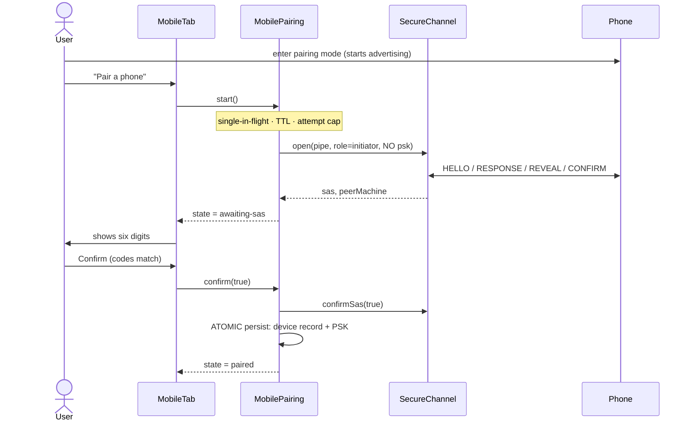
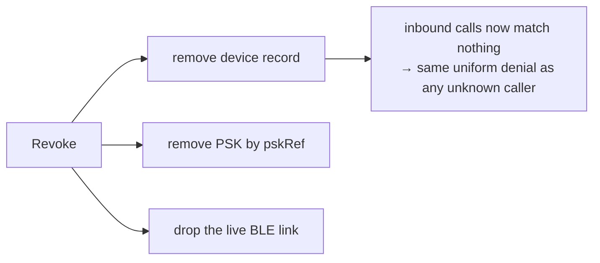

# Mobile device pairing

How a phone becomes a trusted device, how that trust survives restarts, and how it
is taken away again.

Companion documents: [mobile-secure-channel.md](mobile-secure-channel.md) (the
handshake itself), [mobile-ble-transport.md](mobile-ble-transport.md) (the radio),
[fleet.md](fleet.md) (the peer equivalent this mirrors).

## The short version

`MobilePairing` **is not a crypto state machine**. `SecureChannel` already performs
the entire SAS exchange — X25519 commit/reveal, the six-digit comparison, the
confirm-MAC and the derived PSK — over an abstract `BytePipe`, and the Kotlin
client asserts against committed vectors for exactly those bytes.

So pairing runs over the **same handshake as every other connection**. The only
difference between pairing and reconnecting is whether a PSK is supplied:

| | PSK passed to `SecureChannel` | SAS shown? |
|---|---|---|
| First pairing | none | yes — the user compares six digits |
| Every reconnect | the stored PSK | no |

A second pairing exchange would fork the wire format, and a cross-language wire
mismatch does not fail loudly — it fails as *"pairing just never works"*. That is
the single most expensive failure mode in this project, so there is one handshake
and one set of vectors.

> The `CTL` characteristic (`…0004`) is declared in `ble/characteristics.ts` and
> is **reserved but unused**. An earlier design carried pairing on it. Do not
> remove the UUID — churning the characteristic map is itself a wire break.

## Role flip

Helm is the BLE **central**; the phone is the **peripheral**. Pairing mode is
therefore entered *on the phone* (it starts advertising) and Helm scans for it.
The desktop button says "Pair a phone" but the user's next action is on the
handset — the tab copy says so explicitly, or the user waits for a button that
does not exist on this side.

## The flow

Reject, cancel, expiry or any persist failure all end the same way: **nothing is
written at all**.

## Identity is `machineId`, never the BLE address

Android rotates a peripheral's advertised address for privacy. Keying the registry
on it would fork a duplicate entry — and orphan the PSK — the first time the OS
rotated it. `machineId` is generated once by the phone app and bound into the
handshake transcript, so it survives rotation and reconnects.

`deviceId` is retained only as a last-seen scanning hint.

This is the same failure the fleet registry actually hit: its loader silently
dropped `machineId`, so re-pairing forked duplicates. One shared sanitizer
(`mobile-device-sanitize.ts`) serves both the YAML loader and `importAll`, which
makes that class of drift structurally impossible. `tests/mobile-device-store.test.ts`
round-trips the store through YAML and asserts no field is lost.

## Atomic finalize

`MobilePairing.finalize()` mirrors `PeerPairing.tryFinalize()`: write the device
record, then the PSK, and on **any** failure roll back everything this attempt
wrote — removing a fresh record, or restoring a prior one's fields. A half-paired
device that has a record but no usable key is worse than no device at all, because
it looks trusted.

## Storage

Split exactly like the fleet, both under the per-user app-data config dir
(invariant 4 — never the repo tree):

| File | Contents | Mode |
|---|---|---|
| `mobile-devices.yaml` | the registry — `pskRef` references only, no secrets | default |
| `mobile-secrets.yaml` | pairing PSKs, base64. The ONLY place they exist | `0600` |

The mobile stores are separate instances from the fleet's: a revoked phone must
never be able to take a peer's trust with it.

## Authorisation and revocation

Deny-by-default. A newly paired phone has an empty `allow` list — it can connect
and do nothing until the user grants globs in the tab. An unknown device, a
disabled device, or an empty list all deny everything.

Revocation is **immediate**, not at next reconnect:

Disabling (`enabled: false`) is the reversible form: it drops the live link and
denies every inbound call, but keeps the record and the PSK so the user can turn
the phone back on without pairing again.

Deny messages stay **uniform**, so a device can never probe what exists.

## Module map

| Module | Role |
|---|---|
| `src/types/mobile-device.ts` | the `MobileDevice` record |
| `src/mobile/mobile-device-store.ts` | registry + authorisation (mirrors `PeerConfigManager`) |
| `src/mobile/mobile-device-sanitize.ts` | the ONE sanitizer for persisted entries |
| `src/mobile/mobile-device-persistence.ts` | both YAML files |
| `src/mobile/mobile-pairing.ts` | the coordinator + trust lifecycle |
| `src/electron/ipc/mobile-handlers.ts` | the `mobile:*` channels |
| `renderer/composables/useMobileDevices.ts` | the reactive mirror |
| `renderer/components/sidebar/MobileTab.vue` | Settings → 📱 Mobile |
| `renderer/components/modals/MobilePairingDialog.vue` | the SAS comparison dialog |

Secrets never cross the IPC boundary: the registry is secret-free by construction,
and the pairing state carries only the SAS digits — a KDF *output*, safe to show.

## Not yet wired

The BLE transport has no owner yet, so `MobilePairing` is constructed without
`dropLink`/`isOnline` and every device reads as offline. `BleLinkClient` also
connects to the first peripheral advertising the Helm service and has no
device-id filter, so reconnect-to-a-known-phone is still to come. A later plan
owns the client lifecycle and feeds links in via `offerLink()`.
