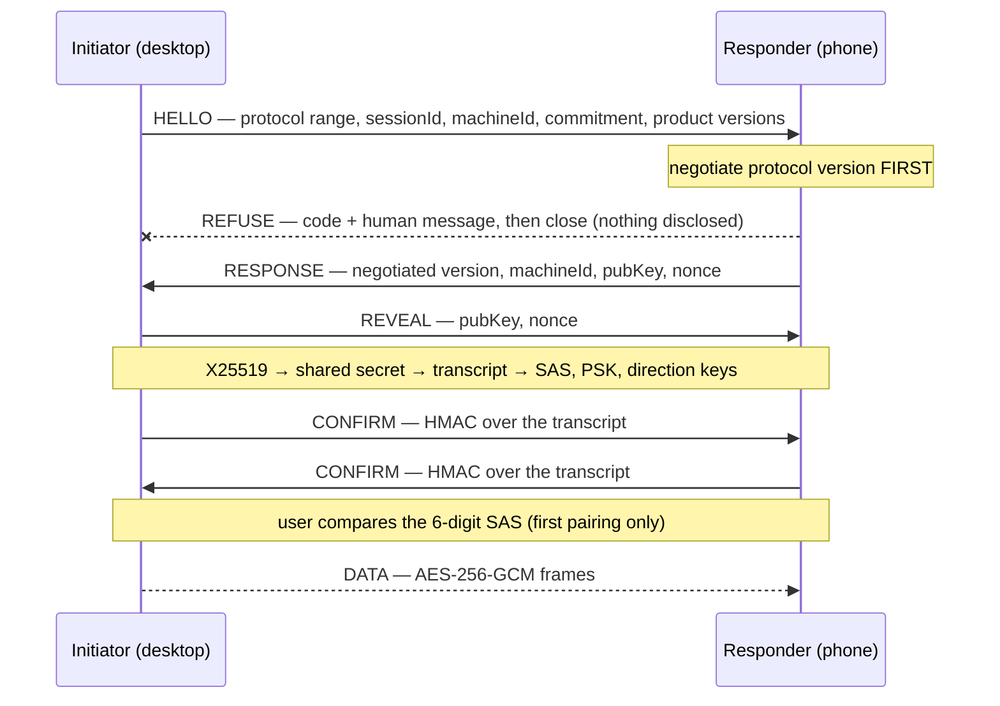
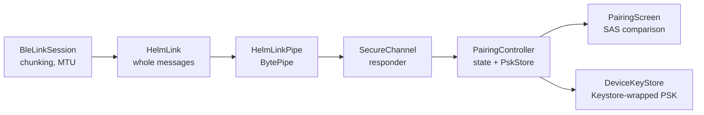

# Mobile SecureChannel

App-layer encryption for the phone ↔ Helm link. BLE's own pairing (Just Works) offers
no MITM protection, so confidentiality and authentication are done above the transport
and are entirely transport-agnostic.

| File | Role |
|------|------|
| `src/mobile/secure-channel.ts` | Handshake + framing over any `BytePipe`. Zero BLE/GATT awareness. |
| `src/mobile/protocol-version.ts` | Supported protocol range and the negotiation/refusal logic. |
| `src/mobile/aead.ts` | AES-256-GCM sealing, per-direction keys, implicit monotonic nonces. |
| `src/mobile/test-vectors.ts` | Cross-language conformance vectors (pure, fixed inputs). |
| `src/mcp/peer/pairing-crypto.ts` | **Reused unchanged** — X25519, commit-reveal, transcript, SAS, confirm-MAC. |
| `tests/fixtures/secure-channel-vectors.json` | Committed vectors the Kotlin client is verified against. |

## Handshake



Every frame on the wire is `uint32be length | type byte | payload`; handshake payload
fields are 4-byte length-prefixed, matching the transcript encoding exactly.

## Protocol version negotiation

Helm auto-updates; the APK is sideloaded and drifts. Compatibility is therefore gated
on a **protocol** version that is decoupled from both product versions and changes only
when the wire changes. Each side declares a range (`PROTOCOL_MIN`…`PROTOCOL_MAX`) in
HELLO and the highest common version wins.

- Negotiation is the **first** thing that happens. On refusal the responder has sent
  nothing but the REFUSE frame — no machine id, no public key, no nonce.
- Product versions (`productVersion`, `minPeerVersion`) ride along **for the message
  text only**. They never gate the decision.
- A refusal is a clean close carrying a code plus human text, e.g. *"The phone app is
  too old for this version of Helm. Helm speaks protocol 3–4; the phone app speaks 1–2.
  Update the phone app."* The reverse direction (the user downgraded Helm) is handled
  symmetrically.
- A `ProtocolRefusalCode` is always relative to whoever holds it — `peer-too-old` means
  "the other end is old". The wire code is written from the refuser's point of view and
  inverted on receipt.
- A malformed or absent range is refused, never defaulted to `0` or to `PROTOCOL_MAX`.

### Version history

Any **breaking** wire change increments `PROTOCOL_MAX` and adds a row here in the same
commit. Additive changes do neither.

| Version | Change |
|---------|--------|
| 1 | Initial wire format — range negotiation in HELLO, X25519 commit-reveal handshake, AES-256-GCM framing. |

## Invariants

- **Negotiation precedes capability.** No identity, key material or tool surface is
  exposed before the protocol version is agreed.
- **No plaintext fallback.** Every failure path calls `close()`; there is no resync.
- **Nonce reuse is structurally impossible.** Each direction has its own HKDF-derived
  key, and the 12-byte nonce is an implicit counter that is never transmitted — so a
  replayed or reordered frame decrypts under the wrong nonce and fails the tag check.
  The counter is refused at exhaustion rather than wrapped.
- **First pairing requires the user.** `send()` throws until `confirmSas(true)`;
  `confirmSas(false)` closes the channel. Messages that arrive before the local user
  has confirmed are queued, not dropped and not emitted.
- **Reconnection uses the stored PSK.** When a PSK is supplied it is bound into both
  the confirm-MAC and the AEAD keys (`bindPsk`), so a peer without it fails the
  handshake instead of silently downgrading to an unpaired link.
- **Keys live only in memory.** Only `pairingPsk` is ever persisted, by the caller,
  following the fleet split of `peers.yaml` vs `peer-secrets.yaml`.
- **`pairing-crypto.ts` stays carrier-agnostic.** If it needs an edit to serve the
  mobile link, the change is in the wrong file.

## Cross-language conformance

The Kotlin client and this TypeScript side are built independently and only meet on
real hardware, where a byte-level mismatch presents as "pairing just never works".
`tests/mobile-secure-channel-vectors.test.ts` pins transcript bytes, SAS digits,
derived keys, confirm-MACs and AEAD frames against the committed fixture; the Kotlin
suite asserts against the same JSON.

Regenerate only for an intentional protocol change — it is a wire break, and every
already-paired phone stops working:

```bash
npx tsx scripts/generate-secure-channel-vectors.ts   # then bump PROTOCOL_MAX
```

## The phone side (Kotlin)

Helm is the BLE central, so Helm is ALWAYS the initiator. The phone therefore only
ever plays **responder**, and the initiator half is deliberately absent from the
Kotlin code rather than written and left unused.



| Kotlin | Mirrors | Notes |
|---|---|---|
| `crypto/PairingCrypto.kt` | `src/mcp/peer/pairing-crypto.ts` | transcript, commitment, SAS, confirm-MAC, PSK |
| `crypto/Aead.kt` | `src/mobile/aead.ts` | AES-256-GCM, per-direction keys, implicit counters |
| `crypto/Hkdf.kt` | Node `crypto.hkdfSync` | RFC 5869 extract-then-expand, HMAC-SHA256 |
| `crypto/ProtocolVersion.kt` | `src/mobile/protocol-version.ts` | ranges, refusal codes, refusal wording |
| `crypto/Frames.kt` | the codec inside `secure-channel.ts` | `uint32be length \| type \| payload` |
| `crypto/SecureChannel.kt` | `src/mobile/secure-channel.ts` | responder half only |

Three details that differ, each for a reason:

- **X25519 comes from Bouncy Castle, not the platform.** The JCE gained XDH in API 33
  and `minSdk` is 26. Hashing, HMAC and AES-GCM still use the platform providers,
  which are hardware-backed. BC is ~4 MB of the APK; enabling R8 would cut most of it.
- **The phone picks the PSK at HELLO, not by guessing.** As responder it learns the
  desktop's `machineId` before any key is derived, so `pskFor(machineId)` resolves the
  stored PSK outright. Helm has to try a candidate and reconnect on failure, because it
  cannot know who answered until the handshake authenticates.
- **A handshake timeout is mandatory on this transport.** A refused GATT notification
  discards the remainder of that message and produces no error frame, so a
  half-delivered handshake is indistinguishable from a peer that went quiet. Silence is
  the only symptom available, so `HANDSHAKE_TIMEOUT_MS` is the trigger. A write the
  link refuses closes the channel for the same reason.

`PairingController` owns the only three decisions above the crypto — which PSK to
offer, what the screen shows, and whether a completed handshake is written to disk —
and it is free of Android types so all three are tested on the JVM. A rejected SAS
persists **nothing**: the store is touched after the verdict, never inside the channel.

`DeviceKeyStore` does not put the PSK *in* the Android Keystore — a raw 32-byte secret
cannot be imported there on API 26. The Keystore holds a key it generated and never
exports (hardware-backed where available) and that key encrypts the PSK; only
ciphertext reaches `SharedPreferences`. An undecryptable PSK (factory reset, changed
lock screen) is treated as absent, because pairing again is the only cure either way.
