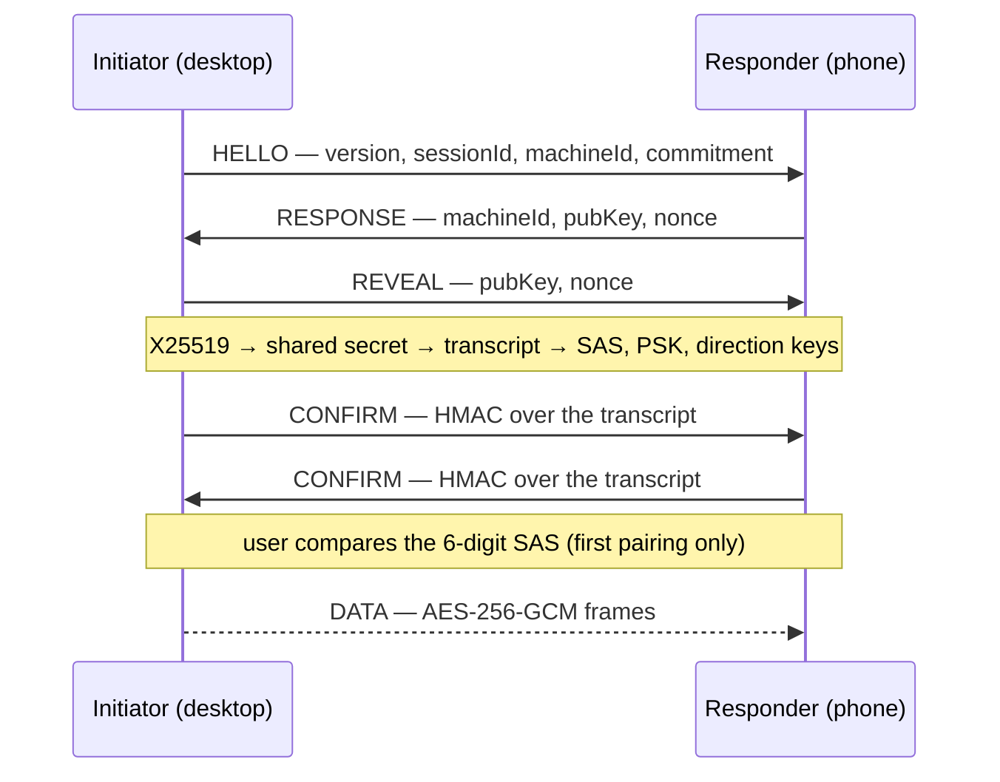

# Mobile SecureChannel

App-layer encryption for the phone ↔ Helm link. BLE's own pairing (Just Works) offers
no MITM protection, so confidentiality and authentication are done above the transport
and are entirely transport-agnostic.

| File | Role |
|------|------|
| `src/mobile/secure-channel.ts` | Handshake + framing over any `BytePipe`. Zero BLE/GATT awareness. |
| `src/mobile/aead.ts` | AES-256-GCM sealing, per-direction keys, implicit monotonic nonces. |
| `src/mobile/test-vectors.ts` | Cross-language conformance vectors (pure, fixed inputs). |
| `src/mcp/peer/pairing-crypto.ts` | **Reused unchanged** — X25519, commit-reveal, transcript, SAS, confirm-MAC. |
| `tests/fixtures/secure-channel-vectors.json` | Committed vectors the Kotlin client is verified against. |

## Handshake



Every frame on the wire is `uint32be length | type byte | payload`; handshake payload
fields are 4-byte length-prefixed, matching the transcript encoding exactly.

## Invariants

- **No plaintext fallback.** Every failure path calls `close()`; there is no resync.
- **Nonce reuse is structurally impossible.** Each direction has its own HKDF-derived
  key, and the 12-byte nonce is an implicit counter that is never transmitted — so a
  replayed or reordered frame decrypts under the wrong nonce and fails the tag check.
  The counter is refused at exhaustion rather than wrapped.
- **First pairing requires the user.** `send()` throws until `confirmSas(true)`;
  `confirmSas(false)` closes the channel. Messages that arrive before the local user
  has confirmed are queued, not dropped and not emitted.
- **Reconnection uses the stored PSK.** When a PSK is supplied it is bound into both
  the confirm-MAC and the AEAD keys (`bindPsk`), so a peer without it fails the
  handshake instead of silently downgrading to an unpaired link.
- **Keys live only in memory.** Only `pairingPsk` is ever persisted, by the caller,
  following the fleet split of `peers.yaml` vs `peer-secrets.yaml`.
- **`pairing-crypto.ts` stays carrier-agnostic.** If it needs an edit to serve the
  mobile link, the change is in the wrong file.

## Cross-language conformance

The Kotlin client and this TypeScript side are built independently and only meet on
real hardware, where a byte-level mismatch presents as "pairing just never works".
`tests/mobile-secure-channel-vectors.test.ts` pins transcript bytes, SAS digits,
derived keys, confirm-MACs and AEAD frames against the committed fixture; the Kotlin
suite asserts against the same JSON.

Regenerate only for an intentional protocol change — it is a wire break, and every
already-paired phone stops working:

```bash
npx tsx scripts/generate-secure-channel-vectors.ts   # then bump SECURE_CHANNEL_VERSION
```
