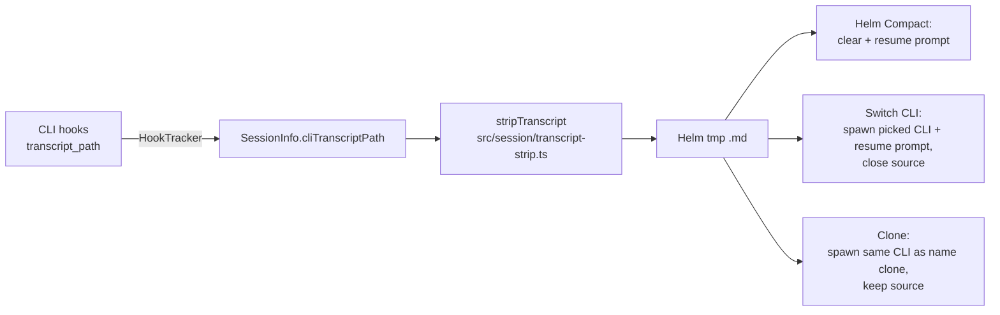

# Helm Compact, Switch CLI & Clone

Three actions share one engine: Helm strips a session's own transcript to markdown and has a fresh context read it back.

- **Helm Compact** (`session_quick_compact`, context menu "🗜️ Helm Compact"): strip → clear the session → paste a prompt pointing at the file. The prompt is not pasted blind: it rides the handover idle-wait ([handover.md](handover.md)) — armed before the clear, pasted once the cleared CLI falls quiet, never sooner than that CLI's `initialPromptDelay`, forced at the 5-minute ceiling. `session_clear` notes use the same path.
- On the phone, all three sit on the session sheet: "Helm compact" (confirms first), "Switch CLI" (opens a picker of the desktop's CLIs) and "Clone". Rows grey out unless the device's mobile allow-list permits the tool.
- **Switch CLI** (`session_switch_cli`, context menu "🔀 Switch CLI…" → CLI picker): strip → spawn the picked CLI in the same directory, name and runtime group, with the prompt as its initial paste → close the source (recycle bin, restorable; `closeSource: false` keeps it; locked sessions are never closed).
- **Artifacts follow** (Switch CLI and Clone): before the source can close, every artifact is copied to the new session under a fresh id, with its versions and attachments. The source keeps its own. A copy's content has the old artifact id swapped for the new one, so embedded attachment paths point at the copy's files.
- **Clone** (`session_clone`, context menu "🧬 Clone"): Switch CLI to the source's own CLI type, named "<name> (clone)", never closing the source — a fork that diverges from the same history. Plans, mission and ownership are not copied.

## Why strip instead of `/compact`

Measured on a 157k-token Claude Code session: `/compact` landed at 47–56k, a local-model fold at 56k, stripping at 62k. Only the stripped copy answered every recall question exactly — summaries lose paths, numbers and decisions. Stripping costs ~10–15k more context and no model call.

What is kept: every user prompt and assistant reply, one line per tool call (name + clipped arguments), and failed tool results. What goes: thinking (only useful inside the turn that produced it), successful tool output (re-readable from disk), meta records and injected hook text. Helm plumbing is removed too — `[HELM_MSG]` envelopes and reply directives, `[HELM_*_RULES]`/`_MODE` blocks, mission/mess/suggestion lines, Stop-hook feedback and large-text temp-file pointers — keeping only the message body: it names the old session's ids, and a successor that reads it back replies to a dead session. Claude Code logs start from the last compaction boundary, keeping its summary; Codex rollouts read `response_item` records only and keep the whole history across compactions — Codex's `compacted` summary is encrypted, so the earlier turns are the only readable record. Copilot CLI logs start after the last `session.compaction_complete`, keeping its summary; sub-agent records (`parentToolCallId`) and the injected `transformedContent` are dropped.

## Requirements

- **CLI hooks installed** ([cli-hooks.md](cli-hooks.md)). The transcript path only arrives through hook payloads (Copilot sends none, so it is derived from the hook's `sessionId`: `~/.copilot/session-state/<id>/events.jsonl`) and is persisted on the session, so it survives a restart. Without it both actions refuse with a clear error and change nothing.
- Supported log formats: Claude Code, Codex and Copilot CLI JSONL. Other CLIs fall through to the Claude parser and produce an empty strip.
- Every strip logs `[TranscriptStrip]` (format, source, sizes, record/compaction/section counts, output file); an empty strip warns with the log's record-type histogram. `[HookTracker]` logs each newly learned transcript path.
- No size limit: the log is read in 16 MB chunks, so it may exceed V8's ~512 MB string cap. A 725 MB Copilot log strips in ~2 s at ~1.6 GB peak memory.
