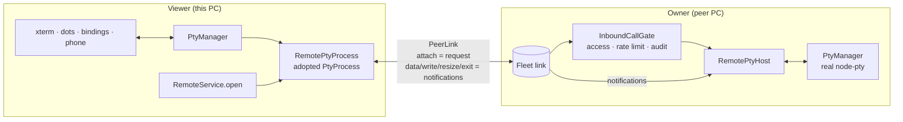
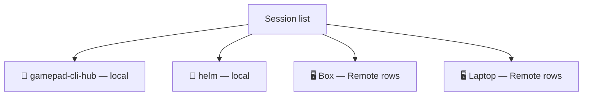

# Remote: drive a peer's sessions from here

## Why

Fleet lets you **delegate**: your AI calls another Helm's tools with `peer_call`. Remote lets you **talk**: a session running on another PC appears here as an ordinary row. Its terminal streams from the peer, and your controller, keyboard, phone and voice drive it directly, with no AI in the middle.

Remote is an option of Fleet, not a separate system. It uses Fleet's TLS-WS link, SAS pairing, per-peer access flag, rate limit and audit log. It adds no new port, crypto or pairing.

## Shape

- **A remote PTY is just a `PtyProcess`.** `PtyManager.adopt()` registers a `RemotePtyProcess` exactly like a spawned process. Everything downstream (terminal, activity dots, pattern matcher, `session_send_text`, bindings, the phone) works unchanged.
- **Attach is the grant.** `remote.attach` is a request, so it passes the owner's `InboundCallGate` like any Fleet call. The later `remote.write`, `remote.resize` and `remote.detach` notifications are honoured only from a peer that is currently attached to that session.
- **Streams are notifications.** `PeerLink.notify()` sends id-less JSON-RPC frames: no reply and no timeout, because a round-trip per keystroke would be too slow. The owner coalesces output into one `remote.data` frame per ~16 ms, each with a `seq` number.

## Lifecycle

| Event | What happens |
|---|---|
| Attach | The owner returns a raw snapshot of the last 500 lines, plus the size and label, then nudges a resize so full-screen TUIs repaint. The viewer adds a row with `remote: { peerId, sessionId }`. |
| Lost frame (`seq` gap) | The viewer re-attaches, resets the terminal (`ESC c`) and repaints from a fresh snapshot. |
| Link drops | The viewer shows a notice, and the owner stops streaming to that peer. When the link returns, the viewer re-attaches and repaints. |
| Close the viewer row | This **detaches** only. The CLI keeps running on the owner. |
| Owner's PTY exits | `remote.exit` is sent, and the viewer row ends. |
| Resize | The last resize wins. |

## Rules

- **Remote rows are views, never local sessions.** They are not persisted, not recycle-binned and have no `cliSessionName`, so a restart can never resume-spawn the peer's CLI locally. To get one back after a restart, re-attach.
- **No chains.** A Remote row is never re-exported: attaching to it answers "not found", the Peers-tab picker hides it, and `peer_attach` / `peer_spawn` are denied to inbound fleet peers (a paired phone may use them).
- **Artifacts follow the CLI.** The CLI's MCP calls go to the owner's Helm, so its artifacts live there. `session_artifact_list` and `session_artifact_get` for a Remote row are forwarded to the owner using the owner's session id. That covers the phone, the renderer and local AIs. Downloads, uploads and missions stay local-only for now.

## Access

The owner must let the viewer call it: tick **May call me** for that peer in the owner's Peers tab. That grants every tool except the hard-deny list, `remote.*` included; the viewer sees it as "me → them" and can then attach and spawn. There is no per-tool allow-list.

## Entry points

- **Peers tab:** the **Attach…** button on an online peer lists its sessions, and **Attach** opens the chosen one here.
- **New session (Spawn button or Ctrl+Shift+N, desktop):** the folder picker shows machine tabs — This PC plus every online peer that lets this machine in (LB/RB or ←/→). A peer's tab lists ITS folders (`peer_call(peer, "directory_list")`); picking one runs `peer_spawn`: the peer's `session_create`, then an attach here.
- **Phone New session:** a "Runs on" row with the same machines (`peer_list` → `mayCallThem`); the desktop does the spawn and attach, and the phone opens the resulting row. Order is name → Runs on → CLI → folder, each loaded for the chosen machine: its CLIs come from `peer_call(peer, "tool_list")`, and switching machine clears the CLI and folder.
- **Messages and renames go to the owner.** A Remote row is only a pipe into the peer's PTY, so `session_send_text` to it is forwarded as the peer's own `session_send_text` (like a `fleet:` target). The peer builds the envelope and its gate hands the recipient a `fleet:` reply address that routes back here. An envelope typed into the pipe here would carry a sender id the peer can't answer. Renaming the row (UI, MCP or phone) renames the peer's session too.
- **CLI type ids are per machine.** `spawn()` sends one of THIS machine's CLI types to the peer by display name (the peer resolves names); any other ref — e.g. the peer's own id from its catalogue — goes as-is.
- **MCP:** `peer_attach(peer, sessionId)`. This is how the phone's operator opens a remote session: find it with `peer_call(peer, "session_list", {})`, then attach. Once attached, nothing else is needed; all input and output routes automatically.

## Lists grouped by machine

A Remote row sits under its owner machine, never under a project folder: its path is the peer's, and means nothing next to this PC's folders. The desktop list adds one 🖥 group per peer after the local groups (`buildSessionGroups`, key `machine:<peerId>`); `session_list` stamps each Remote row with `remote.machineName`, and the phone groups by it the same way. A remote session is attached at most once per peer (`RemoteService.open` is idempotent), and one peer registry entry exists per machineId, so no row shows twice.

## Modules

| Module | Role |
|---|---|
| `src/session/remote/remote-protocol.ts` | Wire vocabulary shared by both sides |
| `src/session/remote/remote-pty-host.ts` | Owner: streams, applies writes, authorizes by attach |
| `src/session/remote/remote-pty-process.ts` | Viewer: adopted `PtyProcess`, seq ordering, repair |
| `src/session/remote/remote-service.ts` | Both roles over the live Fleet link manager; `open()`, `spawn()` |
| `src/mcp/peer/fleet-access-sync.ts` | Reports my access flag to each peer (`fleet.access`) |
| `src/mcp/peer/peer-link.ts` | `notify()` plus the `notification` event |

## Known limitations

- Unticking **May call me** stops **new** attaches but doesn't cut a stream that's already attached. To cut it, disable the peer; that drops the link.
- A spawn whose attach fails leaves the CLI running on the peer; the error names it so it can be attached from the Peers tab.
- Attaching is manual (Peers tab or `peer_attach`). Remote rows aren't restored after a restart.
- Artifact downloads and uploads, missions and hooks for a Remote row stay with the owner.
