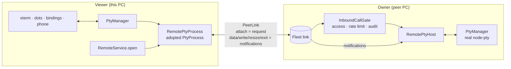

# Remote: drive a peer's sessions from here

## Why

Fleet lets you **delegate**: your AI calls another Helm's tools with `peer_call`. Remote lets you **talk**: a session running on another PC appears here as an ordinary row. Its terminal streams from the peer, and your controller, keyboard, phone and voice drive it directly, with no AI in the middle.

Remote is an option of Fleet, not a separate system. It uses Fleet's TLS-WS link, SAS pairing, per-peer access flag, rate limit and audit log. It adds no new port, crypto or pairing.

## Shape



- **A remote PTY is just a `PtyProcess`.** `PtyManager.adopt()` registers a `RemotePtyProcess` exactly like a spawned process. Everything downstream (terminal, activity dots, pattern matcher, `session_send_text`, bindings, the phone) works unchanged.
- **Attach is the grant.** `remote.attach` is a request, so it passes the owner's `InboundCallGate` like any Fleet call. The later `remote.write`, `remote.resize` and `remote.detach` notifications are honoured only from a peer that is currently attached to that session.
- **Streams are notifications.** `PeerLink.notify()` sends id-less JSON-RPC frames: no reply and no timeout, because a round-trip per keystroke would be too slow. The owner coalesces output into one `remote.data` frame per ~16 ms, each with a `seq` number.

## Lifecycle

| Event | What happens |
|---|---|
| Attach | The owner returns a raw snapshot of the last 500 lines, plus the size and label, then nudges a resize so full-screen TUIs repaint. The viewer adds a row with `remote: { peerId, sessionId }`. |
| Lost frame (`seq` gap) | The viewer re-attaches, resets the terminal (`ESC c`) and repaints from a fresh snapshot. |
| Link drops | The viewer shows a notice, and the owner stops streaming to that peer. When the link returns, the viewer re-attaches and repaints. |
| Close the viewer row | This **detaches** only. The CLI keeps running on the owner. |
| Owner's PTY exits | `remote.exit` is sent, and the viewer row ends. |
| Resize | The last resize wins. |

## Rules

- **Remote rows are views, never local sessions.** They are not persisted, not recycle-binned and have no `cliSessionName`, so a restart can never resume-spawn the peer's CLI locally. To get one back after a restart, re-attach.
- **No chains.** A Remote row is never re-exported: attaching to it answers "not found", the Peers-tab picker hides it, and `peer_attach` / `peer_spawn` are denied to inbound fleet peers (a paired phone may use them).
- **Artifacts follow the CLI.** The CLI's MCP calls go to the owner's Helm, so its artifacts live there. `session_artifact_list` and `session_artifact_get` for a Remote row are forwarded to the owner using the owner's session id. That covers the phone, the renderer and local AIs. Downloads, uploads and missions stay local-only for now.

## Access

The owner must let the viewer call it: tick **May call me** for that peer in the owner's Peers tab. That grants every tool except the hard-deny list, `remote.*` included; the viewer sees it as "me → them" and can then attach and spawn. There is no per-tool allow-list.

## Entry points

- **Peers tab:** the **Attach…** button on an online peer lists its sessions, and **Attach** opens the chosen one here.
- **Controller or keyboard attach:** open Settings → Peers, use the D-pad/arrow keys to focus an online peer's **Attach…** button, then focus the chosen session's **Attach** button and press A/Enter. The same picker remains available when a session is not yet attached and therefore is not in the Sessions navigation order.
- **New session (Spawn button or Ctrl+Shift+N, desktop):** Quick Spawn shows This PC plus each eligible peer (Left/Right Bumper, keyboard arrows, or mouse). Selecting a machine lists that machine's own tools. Choosing a tool opens its folder picker for the same machine; a peer's folders come from `peer_call(peer, "directory_list")`. Quick Spawn passes the selected peer-owned tool id directly to `peer_spawn`, which creates and attaches the session here. Slow or refusing peers show loading/error states; a peer that goes offline while selected falls back to This PC. With no eligible peers it stays local and shows no machine tabs. Switch CLI and scheduled-task CLI pickers remain local-only.
- **Phone New session:** a "Runs on" row with the same machines (`peer_list` → `mayCallThem`); the desktop does the spawn and attach, and the phone opens the resulting row. Order is name → Runs on → CLI → folder, each loaded for the chosen machine: its CLIs come from `peer_call(peer, "tool_list")`, and switching machine clears the CLI and folder.
- **Messages and renames go to the owner.** A Remote row is only a pipe into the peer's PTY, so `session_send_text` to it is forwarded as the peer's own `session_send_text` (like a `fleet:` target). The peer builds the envelope and its gate hands the recipient a `fleet:` reply address that routes back here. An envelope typed into the pipe here would carry a sender id the peer can't answer. Renaming the row (UI, MCP or phone) renames the peer's session too.
- **CLI type ids are per machine.** Desktop Quick Spawn reads the peer's tools and passes the selected peer-owned id directly to `peer_spawn`. An MCP `peer_spawn` caller may pass one of this machine's ids; `RemoteService.spawn()` translates a locally-owned id to this machine's display name, while unknown refs (including peer-owned ids) go as-is.
- **MCP:** `peer_attach(peer, sessionId)`. This is how the phone's operator opens a remote session: find it with `peer_call(peer, "session_list", {})`, then attach. Once attached, nothing else is needed; all input and output routes automatically.

## Session lists by computer

The desktop has one Sessions pane per paired peer, titled `Sessions - <peer
alias>`. It reuses the local `SessionList` component with a peer source. Remote
rows appear only in their computer's pane; the local list no longer creates a
`machine:<peerId>` group. Attached rows map to the local remote-session proxy so
they can be focused, detached, and controlled. They remain in keyboard and
gamepad session navigation order, while local directory groups, the group
overview, local session counts, and group chips exclude them. The phone keeps
its existing machine grouping for its own session list.

The peer's snapshot is fetched on connect and reconnect. Session add, remove,
rename, and state changes are pushed as `fleet.sessions` notifications over the
existing Fleet link notification path. The owner coalesces updates and skips an
unchanged snapshot per peer; it sends only to enabled peers whose inbound grant
allows this machine to call them. The receiver checks pairing, peer enablement,
and inbound grant through `InboundCallGate.handleNotification`. Accepted pushes
do not consume the tool-call rate bucket or create tool-call audit entries.
If an older peer does not push, its connect-time snapshot remains available and
the pane's Refresh action fetches another one. When offline, the pane stays
visible with stale rows marked offline; those unattached rows cannot be
attached. Unpairing removes the pane. Closing it persists the closed state in
the user's dock layout and it remains available in the View menu.

```mermaid
sequenceDiagram
  participant Owner as Owner RemoteService
  participant Link as Existing PeerLink notification path
  participant Gate as InboundCallGate
  participant Viewer as Viewer RemoteService / IPC
  participant Pane as Peer Sessions pane
  Owner->>Link: fleet.sessions snapshot on session change
  Link->>Gate: authenticated inbound notification
  Gate->>Viewer: authorize paired peer with inbound enabled
  Viewer->>Pane: peer:sessions-changed
  Pane->>Viewer: peer:sessions on connect/reconnect or Refresh
  Viewer->>Link: session_list request to peer
  Link-->>Pane: snapshot via peer:sessions
```

## Modules

| Module | Role |
|---|---|
| `src/session/remote/remote-protocol.ts` | Wire vocabulary shared by both sides |
| `src/session/remote/remote-pty-host.ts` | Owner: streams, applies writes, authorizes by attach |
| `src/session/remote/remote-pty-process.ts` | Viewer: adopted `PtyProcess`, seq ordering, repair |
| `src/session/remote/remote-service.ts` | Both roles over the live Fleet link manager; `open()`, `spawn()` |
| `src/mcp/peer/fleet-access-sync.ts` | Reports my access flag to each peer (`fleet.access`) |
| `src/mcp/peer/peer-link.ts` | `notify()` plus the `notification` event |

## Known limitations

- Unticking **May call me** stops **new** attaches but doesn't cut a stream that's already attached. To cut it, disable the peer; that drops the link.
- A spawn whose attach fails leaves the CLI running on the peer; the error names it so it can be attached from the Peers tab.
- Attaching is manual (Peers tab or `peer_attach`). Remote rows aren't restored after a restart.
- Artifact downloads and uploads, missions and hooks for a Remote row stay with the owner.
