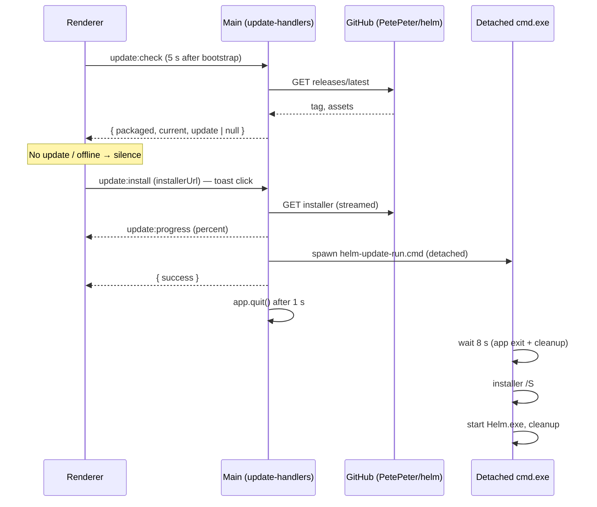

# Self-Update

Launch-time check against GitHub releases, followed by a **silent download →
install → restart** when the user accepts. One flow, no browser involved.

## The check

- Runs 5 s after renderer bootstrap (`renderer/composables/useUpdateCheck.ts`),
  fire-and-forget, only in packaged builds (`packaged: false` is reported for
  dev and the renderer stays silent).
- **Settings → ⬆ Updates** holds `updateCheck: auto | manual` in
  `settings.yaml` (missing/unknown = `auto`). `manual` skips the launch check
  entirely — no GitHub request at all. **Check now** works in either mode and
  always answers (up to date / available / could not check), because a
  user-initiated check that stays silent reads as broken.
- `parseLatestRelease` (`src/session/update-checker.ts`) compares the tag
  against `app.getVersion()` and picks the one asset matching
  `Helm Setup X.Y.Z.exe` — APK, blockmap, checksums and Mac builds are ignored.
- Every failure (offline, rate limit, DNS, malformed payload) answers
  `{ update: null }` — a failed check must never look like an update, or a
  phantom one.

## The install

1. **Validate** — the URL handed back by the renderer must be a
   `github.com/PetePeter/helm/releases/download/…` URL. A tampered renderer can
   at worst re-trigger downloading our own release.
2. **Download** — streamed to disk into the Helm temp dir (app-data, never
   the repo tree) as `helm-update-Helm Setup X.exe` — never buffered in
   memory, the installer is ~150 MB and the main process hosts every PTY.
   Size checked against `Content-Length`. Progress broadcasts on
   `update:progress` to every live window.
3. **Script** — `helm-update-run.cmd` (built by `buildUpdateScript`) waits 8 s
   for the app to exit (before-quit cleanup caps at 5 s), runs the NSIS
   installer with `start /wait … /S` (silent; installs over the previous
   directory the installer remembers in the registry — and `start /wait`
   because a GUI-subsystem installer returns to cmd instantly, which would
   let the relaunch race a half-written install), relaunches
   `process.execPath`, then deletes the installer and itself.
4. **Quit** — main quits ~1 s after resolving, so the renderer can show its
   "Installing & restarting" toast. Quitting runs the normal close path:
   PTYs close into the recycle bin and restore-with-resume on relaunch.

Backstops:

| Risk | Cover |
|------|-------|
| App still alive when the installer starts | The silent electron-builder NSIS installer kills a running Helm |
| Update never completes (crash mid-download) | `helm-update-` prefix joins `OWNED_TEMP_PREFIXES`; the startup temp sweep reaps stranded files |
| Double-click during install | Main (`installing` flag) and renderer both no-op |
| Renderer toast | Persistent, click = install, × = dismiss; failures swap to an 8 s error toast |

## Preload surface

| Method | Channel | Effect |
|--------|---------|--------|
| `updateCheck` | `update:check` | Release check result (never rejects) |
| `updateInstall` | `update:install` | Download + silent install + restart |
| `updateGetMode` / `updateSetMode` | `update:getMode` / `update:setMode` | Read / persist the auto/manual launch-check setting |
| `onUpdateProgress` | `update:progress` | `{ stage, percent, … }` push |

Domain `update` in the preload contract; renderer client
`renderer/ipc/clients.ts` → `updateClient`.

## Key modules

| Module | Role |
|--------|------|
| `src/session/update-checker.ts` | Pure decisions: version compare, asset pick, release parse, update script text |
| `src/electron/ipc/update-handlers.ts` | `update:check` / `update:install` handlers, streamed download, detached spawn |
| `renderer/composables/useUpdateCheck.ts` | Mode-gated launch check, Check now, toast offer, install click-through with progress |
| `renderer/components/sidebar/UpdatesTab.vue` | Settings tab: mode select + Check now + running version |
