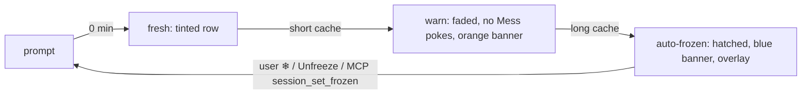
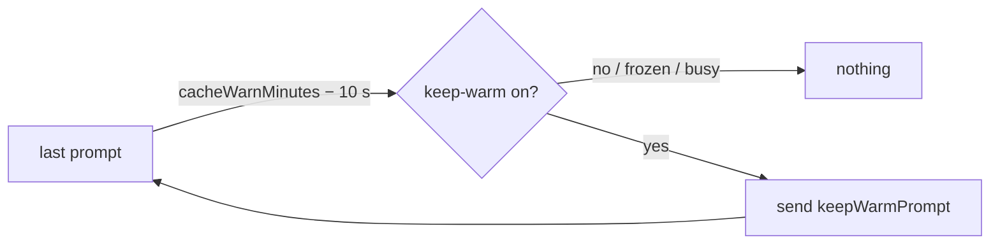

# Session Freeze & Prompt-Cache Staleness

A CLI's prompt cache expires a fixed time after its last prompt. Past that,
the next prompt re-reads the whole context at full price. Helm makes that
visible, stops nudging stale sessions, and finally freezes them so nothing
wakes one by accident.

## Thresholds (per CLI type)

| Setting | Default | Effect once exceeded |
|---|---|---|
| `cacheWarnMinutes` (short cache) | 5 | Row tint has faded out; Mess reminders stop; orange banner above the terminal |
| `cacheExpireMinutes` (long cache) | 60 | Red banner, then `AutoFreezer` freezes the session |

Both are edited in the CLI type editor and stored only when they differ from
the default. The clock is `lastPromptAt` (`src/session/prompt-staleness.ts`).

## What counts as a prompt

- `UserPromptSubmit` hook — except a prompt starting `[HELM_MESS]`: a Mess
  poke is Helm talking, and counting it would keep a dormant session awake.
- Enter typed on the desktop (CLIs without hooks), unless the session is frozen.
- A delivered `session_send_text` — the sender's message re-arms the recipient.
- Thawing — so an auto-frozen session does not refreeze on the next tick.

## Freeze

`SessionInfo.frozen` (persisted). Enforced at two choke points so no path is
missed:

- **`PtyManager.write`** drops every non-scroll write — desktop keys, hook
  output, Mess pokes, handover pastes. Mouse scroll still passes: reading is
  not input.
- **`deliverPromptSequenceToSession`** and **`sendTextToSession`** throw
  `Session "…" is frozen`, so programmatic senders (MCP, schedules, chat) get
  an error instead of a silent drop.

`LoopDriver` never Stop-blocks a frozen session (a block is a new prompt), and
`MessNotifier` skips it. The operator is never auto-frozen.

Ways to thaw: the row's ⋮ menu (or right-click the frozen terminal) →
Unfreeze, the Unfreeze button on the terminal overlay, or MCP
`session_set_frozen` from another session. A frozen session's menu offers only
what works without typing into it — Unfreeze, Helm Compact, Clone, Switch CLI —
and Helm Compact thaws it first, since it must type `/clear`.

## Keep warm

The row's ⋮ → **Keep cache warm** sets `SessionInfo.keepWarmUntil` (persisted)
8 hours ahead. `KeepWarmer` then sends the CLI type's `keepWarmPrompt`
(sequence syntax, default `{Esc}heartbeat`) **10 s before its short cache
lapses** (`cacheWarnMinutes` − 10 s; 4:50 for 5 min), so the next real prompt
still hits the cheap cache. Each ping costs one short turn, which is why it is
opt-in and lapses on its own. It skips a busy session (already warming itself)
and a frozen one.

## Row status icons

The ⋮ menu replaced the row's lock / freeze / eye / rename buttons. What they
used to show now sits centred on the row: 🔒 locked, ❄️ frozen, ⏰ keep-warm —
every one that applies, side by side. The phone shows the same icons on its
session rows and after the name in the open session's header. The cache banner
is drawn both above and below the terminal, where the eyes are while typing.

## On the phone

`session_list` carries `frozen`, `lastPromptAtEpochMs` and the CLI type's
resolved `cacheWarnMinutes` / `cacheExpireMinutes`. The Android chat shows the
same orange / red / blue banner above the thread (with Unfreeze when frozen),
and rows show the same 🔒 ❄️ ⏰ icons as the desktop (`locked`,
`keepWarmUntilEpochMs` ride the summary too). A message refused because the session is frozen
settles as `Delivery.Frozen` — matched on the desktop's "is frozen" wording —
with an **Unfreeze & send** action that calls `session_set_frozen` and resends.
The phone's clock may disagree with the desktop's, so its banner is advisory;
the desktop owns the actual freeze.
