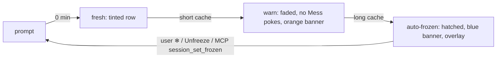

# Session Freeze & Prompt-Cache Staleness

A CLI's prompt cache expires a fixed time after its last prompt. Past that,
the next prompt re-reads the whole context at full price. Helm makes that
visible, stops nudging stale sessions, and finally freezes them so nothing
wakes one by accident.

## Thresholds (per CLI type)

| Setting | Default | Effect once exceeded |
|---|---|---|
| `cacheWarnMinutes` (short cache) | 5 | Row tint has faded out; Mess reminders stop; orange banner above the terminal |
| `cacheExpireMinutes` (long cache) | 60 | Red banner, then `AutoFreezer` freezes the session |

Both are edited in the CLI type editor and stored only when they differ from
the default. The clock is `lastPromptAt` (`src/session/prompt-staleness.ts`).

## What counts as a prompt

- `UserPromptSubmit` hook — except a prompt starting `[HELM_MESS]`: a Mess
  poke is Helm talking, and counting it would keep a dormant session awake.
- Enter typed on the desktop (CLIs without hooks), unless the session is frozen.
- A delivered `session_send_text` — the sender's message re-arms the recipient.
- Thawing — so an auto-frozen session does not refreeze on the next tick.

## Freeze

`SessionInfo.frozen` (persisted). Enforced at two choke points so no path is
missed:

- **`PtyManager.write`** drops every non-scroll write — desktop keys, hook
  output, Mess pokes, handover pastes. Mouse scroll still passes: reading is
  not input.
- **`deliverPromptSequenceToSession`** and **`sendTextToSession`** throw
  `Session "…" is frozen`, so programmatic senders (MCP, schedules, chat) get
  an error instead of a silent drop.

`LoopDriver` never Stop-blocks a frozen session (a block is a new prompt), and
`MessNotifier` skips it. The operator is never auto-frozen.

Ways to thaw: the ❄ button on the row, the Unfreeze button on the terminal
overlay, or MCP `session_set_frozen` from another session.
