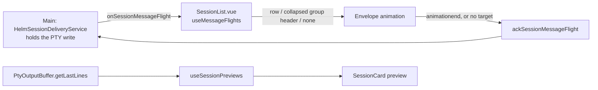

# Session List previews and message flights

Each Session List row shows a live tail of its session's terminal, and the list
animates every message one session sends another. Both used to live in Team
View, a second roster pane that duplicated the Session List. Team View was
retired (P-0804) and these two parts moved into the list.

## PTY preview

- **Source:** the renderer's existing `PtyOutputBuffer`, which is already
  ANSI-stripped. The preview never copies PTY data into a store, takes focus,
  or writes a terminal. Clicking the row selects the session as before.
- **Lines:** the last 5 *non-blank* lines. TUIs pad their output with empty
  rows, so the raw last 5 lines are often blank.
- **Throttle:** buffer updates bump one version counter at most every 250 ms, so
  a burst of `pty:data` re-renders once rather than per chunk.
- **Late manager:** dock panes mount before `useAppBootstrap` builds the
  `TerminalManager`, so the composable subscribes to `onTerminalManagerChanged`
  instead of reading the buffer once at setup.
- **Setting:** Settings → Session List → *Output preview*: `on` (default),
  `selected-only` (one preview, for gamepad density) or `off` (compact rows).
  Persisted as `sessionPreviewMode` with the session-group prefs.

## Message flights

The delivery service broadcasts a flight **before** it pastes an inter-session
message, and holds the paste until the renderer acks it. Landing the envelope
is what releases the message.

| Case | Behaviour |
|------|-----------|
| Recipient row rendered | Envelope flies there; ack on `animationend`; the row flashes accent for 0.6 s |
| Recipient inside a collapsed group | Lands on that group's header |
| Recipient not rendered (closed, filtered) | Acked at once, with no animation |
| Sender has no row (phone proxy, peer) | Flies in from the list's top-right corner |
| Session List unmounted mid-flight | Every pending flight is acked on unmount |
| No Session List mounted at all | Main-process timeout (`HELM_MESSAGE_FLIGHT_TIMEOUT_MS`, default 1.6 s) releases it |

A paste is never held hostage to a missing target. Anchors are matched by
comparing `dataset` values, not by building an attribute selector, because
session ids and paths contain characters that would need CSS escaping.
Envelope colours come from `MESSAGE_FLIGHT_COLORS` in `renderer/state-colors.ts`:
blue for a first send, amber for a reply within the reply window.
