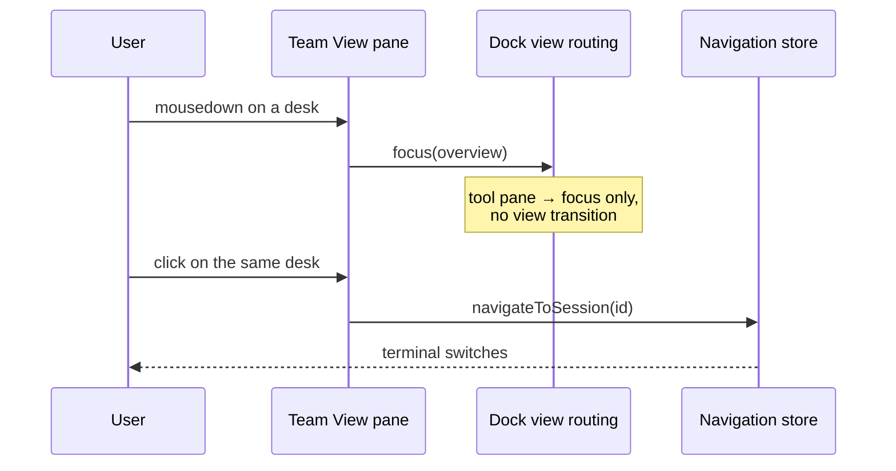
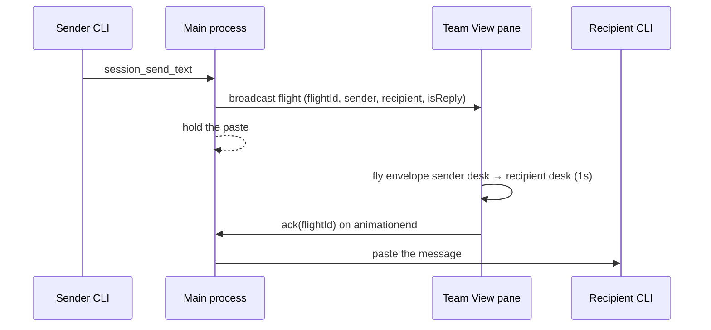

# Team View

Team View is the docked replacement for the former Overview pane. The saved
dock id remains `overview`, so an existing layout opens Team View in the same
place; its tab and View-menu name are **Team View**. The Session List is a
separate dockable tool and both surfaces may be visible together.

## It is a tool pane, not a view mode

Team View renders a pure reactive projection
(`renderer/composables/useTeamViewProjection.ts`) — there is no mount/unmount
lifecycle to run, so the `overview` **pane** is not mapped to a **view mode** in
`renderer/composables/useDockViewRouting.ts`. Only Terminal and Plans are.

That mapping is load-bearing, not bookkeeping. A click starts with `mousedown`,
so the pane's `focusin` reaches the shell *before* the click handler:

Were the pane a view mode, that `focusin` would start a view transition whose
`navigationRequestId` bump cancels the click's own `navigateToSession` as a
stale request — every selection after the first would silently do nothing, and
the action panel would unmount under the pointer as `tm.deselect()` cleared the
active session.

The legacy fullscreen group-overview grid is a separate thing that still exists
and still has the `overview` view mode; it is reached through `openOverview()`
(the Session List group action), never through this pane.

A desk selection that did not reach a session is reported by
`onOverviewSelect` (`renderer/composables/useSidebarController.ts`) rather than
discarded — on screen, a dropped navigation is indistinguishable from a
successful one.

The default dock layout gives Team View its own column beside the view group:
as a tab of the terminal group it would be hidden the moment a selection made
through it activated the terminal.

Each project with open sessions is a department and each session is a desk.
Desk monitors show only a short, passive, clipped tail of that session's real
PTY output. They cannot receive focus or input. Selecting a desk uses the same
normal session-selection path as Session List and `Ctrl+number`; Terminal
remains the only interactive terminal surface.

`Ctrl+1` through `Ctrl+9` and `Ctrl+0` are displayed only on desks assigned by
the shared Session List shortcut map. Desks are ordered within a department by
that slot (ascending, slot-less desks after) and departments by their lowest
member slot, so the labels read top-left → right → down across the whole
view. Department collapse is saved with the
existing session-group preferences. Desk state, waiting cue, lock, visibility,
rename, artifact, and close controls are projections of the existing session
boundaries rather than a second Team View state store.

## Operator bar

One persistent operator bar is sticky at the top of the pane — selection
context, then the desk actions (open, copy reference, lock, hide/unhide,
artifacts, close) and the rename form when a desk is selected. With no
selection it shows a "Select a desk" hint and no controls. `Ctrl+Shift+R`
claims the Session List rename chord **when the Team View pane is focused**
(the global `session-meta-keys` handler declines the chord for a focused Team
View, per `renderer/keyboard/handlers/terminal-keys.ts`) and focuses the
rename input.

## Hidden desks

Hiding a desk writes the same persisted `overviewHidden` key the Session List
hide uses (`cliSessionName` when present, else session id — see
`isSessionHiddenFromOverview`). Because `cliSessionName` survives restarts, a
hidden desk stays hidden across Helm restarts — so hiding collapses the desk
to a **name-only row** (no state, monitor, or avatar) rather than removing it:
hidden sessions stay visible, selectable, and fully operable from the operator
bar, whose Hide button becomes **Unhide** for a hidden selected desk. Hidden
desks keep their Session List slot while hidden, so unhiding restores both the
desk and its `Ctrl+number`.

## Recycle bin

A bin entry sits at the very bottom of the pane — the same `useRecycleBin`
singleton the Session List button drives (live count badge, globally mounted
`RecycleBinModal`). Opening it from either surface is the same modal.

## Layout and theme

- The desk grid is `repeat(auto-fill, minmax(340px, 1fr))` — 1 per row when
  narrow, 2, 3, … as width allows. Each tile is an inline-size container; below
  280px the desk monitor is dropped so tiles compress instead of overflowing in
  short horizontal docks.
- The avatar figure lives in a fixed-width rail inside each tile — it can never
  render outside its desk (it previously overhung neighbouring content when a
  dock squeezed the pane).
- Colours come from the shared `renderer/styles/main.css` tokens; Team View
  paints no palette of its own. Only the activity dot (via `getActivityColor`)
  and message flights (via `MESSAGE_FLIGHT_COLORS`) carry colour semantics.

## Live desk plumbing

Two desk cues come straight from the same renderer sources the Session List
uses — Team View owns no state of its own for either:

- **Activity dot** — `state.sessionActivityLevels` (PTY output timing, fed by
  `pty:activity-change`) flows into the projection via
  `activityLevelForSession` and is rendered with the shared
  `getActivityColor` palette (`renderer/state-colors.ts`). Never hardcode a
  dot colour here.
- **Desk monitor tail** — the `PtyOutputBuffer` behind the TerminalManager.
  The pane's composable resolves the buffer *reactively*
  (`onTerminalManagerChanged`), because dock panes mount before
  `useAppBootstrap` constructs the TerminalManager; a one-time read at setup
  is permanently null. Buffer updates invalidate the projection on a
  250 ms trailing throttle so PTY bursts recompute once per window.

## Notifications

A desk with unread LLM notifications shows a count badge inline in its meta
row (next to the activity dot and state) and its figure takes the waving
pose regardless of state — a person flags for attention while unread. The
full list is projected verbatim via `notificationsForSession` from the
`llmNotifications` store, the same source Session List reads: dismissal in
either surface clears both, and there is no second notification state.
Clicking the badge opens a popover (the shared `NotificationCarousel`)
anchored inside the desk tile — a desk-local read that does not select the
desk — and only one popover is open at a time; `Escape` closes it.

## Message flights (envelope animation)

Every enveloped `session_send_text` pauses before its bytes reach the
recipient's composer: the main process broadcasts a flight
(`session:message-flight`) and holds the paste until the renderer acks the
landing (`session:message-flight-ack`):

- The hold is **never a hostage situation**: the delivery service races the
  ack against `HELM_MESSAGE_FLIGHT_TIMEOUT_MS` (default 1600 ms), so
  headless MCP traffic with no renderer degrades to a short fixed delay.
- A flight whose recipient desk is missing (closed session, other project) is
  acked immediately; a sender without a desk (phone, mobile proxy) flies in
  from the pane corner.
- Colours live in `MESSAGE_FLIGHT_COLORS` (`renderer/state-colors.ts`): a
  first send flies blue, any reverse-direction send within the 10-minute
  reply window flies amber — replies to replies included.
- Contract and constants: `src/session/message-flight.ts`; IPC wiring in
  `src/electron/ipc/handlers.ts`; preload channels `onSessionMessageFlight` /
  `ackSessionMessageFlight` in the `sessions` domain.
