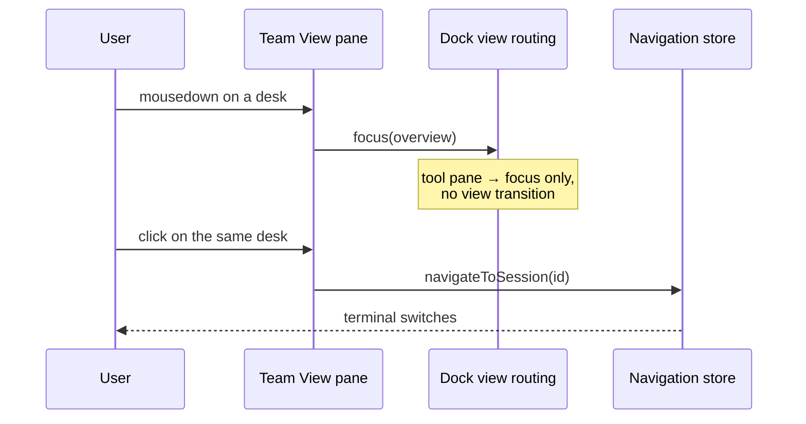

# Team View

Team View is the docked replacement for the former Overview pane. The saved
dock id remains `overview`, so an existing layout opens Team View in the same
place; its tab and View-menu name are **Team View**. The Session List is a
separate dockable tool and both surfaces may be visible together.

## It is a tool pane, not a view mode

Team View renders a pure reactive projection
(`renderer/composables/useTeamViewProjection.ts`) — there is no mount/unmount
lifecycle to run, so the `overview` **pane** is not mapped to a **view mode** in
`renderer/composables/useDockViewRouting.ts`. Only Terminal and Plans are.

That mapping is load-bearing, not bookkeeping. A click starts with `mousedown`,
so the pane's `focusin` reaches the shell *before* the click handler:

Were the pane a view mode, that `focusin` would start a view transition whose
`navigationRequestId` bump cancels the click's own `navigateToSession` as a
stale request — every selection after the first would silently do nothing, and
the action panel would unmount under the pointer as `tm.deselect()` cleared the
active session.

The legacy fullscreen group-overview grid is a separate thing that still exists
and still has the `overview` view mode; it is reached through `openOverview()`
(the Session List group action), never through this pane.

A desk selection that did not reach a session is reported by
`onOverviewSelect` (`renderer/composables/useSidebarController.ts`) rather than
discarded — on screen, a dropped navigation is indistinguishable from a
successful one.

The default dock layout gives Team View its own column beside the view group:
as a tab of the terminal group it would be hidden the moment a selection made
through it activated the terminal.

Each project with open sessions is a department and each session is a desk.
Desk monitors show only a short, passive, clipped tail of that session's real
PTY output. They cannot receive focus or input. Selecting a desk uses the same
normal session-selection path as Session List and `Ctrl+number`; Terminal
remains the only interactive terminal surface.

`Ctrl+1` through `Ctrl+9` and `Ctrl+0` are displayed only on desks assigned by
the shared Session List shortcut map. Department collapse is saved with the
existing session-group preferences. Desk state, waiting cue, lock, visibility,
rename, artifact, and close controls are projections of the existing session
boundaries rather than a second Team View state store.
