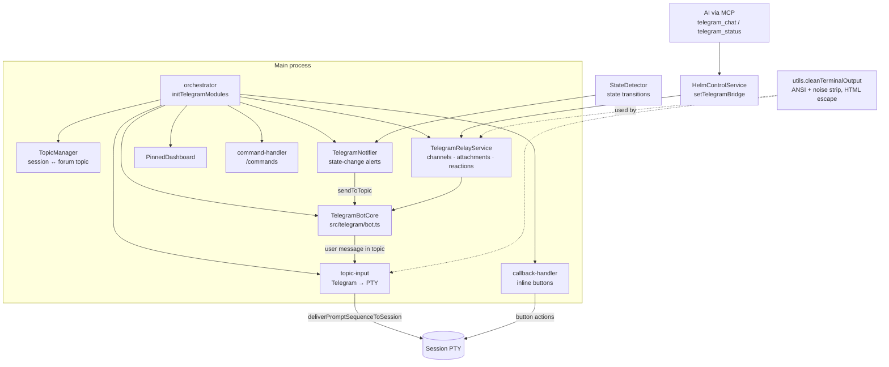
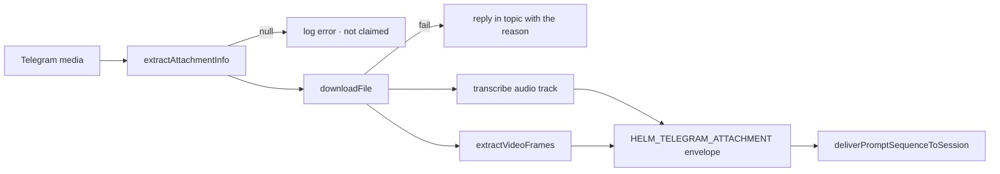

# Telegram Integration (session topics, notifications, relay)

Helm can be driven and observed from a phone. A Telegram **forum group** becomes a
mirror of the app: each hub session gets its own **forum topic**, state changes post
notifications into that topic, anything the user types in a topic is injected into
that session's PTY, and an AI can deliberately open a conversation channel with the
user through the `telegram_chat` MCP tool.

> **⚠️ Divergence from CLAUDE.md decision 19.** CLAUDE.md describes an activity-gated
> `TerminalMirror` class that buffers raw PTY output during green-dot periods and
> flushes it to Telegram on activity/state transitions, with a 50 KB safety flush,
> a 3500-char head+tail truncation and a `📝` prompt echo. **No `TerminalMirror`
> exists in the codebase** (`grep -rn TerminalMirror` returns nothing). That
> firehose-mirroring design was replaced by an *explicit* model: the AI decides what
> reaches Telegram (`telegram_chat`), and the app posts state-change notifications.
> The output-cleaning machinery that decision 19 described (ANSI strip, spinner /
> progress-bar / `esc to cancel` / `AIAGENT-*` noise filtering, HTML escaping) **did
> survive** and now lives in `src/telegram/utils.ts`. This document follows the code.

## Why it exists

- **Away from the desk.** A long-running CLI finishes, or asks a question, hours
  after you walked away. A phone notification plus a reply box beats coming back to
  a stalled terminal.
- **Explicit over ambient.** Mirroring *all* terminal output to a chat app is noisy,
  expensive and leaky. The current design puts the AI in charge of what is worth a
  message, and limits automatic traffic to a handful of rate-limited state
  notifications.
- **One topic per session.** A forum topic gives every session a persistent,
  addressable thread, so a reply needs no routing metadata — the topic *is* the
  session.

## Architecture

## Key modules

| File | Role |
|------|------|
| `src/telegram/bot.ts` | `TelegramBotCore` — token/chat/allow-list, polling, send primitives (`sendToTopic`, `sendPhoto`, `sendDocument`, …) |
| `src/telegram/orchestrator.ts` | `initTelegramModules()` — wires every module together and returns a `cleanup()` |
| `src/telegram/topic-manager.ts` | `TopicManager` — session ↔ forum-topic mapping, topic naming `[InstanceName] session-name`, `ensureAllTopics`, stale-topic probe/cleanup |
| `src/telegram/topic-registry.ts` | `TelegramTopicRegistry` — the persisted topic records |
| `src/telegram/notifier.ts` | `TelegramNotifier` — posts on active → non-active state transitions, with dedup + rate limit |
| `src/telegram/relay-service.ts` | `TelegramRelayService` — AI-facing channel broker, attachments, voice transcription, reactions; implements `TelegramBridge` |
| `src/telegram/topic-input.ts` | `setupTopicInput` — Telegram message → PTY stdin |
| `src/telegram/callback-handler.ts` | Inline-keyboard callbacks (reply, approve, drafts, …) |
| `src/telegram/command-handler.ts` | `/help` and other slash commands |
| `src/telegram/keyboards.ts` | Inline keyboard layouts (`notificationKeyboard`, …) |
| `src/telegram/pinned-dashboard.ts` | Pinned message summarising live sessions |
| `src/telegram/utils.ts` | `stripAnsi`, `cleanTerminalOutput`, `escapeHtml`, `formatAgentMessageForTelegram`, `validateMobileFriendlyTelegramText` |
| `src/voice/openwhispr-transcriber.ts` | Voice/audio/video track → text transcription |
| `src/voice/ffmpeg.ts` | Shared ffmpeg resolution (configured path → OpenWhispr bundle) and process runner |
| `src/telegram/video-frames.ts` | Video → JPEG contact sheet, plus the seek command the agent uses for other timestamps |
| `src/voice/piper-tts.ts` | Text → voice replies |
| `src/electron/ipc/telegram-handlers.ts` | Settings/start/stop IPC surface |
| `src/mcp/services/helm-telegram-service.ts` | MCP tools `telegram_chat`, `telegram_status`, `telegram_channel_close` |

## Output cleaning (`cleanTerminalOutput`)

Anything derived from raw terminal bytes passes through `cleanTerminalOutput()`
before it is shown in a chat. The rationale for each step is that a terminal stream
is a *render target*, not a document — replaying it verbatim into a linear chat log
produces unreadable spinner confetti.

1. Strip ANSI escape codes (CSI, private-mode CSI, complete and partial OSC).
2. Normalise `\r\n` → `\n`.
3. Simulate a standalone `\r` as a line overwrite — this is what collapses animated
   spinner frames down to their final state.
4. Simulate backspace (`\b`) deletions.
5. Strip remaining control characters (BEL, NUL, …) while keeping `\n` and `\t`.
6. Drop known CLI noise lines:

   | Pattern | Why |
   |---|---|
   | `… esc to cancel …` hint bars | Pure UI chrome |
   | `…thinking…` lines | Animated status |
   | Braille (`⠋⠙⠹…`) and ASCII (`- \ | /`) spinner frames | Animation residue |
   | `AIAGENT-*` phase tags | MCP-owned protocol markers, not user content |
   | `47/100 tests` style progress counters | High-frequency, low-value |
   | Block-character progress bars | Same |

7. Collapse runs of 3+ blank lines into 2, then trim.

HTML escaping for Telegram's HTML parse mode is separate (`escapeHtml` /
`formatAgentMessageForTelegram`, both delegating to `src/utils/html.ts`), and
`validateMobileFriendlyTelegramText()` rejects messages over 1600 chars or with
lines over 140 chars — a readability contract enforced on the AI, not a truncation.

## Notifications (`TelegramNotifier`)

Automatic traffic is deliberately narrow: only **active → non-active** transitions
notify, where active is `implementing` or `planning`.

| Aspect | Value | Why |
|---|---|---|
| Trigger | `previousState ∈ {implementing, planning}` and `newState ∉` that set | A session that *was working* and stopped is the only interesting moment |
| States reported | `completed` 🎉 · `idle` 💤 · `waiting` ⏳ | Each is individually toggleable (`notifyOnComplete` / `notifyOnIdle` / `notifyOnError`) |
| Per-session dedup | 15 s (`DEDUP_WINDOW_MS`) | Flapping state detection must not spam one topic |
| Global rate limit | 3 per minute (`MAX_NOTIFICATIONS_PER_MIN`) | Ten busy sessions must not turn the chat into a firehose |
| Destination | the session's own topic only | No cross-session noise |
| Payload | emoji + title, session name, directory basename, CLI type, inline action keyboard | Enough to act on from a lock screen |

## Inbound: Telegram → PTY

`setupTopicInput` routes an incoming message in this order:

1. **Attachments with no text** → `TelegramRelayService.handleIncomingTelegramMessage`
   (see [Inbound media](#inbound-media-seeing-and-hearing-attachments)).
2. Messages starting with `/` → ignored here, handled by the command handler.
3. **Relay service first** — if the message answers an open AI channel, it is consumed there.
4. **Topic mapping** — the topic's session receives the text via
   `deliverPromptSequenceToSession` (so sequence syntax works from a phone).
5. **No `message_thread_id`** (the General/root thread) → treated as `/help`.
   This is deliberate: a message with no session context must never be silently
   forwarded to "whichever session happens to be active".

### Inbound media: seeing and hearing attachments

A file path alone is opaque to an AI agent. Inbound media is therefore *converted
into something the agent can perceive* before the envelope is delivered.

| Telegram field | `type` | Transcribed | Frames |
|---|---|---|---|
| `photo` | `photo` | — | — |
| `document` | `document` | if `audio/*` or `video/*` | if `video/*` |
| `video` | `video` | ✅ | ✅ |
| `video_note` (round bubble) | `video_note` | ✅ | ✅ |
| `animation` (GIF) | `animation` | ✅ (silent in practice) | ✅ |
| `voice` | `voice` | ✅ | — |
| `audio` | `audio` | ✅ | — |

Classification is exhaustive by design. An unrecognised media message is logged at
**error** level with its field names — it previously fell through silently, leaving
the user waiting on a reply that could never come.

**Video → frames.** `src/telegram/video-frames.ts` runs one ffmpeg pass to write an
evenly-spread contact sheet (6 frames, 360p) beside the video. The envelope lists
the frame paths *and* the ffmpeg command for seeking any other timestamp, so the
agent decides which moments matter rather than the app hardcoding a sampling
policy. Extraction never throws — frames are a bonus on top of the attachment.

**ffmpeg resolution** lives in `src/voice/ffmpeg.ts`, shared by the transcriber
and the frame extractor: the configured `ffmpegPath` wins, the OpenWhispr bundled
copy is the fallback. PATH is deliberately *not* searched — resolution stays
config-driven so behaviour cannot vary with whatever is installed on the machine.

**Download failures are reported.** Telegram's `getFile` caps bot downloads at
**20MB** (independent of the 50MB outbound limit), which is the usual reason a phone
video never arrives. That case now posts a message naming the size and the cap.

Very large pasted text is diverted to a temp file with a notice, via
`shouldSendLargeTextAsTempFile` / `writeLargeTextTempFile`
(`src/session/large-text-temp-file.ts`) — a multi-thousand-line paste through PTY
stdin is slow and often mangled by the CLI's own input handling.

## Topic lifecycle

`initTelegramModules` subscribes to raw bot events so that the Telegram side and the
hub side stay in sync in **both** directions:

- **`forum_topic_closed`** → delete the topic, clear the mapping, kill the PTY and
  remove the session. Note the ordering comment in the code: the topic is deleted
  *before* `handleTopicClosed` clears `session.topicId`, otherwise the
  `session:removed` listener sees `topicId=undefined` and skips deletion.
- **`forum_topic_edited`** → renaming the topic renames the hub session (the
  `[InstanceName] ` prefix is stripped first).
- **`message_reaction`** → forwarded to `TelegramRelayService.handleReaction`.
- **`session:removed`** (hub side, in `src/electron/ipc/handlers.ts`) → closes the
  session's topic.

## MCP surface

| Tool | Purpose |
|---|---|
| `chat_send` | The transport-neutral name for opening/continuing a conversation channel with the user for its session — every bound surface, not just Telegram |
| `telegram_chat` | Alias of `chat_send` with identical behavior; kept so existing clients keep working |
| `telegram_status` | Whether the bridge is running / available |
| `telegram_channel_close` | Close an open channel |

`HelmControlService.setTelegramBridge(relayService)` installs the bridge at
orchestration time and clears it on cleanup, so the tools degrade gracefully to
"not available" when the bot is off.

## Configuration

Telegram config lives in the settings store (`ConfigLoader.getTelegramConfig()`):
`enabled`, `botToken`, `chatId`, `allowedUserIds`, `instanceName`, `autoStart`, and
the `notifyOnComplete` / `notifyOnIdle` / `notifyOnError` toggles.

Auto-start is intentionally delayed (~60 s after app start) and refuses to run
without a token, chat id **and** a non-empty `allowedUserIds` list — an open bot is
a remote-code-execution surface, since topic input goes straight to a shell.

## Distinct from

- **Notifications via `notify_user`** — routed by `NotificationManager`, which may
  *choose* Telegram when the screen is locked; that is a different entry point.
- **Artifacts** — in-app renderable reports, not chat messages.
- **Flash Attention** — grabs attention on the desktop, never over the network.
