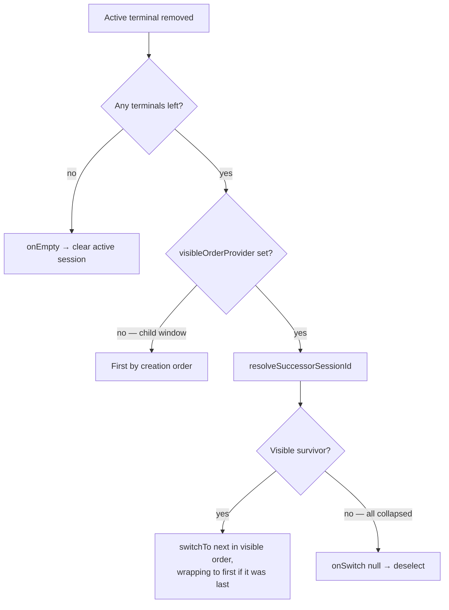
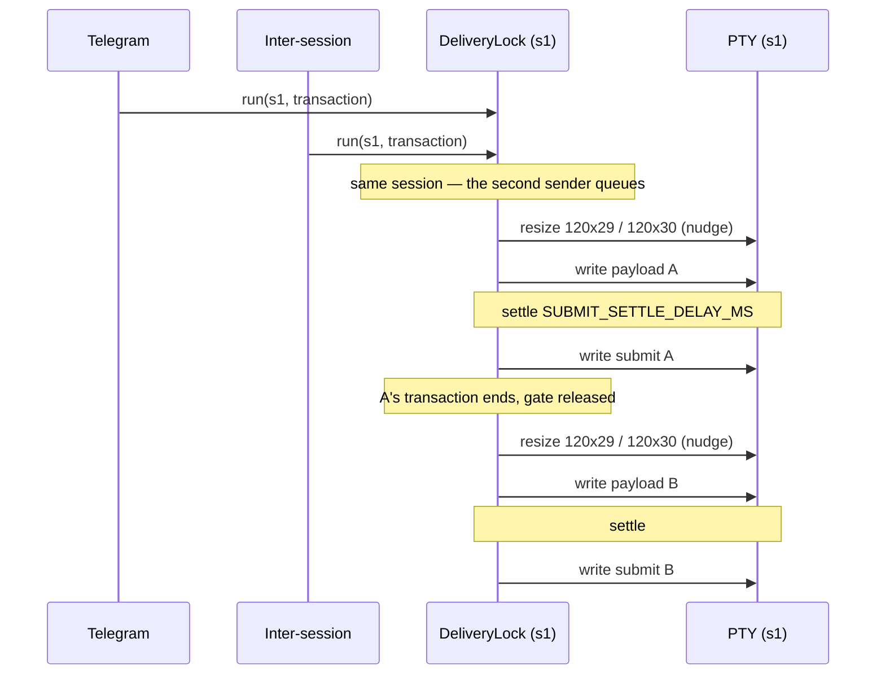
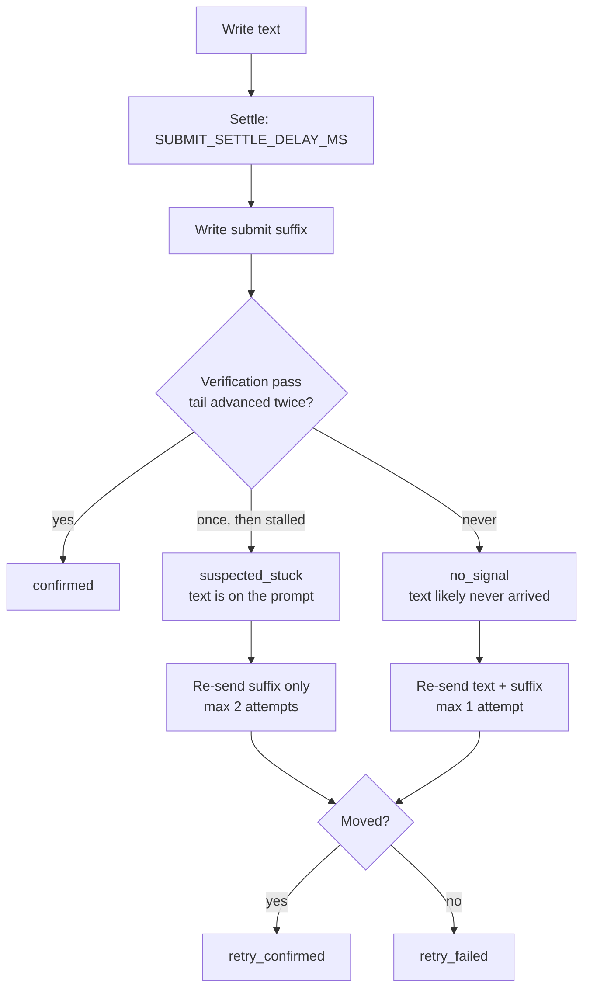

# Embedded Terminal Architecture

All CLIs run inside the Electron app as embedded PTY terminals. No external windows.

## Stack

node-pty (PTY process management, cmd.exe on Windows) + xterm.js (terminal rendering)

## Data Flow

```
Gamepad Button Press / Keyboard Input
  → D-pad/stick: navigate sessions (auto-select terminal)
  → Keyboard: routes to active terminal (PTY stdin)
  → Ctrl+V: paste-handler intercepts → clipboard text → ptyWrite() (any DOM focus)
  → Ctrl+G: paste-handler intercepts → in-app Prompt Editor (EditorPopup.vue) → Ctrl+Enter → deliverPromptSequence() → PTY
  → Non-nav buttons: per-CLI configurable bindings

Modal keyboard capture:
  When a blocking modal is visible (context-menu, close-confirm, prompt-tree picker,
  quick-spawn), ALL keyboard input is captured by the modal and blocked from
  reaching the terminal. modal-base.ts selection mode uses capture-phase
  stopPropagation to prevent xterm.js listeners from receiving keys.
  Tab/Shift+Tab cycles buttons within selection-mode modals (alongside arrow keys).
  paste-handler.ts and main.ts independently check `.modal-overlay.modal--visible`
  to skip Ctrl+V relay and Ctrl+Tab switching.

Right-click paste prevention:
  Capture-phase mousedown listener on terminal elements blocks right-click
  (button 2) via stopPropagation(), preventing xterm.js from processing it
  as a paste action. Applied in both createTerminal() and adoptTerminal().

Input Routing (voice + keyboard bindings):
  Active terminal + target = 'terminal' → keyToPtyEscape() → ptyWrite() (PTY opt-in)
  No active terminal OR target ≠ 'terminal' → robotjs (OS-level key simulation, default)
  Hold mode (PTY path): escape sequence sent once on press (no key-up in PTY)
  Hold mode (OS path): keyboardComboDown() on press, keyboardComboUp() on release

PTY Data Flow:
  Main Process                           Renderer Process
  ┌─────────────┐   IPC: pty:data       ┌──────────────────┐
  │ PtyManager   │ ────────────────────→ │ TerminalManager   │
  │ (node-pty)   │                       │  → TerminalView   │
  │              │ ←──────────────────── │    (mouse guard)  │
  └─────────────┘   IPC: pty:write       │  → xterm.js       │
                     IPC: pty:scrollInput │                    │
                     ↑                    │                    │
  voice/paste ───────┘                    │                    │
  StateDetector  ←── PTY stdout ──────── └──────────────────┘
               ←── PTY stdin (markActive)┌──────────────────┐
               ←── scroll input (markScrolling)
                                         │ [●Claude][●Copilot]│
  PipelineQueue  ←── state changes       └──────────────────┘
```

## Activity Dots

Session cards and overview cards use activity-based coloring (PTY I/O timing, not AIAGENT state):

- 🟢 active (green `#44cc44` — producing output or receiving user input)
- 🔵 inactive (blue `#4488ff` — >10s silence)
- ⚪ idle (grey `#555555` — >5min silence)

Input tracking: the `pty:write` IPC handler calls `StateDetector.markActive(sessionId)` on every keystroke, so the green dot appears immediately when the user types — not just when the shell echoes back. `markActive()` only resets activity timers; it does NOT scan for AIAGENT-* keywords. Helm no longer scrapes printed AIAGENT phase tags from PTY output; agents update durable phase state through `session_set_aiagent_state`. Scroll input uses a distinct path: `pty:scrollInput` IPC handler calls `StateDetector.markScrolling(sessionId)` instead of `markActive()`, suppressing marker scanning for 2s during PageUp/PageDown redraws. Resize uses an analogous path: `pty:resize` IPC handler calls `StateDetector.markResizing(sessionId)`, which suppresses activity promotion for 1s to prevent false green dots when tab switches trigger resize → CLI redraws → output. Terminal switching uses: `pty:markSwitching` IPC (called by TerminalManager before fit()) routes to `markResizing()` to suppress false activity promotion during Ctrl+Tab switching. Session restore uses: `markRestored(sessionId)` sets a 3s grace period that prevents shell startup output from promoting restored sessions to green — ensures restored sessions start as grey (idle) dots.

Session cards also display an elapsed timer showing time since last CLI output (e.g. "just now", "5s", "2m"). `formatElapsed()` helper in `sessions.ts`, driven by `lastOutputAt` piggybacked on the `pty:activity-change` event, refreshed every 10s and on each activity-change.

Colors centralized in `renderer/state-colors.ts` via `getActivityColor()`.

## Terminal Hand-Over

When the active terminal goes away — closed (`detachTerminal`), snapped out, or killed by a failed
spawn / PTY exit (`destroyTerminal`) — another session takes the active slot. That successor is
chosen from the **sidebar's visible order**, never from terminal creation order.

The visible order comes from `getOrderedSessionIds()` (`renderer/utils/session-shortcut-map.ts`),
the same navList-derived list behind Ctrl+Tab and Ctrl+N. Sessions in a collapsed group are absent
from navList by construction; hidden and snapped-out sessions are filtered out explicitly. A session
you cannot see therefore can never be auto-selected.



`onEmpty` means *no terminals at all*. Terminals that exist but are all hidden take the deselect
branch instead: the pane blanks rather than silently activating an invisible session. The teardown
runs before `refreshSessions()`, so navList still holds the departing session — that position is
what makes "the next one down the list" resolvable rather than restarting from the top.

## Delivery & Recovery

Programmatic text (inter-session `session_send_text`, Telegram, scheduled tasks) is written to the
PTY in two parts: the text, then the submit suffix. They are never coalesced.

**One transaction per session.** Delivery is not a single write — it is nudge → payload → settle →
submit, and any interleaving of two of those corrupts both messages. `DeliveryLock`
(`src/session/delivery-lock.ts`) serializes the whole sequence per session.
`deliverPromptSequenceToSession` is the gate for the senders that deliver in this shape — Telegram,
scheduled tasks, inter-session sends, MCP. It is not a universal choke point: pattern-matcher
send-text and spawn-time initial prompts are single atomic writes that bypass the gate, and
renderer-origin delivery (below) runs outside it entirely. Locking the write alone would not have
been enough: two senders could each nudge before either wrote, landing one message's resize between
the other's payload and its submit.



Two things stay deliberately **outside** the gate, and both are load-bearing:

- `PtyManager.write`, so the user's own keystrokes never queue behind a bulk delivery.
- The delivery-verification polling window, which runs for seconds. Recovery re-sends re-acquire the
  gate as a *fresh* acquisition; if verification held it, a resend would wait on a gate its own
  caller still held and deadlock immediately. This is why "recovery must reacquire" and "do not hold
  the lock across verification" are not in tension — do not "simplify" it by pulling verification in.

The lock is per session, not global: delivering to one session never holds up another. Release is
structural rather than `try`/`finally` — each queued task chains off a predecessor whose rejection
has already been swallowed, so a thrown transaction can neither wedge the session nor leak its error
into the next caller.

**On the resize race.** `nudgeResize` stays fire-and-forget. The hypothesis that writing during the
post-SIGWINCH repaint loses bytes was never reproduced: terminals buffer stdin while painting, and
the head-loss that motivated it turned out to be unframed multi-line submission, fixed by bracketed
paste. A quiescence wait keyed to `lastOutputAt` was considered and rejected — `TerminalOutputBuffer`
stamps that field on *every* output chunk, so a mid-generation recipient never goes quiet and the
wait would burn its full budget on the common case, degrading into the fixed sleep it was meant to
replace. The readiness budget below already waits on a specific signal in the case that matters.

**Why the gap matters.** Ink-based full-screen TUIs (Copilot CLI) ingest a paste asynchronously and
only honour Enter once the composer has re-rendered. An Enter that lands mid-paste is swallowed, and
the message sits on the prompt looking sent but never running. `SUBMIT_SETTLE_DELAY_MS`
(`src/session/delivery-context.ts`) is the shared pause both halves of the pipeline wait before
submitting — the main-process sequence executor and the renderer paste path.

**Who writes the bytes.** There is one programmatic delivery path: `PtyManager.deliverText` writes
to the PTY in the main process. The bytes used to travel main → IPC → renderer → IPC → main and be
written by the class they started in, purely to borrow the renderer's DEC 2004 bit and to honour a
`pasteMode` setting offering four alternatives to a plain PTY write — per-character pacing, robotjs
typing, clipboard focus. Nothing ever configured them. `BracketedPasteTracker` supplies the mode bit
and the setting is gone, so the round trip went with it, taking its request timeout, its raw fallback
and its duplicate-write ambiguity.

Renderer-origin delivery is a separate concern that shares a file: `deliverBulkText` in
`renderer/paste-handler.ts` serves the user's Ctrl+V, the prompt editor, gamepad bindings and
sequence delivery. It makes the same framing decision against its own xterm view. Its
payload → settle → suffix writes go through raw `pty:write` and do not hold the main-process
`DeliveryLock`, so a renderer paste can still interleave with a gated delivery — a known gap,
accepted because the overlap window is a single settle delay.

**Framing.** Multi-line text is wrapped in DEC 2004 bracketed-paste markers so a TUI line editor
takes the whole block as one paste instead of reading every embedded newline as Enter and submitting
line-by-line — which left the recipient only the final fragment. The decision depends solely on
whether the CLI announced the mode, never on the delivery context. `BracketedPasteTracker` is the
main process's source of truth: it scans PTY output for `ESC[?2004h` / `ESC[?2004l`, so it sees the
announcement at least as early as xterm.js does and works for a session that was never rendered.
The renderer path (manual Ctrl+V, the prompt editor, gamepad bindings) reads the same state off its
xterm view.

`buildPastePayload` (`src/session/delivery-context.ts`) is shared by both so they cannot drift. A CLI
that never announces the mode — `cmd.exe` — gets raw bytes, because there line-by-line execution is
exactly what pasting a block of commands should do.

The tracker scans incrementally: node-pty splits output arbitrarily, so `ESC[?2004h` can arrive as
`ESC[?20` then `04h`. It carries a bounded tail of the previous chunk (one byte short of a full
sequence, so no transition is counted twice) and takes the last transition it sees.

**Readiness budget.** A freshly spawned CLI turns DEC 2004 on a beat *after* its first prompt
renders, and initial prompts and context deliveries land in exactly that window. Multi-line text
aimed at a session whose mode is still off waits up to `BRACKETED_PASTE_READY_BUDGET_MS`
(`src/session/delivery-context.ts`, shared with the renderer) for the announcement before conceding
and writing raw. The wait aborts as soon as the PTY exits, and single-line text never spends it —
there is no embedded newline to protect. A CLI that never announces the mode pays the full budget;
that is the accepted cost of not silently losing the head of a message to a fresh session.

**Activity marking.** `PtyManager.write` marks the session active, not the `pty:write` IPC handler.
Bytes that originate in main — MCP, Telegram, pattern-matcher send-text — must move the dots too
(invariant 8). Scroll writes pass `'scroll'` and are exempt: a scrollback redraw is not new work.
The IPC handler keeps only the user-origin concerns, the Telegram→desktop `interactionChannel`
switch and the `onPtyInput` hook.

**Verification.** After delivery, `verifyDeliveryAfterDelay` polls the terminal tail's `lastOutputAt`.
One advance means the CLI emitted something (usually the echo); a second advance means it moved past
the echo and is generating. TUIs draw input inside ANSI boxes, so substring matching is unreliable —
timestamps are not.

**Recovery.** A failed pass is remedied, not just logged. Recovery mode is fixed by the first pass so
a stuck CLI is never sent the same message twice. Callers delivering raw terminal control input pass
`retrySubmit: false` to disable it — re-sending arrows or Esc would move a TUI somewhere unintended.



`session_send_text` and `session_send_input` return `deliveryStatus` and `retryCount` alongside
`verified`, so an unattended caller can tell "the CLI is working on it" from "it never got sent".

## Key Modules

| Module | File | Role |
|--------|------|------|
| PtyManager | `src/session/pty-manager.ts` | Spawns node-pty processes (cmd.exe), routes stdin/stdout, handles resize/kill. `deliverText()` is the single programmatic delivery path — framing via `BracketedPasteTracker`, suffix as a separate write after the settle delay, no IPC involved. `write()` marks session activity for every caller. `beginShutdown()` latches app quit: PTY exits after it still free local bookkeeping but no longer emit `exit`, so a quitting app never looks like a wave of closed sessions |
| BracketedPasteTracker | `src/session/bracketed-paste-tracker.ts` | Per-session DEC 2004 state scanned incrementally from PTY output — the main process's source of truth for framing. `waitUntilEnabled()` spends the readiness budget for a just-spawned CLI and bails out if the PTY dies. Cleared on exit/kill/killAll so a reused session id starts disabled |
| StateDetector | `src/session/state-detector.ts` | Tracks PTY I/O activity (active/inactive/idle levels via `activity-change` events) and question markers. `processOutput()` handles PTY stdout (marker + activity); printed AIAGENT phase tags do not mutate session state. `markActive()` handles PTY stdin (activity only, no keyword scan). `markScrolling(sessionId)` handles scroll input — sets per-session flag that makes `processOutput()` skip marker scanning (still tracks activity); auto-clears after 2s; `markActive()` clears it immediately. `markResizing(sessionId)` handles resize — sets per-session flag that makes `processOutput()` skip activity promotion for 1s; prevents false green dots from tab-switch redraws. `markRestored(sessionId)` handles session restore — suppresses activity promotion for 3s grace period; prevents shell startup output from promoting restored sessions to green |
| PipelineQueue | `src/session/pipeline-queue.ts` | Auto-handoff: routes queued tasks to waiting sessions. Handoff triggers on completed or idle state transitions |
| InitialPrompt | `src/session/initial-prompt.ts` | Converts sequence parser syntax to PTY escape codes, sends after configurable delay. `onComplete` callback signals when all items are done |
| SequenceParser | `src/input/sequence-parser.ts` | Parses `{Enter}`, `{Ctrl+C}`, `{Wait 500}` etc. into typed actions |
| TerminalView | `renderer/terminal/terminal-view.ts` | xterm.js wrapper with fit/search addons, OSC title change callback. Optional `onScrollInput` callback for gamepad scroll-specific PTY writes. `scroll(direction, lines)` method: normal buffer → `scrollLines()` viewport scroll; alternate buffer → PageUp/PageDown escape sequences to PTY via `onScrollInput` (falls back to `onData`). Mouse wheel handled natively by xterm.js v6 SmoothScrollableElement — no custom interception. PageUp/PageDown key handler: normal buffer → `scrollLines()` viewport scroll; alternate buffer → xterm.js sends to CLI natively |
| TerminalManager | `renderer/terminal/terminal-manager.ts` | Multi-terminal switching, lifecycle. `deselect()` pauses keyboard relay without destroying terminal. Accepts `contextText` forwarded to main process via `ptySpawn()`. `adoptTerminal()` creates a TerminalView for externally-spawned PTY sessions without calling `pty:spawn`. Capture-phase `mousedown` listener on terminal elements blocks right-click (button 2) from reaching xterm.js paste handling. `switchTo()` calls `pty:markSwitching` before fit() to suppress false activity promotion during terminal switching. Owns `PtyOutputBuffer` for preview data. `setOnTitleChange()` routes terminal title events to renderer state. `writeToTerminal()` writes PTY output directly to xterm.js (no filtering). `setVisibleOrderProvider()` supplies the sidebar's visible session order used for hand-over when the active terminal is destroyed or detached |
| SuccessorPick | `renderer/terminal/successor-pick.ts` | `resolveSuccessorSessionId(orderedVisibleIds, liveTerminalIds, closedId)` — which terminal takes the active slot after a close. Walks forward from the closed session's slot in visible order, wraps once, returns `null` when no visible session survives |
| MouseTrackingGuard | `renderer/terminal/mouse-tracking-guard.ts` | Why: CLIs like Copilot CLI enable xterm mouse tracking, so plain click-drag goes to the app and copying needs Shift+drag. Unless the CLI type sets `mouseTracking: true`, TerminalView registers DECSET/DECRST (`CSI ? … h/l`) parser handlers that swallow mouse modes 1000/1001/1002/1003/1005/1006/1015/1016; non-mouse modes in a mixed sequence are re-written so they still apply. Handled in the xterm parser, so sequences split across PTY chunks are still caught |
| PtyOutputBuffer | `renderer/terminal/pty-output-buffer.ts` | Ring buffer for PTY output per session (ANSI-stripped plain text). Used by group overview for live previews |
| Bindings | `renderer/bindings.ts` | PTY-aware input routing: voice OS-default (robotjs) with PTY opt-in via `target: 'terminal'` + `keyToPtyEscape()` (F1-F12 VT220 sequences) |
| PasteHandler | `renderer/paste-handler.ts` | Document-level Ctrl+V interceptor: reads clipboard, writes to active PTY via `ptyWrite()` regardless of DOM focus. Ctrl+G interceptor: opens the in-app Prompt Editor (`EditorPopup.vue` via `showEditorPopup()`), and on Ctrl+Enter / Send delivers the composed text to the active PTY via `deliverPromptSequence()`. Skipped when any modal overlay is visible (selection-mode modals own all keyboard input) |
