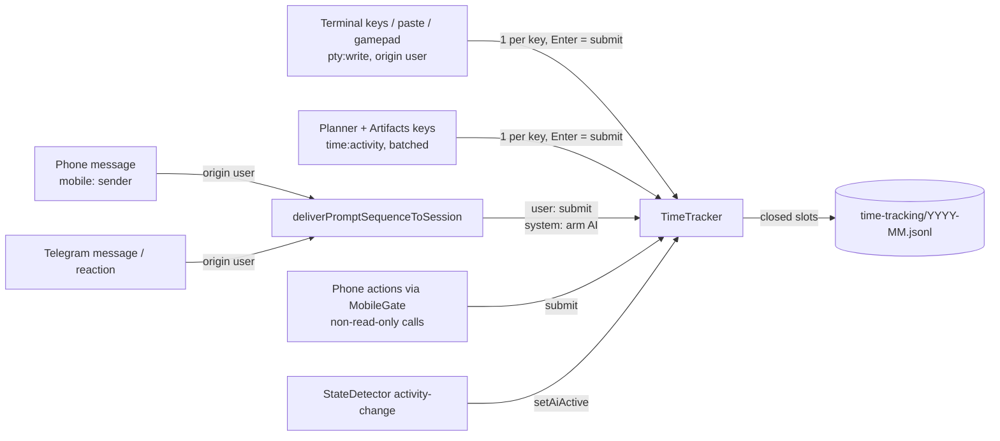

# Time Tracking

How long the user worked on each project, shown as a timesheet per folder.

## Why slots

Measuring the user's own time means guessing at the gaps between inputs. A fixed 5-minute grid makes the guess explicit and cheap. A slot counts if the user did anything in it, and idle slots count nothing. Several inputs inside one slot are still one slot.

## What counts

- **You** (`user` slots): input the user produced: keystrokes in the terminal, planner or artifacts, and on the phone any message or action that changes something. Read-only phone calls (`*_get`, `*_list`, `*_read_terminal`, …) do not count, and neither does reading a terminal.
- **Noise floor**: a project needs `SUBMIT_WEIGHT` (20) input in a slot to earn it. A keystroke weighs 1. A submit (Enter, a phone or Telegram message including speech-to-text, a phone edit) weighs the full 20, so one deliberate send always counts and a few stray keys never do.
- **What never counts:** Programmatic sends (background deliveries, AI-to-AI `session_send_text`, the scheduler, initial prompts) are `system` origin and never count.
- **One project per user slot.** If the user touches two projects in one slot, the one with more input wins, and a tie goes to the latest. Within that project, the folder with the most input gets the slot.
- **AI** (`ai` slots): a session whose activity dot is green earns its project one AI slot, but only once the session has been given a prompt (any delivery or user input arms it). Before that, activity is the CLI booting and is ignored, so starting a session counts nothing until something is sent. Hook turns (UserPromptSubmit → Stop) drive the same dot, which is why the AI window follows prompts. Agents genuinely run in parallel, so AI slots are per project, not exclusive.
- **Project** = the session's Helm project, or its working directory when it has none.

## Storage

Append-only JSONL, one file per local month under the app-data `time-tracking/` dir (config boundary). Each line is one closed slot `{start, kind, projectKey, projectName, dir}`. The open slot is written once it ends, or on shutdown. A corrupt line is skipped. A slot written at shutdown and reopened after a restart is deduplicated on read, and the later record wins. Appending survives crashes without a native DB dependency.

## Timesheet pane

Dock pane **Timesheet** (⏱). It follows the active session's project, like the Mess pane. Rows are folders; the views are:

| View  | Columns |
|-------|---------|
| Hour  | the 24 hours of a day |
| Day   | the 7 days of a Monday week |
| Week  | the Monday weeks covering a month |
| Month | the 12 months of a year |

Each cell shows *You* time plus *AI* time underneath. The arrows page the view, and the range label jumps back to now. **CSV** exports the current view (`period_start,project,directory,you_minutes,ai_minutes`).

All arithmetic (`periodEdges`, `buildTimesheet`, `timesheetToCsv`) lives in `src/session/time-tracker.ts`. The renderer only renders, so the planned phone screen can reuse the same IPC/gate surface.

A saved dock layout from before a pane existed keeps its arrangement, and the new pane is offered as closed in the View menu (`dock-persistence.ts`, `adoptNewPanes`).
