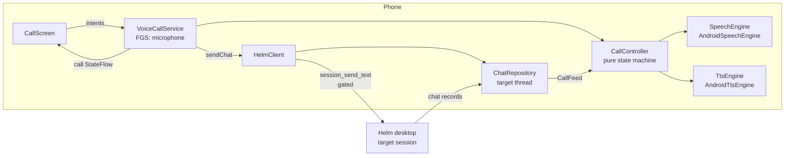
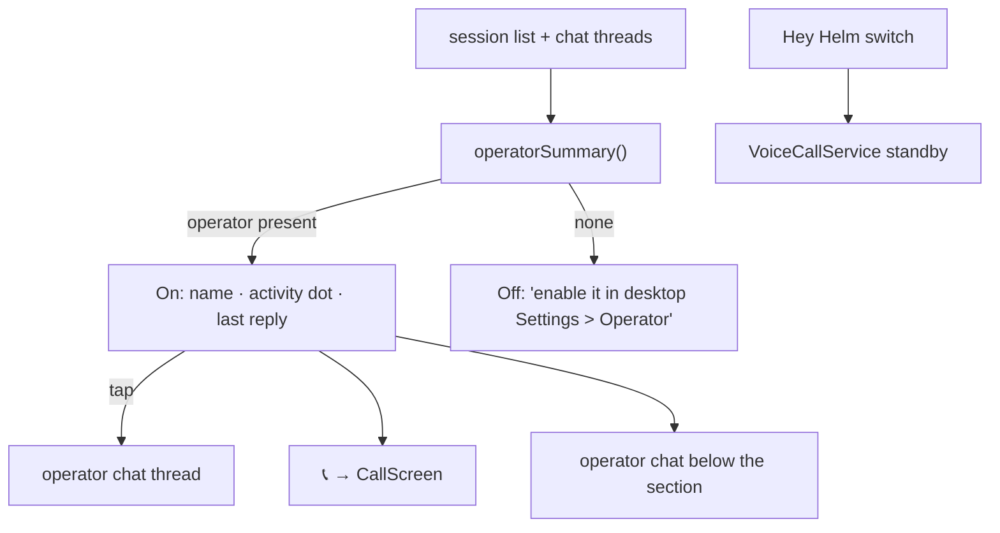
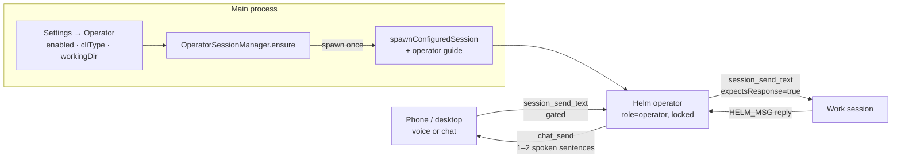
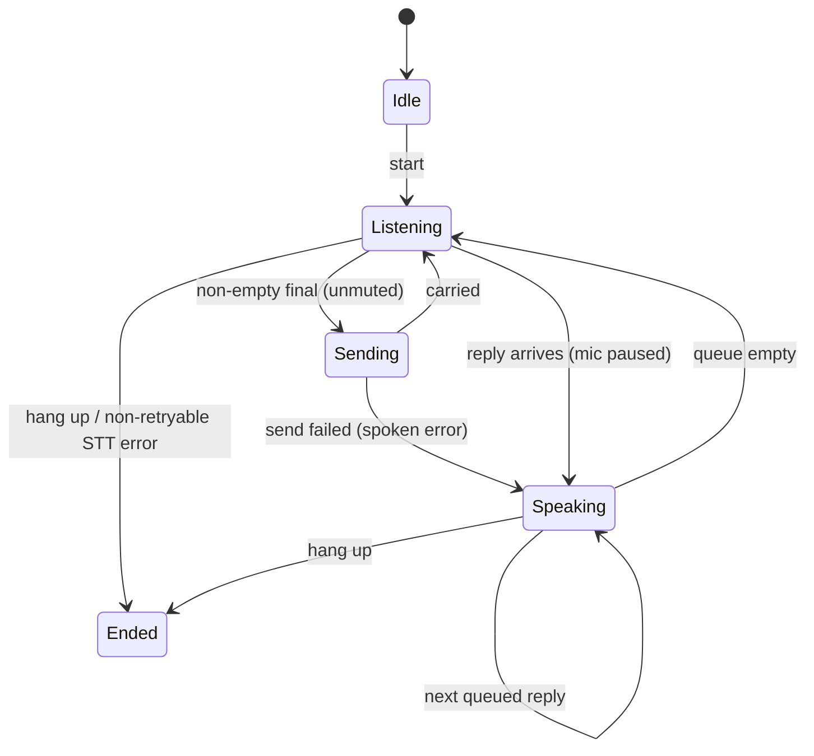
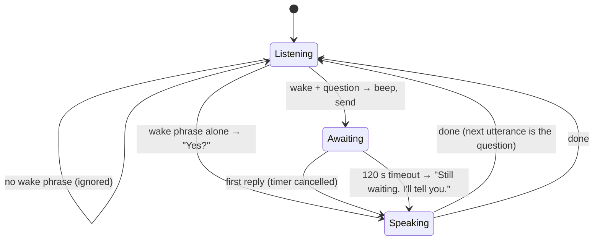
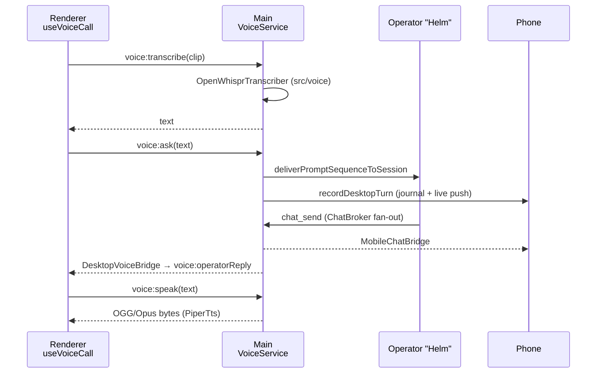
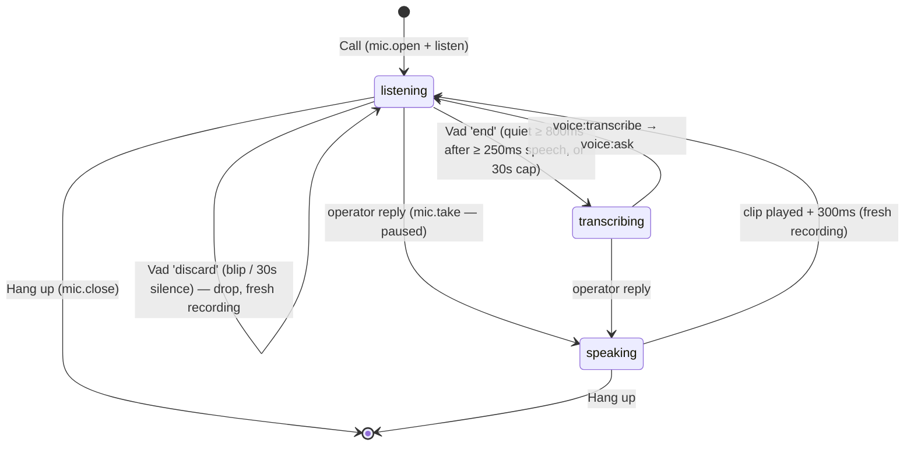

# Voice operator — "Call Helm"

A phone-call-style voice conversation with Helm from the Android app. Tap
**Call Helm**, talk; Helm says "on it" and later speaks the result. Built for
driving: it runs through the car's Bluetooth, the earpiece or the speaker, and
survives the screen turning off.

**Hey Helm** is the opt-in standby: one spoken question, one spoken answer,
no call — see [below](#hey-helm--standby).

This page covers the phone half (P-0834, P-0835), the desktop's
[operator session](#the-operator-session--helm) (P-0833) and
[desktop voice](#desktop-voice) (P-0836). With no operator
configured, a call targets a session the user picks.

## Shape



No new wire surface: an utterance is the same gated `session_send_text` a typed
chat message is, and a reply is whatever lands in the target's chat thread. The
call screen's transcript **is** that thread, so the call and the chat can never
disagree.

## Who is called — `resolveCallTarget`

1. The session whose `role` is `operator` in `session_list`, when there is one.
2. Otherwise the session the user picked (📞 **Call** on its control sheet),
   while that session still exists.
3. Otherwise nobody.

## The Helm home tab

The operator is the FIRST entry of the phone's home dropdown — **Helm**, then
Sessions, Plans, Contexts (`HomeTab`; Sessions stays the default). The Helm tab
is `ui/operator/OperatorSection.kt` — status dot, last reply (tap → the full
thread), 📞 Call, the Hey Helm switch — with the operator's chat thread below
it, the same `ChatScreen` a session's Chat tab uses. Seeing it there counts as
reading it (unread clears). The operator session is filtered OUT of the Sessions
list (`withoutOperator`), so it is shown in one place only.



The last reply is the newest non-phone row of the operator's thread — the same
journal the chat screen reads. The 📞 appears only when an operator
exists (or a call is live); without one, a picked session is still callable
from its control sheet. The phone matches the literal string
`"operator"` (`CallTarget.kt`), so that value is a wire contract.

## The operator session — "Helm"

One locked session named **Helm** that every voice client (phone now, desktop
later) talks to. It answers questions about Helm state and general questions (including web
searches and page fetches)
itself; for work, it is a router: it passes an instruction to the right work
session, acknowledges at once, and speaks a short summary when the reply comes
back. It never edits, runs commands, investigates, or creates/closes sessions —
the work stays in the sessions that own it, and there is one conversation for
phone and desktop to share.



- **Singleton.** `OperatorSessionManager.ensure()` (`src/session/operator-session-manager.ts`)
  runs at startup, after `restoreSessions`, and on every settings save. It
  keeps exactly one `role: 'operator'` session: a persisted one is reused (the
  renderer's auto-resume brings it back on the same `cliSessionName`), a
  missing one is spawned through `spawnConfiguredSession`. Duplicates keep the
  oldest and have their role cleared — demoted, never closed. Lock and the
  name "Helm" are re-asserted on every ensure.
- **Off means demoted.** Disabling the setting clears the operator's role, so
  the phone stops routing to it; the session itself stays open until you close
  it (force, since it stays locked).
- **Restart.** A force-restart (`helm_restart` with `resume:false`) skips the
  operator: its lock is by design, so it neither blocks the restart nor gets
  closed, and it resumes next launch.
- **Settings.** `settings.yaml → operator: { enabled, cliType, workingDir, compactEveryMinutes }`,
  edited in Settings → 🎙 Operator. `cliType` is a dropdown of your own CLI
  types — ids are per-machine UUIDs, so there is no shipped default and
  nothing spawns until one is chosen.
- **Persistence.** `SessionInfo.role` is in `serializeSession`'s allow-list
  (invariant 6), in the renderer's session-refresh allow-list, and in
  `session_list`/`session_get` summaries. An unknown role drops on load.
- **Rules.** `src/mcp/guides/operator-guide.ts` is delivered as the initial
  prompt. There are three modes (P-0838):

  ```mermaid
  flowchart LR
      Q[User asks] --> K{Kind?}
      K -->|Helm state| A[Read-only lookups:<br/>plan_* · sequence_* · session_* · context_*<br/>scheduler_list · memory_* · skill_list<br/>directory_list · project_list · tool_list] --> R[chat_send answer]
      K -->|general| G[Own knowledge + web search] --> R
      K -->|work| W[session_send_text to owning session]
  ```

  The only writes are `chat_send` and `session_send_text`. It never edits
  files, runs commands, reads repo code, mutates Helm state, or spawns or
  closes sessions. It asks back when the target is ambiguous, and it keeps a
  speakable style (no markdown, paths or UUIDs). CLI types come from the
  existing `tool_list`, so no new tool was needed.
  **Rule changes need a fresh prompt:** the guide is the operator's initial
  prompt, so a running operator only picks up edits after it is respawned or
  compacted. The idle self-compaction below re-sends it every time.
- **User rules (P-0842).** Settings → Operator has a **Rules** section. It
  lists the built-in hard rules read-only and has a "Your rules" box.

  ```mermaid
  flowchart LR
      OR[OPERATOR_RULES<br/>operator-guide.ts] --> G[buildOperatorGuide rules]
      OR --> TAB[OperatorTab.vue<br/>read-only list]
      TAB -->|Save| CFG[settings.yaml<br/>operator.rules]
      CFG --> G
      G --> SP[spawn: initial prompt]
      G --> HC[compaction handover]
  ```

  - **The built-ins remain.** User rules are appended as a `[user_rules]`
    section (one `rule_N` per non-blank line), ranked as the highest priority.
    They can narrow the operator or grant it more. The built-in `[rules]` are
    still sent every time, and blank rules add no section.
  - **One source.** The tab imports `OPERATOR_RULES` from the guide module, so
    the list shown is exactly the text the operator receives.
  - Both deliveries read the rules from config at that moment, so an edit
    applies from the next spawn or compaction. Saving goes through the existing
    `config:setOperatorConfig` channel; there is no new IPC.
- **Idle self-compaction (P-0839).** The operator lives for days, so its context
  would grow without bound. Every `compactEveryMinutes` (default 60; 0 = off)
  the manager checks it:

  ```mermaid
  flowchart TD
      T[Tick] --> B{Busy?<br/>dot active · implementing ·<br/>handover pending · open relay}
      B -->|yes| R[Retry in 30 min]
      B -->|no| S{Settling after<br/>a compaction?}
      S -->|yes| RB[Baseline = lastOutputAt] --> N[Next tick in interval]
      S -->|no| A{lastOutputAt > baseline?}
      A -->|no| N
      A -->|yes| C[session_compact path<br/>handover = operator guide] --> R
  ```

  - It reuses `compactSession` with a handover, so [handover.md](handover.md)'s
    delivery and terminal lock apply unchanged. The handover says "you are Helm,
    the operator, no relays are open" and then repeats the full guide.
  - **Why a settle step.** The compaction's output, and the operator's answer to
    the handover, move `lastOutputAt` too. The first idle check afterwards
    rebaselines, so that echo never counts as activity. Otherwise an untouched
    operator would compact every hour forever. The cost: activity in that same
    window is picked up an interval later. Rebaselining on `handover-delivered`
    was rejected: the operator's reply to the handover comes *after* delivery,
    so it would count as activity and bring back the hourly loop.
  - **In-flight safety.** A tick awaits the compact. A generation counter,
    bumped on every timer clear, stops a tick that outlived a
    dispose/disable/interval change from rescheduling.
  - **Open relays.** An operator send with `expectsResponse` (seen on the
    message-flight sink) opens a relay. The recipient's next message to the
    operator closes it. Compacting mid-relay would lose what the reply is for.
    A relay stops blocking after 2 h, so a reply that never comes cannot pin the
    context forever.
  - The baseline is in memory. After a restart, the first idle tick compacts
    once if the operator has any output at all.
- **Launch race.** Main can spawn the operator before the renderer's
  auto-resume runs; `pty:spawn` treats a resume of an already-live PTY as an
  attach, not a second process.

## The call state machine — `CallController`



Why each rule exists:

- **Continuous listening.** The platform closes an utterance on every pause, so
  each final is sent once and the mic reopens.
- **Silence is never sent.** Empty or whitespace finals are dropped.
- **Mic paused while speaking.** `cancel()` (not `stop()`) so no final follows —
  Helm cannot hear its own voice and send it back as the user's words.
- **No barge-in.** Because the mic is paused, the user cannot talk over a
  reply; anything heard while speaking is ignored. Real barge-in needs echo
  cancellation and a real engine behind `SpeechEngine` — a later plan.
- **Replies queue in order**, including ones that arrive mid-send.
- **Mute** = heard but not sent.
- **Send failures are spoken** ("That did not send.") and the call keeps going.
- **Retryable STT errors** (silence, busy, network) keep the line open; a denied
  microphone or missing recogniser ends the call instead of looping. A
  retryable error after partials sends what was heard first — some
  recognisers close an utterance with NO_MATCH rather than a final. The
  engine drops a failed recogniser *before* reporting the error, so the
  restart issued from inside `onError` gets a fresh instance.

`CallFeed` turns the target thread into events: rows present at call start are
history and never read out; each new agent row is a reply; each own row that
settles `Failed` is one spoken failure.

## Audio — `VoiceCallService`

A foreground service of type `microphone` (manifest:
`FOREGROUND_SERVICE_MICROPHONE`, `MODIFY_AUDIO_SETTINGS`). For the call's
lifetime it:

- sets `AudioManager.MODE_IN_COMMUNICATION` and restores the previous mode on end
  (only if the call actually began — a service that never began touches nothing);
- requests transient audio focus as `USAGE_VOICE_COMMUNICATION` and abandons it;
  a refused request ends the call, and losing focus (e.g. a GSM call) hangs up;
- routes via `setCommunicationDevice` (API 31+) or speakerphone/SCO (older);
- speaks TTS as `USAGE_VOICE_COMMUNICATION`, so replies follow the call route.

Route choice is the pure `pickAudioRoute`: keep the current route while it is
available, else Bluetooth, else earpiece, else speaker. It is re-run on every
audio device add/remove, so losing Bluetooth falls back to the earpiece.

The notification carries a **Hang up** action. The call is not sticky: a killed
call is never restarted behind the user's back.

## Hey Helm — standby

Off by default. The **Hey Helm** row on the Helm home tab switches it (asking for the
microphone first); the choice persists in `PrefsHeyHelmStore` and is mirrored
process-wide by `HeyHelmSetting`. While it is on and a target resolves (same
`resolveCallTarget` as a call), `VoiceCallService` runs in standby with a
"Listening for Hey Helm" notification whose **Stop** also turns the switch off.
Off means no background mic: the service is stopped.

It is the same `CallController`, given a `Standby` config:



- **Wake phrase** — `stripWakePhrase`: case-insensitive, tolerant of the
  recogniser's usual spellings (`hey/hay/hi helm`, `hey home`, `hey elm`,
  `a helm`). The list is deliberately short: each spelling is another way an
  ordinary sentence wakes the phone ("a home…" is excluded for that reason).
- **"Yes?" has a window.** After a bare wake the next utterance is the
  question only for 8 s; after that the wake is forgotten.
- **One question at a time.** Wakes are ignored while a question awaits its
  answer, so a second question can never orphan the first answer.
- **Backed-off restarts.** Retryable recogniser errors restart after 1 s,
  doubling to a 30 s cap, reset by any result — a phone with no language pack
  must not spin for hours. A fatal error (no mic permission, no recogniser)
  ends standby and turns the switch off, so the UI never claims it is on.
- **The row is always reachable while on**, even with no target, so ON can be
  turned off. With no target the service stops but the switch stays on.
- **One question, one answer.** Only the first reply after a question is
  spoken; anything else the target says is not read to the room. A slow reply
  gets one holding line, and is still spoken when it arrives.
- **No audio takeover.** Standby runs for hours, so it holds no audio focus, no
  communication mode and no route — music keeps playing. Its voice is the
  `USAGE_ASSISTANT` stream. The mic still pauses while it speaks.
- **Calls win.** Starting a call during standby replaces it; when the call ends
  with the switch still on, the service drops the call audio and returns to
  standby.
- The timeout clock is a port (`Standby.schedule`), so the whole flow runs in
  `StandbyControllerTest` against fakes.

**Honest caveat** (also the setting's subtitle): Android's built-in STT is not a
wake-word engine. It is a continuous recognise-restart loop — expect the
platform's listening beeps, real battery drain, and possible OS kills; it is
best on a charger. A real engine (openWakeWord, Porcupine, Whisper) can later
replace it behind `SpeechEngine` without touching the controller. Standby does
not survive a reboot or a process kill — reopen the app.

## Desktop voice

Hold a gamepad button bound to `voice-talk` (or press **Ctrl+Shift+Space**,
press again to send) and talk; the words go to the operator and its reply is
spoken through the speakers. It reuses the local tools Telegram already has —
no second STT/TTS stack.



- **Shared modules.** `openwhispr-transcriber.ts`, `piper-tts.ts` and `ffmpeg.ts`
  moved from `src/telegram/` to `src/voice/`; Telegram imports them from there
  unchanged. Piper keeps its OGG/Opus output — Chromium plays it natively.
- **Configuration.** The tool paths are the ones in Settings → Telegram.
  `CapabilityDetector.getVoiceTools()` checks them without requiring the bot to
  be enabled; a missing tool is a clear error, and nothing is spawned.
- **Config boundary.** The recorded clip, its transcript and the synthesized
  OGG live in the app-data temp dir and are deleted on success and failure.
- **Replies.** The operator answers with `chat_send`, as for the phone.
  `DesktopVoiceBridge` is one more ChatBroker surface, so the desktop hears
  exactly what the phone receives; it declines every non-operator session.
- **One conversation.** The user's desktop words are journaled
  (`originId: desktop:<uuid>`) and pushed live to linked phones, so the phone
  thread shows both sides.
- **Call window.** The first talk opens the call; while it is open each
  reply is spoken once, strictly in arrival order. After **Hang up** replies
  are still listed but not spoken — the phone may be the one talking.
- **Gating.** Talk and Call refuse (with a message) while no operator exists.

### The sidebar "Helm" section

The desktop twin of the phone's first tab (`OperatorSummary.kt`):
`OperatorSection.vue` is pinned above the session list and fed by the pure
`operatorSummary()` (`renderer/operator-summary.ts`) — the operator's activity
dot (`state-colors.ts`), its last reply, **Call / Hang up**, and while a call is
open the live phase and transcript (it replaced the floating call panel — one
UI). Clicking the title opens the operator's terminal. With no operator it
reads "Enable in Settings > Operator". `buildSessionGroups` drops the operator
(`withoutOperator`), so it is never listed twice — the same rule as the phone.
Instead it is the pinned first gamepad nav item (`buildFlatNavList` →
`type: 'operator'`), so the D-pad and stick reach it like any session card
(Invariant 1: the gamepad reaches everything). Starting a call from any binding
restores/activates/reveals the Sessions pane, so the Hang up button is always
on screen.

### Hands-free call

**Call** (or a gamepad button bound to `voice-call`, a toggle) keeps the mic
open and lets a voice-activity gate cut it into turns; hold-to-talk still works
outside a hands-free call.



- **Vad** (`renderer/voice/vad.ts`) is pure: fed one RMS energy per 20ms frame
  with its time, it emits `start` / `end` / `discard` (blips shorter than the
  minimum speech length). No WebAudio in its tests.
- **Mic** (`createBrowserMic`, `browser-audio.ts`): one stream for the call, an
  `AnalyserNode` meter, and a fresh `MediaRecorder` per turn. A turn's clip
  runs from when listening resumed, so the speech onset is never clipped.
- **Bounded.** A turn is cut at 30s (forced `end`); a recording that held no
  speech for 30s, or only a blip, is `discard`ed — dropped, and a fresh one starts.
- **Race-safe.** A hang-up (or a second `voice-call` press) while the mic is
  still opening cancels the call; the mic is closed as soon as it opens. A
  generation counter makes late transcribe/playback work from an ended call inert.
- **No echo.** The mic asks for browser echo cancellation, noise suppression
  and AGC; recording and meter are paused while Piper speaks and resume 300ms
  after it ends; words spoken over a reply are dropped. A failed or repeated
  `open()` releases the stream and audio context. Empty transcripts send
  nothing. No new main-process code — the same `voice:*` IPC.

## Limitations

- Desktop voice: the transcript holds only this run's lines (the phone
  keeps history); no barge-in — a reply that arrives while you talk is spoken
  after the one before it, and in a hands-free call it pauses the mic even
  mid-sentence. The VAD threshold is a fixed energy level, not calibrated.
  Not yet judged live (needs a restart + a real call).

- Not yet judged on a device: routing, screen-off survival, BT switching and
  hang-up from the notification need the manual adb check in P-0834's
  acceptance criteria.
- Built-in STT only, requested offline; a phone with no downloaded language
  pack reports a network error each utterance and the call keeps retrying.
- No barge-in, as described above: wait for Helm to finish, or hang up.
- Hey Helm is unjudged on a device, including the 30-minute screen-off run on a
  charger; see the caveat above.
