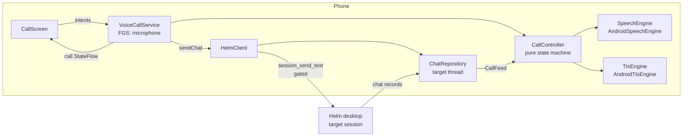
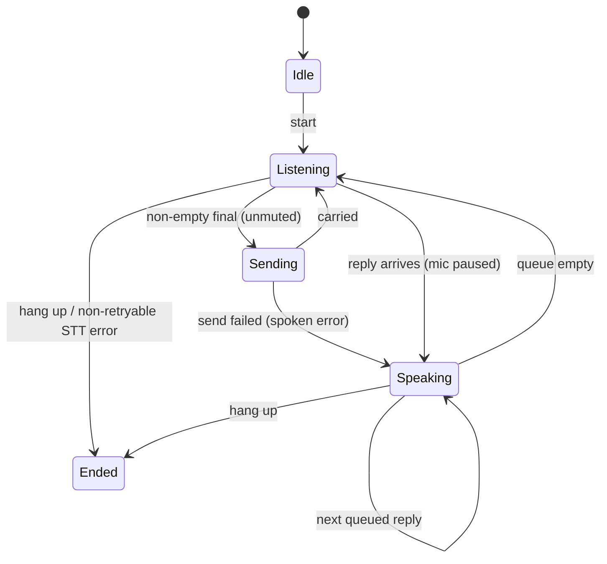

# Voice operator — "Call Helm"

A phone-call-style voice conversation with Helm from the Android app. Tap
**Call Helm**, talk; Helm says "on it" and later speaks the result. Built for
driving: it runs through the car's Bluetooth, the earpiece or the speaker, and
survives the screen turning off.

This page covers the phone half (P-0834). The operator session itself (the
`role=operator` session on the desktop) is P-0833; until it exists, a call
targets a session the user picks.

## Shape

No new wire surface: an utterance is the same gated `session_send_text` a typed
chat message is, and a reply is whatever lands in the target's chat thread. The
call screen's transcript **is** that thread, so the call and the chat can never
disagree.

## Who is called — `resolveCallTarget`

1. The session whose `role` is `operator` in `session_list`, when there is one.
2. Otherwise the session the user picked (📞 **Call** on its control sheet),
   while that session still exists.
3. Otherwise nobody.

The pinned **Call Helm** row on the session list appears only when an operator
exists (or a call is live). Once P-0833 ships, the phone switches to the
operator with no further change.

## The call state machine — `CallController`

Why each rule exists:

- **Continuous listening.** The platform closes an utterance on every pause, so
  each final is sent once and the mic reopens.
- **Silence is never sent.** Empty or whitespace finals are dropped.
- **Mic paused while speaking.** `cancel()` (not `stop()`) so no final follows —
  Helm cannot hear its own voice and send it back as the user's words.
- **No barge-in.** Because the mic is paused, the user cannot talk over a
  reply; anything heard while speaking is ignored. Real barge-in needs echo
  cancellation and a real engine behind `SpeechEngine` — a later plan.
- **Replies queue in order**, including ones that arrive mid-send.
- **Mute** = heard but not sent.
- **Send failures are spoken** ("That did not send.") and the call keeps going.
- **Retryable STT errors** (silence, busy, network) keep the line open; a denied
  microphone or missing recogniser ends the call instead of looping.

`CallFeed` turns the target thread into events: rows present at call start are
history and never read out; each new agent row is a reply; each own row that
settles `Failed` is one spoken failure.

## Audio — `VoiceCallService`

A foreground service of type `microphone` (manifest:
`FOREGROUND_SERVICE_MICROPHONE`, `MODIFY_AUDIO_SETTINGS`). For the call's
lifetime it:

- sets `AudioManager.MODE_IN_COMMUNICATION` and restores the previous mode on end
  (only if the call actually began — a service that never began touches nothing);
- requests transient audio focus as `USAGE_VOICE_COMMUNICATION` and abandons it;
  a refused request ends the call, and losing focus (e.g. a GSM call) hangs up;
- routes via `setCommunicationDevice` (API 31+) or speakerphone/SCO (older);
- speaks TTS as `USAGE_VOICE_COMMUNICATION`, so replies follow the call route.

Route choice is the pure `pickAudioRoute`: keep the current route while it is
available, else Bluetooth, else earpiece, else speaker. It is re-run on every
audio device add/remove, so losing Bluetooth falls back to the earpiece.

The notification carries a **Hang up** action. The call is not sticky: a killed
call is never restarted behind the user's back.

## Limitations

- Not yet judged on a device: routing, screen-off survival, BT switching and
  hang-up from the notification need the manual adb check in P-0834's
  acceptance criteria.
- Built-in STT only, requested offline; a phone with no downloaded language
  pack reports a network error each utterance and the call keeps retrying.
- No barge-in, as described above: wait for Helm to finish, or hang up.
