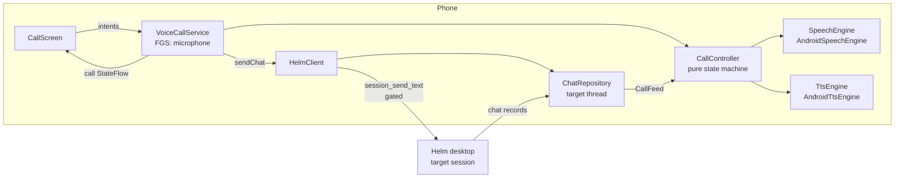
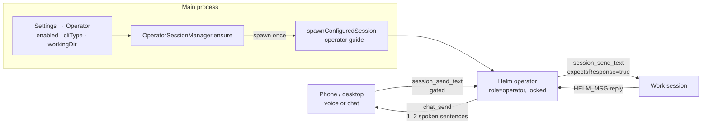
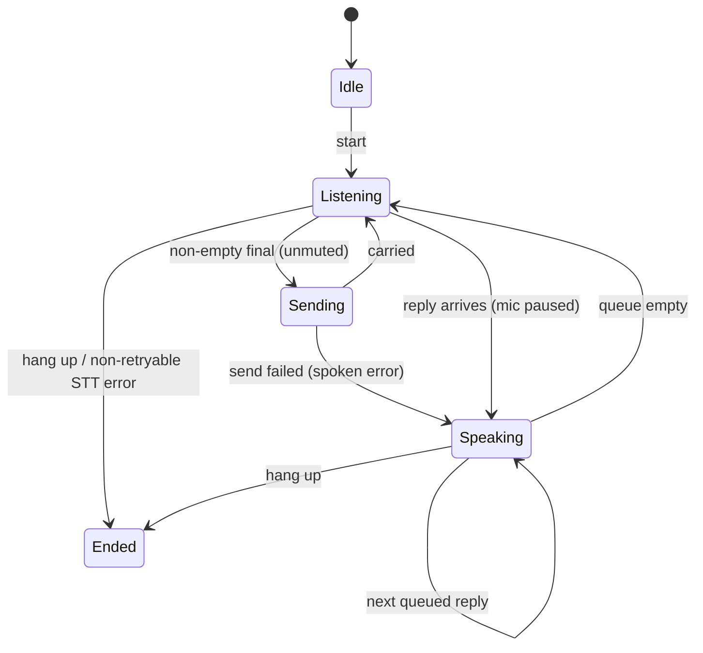
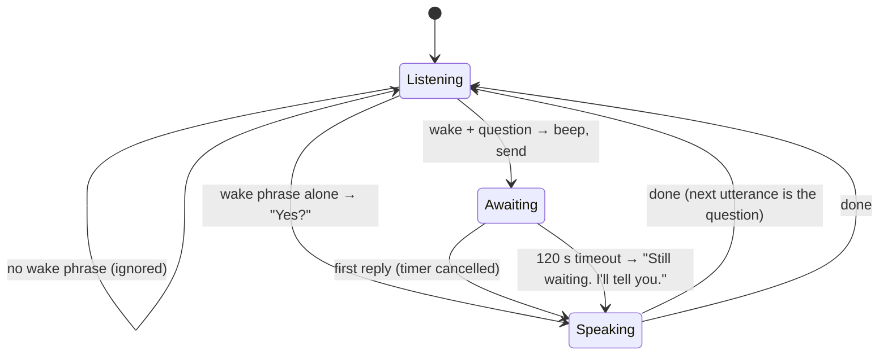

# Voice operator — "Call Helm"

A phone-call-style voice conversation with Helm from the Android app. Tap
**Call Helm**, talk; Helm says "on it" and later speaks the result. Built for
driving: it runs through the car's Bluetooth, the earpiece or the speaker, and
survives the screen turning off.

**Hey Helm** is the opt-in standby: one spoken question, one spoken answer,
no call — see [below](#hey-helm--standby).

This page covers the phone half (P-0834, P-0835) and the desktop's
[operator session](#the-operator-session--helm) (P-0833). With no operator
configured, a call targets a session the user picks.

## Shape

No new wire surface: an utterance is the same gated `session_send_text` a typed
chat message is, and a reply is whatever lands in the target's chat thread. The
call screen's transcript **is** that thread, so the call and the chat can never
disagree.

## Who is called — `resolveCallTarget`

1. The session whose `role` is `operator` in `session_list`, when there is one.
2. Otherwise the session the user picked (📞 **Call** on its control sheet),
   while that session still exists.
3. Otherwise nobody.

The pinned **Call Helm** row on the session list appears only when an operator
exists (or a call is live). The phone matches the literal string
`"operator"` (`CallTarget.kt`), so that value is a wire contract.

## The operator session — "Helm"

One locked session named **Helm** that every voice client (phone now, desktop
later) talks to. It is a router: it passes an instruction to the right work
session, acknowledges at once, and speaks a short summary when the reply comes
back. It never edits, runs commands, investigates, or creates/closes sessions —
the work stays in the sessions that own it, and there is one conversation for
phone and desktop to share.

- **Singleton.** `OperatorSessionManager.ensure()` (`src/session/operator-session-manager.ts`)
  runs at startup, after `restoreSessions`, and on every settings save. It
  keeps exactly one `role: 'operator'` session: a persisted one is reused (the
  renderer's auto-resume brings it back on the same `cliSessionName`), a
  missing one is spawned through `spawnConfiguredSession`. Duplicates keep the
  oldest and have their role cleared — demoted, never closed. Lock and the
  name "Helm" are re-asserted on every ensure.
- **Off means demoted.** Disabling the setting clears the operator's role, so
  the phone stops routing to it; the session itself stays open until you close
  it (force, since it stays locked).
- **Restart.** A force-restart (`helm_restart` with `resume:false`) skips the
  operator: its lock is by design, so it neither blocks the restart nor gets
  closed, and it resumes next launch.
- **Settings.** `settings.yaml → operator: { enabled, cliType, workingDir }`,
  edited in Settings → 🎙 Operator. `cliType` is a dropdown of your own CLI
  types — ids are per-machine UUIDs, so there is no shipped default and
  nothing spawns until one is chosen.
- **Persistence.** `SessionInfo.role` is in `serializeSession`'s allow-list
  (invariant 6), in the renderer's session-refresh allow-list, and in
  `session_list`/`session_get` summaries. An unknown role drops on load.
- **Rules.** `src/mcp/guides/operator-guide.ts` is delivered as the initial
  prompt: route only, ask back when the target is ambiguous, speakable style
  (no markdown, paths or UUIDs).
- **Launch race.** Main can spawn the operator before the renderer's
  auto-resume runs; `pty:spawn` treats a resume of an already-live PTY as an
  attach, not a second process.

## The call state machine — `CallController`

Why each rule exists:

- **Continuous listening.** The platform closes an utterance on every pause, so
  each final is sent once and the mic reopens.
- **Silence is never sent.** Empty or whitespace finals are dropped.
- **Mic paused while speaking.** `cancel()` (not `stop()`) so no final follows —
  Helm cannot hear its own voice and send it back as the user's words.
- **No barge-in.** Because the mic is paused, the user cannot talk over a
  reply; anything heard while speaking is ignored. Real barge-in needs echo
  cancellation and a real engine behind `SpeechEngine` — a later plan.
- **Replies queue in order**, including ones that arrive mid-send.
- **Mute** = heard but not sent.
- **Send failures are spoken** ("That did not send.") and the call keeps going.
- **Retryable STT errors** (silence, busy, network) keep the line open; a denied
  microphone or missing recogniser ends the call instead of looping.

`CallFeed` turns the target thread into events: rows present at call start are
history and never read out; each new agent row is a reply; each own row that
settles `Failed` is one spoken failure.

## Audio — `VoiceCallService`

A foreground service of type `microphone` (manifest:
`FOREGROUND_SERVICE_MICROPHONE`, `MODIFY_AUDIO_SETTINGS`). For the call's
lifetime it:

- sets `AudioManager.MODE_IN_COMMUNICATION` and restores the previous mode on end
  (only if the call actually began — a service that never began touches nothing);
- requests transient audio focus as `USAGE_VOICE_COMMUNICATION` and abandons it;
  a refused request ends the call, and losing focus (e.g. a GSM call) hangs up;
- routes via `setCommunicationDevice` (API 31+) or speakerphone/SCO (older);
- speaks TTS as `USAGE_VOICE_COMMUNICATION`, so replies follow the call route.

Route choice is the pure `pickAudioRoute`: keep the current route while it is
available, else Bluetooth, else earpiece, else speaker. It is re-run on every
audio device add/remove, so losing Bluetooth falls back to the earpiece.

The notification carries a **Hang up** action. The call is not sticky: a killed
call is never restarted behind the user's back.

## Hey Helm — standby

Off by default. The **Hey Helm** row under Call Helm switches it (asking for the
microphone first); the choice persists in `PrefsHeyHelmStore` and is mirrored
process-wide by `HeyHelmSetting`. While it is on and a target resolves (same
`resolveCallTarget` as a call), `VoiceCallService` runs in standby with a
"Listening for Hey Helm" notification whose **Stop** also turns the switch off.
Off means no background mic: the service is stopped.

It is the same `CallController`, given a `Standby` config:

- **Wake phrase** — `stripWakePhrase`: case-insensitive, tolerant of the
  recogniser's usual spellings (`hey/hay/hi helm`, `hey home`, `hey elm`,
  `a helm`). The list is deliberately short: each spelling is another way an
  ordinary sentence wakes the phone ("a home…" is excluded for that reason).
- **"Yes?" has a window.** After a bare wake the next utterance is the
  question only for 8 s; after that the wake is forgotten.
- **One question at a time.** Wakes are ignored while a question awaits its
  answer, so a second question can never orphan the first answer.
- **Backed-off restarts.** Retryable recogniser errors restart after 1 s,
  doubling to a 30 s cap, reset by any result — a phone with no language pack
  must not spin for hours. A fatal error (no mic permission, no recogniser)
  ends standby and turns the switch off, so the UI never claims it is on.
- **The row is always reachable while on**, even with no target, so ON can be
  turned off. With no target the service stops but the switch stays on.
- **One question, one answer.** Only the first reply after a question is
  spoken; anything else the target says is not read to the room. A slow reply
  gets one holding line, and is still spoken when it arrives.
- **No audio takeover.** Standby runs for hours, so it holds no audio focus, no
  communication mode and no route — music keeps playing. Its voice is the
  `USAGE_ASSISTANT` stream. The mic still pauses while it speaks.
- **Calls win.** Starting a call during standby replaces it; when the call ends
  with the switch still on, the service drops the call audio and returns to
  standby.
- The timeout clock is a port (`Standby.schedule`), so the whole flow runs in
  `StandbyControllerTest` against fakes.

**Honest caveat** (also the setting's subtitle): Android's built-in STT is not a
wake-word engine. It is a continuous recognise-restart loop — expect the
platform's listening beeps, real battery drain, and possible OS kills; it is
best on a charger. A real engine (openWakeWord, Porcupine, Whisper) can later
replace it behind `SpeechEngine` without touching the controller. Standby does
not survive a reboot or a process kill — reopen the app.

## Limitations

- Not yet judged on a device: routing, screen-off survival, BT switching and
  hang-up from the notification need the manual adb check in P-0834's
  acceptance criteria.
- Built-in STT only, requested offline; a phone with no downloaded language
  pack reports a network error each utterance and the call keeps retrying.
- No barge-in, as described above: wait for Helm to finish, or hang up.
- Hey Helm is unjudged on a device, including the 30-minute screen-off run on a
  charger; see the caveat above.
