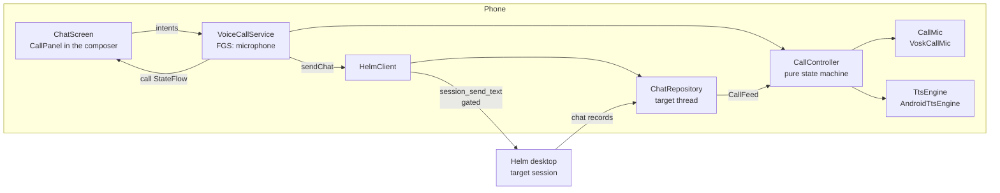
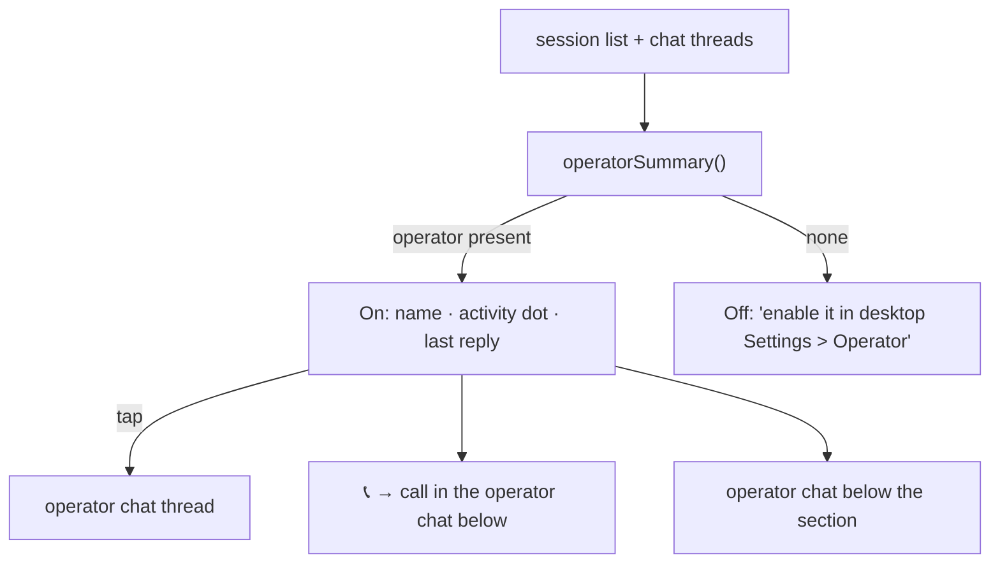
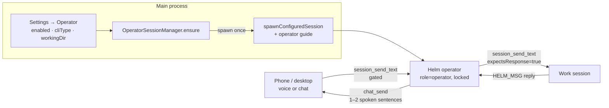
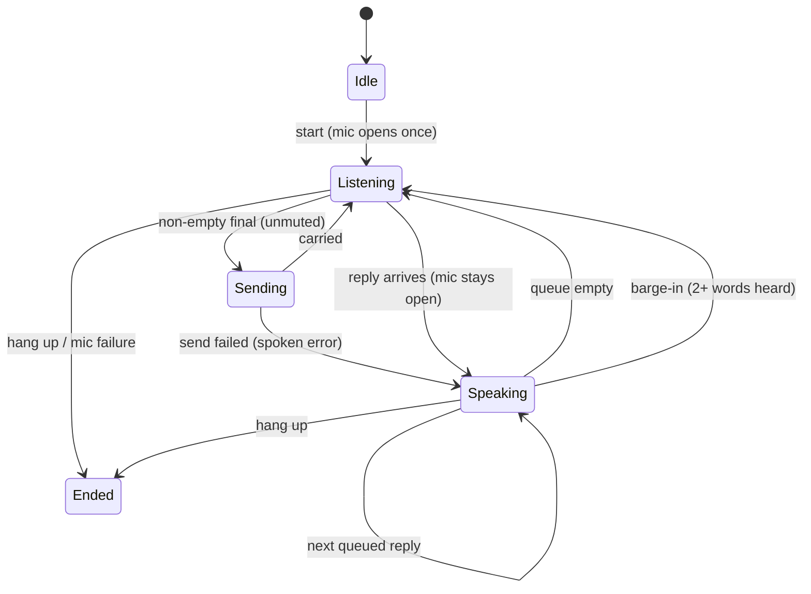
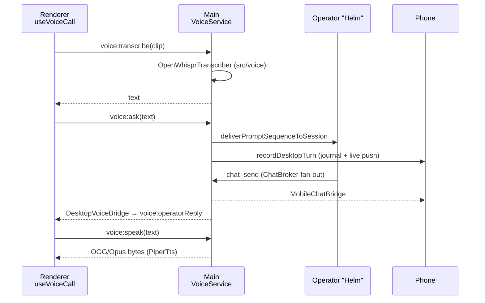
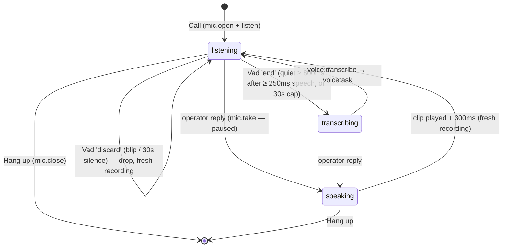
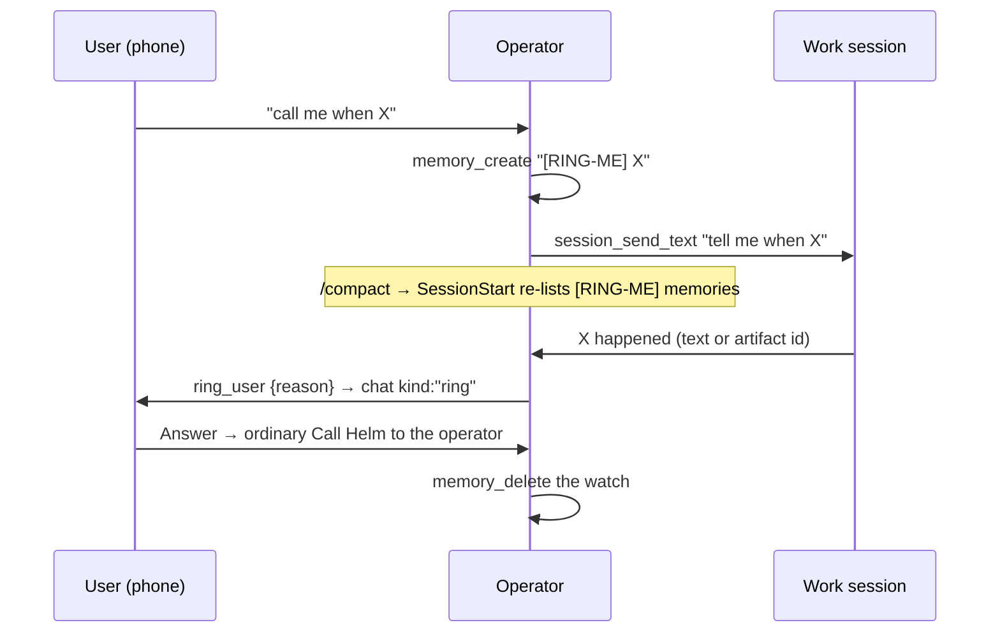
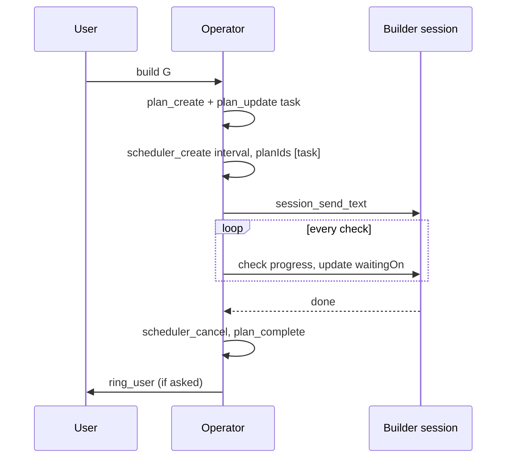

# Voice operator — "Call Helm"

A phone-call-style voice conversation with Helm from the Android app. A call
is a mode of a chat: the composer's round voice button, set to 📞, rings that
session and the composer turns into the call's controls. Talk; Helm says "on it"
and later speaks the result. Built for driving: it runs through the car's
Bluetooth, the handset or the speaker, and survives the screen turning off.

It is full duplex like a phone call, not a walkie-talkie: the mic stays open
while Helm speaks, and talking over Helm stops it.

This page covers the phone half (P-0834, P-0835), the desktop's
[operator session](#the-operator-session--helm) (P-0833) and
[desktop voice](#desktop-voice) (P-0836). With no operator
configured, any session's chat can be called.

## Shape


```mermaid
graph LR
    subgraph Phone
        UI[ChatScreen<br/>CallPanel in the composer] -- intents --> SVC[VoiceCallService<br/>FGS: microphone]
        SVC --> CC[CallController<br/>pure state machine]
        CC --> STT[CallMic<br/>VoskCallMic]
        CC --> TTS[TtsEngine<br/>AndroidTtsEngine]
        SVC -- sendChat --> CL[HelmClient]
        CL --> CR[ChatRepository<br/>target thread]
        CR -- CallFeed --> CC
        SVC -- call StateFlow --> UI
    end
    CL -- session_send_text<br/>gated --> Helm[Helm desktop<br/>target session]
    Helm -- chat records --> CR
```

No new wire surface: an utterance is the same gated `session_send_text` a typed
chat message is, and a reply is whatever lands in the target's chat thread. The
call is drawn inside that thread's chat, so the transcript **is** the thread and
the call and the chat can never disagree.

## Who is called

The session whose chat the call was started from — its composer's 📞, the 📞
on its control sheet, or (for the operator) the 📞 on the Helm home tab. One
call at a time: while a call is live, other chats' phone buttons go dark.

## The composer's voice button

One round button, Telegram-style, either 🎙 or 📞 (remembered):

- 🎙 **hold** to dictate into the draft; **slide up** while holding to switch mode.
- 📞 **tap** to call this session; **hold** to switch mode.

While a call with the session is live, `CallPanel` replaces the composer:
status, what was heard, Handset / Speaker / Bluetooth, Mute, Hang up. Leaving
the chat does not hang up — like a phone app; the notification can.

## The Helm home tab

The operator is the FIRST entry of the phone's home dropdown — **Helm**, then
Sessions, Plans, Contexts (`HomeTab`; Sessions stays the default). The Helm tab
is `ui/operator/OperatorSection.kt` — status dot, last reply (tap → the full
thread), 📞 Call — with the operator's chat thread below
it, the same `ChatScreen` a session's Chat tab uses. Seeing it there counts as
reading it (unread clears). The operator session is filtered OUT of the Sessions
list (`withoutOperator`), so it is shown in one place only.


```mermaid
graph TD
    S[session list + chat threads] --> Q["operatorSummary()"]
    Q -->|operator present| On["On: name · activity dot · last reply"]
    Q -->|none| Off["Off: 'enable it in desktop Settings > Operator'"]
    On -->|tap| Chat[operator chat thread]
    On --> Call[📞 → call in the operator chat below]
    On --> Thread[operator chat below the section]
```

The last reply is the newest non-phone row of the operator's thread — the same
journal the chat screen reads. The 📞 appears only when an operator exists and
no call is live; any session is still callable from its own chat. The phone matches the literal string
`"operator"` (`CallTarget.kt`), so that value is a wire contract.

## The operator session — "Helm"

One locked session named **Helm** that every voice client (phone now, desktop
later) talks to. It answers questions about Helm state and general questions (including web
searches and page fetches)
itself; for work, it is a router: it passes an instruction to the right work
session, acknowledges at once, and speaks a short summary when the reply comes
back. It never edits files, runs commands, reads repo code or restarts Helm —
coding stays in the sessions that own it, and there is one conversation for
phone and desktop to share.

**It manages Helm itself.** Every other Helm MCP tool is open to it: schedules
(a "remind me" is a `scheduler_create` direct task with `targetSession:"caller"`),
plans, contexts, sequences, artifacts, and sessions — it may `session_create` a
session for work nothing fits, hand it over, and `session_close` it when done
(never one it did not create, unless asked).

**Its own memories and tasks.** It ALWAYS lives in `<config>/operator`,
registered as the **Helm Operator** project (`ensureOperatorHome`); there is no
working-dir setting, because a repo dir put its memories and task plans in that
repo's project. An operator found anywhere else (restored from an older build)
is demoted and a fresh one spawned at home. It may READ every
project's memories — `MemoryManager.canReadAll`, wired to `role === 'operator'` —
but writes stay fenced to its own project: reading is never owning, enforced in
`owns()`, not in the prompt.


```mermaid
graph LR
    V[Phone / desktop<br/>voice or chat] -- session_send_text<br/>gated --> OP[Helm operator<br/>role=operator, locked]
    OP -- session_send_text<br/>expectsResponse=true --> W[Work session]
    W -- HELM_MSG reply --> OP
    OP -- chat_send<br/>1–2 spoken sentences --> V
    subgraph Main process
        CFG[Settings → Operator<br/>enabled · cliType · workingDir] --> OSM[OperatorSessionManager.ensure]
        OSM -- spawn once --> SPAWN[spawnConfiguredSession<br/>+ operator guide]
    end
    SPAWN --> OP
```

- **Singleton.** `OperatorSessionManager.ensure()` (`src/session/operator-session-manager.ts`)
  runs at startup, after `restoreSessions`, and on every settings save. It
  keeps exactly one `role: 'operator'` session: a persisted one is reused (the
  renderer's auto-resume brings it back on the same `cliSessionName`), a
  missing one is spawned through `spawnConfiguredSession`. Duplicates keep the
  oldest and have their role cleared — demoted, never closed. Lock and the
  name "Helm" are re-asserted on every ensure.
- **Off means demoted.** Disabling the setting clears the operator's role, so
  the phone stops routing to it; the session itself stays open until you close
  it (force, since it stays locked).
- **Restart.** A force-restart (`helm_restart` with `resume:false`) skips the
  operator: its lock is by design, so it neither blocks the restart nor gets
  closed, and it resumes next launch.
- **Settings.** `settings.yaml → operator: { enabled, cliType, workingDir, compactEveryMinutes }`,
  edited in Settings → 🎙 Operator. `cliType` is a dropdown of your own CLI
  types — ids are per-machine UUIDs, so there is no shipped default and
  nothing spawns until one is chosen. Changing `cliType` takes effect at once
  (and on restart): the operator on the old type is demoted and unlocked, not
  closed, and a fresh operator spawns on the new type.
- **Persistence.** `SessionInfo.role` is in `serializeSession`'s allow-list
  (invariant 6), in the renderer's session-refresh allow-list, and in
  `session_list`/`session_get` summaries. An unknown role drops on load.
- **Rules.** `src/mcp/guides/operator-guide.ts` is delivered as the initial
  prompt. There are three modes (P-0838):

  ```mermaid
  flowchart LR
      Q[User asks] --> K{Kind?}
      K -->|Helm state| A[Read-only lookups:<br/>plan_* · sequence_* · session_* · context_*<br/>scheduler_list · memory_* · skill_list<br/>directory_list · project_list · tool_list] --> R[chat_send answer]
      K -->|general| G[Own knowledge + web search] --> R
      K -->|work| W[session_send_text to owning session]
  ```

  The only writes are `chat_send` and `session_send_text`. It never edits
  files, runs commands, reads repo code, mutates Helm state, or spawns or
  closes sessions. It asks back when the target is ambiguous, and it keeps a
  speakable style (no markdown, paths or UUIDs). CLI types come from the
  existing `tool_list`, so no new tool was needed.
  **Rule changes need a fresh prompt:** the guide is the operator's initial
  prompt, so a running operator only picks up edits after it is respawned or
  compacted. The idle self-compaction below re-sends it every time.
- **User rules (P-0842).** Settings → Operator has a **Rules** section. It
  lists the built-in hard rules read-only and has a "Your rules" box.

  ```mermaid
  flowchart LR
      OR[OPERATOR_RULES<br/>operator-guide.ts] --> G[buildOperatorGuide rules]
      OR --> TAB[OperatorTab.vue<br/>read-only list]
      TAB -->|Save| CFG[settings.yaml<br/>operator.rules]
      CFG --> G
      G --> SP[spawn: initial prompt]
      G --> HC[compaction handover]
  ```

  - **The built-ins remain.** User rules are appended as a `[user_rules]`
    section (one `rule_N` per non-blank line), ranked as the highest priority.
    They can narrow the operator or grant it more. The built-in `[rules]` are
    still sent every time, and blank rules add no section.
  - **One source.** The tab imports `OPERATOR_RULES` from the guide module, so
    the list shown is exactly the text the operator receives.
  - Both deliveries read the rules from config at that moment, so an edit
    applies from the next spawn or compaction. Saving goes through the existing
    `config:setOperatorConfig` channel; there is no new IPC.
- **Idle self-compaction (P-0839).** The operator lives for days, so its context
  would grow without bound. Every `compactEveryMinutes` (default 60; 0 = off)
  the manager checks it:

  ```mermaid
  flowchart TD
      T[Tick] --> B{Busy?<br/>dot active · implementing ·<br/>handover pending · open relay}
      B -->|yes| R[Retry in 30 min]
      B -->|no| S{Settling after<br/>a compaction?}
      S -->|yes| RB[Baseline = lastOutputAt] --> N[Next tick in interval]
      S -->|no| A{lastOutputAt > baseline?}
      A -->|no| N
      A -->|yes| C[session_compact path<br/>handover = operator guide] --> R
  ```

  - It reuses `compactSession` with a handover, so [handover.md](handover.md)'s
    delivery and terminal lock apply unchanged. The handover says "you are Helm,
    the operator, no relays are open" and then repeats the full guide.
  - **Why a settle step.** The compaction's output, and the operator's answer to
    the handover, move `lastOutputAt` too. The first idle check afterwards
    rebaselines, so that echo never counts as activity. Otherwise an untouched
    operator would compact every hour forever. The cost: activity in that same
    window is picked up an interval later. Rebaselining on `handover-delivered`
    was rejected: the operator's reply to the handover comes *after* delivery,
    so it would count as activity and bring back the hourly loop.
  - **In-flight safety.** A tick awaits the compact. A generation counter,
    bumped on every timer clear, stops a tick that outlived a
    dispose/disable/interval change from rescheduling.
  - **Open relays.** An operator send with `expectsResponse` (seen on the
    message-flight sink) opens a relay. The recipient's next message to the
    operator closes it. Compacting mid-relay would lose what the reply is for.
    A relay stops blocking after 2 h, so a reply that never comes cannot pin the
    context forever.
  - The baseline is in memory. After a restart, the first idle tick compacts
    once if the operator has any output at all.
- **Launch race.** Main can spawn the operator before the renderer's
  auto-resume runs; `pty:spawn` treats a resume of an already-live PTY as an
  attach, not a second process.

## The call state machine — `CallController`


```mermaid
stateDiagram-v2
    [*] --> Idle
    Idle --> Listening: start (mic opens once)
    Listening --> Sending: non-empty final (unmuted)
    Sending --> Listening: carried
    Sending --> Speaking: send failed (spoken error)
    Listening --> Speaking: reply arrives (mic stays open)
    Speaking --> Speaking: next queued reply
    Speaking --> Listening: queue empty
    Speaking --> Listening: barge-in (2+ words heard)
    Listening --> Ended: hang up / mic failure
    Speaking --> Ended: hang up
```

Why each rule exists:

- **One open mic.** `CallMic` is a single stream from pick-up to hang-up. The
  old per-utterance `SpeechRecognizer` restarted on every pause, grabbed audio
  focus on each restart (which churned the Bluetooth headset's call link) and
  could not listen while Helm spoke.
- **Silence is never sent.** Empty or whitespace finals are dropped.
- **Heard, instantly.** Each send plays a short ack tone on the call route.
  TTS runs at 1.15×. `call sending` / `call target replied` /
  `text to speech speaking` / `call barge-in` log lines give the per-turn trace.
- **Barge-in.** Helm speaks with the mic open; a partial of 2+ words stops it,
  drops what was queued, and what the user says is sent. One stray word while
  speaking is taken as residual echo and ignored — echo removal itself is the
  recorder's job (below).
- **Replies queue in order**, including ones that arrive mid-send.
- **Mute** = heard but not sent, and a muted user never interrupts.
- **Send failures are spoken** ("That did not send.") and the call keeps going.
- **A mic that cannot run** (no recorder, no model) ends the call with an error.

## The call mic — `VoskCallMic`

One `AudioRecord` as `VOICE_COMMUNICATION` (so the platform's call echo
canceller applies; `AcousticEchoCanceler` and `NoiseSuppressor` are enabled
when present), 16 kHz mono in 100 ms frames, fed to an offline
[Vosk](https://alphacephei.com/vosk/) recogniser. Partials drive barge-in;
finals are utterances. Nothing leaves the phone but the recognised text.

**The model** is `vosk-model-small-en-us-0.15` (~40 MB zip, English only). It
is not checked in: the Gradle `voskModel` task downloads it once into
`android/app/build/vosk/` and unpacks it into generated assets with a `uuid`
file; on first call it is unpacked to `filesDir` (`StorageService.unpack`) and
loaded once per process. The dictation mic (🎙) still uses the platform
recogniser — it is per-utterance by nature.

`CallFeed` turns the target thread into events: rows present at call start are
history and never read out; each new agent row is a reply; each own row that
settles `Failed` is one spoken failure.

## Audio — `VoiceCallService`

A foreground service of type `microphone` (manifest:
`FOREGROUND_SERVICE_MICROPHONE`, `MODIFY_AUDIO_SETTINGS`). For the call's
lifetime it:

- sets `AudioManager.MODE_IN_COMMUNICATION` and restores the previous mode on end
  (only if the call actually began — a service that never began touches nothing);
- requests transient audio focus as `USAGE_VOICE_COMMUNICATION` and abandons it;
  a refused request ends the call, and losing focus (e.g. a GSM call) hangs up;
- routes via `setCommunicationDevice` (API 31+) or speakerphone/SCO (older), so
  the recorder and the voice share the call route (handset, speaker, Bluetooth);
- speaks TTS as `USAGE_VOICE_COMMUNICATION`, so replies follow the call route.

Route choice is the pure `pickAudioRoute`: keep the current route while it is
available, else Bluetooth, else earpiece, else speaker. It is re-run on every
audio device add/remove, so losing Bluetooth falls back to the earpiece.

The notification carries a **Hang up** action. The call is not sticky: a killed
call is never restarted behind the user's back.

## Desktop voice

Hold a gamepad button bound to `voice-talk` (or press **Ctrl+Shift+Space**,
press again to send) and talk; the words go to the operator and its reply is
spoken through the speakers. It reuses the local tools Telegram already has —
no second STT/TTS stack.


```mermaid
sequenceDiagram
    participant R as Renderer<br/>useVoiceCall
    participant M as Main<br/>VoiceService
    participant OP as Operator "Helm"
    participant P as Phone
    R->>M: voice:transcribe(clip)
    M->>M: OpenWhisprTranscriber (src/voice)
    M-->>R: text
    R->>M: voice:ask(text)
    M->>OP: deliverPromptSequenceToSession
    M->>P: recordDesktopTurn (journal + live push)
    OP->>M: chat_send (ChatBroker fan-out)
    M-->>P: MobileChatBridge
    M-->>R: DesktopVoiceBridge → voice:operatorReply
    R->>M: voice:speak(text)
    M-->>R: OGG/Opus bytes (PiperTts)
```

- **Shared modules.** `openwhispr-transcriber.ts`, `piper-tts.ts` and `ffmpeg.ts`
  moved from `src/telegram/` to `src/voice/`; Telegram imports them from there
  unchanged. Piper keeps its OGG/Opus output — Chromium plays it natively.
- **Configuration.** The tool paths are the ones in Settings → Telegram.
  `CapabilityDetector.getVoiceTools()` checks them without requiring the bot to
  be enabled; a missing tool is a clear error, and nothing is spawned.
- **Config boundary.** The recorded clip, its transcript and the synthesized
  OGG live in the app-data temp dir and are deleted on success and failure.
- **Replies.** The operator answers with `chat_send`, as for the phone.
  `DesktopVoiceBridge` is one more ChatBroker surface, so the desktop hears
  exactly what the phone receives; it declines every non-operator session.
- **One conversation.** The user's desktop words are journaled
  (`originId: desktop:<uuid>`) and pushed live to linked phones, so the phone
  thread shows both sides.
- **Call window.** The first talk opens the call; while it is open each
  reply is spoken once, strictly in arrival order. After **Hang up** replies
  are still listed but not spoken — the phone may be the one talking.
- **Gating.** Talk and Call refuse (with a message) while no operator exists.

### The sidebar "Helm" section

The desktop twin of the phone's first tab (`OperatorSummary.kt`):
`OperatorSection.vue` is pinned above the session list and fed by the pure
`operatorSummary()` (`renderer/operator-summary.ts`) — the operator's activity
dot (`state-colors.ts`), its last reply (seeded at startup from the chat
journal via `voice:lastOperatorReply`, so it survives a restart), **Call / Hang up**, and while a call is
open the live phase and transcript (it replaced the floating call panel — one
UI). Clicking the title opens the operator's terminal. With no operator it
reads "Enable in Settings > Operator". `buildSessionGroups` drops the operator
(`withoutOperator`), so it is never listed twice — the same rule as the phone.
Instead it is the pinned first gamepad nav item (`buildFlatNavList` →
`type: 'operator'`), so the D-pad and stick reach it like any session card
(Invariant 1: the gamepad reaches everything). Starting a call from any binding
restores/activates/reveals the Sessions pane, so the Hang up button is always
on screen.

### Hands-free call

**Call** (or a gamepad button bound to `voice-call`, a toggle) keeps the mic
open and lets a voice-activity gate cut it into turns; hold-to-talk still works
outside a hands-free call.


```mermaid
stateDiagram-v2
    [*] --> listening: Call (mic.open + listen)
    listening --> transcribing: Vad 'end' (quiet ≥ 800ms after ≥ 250ms speech, or 30s cap)
    listening --> listening: Vad 'discard' (blip / 30s silence) — drop, fresh recording
    transcribing --> listening: voice:transcribe → voice:ask
    listening --> speaking: operator reply (mic.take — paused)
    transcribing --> speaking: operator reply
    speaking --> listening: clip played + 300ms (fresh recording)
    listening --> [*]: Hang up (mic.close)
    speaking --> [*]: Hang up
```

- **Vad** (`renderer/voice/vad.ts`) is pure: fed one RMS energy per 20ms frame
  with its time, it emits `start` / `end` / `discard` (blips shorter than the
  minimum speech length). No WebAudio in its tests.
- **Mic** (`createBrowserMic`, `browser-audio.ts`): one stream for the call, an
  `AnalyserNode` meter, and a fresh `MediaRecorder` per turn. A turn's clip
  runs from when listening resumed, so the speech onset is never clipped.
- **Bounded.** A turn is cut at 30s (forced `end`); a recording that held no
  speech for 30s, or only a blip, is `discard`ed — dropped, and a fresh one starts.
- **Race-safe.** A hang-up (or a second `voice-call` press) while the mic is
  still opening cancels the call; the mic is closed as soon as it opens. A
  generation counter makes late transcribe/playback work from an ended call inert.
- **No echo.** The mic asks for browser echo cancellation, noise suppression
  and AGC; recording and meter are paused while Piper speaks and resume 300ms
  after it ends; words spoken over a reply are dropped. A failed or repeated
  `open()` releases the stream and audio context. Empty transcripts send
  nothing. No new main-process code — the same `voice:*` IPC.

## Ring me — the operator calls the user

"Hey operator, call me when P-0850 finishes or has blocking questions." Calls
were phone-initiated only; `ring_user` is the one reverse path.


```mermaid
sequenceDiagram
  participant U as User (phone)
  participant O as Operator
  participant W as Work session
  U->>O: "call me when X"
  O->>O: memory_create "[RING-ME] X"
  O->>W: session_send_text "tell me when X"
  Note over O: /compact → SessionStart re-lists [RING-ME] memories
  W->>O: X happened (text or artifact id)
  O->>U: ring_user {reason} → chat kind:"ring"
  U->>O: Answer → ordinary Call Helm to the operator
  O->>O: memory_delete the watch
```

- **Operator only.** `ring_user` refuses every other role. Work sessions hand the
  operator what to say (`session_send_text`, or an artifact id it reads with
  `session_artifact_get`) and it paraphrases on the call — one voice calls the user.
- **Watches are plain memories**, tldr prefixed `[RING-ME]` (`RING_ME_PREFIX`,
  `context-injector.ts`). No new store: SessionStart fires after every
  compaction, and for the operator it lists those tldrs with the instruction to
  check them.
- **Wire:** the existing alert push with `kind: "ring"` (`MobileChatBridge.sendRing`).
  A phone that predates it degrades to an ordinary notification.
- **Phone:** `notify/IncomingRing.kt` — high-importance CALL notification with a
  full-screen intent and the default ringtone, 30 s timeout. Answer opens the
  app and starts `VoiceCallService` (a visible activity may start the mic FGS;
  a background broadcast may not). Answering on a locked phone shows the app
  over the lock screen and turns the screen on (`MainActivity.showOverLockScreen`),
  so the call starts without an unlock; the pass is dropped in `onStop`, so only
  the answered call ever sits over the keyguard. Because `MainActivity` is
  exported, Accept carries a one-shot `RingTicket` minted with the ring; an accept
  intent without the live ticket (another app's) only opens the thread. Decline just stops ringing;
  nothing is reported back.
- **A real incoming call.** The ring is offered to Android Telecom first
  (`telecom/HelmTelecom.kt`, a self-managed PhoneAccount + `HelmConnectionService`),
  so car Bluetooth call screens, steering-wheel and headset buttons can answer or
  decline it. Self-managed calls draw their own UI, so the same ring notification
  is still shown; Answer from anywhere runs the same MainActivity accept path.
  The system call ends with ours, times out with the notification (30 s, missed),
  and if Telecom refuses the ring falls back to the notification alone.
- **Opens speaking.** Within a breath of Answer the phone says "Hi, it's Helm.
  I have a message about <reason>. Is now a good time?" (`RingGreeting`, spoken
  via `CallController.start(opening)` with the mic already open). The user's
  spoken yes / no / "call me back in N" reaches the operator, whose guide says
  how to honour each — a call-back is a once scheduler self-timer.
- **One retry.** The phone reports only ANSWERED (`__ring_answered__`, in-gate).
  No answer inside 45 s — declined, timed out, phone off — and Helm rings once
  more 10 min later (`src/session/ring-retry.ts`); a second miss leaves an
  attention alert instead. In memory: a restart drops a pending retry.
- **Ear sensor.** On the earpiece a proximity wake lock darkens the screen at
  the ear; speaker or Bluetooth keeps it on. Released when the call ends.
- **Fails legibly** when no phone takes the ring; the operator falls back to
  `chat_send`.

## Operator tasks — asks it follows through

"Check ABC and get it done later", "check EF too", "build G": each is an ask the
operator must keep chasing across compactions. A task is an ordinary plan in the
operator's own project carrying a `task` block — `builderSessionId`,
`watchPlanId`, `waitingOn` — set with `plan_update`. **Why a plan:** plans already
persist, render on both boards and complete with notes; a task differs only in
being a follow-up in flight, which its project and block say.

The check timer is an ordinary scheduler row (`targetSession:"caller"`) whose
`planIds` include the task, so "next check" is derived (`nextCheckAt` in
`src/session/operator-tasks.ts`) and never stored twice. `plan_summary` rows
carry the task block plus the builder's name and next check, so the phone and PC
cards need no full record. After every compaction SessionStart re-lists the
operator's open tasks.

**On the PC** the Plans pane shows an "Operator tasks" button while the operator
runs (found via its session's working dir, not the renameable project name). A
task card replaces its description with 👷 builder (click: go to the session),
📋 watched plan (click: open it in its own canvas), ⏰ next check, and ⏳
waiting-on. "no timer" is shown deliberately: a task nobody will check is a
dropped ask.

**On the phone** the Helm home tab's operator row has a **Tasks** link that opens
the operator session's Plans tab — its project's plans are its tasks. A task row
adds 👷 builder (tap: its chat), 📋 watched plan (tap: its detail, via the
`watchPlanUuid` the summary resolves), ⏰ next check and ⏳ waiting-on. Everything
rides `plan_summary`, so the phone never asks for full records.


```mermaid
sequenceDiagram
    participant U as User
    participant O as Operator
    participant S as Builder session
    U->>O: build G
    O->>O: plan_create + plan_update task
    O->>O: scheduler_create interval, planIds [task]
    O->>S: session_send_text
    loop every check
        O->>S: check progress, update waitingOn
    end
    S-->>O: done
    O->>O: scheduler_cancel, plan_complete
    O->>U: ring_user (if asked)
```

## Limitations

- Desktop voice: the transcript holds only this run's lines (the phone
  keeps history); no barge-in — a reply that arrives while you talk is spoken
  after the one before it, and in a hands-free call it pauses the mic even
  mid-sentence. The VAD threshold is a fixed energy level, not calibrated.
  Not yet judged live (needs a restart + a real call).

- Not yet judged on a device: routing, screen-off survival, BT switching and
  hang-up from the notification need the manual adb check in P-0834's
  acceptance criteria.
- The small Vosk model is less accurate than Google's recogniser; a larger
  model (~128 MB more) is the upgrade path.
- Barge-in quality depends on the phone's echo canceller; on speaker, a loud
  reply can still leak two words and cut itself off.
